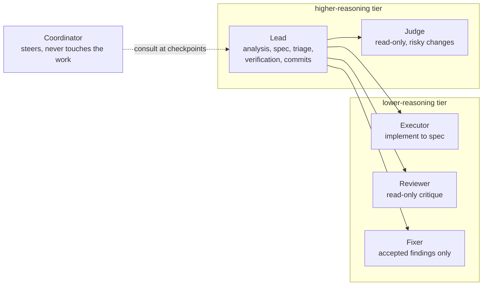
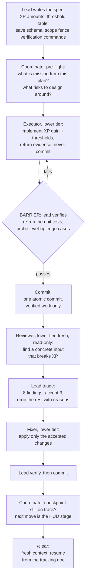
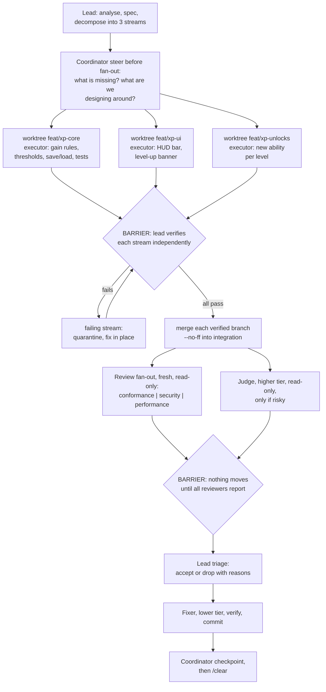

# Orchestrated delegation: worked example, adding XP to a game

A visual walkthrough of the `orchestrated-delegation` skill applied to one problem end to end: **adding an XP and levelling system to a game**. The diagrams follow the skill exactly (loop default, graph when decomposition finds independent streams); the text under each diagram says what the lead, the coordinator, and the subagents actually do for this feature.

## The problem

Feature: XP and levelling.

- Kill a monster or finish a quest, gain XP.
- Levels come from a thresholds table; on level-up, unlock one new ability.
- HUD shows an XP bar; a banner plays on level-up.
- XP and level persist in the save file.

The spec pins down: exact gain amounts, the threshold table, the save schema, and the verification commands (unit tests for gain and thresholds, a save/load round trip, a manual playthrough of the level-up moment).

## The cast

This example speaks in reasoning tiers, not model names: the concrete model behind each role is pinned only in that role's agent definition (`model:` frontmatter). The higher-reasoning tier judges and accepts; the lower-reasoning tier proposes and implements. What sets the coordinator apart is position, not tier: a separate, read-only context that steers but never touches the work.

| Role | Agent | Tier | Owns in this example |
| ------ | ------- | ------- | ---------------------- |
| Lead | main session | higher-reasoning | spec, triage, verification, commits, human contact |
| Coordinator | delegate-coordinator | per frontmatter, read-only | steering at pre-flight and after each verified commit |
| Executor | delegate-executor | lower-reasoning | implement XP gain, HUD, unlocks to spec |
| Reviewer | delegate-reviewer | lower-reasoning, read-only | adversarial critique of the change |
| Fixer | delegate-fixer | lower-reasoning | apply only the accepted findings |
| Judge | delegate-judge | higher-reasoning, read-only | pass or block on risky changes only |

## Default shape: the loop

The default is one stream. For a small feature this is the whole session.

Walkthrough, stage by stage:

1. **Spec (lead).** Monster kills give 10 XP, quests 50; thresholds 100/300/600/1000; gains and level-ups are pure functions with unit tests; the save file gains `xp` and `level` fields. The fence: only the XP module and its tests. No executor is spawned before this exists (skill principle: the spec is the contract).
2. **Pre-flight (coordinator).** The coordinator reads the goal and the plan and answers: what is missing, what risks should we design around? It flags the questions the lead may have skimmed: what happens at max level, and does a quest reward double-count with monster XP?
3. **Execute (executor, lower tier).** Implements exactly to the spec. Returns evidence: test output, changed files.
4. **Barrier (lead).** The lead re-runs the tests itself and reads the riskiest file (the gain and threshold logic). It does not trust the executor's report (verify, don't trust).
5. **Commit.** One atomic commit per verified stage.
6. **Review (reviewer, lower tier, fresh, read-only).** An adversarial pass: a save file from an old version, XP gained while the game saves, a level-up inside a quest reward. Findings come back ranked.
7. **Triage (lead).** 8 findings, 3 accepted. Nitpicks and self-mitigated concerns are dropped with reasons, recorded in the tracking doc.
8. **Fix (fixer, lower tier).** Only the accepted changes, applied as concrete instructions.
9. **Verify and commit (lead).** Re-run, then a second atomic commit.
10. **Checkpoint (coordinator).** Still on track? The steer: next move is the HUD stage. Recorded in the tracking doc.
11. **/clear.** The committed stage's transcript is dead weight; the docs and commits are the durable memory. Resume with the one-liner: tracking doc, active stage plan, branch + last commit, last coordinator steer, reconcile-first.

## Parallel shape: the graph

Decomposition finds three genuinely independent streams, each with its own scope fence in the spec: the XP core (rules and persistence), the HUD (XP bar and level-up banner), and the unlocks (a new ability per level). Interfaces are pinned in the spec, so each worktree proceeds without waiting on the others.

Walkthrough:

1. **Decompose (lead).** Three streams, at the skill's cap (3; 4 only in exceptional cases). A clean tree is required before the worktrees are cut.
2. **Steer (coordinator).** Before the fan-out, the coordinator asks: what risks should we design around? The answer lands in the tracking doc.
3. **Execute in parallel (executor x3, lower tier).** One executor per worktree, each with its own fence. No cross-stream file edits: the HUD consumes the core's API exactly as the spec pins it.
4. **Barrier (lead).** Each stream is verified independently before anything merges. A broken stream is quarantined and fixed in place; it never merges broken.
5. **Merge (lead).** Each verified stream becomes one atomic commit on the integration branch (`--no-ff`), then the worktrees are pruned.
6. **Review fan-out (reviewer x3, lower tier, fresh, read-only).** Conformance, security, and performance angles, one reviewer each. A judge (higher tier) is spawned only if the change is risky (sits on a live path or failed a prior review); routine changes do not get a judge.
7. **Barrier again.** Nothing moves until every reviewer has reported.
8. **Triage (lead), fix (fixer, lower tier), verify, commit.**
9. **Checkpoint (coordinator), then /clear.**

## Where the coordinator earns its place

The coordinator's tier is set per its frontmatter, so its value is never tier: it is a separate, read-only context that holds only the goal, the plan, and repo state. It is consulted at pre-flight and at stage boundaries, never per subtask, and its steer is a few lines, not a report. The steer is recorded in the tracking doc, which is what survives a `/clear`; the next consult builds on it. Its whole job is to hold the goal and the plan so the working nodes do not drift.

## Closing the doc loop

Before any stage is declared done, the docs must match repo reality: checkboxes flipped, tracking lists updated, the coordinator steer recorded. If the docs lie, the next session inherits the lie.
