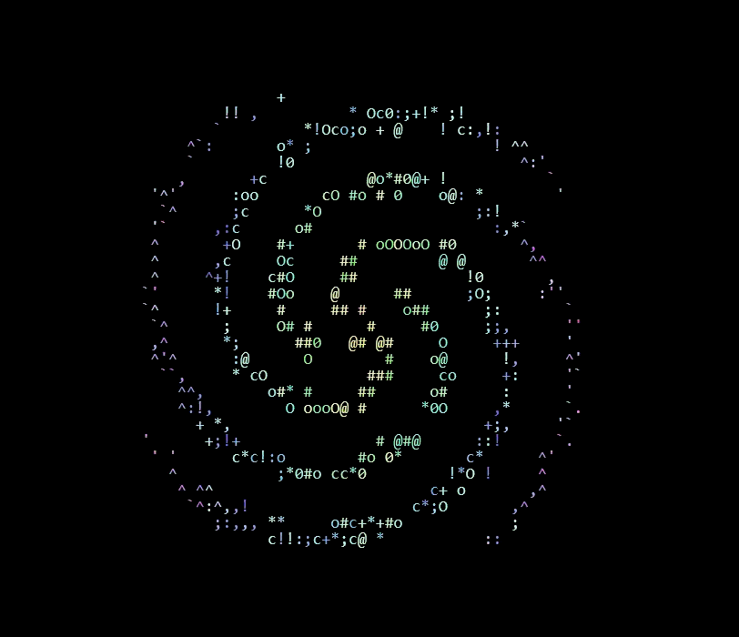

# The Warden's Oak



> *A year is a long time to carry an ember. But it's longer still to carry one alone.*

A year-long Discord RPG where eight strangers become a fellowship — two rolls a day (more on weekends), one tree at a crossroads, and something waking in the east.

Built with TypeScript, Discord.js, SQLite, and pixel-perfect ASCII art.

---

## What is this?

The Warden's Oak is a slow-burn narrative game played over a real calendar year. Each day, players get two d20 rolls — more on weekends — to travel, rest, or act, and the world advances around them. Miss a day? Your character rests by the fire. Miss too many? The world moves on without you.

It draws from **Frieren** (time as tension), **D&D** (visible dice), **Lord of the Rings** (fellowship of many), **Castlevania** (gothic threat on the horizon), **anime** (friendship as mechanic), **MapleStory** (the social grind as ritual), and **Fable** (NPCs who live their own lives).

---

## Quick start

```bash
git clone https://github.com/YOUR_USER/daily-pixel.git
cd daily-pixel
npm install
cp .env.example .env
# Edit .env with your Discord bot token and API keys
npm run dev
```

---

## Architecture

```
Discord Bot (TypeScript)
  ├── Command router
  ├── Daily roll engine
  ├── ASCII art renderer
  ├── Auto-sim engine (PC + NPC)
  ├── NPC routine simulation
  ├── Daily economy tick
  ├── Weekly scheduler (cron)
  │
  ├── Graph DB (SQLite + custom edge model)
  │   └── Nodes: Characters, Locations, NPCs, Items, Quests
  │   └── Edges: trust, rivalry, owns, at_location, on_quest…
  │
  └── LLM Gateway (token-optimized, lazy evaluation)
      └── Narrative generation, NPC dialogue, quest creation
```

---

## Design principles

- **Cheap by default.** Roll resolution, stat math, and templates run without touching an LLM.
- **Lazy evaluation.** NPCs aren't alive until met. Locations are procedural until visited.
- **Mobile-first Discord.** ~30 char wide ASCII scenes. One message per daily roll batch.
- **Hard cap at 8 players.** Graph DB and token budget don't scale linearly.

---

## Design docs

The full design vault lives in [`docs/`](./docs/README.md) — vision, game mechanics, engine, UI, and decision records. Start with [`docs/README.md`](./docs/README.md) (the map of content) and [`docs/CONVENTIONS.md`](./docs/CONVENTIONS.md) (how docs are organised).

---

## License

MIT — see [LICENSE](./LICENSE)
