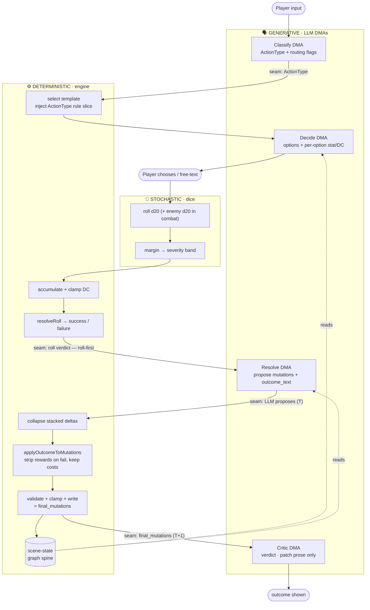
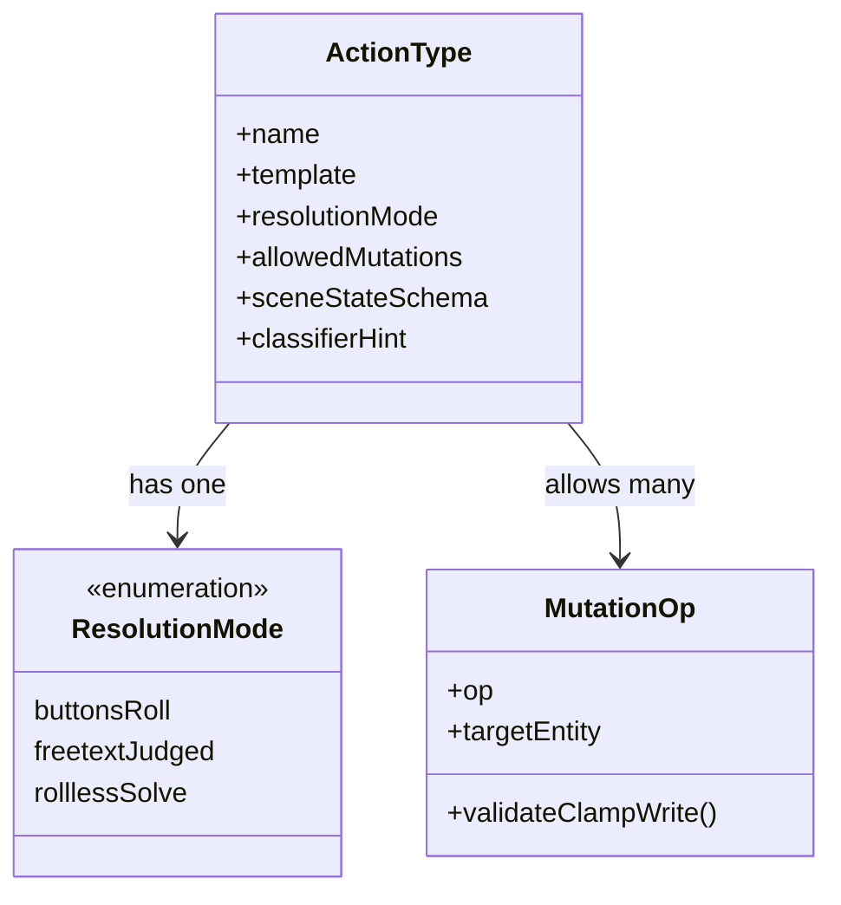
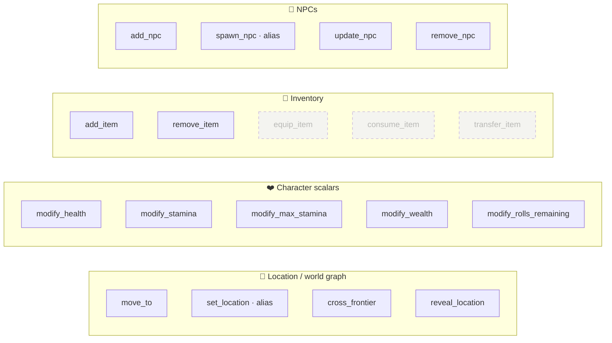
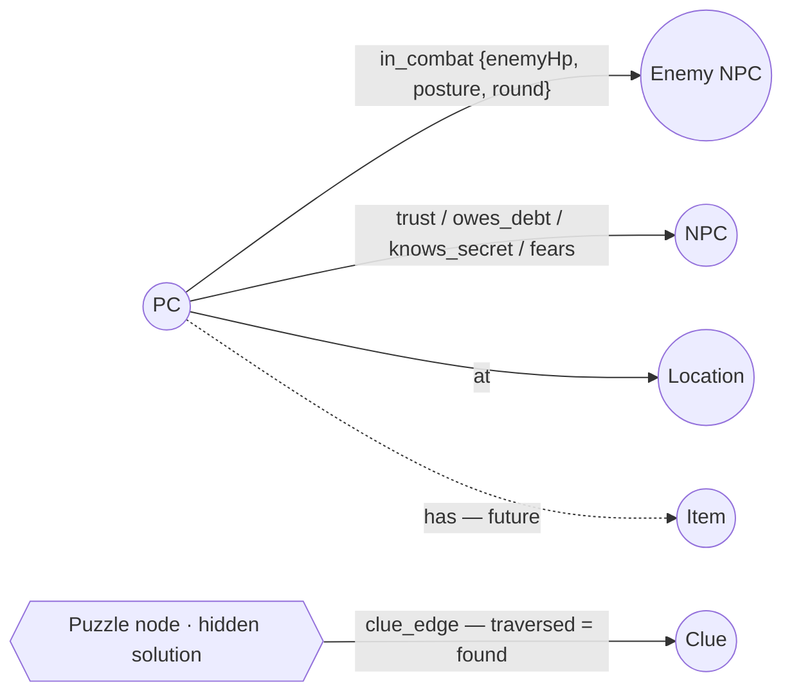

_The framework view of the action engine: a fixed classify → decide → dice → resolve spine with data-driven registries (ActionTypes, Mutations, DMAs) around it, and the three ownership zones (dice / engine / LLM) drawn so every seam is explicit. Formalizes structures that already exist in code (`CATEGORY_MUTATION_MAP`, the post-authoring mutation-adjustment pipeline) so future updates — more DMAs, mutations, action types, item interaction — plug in without touching the spine._

---

# Action Engine Framework

The engine that turns a player's custom action into a resolved outcome. This doc is the **scaling contract**: the resolution spine is fixed; everything that grows — action types, the mutation vocabulary, the LLM stages — is a **registry entry**, not a spine edit. It is grounded in the current code (`src/engine/action/`, `src/llm/`) and points at where v12 ([[prompt-separation-of-concerns]]) extends it.

The core principle, shared with the game thesis: **dice rule the uncertain, the engine owns what players would feel cheated by if it drifted, the LLM dresses it.** Immersion is the seams between those three not showing. The diagrams below exist to make every seam visible so we can defend it.

## Canonical vocabulary (decided)

One term per concept — the code currently carries three overlapping classification fields, which the framework collapses:

- [>] **`ActionType`** — the single closed routing key: `combat · travel · social · skill · search · rest · other`. Promotes today's optional `category` enum (`LlmGateway.ts:48`) to canonical, and **retires the free-form `distilledType`** (`LlmGateway.ts:52`) — the classifier becomes the source of truth for type. (`distilledType` is used for story-threading today, so removal is a tracked migration, not a rename.)
- [I] **`ResolutionMode`** — *how* a type resolves, orthogonal to *what* it is: `buttonsRoll · freetextJudged · rolllessSolve`. Combat and skill are different ActionTypes sharing `buttonsRoll`.
- [I] **`ActionKind`** — `work · quest` narrative label (`WorldEngine.ts:66`). Unchanged, orthogonal to ActionType.
- [I] **DMA (DM Agent)** — one LLM call-site with a typed contract: Classify, Decide, Resolve, Critic.
- [I] **Mutation** — a typed, whitelisted state-delta the LLM *proposes* and the engine *applies*.

## The three zones

Every box in every diagram below belongs to exactly one zone; every arrow that crosses a zone is a **seam**.

- 🎲 **Stochastic (dice)** — the RNG for what *should* be uncertain: `d20`, the contested enemy d20 (combat), the severity band.
- ⚙️ **Deterministic (engine)** — the roll math (`resolveRoll`, `dc.ts:66`), DC accumulation + clamp (`dc.ts:12`), and the **post-authoring mutation-adjustment pipeline** (collapse → outcome-filter → validate/clamp → write, `mutations.ts:70`, `machine.ts:562`) that produces `final_mutations`. Plus the scene-state truth.
- 🗣️ **Generative (LLM / DMAs)** — non-deterministic but *not random*: classification, option authoring, free-text judgment, narration. Owns only soft texture.

## Diagram 1 — the resolution pipeline (seams marked)

The fixed spine. The four labelled **seams** are where information crosses a zone — and where the known defect classes live: the roll-first handoff, the `LLM-proposes → engine-disposes` mutation boundary, and the `final_mutations (T+1)` handoff the critic/resolve stage must read (not the authored `T` set — the D5b gap in [[prompt-v12-pipeline]]).

- [p] **Roll-first** (`machine.ts:295` invariant): the dice decide the verdict, *then* the Resolve DMA narrates to match — the critic can only patch prose, never the outcome.
- [!] The engine's `E3→E4→E5` chain rewrites the LLM's proposed mutations *after* authoring (collapse caps stacked damage at −5 stamina / −4 health; failure strips `add_item`/`cross_frontier`/`reveal_location` and keeps costs; the day-job wage is paid win-or-lose). This is why `outcome_text` drifts — it is authored against the pre-adjustment set. **The Resolve/Critic seam must carry `final_mutations`.**

## Diagram 2 — an ActionType is a registry entry

Adding an action type is **one registration**, not a spine change. The `allowedMutations` field already exists in code as `CATEGORY_MUTATION_MAP` (`WorldEngineImpl.ts`) — this formalizes it and adds the missing fields (template, resolution mode, scene-state schema, classifier hint).

The seven current entries, with `allowedMutations` quoted exactly from `CATEGORY_MUTATION_MAP`:

| ActionType | ResolutionMode | Roll's role | Allowed mutations (current code) |
| ---------- | -------------- | ----------- | -------------------------------- |
| `combat`   | buttonsRoll (multi-round) | contested d20 → band → HP delta | `modify_stamina`, `modify_health`, `add_item`, `update_npc`, `remove_npc` |
| `travel`   | buttonsRoll | gates arrival / hazard | `move_to`, `cross_frontier`, `modify_stamina`, `add_npc`, `add_item` |
| `social`   | freetextJudged | modifies confidence, not the verdict | `modify_wealth`, `add_npc`, `update_npc`, `add_item`, `remove_item` |
| `skill`    | buttonsRoll | roll vs DC | `modify_stamina`, `modify_max_stamina`, `modify_rolls_remaining` |
| `search`   | buttonsRoll (puzzle: rolllessSolve on the final answer) | reveals clue-edge / find | `add_item`, `modify_stamina` |
| `rest`     | often rollless | low/no-stakes | `modify_health`, `modify_stamina`, `modify_rolls_remaining` |
| `other`    | generic fallback | as authored | — (catch-all, never flagged) |

## Diagram 3 — the mutation vocabulary, grouped by target entity

Fifteen ops today, grouped by *what they touch*. Every op is **LLM-proposed, engine-disposed** — the LLM emits a typed delta; the engine validates against the whitelist (`mutations.ts:41`), clamps numerics, and writes. The LLM never emits SQL. Grouping by entity is what makes the extension seam obvious: **item interaction is already a live group** (`add_item`/`remove_item`), so the future verbs (dashed) extend it without new machinery.

- [p] **Failure-filter is deterministic and central** (`applyOutcomeToMutations`, `machine.ts:562`): on failure, beneficial ops (`add_item`, `cross_frontier`, `reveal_location`) are stripped, costs kept, a −2 stamina penalty added.
- [>] **v12 extends the vocabulary to be edge-shaped** (`set_relation` / `update_relation`, [[prompt-v12-scene-state]]) so combat/conversation/puzzle state lives on graph edges — same proposed→disposed rule, new op shape.

## Diagram 4 — the scene-state graph shape

What the pipeline carries across beats instead of re-deriving from prose (D1/D2, [[prompt-v12-scene-state]]). The engine owns the hard numbers on the edges; the LLM owns the texture.

## Verification — the deterministic layer

Deterministic-first: anything checkable without semantic judgment is a ⚙️ validator that runs always and cheap; the 🗣️ LLM critics ([[prompt-v12-pipeline]] §D7) handle only free-prose judgment and **patch prose only**. **The one component that repairs state is the deterministic mutation-coherence gate below — no LLM ever authors mutations.**

### Validator suite (always-on)

| Validator | Owns | Reject / Warn |
| --------- | ---- | ------------- |
| Shape guard | empty `decision[]` + `mutations[]`, empty turns | reject |
| Mutation shape + bounds + whitelist (`mutations.ts:97`) | malformed / out-of-range deltas | reject (drop) |
| Handle resolution | `update_npc` / `remove_npc` handle → real id | reject / warn |
| DC / stat bounds (`validateDecision`) | `baseDc`, `dcModifier` ∈ [−5,+5], valid ability | reject / clamp |
| ActionType ↔ mutation fit (`CATEGORY_MUTATION_MAP`) | off-pattern mutation for the type | **warn + log** — descriptive & tunable, not a straitjacket |

A `_warning` (a) forces the coherence-critic gate and (b) becomes its checklist — so **the validators decide when the gated coherence critic runs.**

### Mutation-coherence gate (travel = rule 1)

A deterministic gate that checks *declared structured intent* against the emitted mutations and repairs **without an LLM**. Extensible — each rule keyed to a declared field; today there is exactly one:

- [I] **Rule 1 — travel.** `scene_location ≠ current_location && no set_location` → inject the travel step (`move_to` if known, `cross_frontier` if a frontier). The destination is the model's declared `scene_location`, so the repair is *certain*. This is the "travel critic" — but deterministic, in the ⚙️ zone, not an LLM pass. **Prereq: the `scene_location` decision-contract field** (the D6 B2 change; a prompt/contract version bump).
- [p] **Strictness scales with signal determinism** — a structured mismatch (rule 1) auto-repairs; a fuzzy prose heuristic (a movement verb with no travel) only warns.
- [!] **No LLM-authoring rules, ever.** Any future rule must be a deterministic check on a declared field, never a generative "guess what should have happened."
- [>] **Deferred to MVP — facility/affordance preconditions** (e.g. crafting/blacksmithing needs a location with a `forge` feature). Needs locations to carry affordance tags first ([[mvp-data-model]], [[improved-item-features]]); safety, by contrast, is *not* a precondition — it feeds combat severity, not a block (see [[prompt-v12-combat]]).

## Extension points (the payoff)

The framework scales because each axis is additive:

- [I] **Add an ActionType** → one registry entry (Diagram 2): name + template + `ResolutionMode` + `allowedMutations` + optional scene-state schema + classifier hint. No spine change.
- [I] **Add a Mutation** → register `{op, targetEntity, validate/clamp, applier}` (Diagram 3) and list it in the relevant ActionTypes' `allowedMutations`.
- [I] **Add a DMA** → a new node on the spine (Diagram 1) with a typed handoff contract. The v9 critic proved an extra stage is affordable.
- [>] **Item interaction (worked example)** → new mutation ops `equip_item` / `consume_item` / `transfer_item` in the existing `INV` group; optionally a `use_item` ActionType with `ResolutionMode: buttonsRoll`; a `PC ──has──▶ Item` edge in scene-state. All additive — the spine, the roll math, and the zones are untouched. This is the test the framework must keep passing.

## Current vs target

- [>] **Today:** DMAs are a decorator stack — `Critic ∘ Fallback ∘ Deepseek` (critic outermost, wrapping the fallback/retry layer, wrapping the base gateway) — and the `DeepseekLlmGateway` class alone plays four roles (decide, cartographer, recap, critic). One `decide()` call does classify + author + (on resolve) mutate + narrate.
- [>] **Target (v12):** split `decide` into distinct **Classify / Decide / Resolve** DMAs with structured handoffs (Diagram 1), each carrying only its ActionType's rule slice. The decorator stack (fallback, critic) stays as cross-cutting wrappers.

## Open questions

- [?] Is the Classify DMA an LLM call or a heuristic (verb/keyword) with an LLM fallback? (See [[prompt-v12-pipeline]].)
- [?] How does the spine map onto the existing PHASE model (`NEW_ACTION` / `CONTINUE` / `RESOLVE_ROLL`, `prompt-builder.ts:104`)?
- [?] Scene-state storage: typed structure in SQLite now, real graph backend at MVP ([[mvp-data-model]]) — where's the seam drawn?
- [!] The `distilledType → ActionType` migration touches story-threading; scope it before removing the field.
