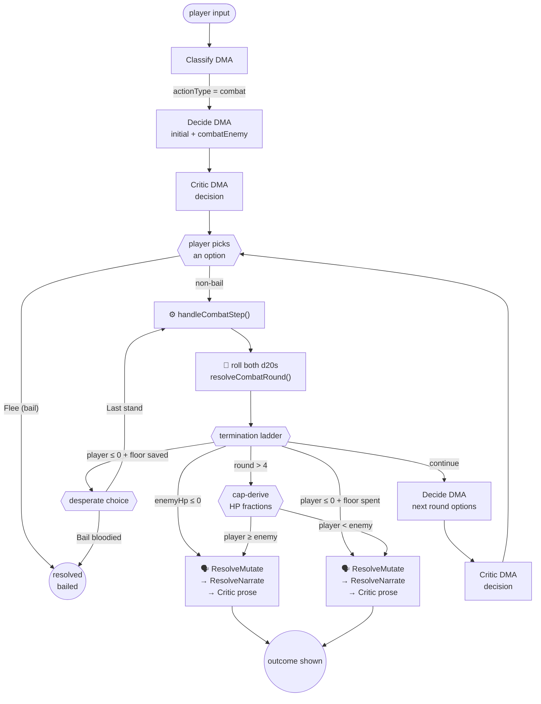
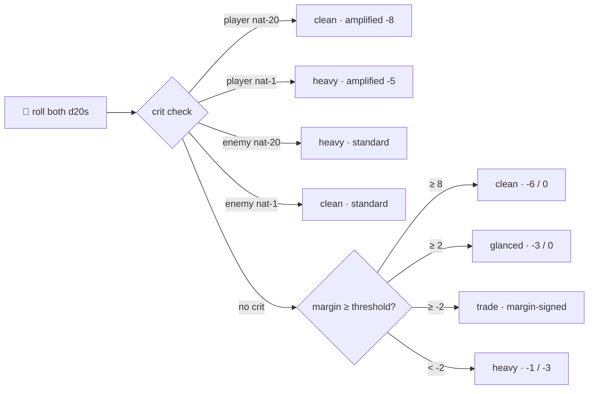

_How the v12 contested-roll combat spine executes inside the pipeline action state machine: the DMAs,
the state transitions, the band math, and the known grievances._

---

## Overview

Combat in v12 is a **contested-roll sub-mode** of the pipeline action state machine
(`PipelineActionStateMachine`). Unlike the generic action flow (classify → decide → dice → resolve,
capped at 2 decisions), combat intercepts `step()` when `actionType === 'combat' && required` and
runs its own spine: engine-owned contested `d20` rolls, a severity-band table, a once-per-day
survive-at-1 floor, and a round-cap that derives the winner from HP fractions. The engine owns
`enemyHp`; the LLM only narrates and authors ancillary loot.

The 0.3.2 polish release ([[poc-plus-0.3.2-polish-plan]]) fixed six combat-correctness defects:
contested-roll display (C1), band-led verdict reconciliation (C2), real enemy identity + HP (C3),
re-entry banded HP on the opening frame (C4), last-stand math reveal (C5), and the C6 guard
preventing combat from auto-resolving with no contested round.

## DMAs in the combat loop

Eight DMAs touch a combat action, plus two deterministic engine stages. The ownership zones match
the [[action-engine-framework]]'s three-zone model.

| # | DMA / Stage | Phase | When | Zone |
| --- | --- | --- | --- | --- |
| 1 | **Classify** | `start()` | Heuristic first; LLM fallback on a miss. Pins `actionType: 'combat'`. | 🗣️ Generative |
| 2 | **Decide (initial)** | `start()` | Authors the first decision + `combatEnemy` signal (name, anchor, optional maxHp). | 🗣️ Generative |
| 3 | **Critic (decision)** | `start()` | Gated coherence critic over the initial decide output. Major → one bounded re-decide. | 🗣️ Generative |
| — | **Engine: combat-state establish** | `handleCombatStep()` | Reads or creates the `in_combat` scene-state edge. Resolves enemy name + maxHp from the NPC if known, falls back to `deriveEnemyMaxHp(baseDc)` for ambient foes. | ⚙️ Deterministic |
| — | **Engine: contested roll + band** | `handleCombatStep()` | Rolls both `d20`s from the same injected `rollD20`. Resolves margin → band → signed HP deltas. Crits (nat-1/20) override the band outright. | 🎲 Stochastic → ⚙️ Deterministic |
| 4 | **Decide (continue, per round)** | `handleCombatStep()` → CONTINUE | Called every non-terminal round. Given the just-resolved round's `combatRoundSummary`, authors next round's options + `narration`. | 🗣️ Generative |
| 5 | **Critic (decision, per round)** | `handleCombatStep()` → CONTINUE | Same gated coherence critic as the initial beat. | 🗣️ Generative |
| 6 | **Resolve-Mutate** | `resolveCombat()` | Authors ancillary loot/rewards/losses only. Never authors `modify_health` or `in_combat` edges — those are engine-injected. | 🗣️ Generative |
| 7 | **Resolve-Narrate** | `resolveCombat()` | Authors `outcomeText` against the finalized mutation set. | 🗣️ Generative |
| 8 | **Critic (prose)** | `resolveCombat()` | Faithfulness prose critic. Patches `outcomeText` only; never touches mutations. | 🗣️ Generative |

The **single-option validator** (`validateSingleOption`) is explicitly skipped for combat (single-option
"Press the attack" is expected on a linear per-round flow).

The **travel-coherence gate** (`applyTravelCoherenceGate`) runs in `resolveCombat()` on the ancillary
mutations from RESOLVE-MUTATE — combat fights don't change location, but it costs nothing to run.

## State machine



### Round lifecycle (inside `handleCombatStep`)

```
1. desperateChoice clear  (if returning from Last Stand)
2. read/create CombatState from scene-state
3. resolve enemy anchor   (npc → nearby lookup; fallback = location minion)
4. roll playerD20 + enemyD20
5. resolveCombatRound() → band + HP deltas
6. ── TERMINATION LADDER ──
   a. enemyHp ≤ 0       → WIN
   b. playerHp ≤ 0      → floor save? (once/day) → desperate choice | hpZero → LOSE
   c. cs.round > 4       → cap-derive (HP fractions)
   d. otherwise          → CONTINUE: persist edge, call DECIDE, return nextDecision
```

### Empty-decision fallback

On a CONTINUE round, if DECIDE returns zero real options (not including the engine-appended
"Flee the fight", which is stripped before the check), the engine injects two deterministic
fallback options: "Press the attack" (dcModifier 0) and "Fight defensively" (dcModifier -1).
This guarantees a flee-only screen never reaches the player mid-fight. Telemetry flag:
`emptyDecisionFallback: true` on the `CombatBeatLog`.

## Band table and contested-roll math

The core of a combat round is the **margin** — the signed difference between the player's and the
enemy's contested totals — mapped to a severity band. Crits override the band outright.

```
margin = (playerD20 + playerBonus) - (enemyD20 + enemyBonus)
```



| Band | Margin | enemyHpDelta | playerHpDelta | Crit amplification |
| --- | --- | --- | --- | --- |
| `clean` | ≥ 8 | −6 | 0 | player nat-20: −8 |
| `glanced` | ≥ 2 | −3 | 0 | — |
| `trade` | ≥ −2 | margin > 0: −2 / margin < 0: −1\* | margin > 0: −1 / margin < 0: −2\* | — |
| `heavy` | < −2 | −1 | −3 | player nat-1: −5 |

\* `trade` asymmetry shipped in 0.3.2 C2 (POC+ exception to the "no combat re-tune" fence).
Dead tie (margin = 0): symmetric −2/−2. Crits never route to `trade`.

### Enemy bonus

```
enemyBonus = clamp(baseDc - 10, 0, ENEMY_BONUS_MAX=10)
enemyMaxHp  = clamp(round(baseDc * scale), ENEMY_HP_MIN=6, ENEMY_HP_MAX=40)
```

When the foe is a known NPC with a real `health` value, `enemyMaxHp` is seeded from that instead
(0.3.2 C3). `scale` is the Thread B world-tier seam; currently hardcoded to 1.

### Danger tier (display only, 0.3.2 C1)

The encounter's overall danger is worded, never shown as a per-beat threshold:

| DC | Tier |
| --- | --- |
| ≤ 9 | `easy` |
| 10–13 | `medium` |
| 14–17 | `hard` |
| 18–21 | `risky` |
| ≥ 22 | `fatal` |

## Terminal conditions

A fight ends through exactly one of four paths:

| Path | Trigger | Verdict | Notes |
| --- | --- | --- | --- |
| **WIN** | `enemyHp ≤ 0` | `success` | Enemy depleted. RESOLVE-MUTATE authors loot + stamina cost. |
| **hpZero** | `playerHp ≤ 0` AND floor save already spent today | `failure` | Player dies. `hpZero: true` on the outcome. |
| **Cap-derive** | `cs.round > 4` | `success` if `playerFraction ≥ enemyFraction` | Fraction = `currentHp / maxHp`. HP ratio, not absolute HP. |
| **Bail** | Player picks "Flee the fight" or "Bail bloodied" | `bailed` | `in_combat` edge persisted (enemy remembered). −1 stamina cost. |

### Once-per-day floor

The first time in a calendar day that a blow would drop the player to ≤ 0 HP, they survive at
**1 HP** and receive a forced **desperate choice**: Bail bloodied (flee, lose position/loot) or
Last stand (continue fighting — the next lethal blow genuinely kills). The floor is tracked as a
`pc → combat_save{savedDay} → pc` self-edge in scene-state.

### Cap-derive — the fraction comparison

After round 4 (cs.round = 5 when the check fires), the fight stops rolling dice. The winner is
derived from remaining HP fractions:

```
playerFraction = clamp(playerHp + playerHpDelta, 0, playerMaxHp) / playerMaxHp
enemyFraction  = clamp(newEnemyHp, 0, enemyMaxHp) / enemyMaxHp
capVerdict     = playerFraction >= enemyFraction ? success : failure
```

## Known grievances and tuning concerns

### 1. Cap-derive favours the higher-max-HP combatant (almost always the enemy)

**Why.** The enemy's max HP scales with DC (typically 12–20), while the player's max HP is fixed
at 10 (or whatever their starting class health is). In a statistically even fight where both sides
trade equally, the cap-derive fraction comparison punishes the player:

| Scenario | DC | Player | Enemy | After 4 rounds of trade | Cap verdict |
| --- | --- | --- | --- | --- | --- |
| Goblin (even match) | 12 | 10 HP → 2 HP (20%) | 12 HP → 4 HP (33%) | FAILURE |
| Wolf (hard) | 14 | 10 HP → 2 HP (20%) | 14 HP → 6 HP (43%) | FAILURE |
| Stag (risky) | 16 | 10 HP → 2 HP (20%) | 16 HP → 8 HP (50%) | FAILURE |

The player loses the fraction comparison even when they and the enemy **deal exactly the same
damage every round**. A fight the sim would model as fair (50/50 in an un-capped contest) becomes a
guaranteed loss once the cap fires.

**Why this matters in practice.** A player can dominate 3 of 4 rounds (landing clean/glanced) and
still lose at the cap because one heavy round cratered their HP fraction lower than the enemy's.
The cap-derive reads only the final snapshot, not who was winning the fight.

**Sim data (from `combat-calibration.json`, n=300 per row):**

| Stat | DC | Win rate | Loss rate | Floor save rate | Mean rounds |
| --- | --- | --- | --- | --- | --- |
| 2 | 16 | 35.7% | 64.3% | 61.0% | 5.21 |
| 5 | 16 | 58.0% | 42.0% | 39.3% | 5.02 |
| 8 | 16 | 74.7% | 25.3% | 22.7% | 4.83 |

Even with physical 8 (a strong combat build), there's a 25% chance of losing to a "hard" enemy.

### 2. Enemy bonus scales linearly with DC, outpacing player stats

`enemyBonus = clamp(baseDc - 10, 0, 10)`. At DC 16, the enemy gets +6 — matching or exceeding a
typical character's stat score. Since the margin is `(stat + d20) - (enemyBonus + d20)`, the player
needs their stat to be ~8 points higher than the enemy bonus to consistently land `clean` hits
(margin ≥ 8). A DC 16 enemy (+6 bonus) requires stat ~14 for reliable clean hits — unreachable
without heavy gear investment.

### 3. MAX_COMBAT_ROUNDS = 4 but 5 rounds are fought

The cap-derive check is `cs.round > 4`, but `cs.round` is incremented _after_ the CONTINUE path.
So round 4 is fought in full (cs.round = 4 → not > 4), then nextRound = 5 is persisted, and the
_following_ call sees cs.round = 5 and triggers cap-derive. This means the player takes HP damage
from one extra round before the fraction comparison is made.

### 4. Empty-decision guard masks LLM fatigue

The engine's fallback ("Press the attack" / "Fight defensively" with identical dcModifier = 0)
fires when DECIDE returns zero real options — but this is a telemetry-warn, not a retry. If the
LLM is producing empty decisions on combat continues, the player gets a stale, non-tactical menu
with no stat diversity, making late-round combat feel like a button-mash. The `mechanical-diversity`
check also emits a console.warn when all options share stat + dcModifier, but again offers no
remediation.

## Extension points

- [>] **World-tier scaling (`scale`)** — Thread B's seam. Multiplying band deltas and enemyMaxHp
  by `scale` keeps the distribution shape constant while raising magnitude. Currently hardcoded
  to 1.
- [>] **Item interaction in combat** — the inventory group in
  [[action-engine-framework]] §Diagram 3. `equip_item` / `consume_item` mutations are future
  verbs; combat already carries item data in the context.
- [>] **Multi-PC combat** — graph-shaped scene-state means two PCs against one enemy is just two
  `in_combat` edges pointing at the same enemy. The engine would need a turn-order concept and
  shared enemy HP.
- [>] **Prose-critic trigger (D7, parked)** — `CombatBeatLog` carries `materialMutationFired` and
  per-round ops to answer whether the prose critic should fire on every beat or only on
  material change. Currently the decision critic fires on every beat (post-§3 v12 QA removal of
  the `required` gate).

## Open questions

- [?] Should the cap-derive compare _cumulative damage dealt_ rather than remaining HP fractions?
  A damage-dealt ratio (`totalEnemyHpLost / enemyMaxHp` vs `totalPlayerHpLost / playerMaxHp`)
  would credit a player who dominated early rounds but took a bad last round.
- [?] Should `enemyBonus` clamp at a lower ceiling, or use a non-linear scale (e.g.
  `clamp(floor((baseDc - 10) / 2), 0, 5)`), so high-DC enemies don't out-stat the player so
  aggressively?
- [?] Should `MAX_COMBAT_ROUNDS` be lifted and the cap-derive moved to `cs.round > MAX_COMBAT_ROUNDS`
  instead of `>` — so exactly MAX_COMBAT_ROUNDS rounds are fought, not N+1?
- [?] Should the empty-decision fallback in combat trigger a re-decide (like the single-option
  validator does for non-combat) rather than injecting deterministic fallback options?
