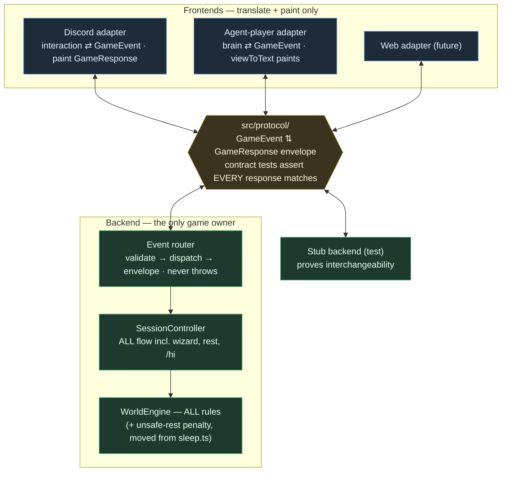

The deferred half of [[layer-boundaries-and-json-seam]]: the formal JSON protocol seam its gap table deferred ("protocol seam — does not exist") and the Discord-adapter rebuild M4 explicitly postponed ("a later, optional bolt-on; deferred, not dropped"). Motivation: the Release A measurement (§ Stage 4, findings 1–2 of `docs/archived/poc-plus/poc-plus-release-a-plan.md`) proved the agent-player is the only playtest instrument we have until human testing resumes, and today it is a privileged client — it calls `SessionController`'s typed methods in-process and goes engine-direct for the bookends, so its findings are not guaranteed player-true. This refactor makes the seam a real, single JSON channel that every frontend crosses for every mechanic, so agent smoke runs play exactly what players play, and frontends and backends become independently swappable. Direction settled with the owner 2026-08-02 (see Settled direction). Execution is one orchestrated-delegation **loop**, not a graph — see § Loop, not graph.

---

## The law

**Every game mechanic crosses the single JSON seam. No frontend holds a privileged channel to the engine or controller; no game rule, flow, or render-assembly lives in an adapter.** A frontend translates its transport's events into protocol input-events and paints the returned envelopes; the backend owns everything else. Frontends (Discord, agent-player, a future web UI) and backends (the real engine, a stub, a future service) are interchangeable because the protocol is the only surface either side sees.

## Settled direction (owner, 2026-08-02)

1. **Full scope.** The Discord adapter is rebuilt onto the protocol in this arc, not deferred again. The seam is only "single" when Discord crosses it too.
2. **Bookends come in.** Character creation, nightly rest+tick, and `/hi` stop being Discord-only flows the agent reaches engine-direct (M4's DA-4). The whole player lifecycle crosses the seam.
3. **The law applies going forward.** All future mechanics land behind the protocol; nothing new may ship as an adapter-side flow.
4. **Out of scope (deliberately separate):** the `AGENT_FORCE_FREE_ACTIONS`-style switch / day-job-rationing brain change from Release A finding 1. It is seam-independent and lands as its own task after this refactor; this arc must not grow it.

## Now — what exists (the banked base)

[p] `src/view/viewState.ts` — the semantic `ViewState` union (6 variants: decision, outcome, notice, menu, loading, commute), all-string fields, JSON-serialisable, imports nothing from `discord.js`. The response payload is already 90% built.
[p] `src/controller/SessionController.ts` (310 lines) — the transport-neutral flow owner for the action loop: `needsCharacterGate`, `stampLastPlayed`, `beginChoice`/`resolveChoice`/`stepChoice`, `openActionMenu`, `beginDayJob`/`commuteForWork`/`runWork`, `beginCustomAction`/`runCustomAction`, `feedbackConfirmation`/`recordFeedback`.
[p] `src/discord/dispatchInteraction.ts` (927 lines) — transport + paint only since M3; the M1 golden-transcript oracle (`tests/discord/dispatch-oracle.test.ts`) and the M2 snapshots characterise its behaviour byte-for-byte.
[p] `src/agent/harness.ts` — plays the mid-day loop through those same typed controller methods; `viewToText` is the agent medium step.
[c] The agent is a **typed-call client**, not a protocol client: no event/envelope vocabulary exists, so "every response matches the envelope" cannot be asserted, and a stub backend cannot be substituted.
[c] **Bookends bypass the seam.** Character creation (`commands/join.ts`, 511 lines + `WizardSession.ts`), rest+tick (`commands/sleep.ts`), and `/hi` (`commands/hi.ts`) have no controller seam and no `ViewState`; the agent harness calls the engine directly for them.
[!] **A second rule leak:** the unsafe-rest −1 HP penalty lives in `src/discord/commands/sleep.ts` (~:87-107), not the engine — the same smell as the M0 commute leak, and the reason the agent harness's `endDay` can never surface unsafe-rest feedback (M4.5 fidelity caveat 2). M7 moves it into the engine, mirroring M0.
[c] Read-only screens (`look`, `map`, `stats`, `backpack`, `journal`, `help`) are direct engine reads + render inside command files. Small, but they are mechanics, so the law covers them.

## Target

## Protocol design — settled calls and lead-owned questions

[I] **Home: `src/protocol/`.** A new top-level module that imports nothing from `discord.js`, `src/discord/`, `src/agent/`, or the engine implementation (engine *types* only where unavoidable). The non-imports are the structural guarantee, same trick as `viewState.ts`.
[I] **Envelope.** `GameResponse = { ok: true; view?: ViewState; facts?: Record<string, unknown> } | { ok: false; error: { code: GameErrorCode; message: string } }`. `facts` carries the semantic side-channel data adapters already consume (distilled type, character name, broadcast payload facts), so no adapter re-derives them. Exact shape is the lead's first settle; every field must be JSON-serialisable.
[I] **Events.** `GameEvent` is a discriminated union on `type`. First-cut inventory, mapped to today's surface: `menu.open`, `dayjob.start`, `action.custom`, `action.choose` (option index | bail), `feedback.submit`, `bug.submit` (the M5 action loop); `rest.begin`, `hi.open`, `character.create` + wizard-step events (M7); `screen.render` variants for look/map/stats/backpack/journal (M8). The union grows only in the slice that first needs each event — the established "no unused vocabulary ahead of a caller" rule.
[I] **Identity is opaque.** Events carry a `playerId: string`; nothing in the protocol assumes a Discord snowflake. (Today that string *is* the Discord user id; the protocol must not care.)
[I] **The router never throws.** Malformed events, unknown types, illegal moves, and backend errors all come back as `ok: false` envelopes with a stable `GameErrorCode` taxonomy (`no-character`, `no-rolls`, `stale-session`, `illegal-move`, `unsafe`, `invalid-event`, `internal`, …). A throw escaping the router is a contract violation the suite tests for.
[I] **Versioning.** A `PROTOCOL_VERSION` constant stamps the module; recorded in transcripts so a future breaking change is detectable.
[I] **Validation is hand-rolled**, matching the repo's gateway convention (throw-loud parse/validate functions, e.g. `resolveReport` in `ProdPlaytestCriticGateway`). No schema-library dependency.
[I] **In-process transport** (parent decision 3 stands): frontends import the router and pass objects. The protocol *shape* is the asset; a network socket stays a later bolt-on.

[?] **Staged flows and interstitial beats — the lead's first design settle.** The day-job flow paints "Starting…" and the commute beat *between* controller steps, and the commute embed must render before the seconds-long LLM call (the M0 rationale). Options: (a) the router takes an `onBeat(view)` callback for interstitials while the final envelope is the return value — flow stays server-side, in-process-friendly, and a future network transport maps beats to streamed messages; (b) one event returns `{ views: ViewState[] }` — simpler envelope, but the client can't paint beat 1 before the LLM call that produces beat 3, so it regresses live UX. Recommendation: (a). The same mechanism covers the custom-action "Thinking…" beat.
[?] **Wizard state ownership.** The join wizard's multi-step session state (`WizardSession.ts`, currently instance-scoped adapter state) must become backend-owned for `character.create` to cross the seam — either controller-held session state keyed by `playerId`, or engine-persisted draft state. The M7.3 slice plan settles it; note the tension with parent decision 1 (session state is engine-owned, controller stateless) — that decision covered *option-resolution* state, and extending it to wizard drafts is a genuine design call, not a given.

## The contract-test barrier (the point of the exercise)

The single highest-value artefact in this arc is `tests/protocol/` — a suite that turns barrier verification from reading diffs into running a command. It lands in M5, **before** any migration, and every later slice extends it in the same commit as the event it adds.

- **Conformance:** every `GameResponse` the router emits, across every event type and every branch (success, each error code, each `ViewState` variant), validates against the envelope schema. "Every response matches the envelope" is asserted, not reviewed.
- **Negative space:** unknown event types, malformed payloads, out-of-range indices, and illegal moves for the current screen all return `ok: false` envelopes; the router never throws.
- **Round-trip:** every `ViewState` variant survives `JSON.parse(JSON.stringify(view))` unchanged (the seam is JSON even in-process).
- **Interchangeability:** the same suite runs against (a) the real backend and (b) a minimal stub backend behind the router. A frontend can be built and tested against the stub; the backend can be replaced under a frontend. This is the executable proof of the law.
- **No network, deterministic:** like every existing suite, it runs in `npm test` with stubs.

## Loop, not graph (execution shape — binding)

This arc runs as **one orchestrated-delegation loop per slice**: lead specs the slice → executor builds → lead verifies (re-run gates, read the riskiest file) → commit → fresh-context reviewer → triage → fixer → verify → commit → coordinator checkpoint → `/clear`. **No parallel streams, no worktrees.** The honest warning from principle 9 applies in full: comms reworks feel parallelisable but aren't, because `SessionController.ts`, `dispatchInteraction.ts`, `viewToDiscord.ts`, `viewState.ts`, and `src/agent/harness.ts` are touched by nearly every slice — two streams would share files, which makes them one stream. A loop of small per-domain slices is still fast, and far cheaper than untangling colliding worktrees.

## Milestones

Order is binding. Each milestone's detailed task checklist is written by the implementing lead just before it starts (the established pattern — over-specifying ten checklists upfront only gets rewritten as the protocol shape settles). Gates stack: every commit keeps **all** prior gates green.

[x] M0–M4 — done (see parent doc): engine seam, oracle, view-state DTO, controller, agent-player adapter.
[ ] **M5 — The contract.** `src/protocol/` types (envelope, M5-event union, error taxonomy, version) → `tests/protocol/` contract suite → the in-process event router over `SessionController` for the action-loop events (`menu.open`, `dayjob.start`, `action.custom`, `action.choose`, `feedback.submit`, `bug.submit`), interstitial-beat mechanism settled and built. Purely additive: no production caller yet, zero behaviour change. Gate: typecheck + suite green at baseline; contract suite green against real backend and stub.
[ ] **M6 — Agent-player becomes a protocol client.** `src/agent/harness.ts` speaks only `GameEvent`/`GameResponse` through the router for the mid-day loop (bookends stay engine-direct until M7); no controller imports left in the action path; `viewToText` reads envelope views. Gate: deterministic harness tests green (scripted brain, no network); one live `npm run agent:play` smoke run clean (exit 0, no new findings).
[ ] **M7 — Bookends through the seam.** M7.0 extends the characterisation oracle to the join/hi/sleep command paths *first* (the M1-before-M3 pattern: no migration without a net). M7.1 rest+tick: the unsafe-rest −1 HP rule moves from `sleep.ts` into the engine (M0-style leak fix), `rest.begin` event + view-state, `sleep.ts` rewires, the agent drops its engine-direct `endDay`. M7.2 `/hi` through the seam. M7.3 character creation through the seam (wizard state ownership settled; the hardest slice — judge candidate). Gate: M7.0 oracle coverage green before each migration; contract suite extended per event; agent lifecycle fully protocol-driven.
[ ] **M8 — Read-only screens through the seam.** `look`, `map`, `stats`, `backpack`, `journal` (and `help` if it carries game content) become `screen.*` events returning view-states; the agent gains full player parity. Small slices, one per screen or batched at the lead's call.
[ ] **M9 — Discord adapter rebuilt onto the protocol.** `dispatchInteraction.ts` and the command files become translate + paint only: interaction → `GameEvent` → router → paint via `viewToDiscord`. Zero controller/engine imports remain in `src/discord/` (structural check, e.g. madge). Gate: **byte-identical** — the M1 oracle + M2 snapshots + M7.0 bookend coverage all green with zero snapshot churn; a snapshot change means the port drifted — fix the port, never re-bless.
[ ] **M10 — Closeout.** Interchangeability proof recorded (contract suite green against stub + real backend); the parent doc's gap-table "protocol seam" and "frontend adapters" rows settled; `CHANGELOG.md`, `TODO.md`, and this doc's execution state updated; the `AGENT_FORCE_FREE_ACTIONS` follow-up task written up in `TODO.md` as the next arc's first item.

## Verification baseline

`npm run typecheck` clean; `npm test` green (reconcile the count on branch first — 89 files / 1675 tests per `TODO.md` § RESUME HERE at 0.3.3). Live runs need `set -a; . ./.env; set +a` first (no dotenv); real-LLM smoke runs are opt-in via `npm run agent:play` per the `agent-smoke` skill and cost real tokens — keep `AGENT_DAYS` small.

## Scope fences (whole arc)

- No game-rule, balance, or prompt changes. The unsafe-rest penalty *moves*; it does not change value or conditions. Any behaviour change the migration forces is flagged as a decision, not smuggled.
- No `sim/` changes; it enters at the engine and stays there (parent decision 6).
- The error funnel/guard plumbing stays wrapping the adapter — that is [[discord-interaction-layer]]'s remit, still sequenced after.
- No network transport, no web adapter, no multi-agent co-located runs (the protocol enables them; building them is a later arc).
- The free-action-forcing harness change is the *next* task, not this one (settled direction 4).
- Branch: one feature branch off `dev` (after the owner's pending 0.3.3 merge lands — reconcile-first); atomic commit per slice; changelog per slice; the owner merges to `dev`. No agent commits, pushes, or checkouts of `dev`/`main`.

## Execution state

*(empty — the implementing lead records per-slice state, commit hashes, and review outcomes here, following the json-seam-build-plans pattern.)*
