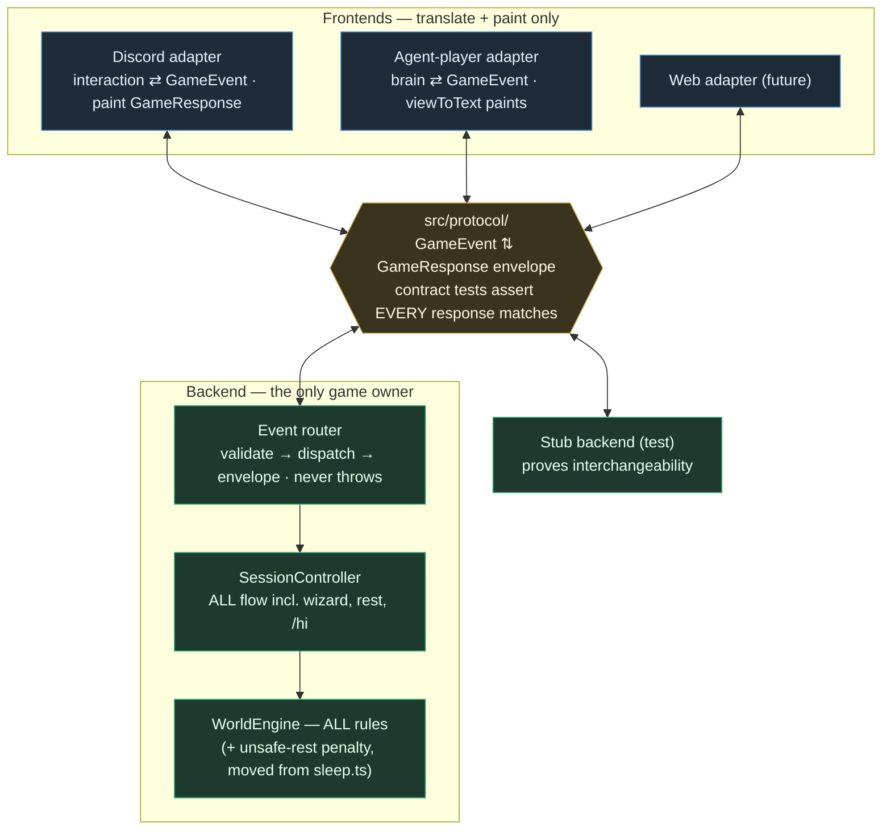

The deferred half of [[layer-boundaries-and-json-seam]]: the formal JSON protocol seam its gap table deferred ("protocol seam — does not exist") and the Discord-adapter rebuild M4 explicitly postponed ("a later, optional bolt-on; deferred, not dropped"). Motivation: the Release A measurement (§ Stage 4, findings 1–2 of `docs/archived/poc-plus/poc-plus-release-a-plan.md`) proved the agent-player is the only playtest instrument we have until human testing resumes, and today it is a privileged client — it calls `SessionController`'s typed methods in-process and goes engine-direct for the bookends, so its findings are not guaranteed player-true. This refactor makes the seam a real, single JSON channel that every frontend crosses for every mechanic, so agent smoke runs play exactly what players play, and frontends and backends become independently swappable. Direction settled with the owner 2026-08-02 (see Settled direction). Execution is one orchestrated-delegation **loop**, not a graph — see § Loop, not graph.

---

## The law

**Every game mechanic crosses the single JSON seam. No frontend holds a privileged channel to the engine or controller; no game rule, flow, or render-assembly lives in an adapter.** A frontend translates its transport's events into protocol input-events and paints the returned envelopes; the backend owns everything else. Frontends (Discord, agent-player, a future web UI) and backends (the real engine, a stub, a future service) are interchangeable because the protocol is the only surface either side sees.

## Settled direction (owner, 2026-08-02)

1. **Full scope.** The Discord adapter is rebuilt onto the protocol in this arc, not deferred again. The seam is only "single" when Discord crosses it too.
2. **Bookends come in.** Character creation, nightly rest+tick, and `/hi` stop being Discord-only flows the agent reaches engine-direct (M4's DA-4). The whole player lifecycle crosses the seam.
3. **The law applies going forward.** All future mechanics land behind the protocol; nothing new may ship as an adapter-side flow.
4. **Out of scope (deliberately separate):** the `AGENT_FORCE_FREE_ACTIONS`-style switch / day-job-rationing brain change from Release A finding 1. It is seam-independent and lands as its own task after this refactor; this arc must not grow it.

## Now — what exists (the banked base)

[p] `src/view/viewState.ts` — the semantic `ViewState` union (6 variants: decision, outcome, notice, menu, loading, commute), all-string fields, JSON-serialisable, imports nothing from `discord.js`. The response payload is already 90% built.
[p] `src/controller/SessionController.ts` (310 lines) — the transport-neutral flow owner for the action loop: `needsCharacterGate`, `stampLastPlayed`, `beginChoice`/`resolveChoice`/`stepChoice`, `openActionMenu`, `beginDayJob`/`commuteForWork`/`runWork`, `beginCustomAction`/`runCustomAction`, `feedbackConfirmation`/`recordFeedback`.
[p] `src/discord/dispatchInteraction.ts` (927 lines) — transport + paint only since M3; the M1 golden-transcript oracle (`tests/discord/dispatch-oracle.test.ts`) and the M2 snapshots characterise its behaviour byte-for-byte.
[p] `src/agent/harness.ts` — plays the mid-day loop through those same typed controller methods; `viewToText` is the agent medium step.
[c] The agent is a **typed-call client**, not a protocol client: no event/envelope vocabulary exists, so "every response matches the envelope" cannot be asserted, and a stub backend cannot be substituted.
[c] **Bookends bypass the seam.** Character creation (`commands/join.ts`, 511 lines + `WizardSession.ts`), rest+tick (`commands/sleep.ts`), and `/hi` (`commands/hi.ts`) have no controller seam and no `ViewState`; the agent harness calls the engine directly for them.
[!] **A second rule leak:** the unsafe-rest −1 HP penalty lives in `src/discord/commands/sleep.ts` (~:87-107), not the engine — the same smell as the M0 commute leak, and the reason the agent harness's `endDay` can never surface unsafe-rest feedback (M4.5 fidelity caveat 2). M7 moves it into the engine, mirroring M0.
[c] Read-only screens (`look`, `map`, `stats`, `backpack`, `journal`, `help`) are direct engine reads + render inside command files. Small, but they are mechanics, so the law covers them.

## Target



## Protocol design — settled calls and lead-owned questions

[I] **Home: `src/protocol/`.** A new top-level module that imports nothing from `discord.js`, `src/discord/`, `src/agent/`, or the engine implementation (engine *types* only where unavoidable). The non-imports are the structural guarantee, same trick as `viewState.ts`.
[I] **Envelope.** `GameResponse = { ok: true; view?: ViewState; facts?: Record<string, unknown> } | { ok: false; error: { code: GameErrorCode; message: string } }`. `facts` carries the semantic side-channel data adapters already consume (distilled type, character name, broadcast payload facts), so no adapter re-derives them. Exact shape is the lead's first settle; every field must be JSON-serialisable.
[I] **Events.** `GameEvent` is a discriminated union on `type`. First-cut inventory, mapped to today's surface: `menu.open`, `dayjob.start`, `action.custom`, `action.choose` (option index | bail), `feedback.submit`, `bug.submit` (the M5 action loop); `rest.begin`, `hi.open`, `character.create` + wizard-step events (M7); `screen.render` variants for look/map/stats/backpack/journal (M8). The union grows only in the slice that first needs each event — the established "no unused vocabulary ahead of a caller" rule.
[I] **Identity is opaque.** Events carry a `playerId: string`; nothing in the protocol assumes a Discord snowflake. (Today that string *is* the Discord user id; the protocol must not care.)
[I] **The router never throws.** Malformed events, unknown types, illegal moves, and backend errors all come back as `ok: false` envelopes with a stable `GameErrorCode` taxonomy (`no-character`, `no-rolls`, `stale-session`, `illegal-move`, `unsafe`, `invalid-event`, `internal`, …). A throw escaping the router is a contract violation the suite tests for.
[I] **Versioning.** A `PROTOCOL_VERSION` constant stamps the module; recorded in transcripts so a future breaking change is detectable.
[I] **Validation is hand-rolled**, matching the repo's gateway convention (throw-loud parse/validate functions, e.g. `resolveReport` in `ProdPlaytestCriticGateway`). No schema-library dependency.
[I] **In-process transport** (parent decision 3 stands): frontends import the router and pass objects. The protocol *shape* is the asset; a network socket stays a later bolt-on.

[I] **Staged flows and interstitial beats — SETTLED 2026-08-02 (option a).** The router takes an optional `onBeat(beat: GameResponse)` callback for interstitials while the final envelope is the return value: `dispatch(event: unknown, onBeat?): Promise<GameResponse>`. Beats are full `ok: true` envelopes carrying `loading`/`commute` views, emitted in flow order; flow stays server-side, in-process-friendly, and a future network transport maps beats to streamed messages. **Beat semantics: beats are advisory; the returned envelope is authoritative.** The router wraps every `onBeat` invocation in try/catch — a throwing adapter paint callback is `console.error`-logged and the flow continues, so the router-never-throws guarantee covers callback throws too (settles the coordinator's pre-flight risk 2). The same mechanism covers the custom-action and action-choice "Thinking…" beats. The contract suite asserts beat envelope-conformance, JSON round-trip, ordering, and never-throws (including a throwing `onBeat`) from M5 on.
[I] **Wizard state ownership.** The join wizard's multi-step session state (`WizardSession.ts`, currently instance-scoped adapter state) must become backend-owned for `character.create` to cross the seam — either controller-held session state keyed by `playerId`, or engine-persisted draft state. The M7.3 slice plan settles it; note the tension with parent decision 1 (session state is engine-owned, controller stateless) — that decision covered *option-resolution* state, and extending it to wizard drafts is a genuine design call, not a given. **Per the coordinator's pre-flight steer, M7.3's plan includes a `decisions/` record for whichever extension is chosen — the parent doc requires one to change a settled decision, and it must not be smuggled in as a slice note.**

## The contract-test barrier (the point of the exercise)

The single highest-value artefact in this arc is `tests/protocol/` — a suite that turns barrier verification from reading diffs into running a command. It lands in M5, **before** any migration, and every later slice extends it in the same commit as the event it adds.

- **Conformance:** every `GameResponse` the router emits, across every event type and every branch (success, each error code, each `ViewState` variant), validates against the envelope schema. "Every response matches the envelope" is asserted, not reviewed.
- **Negative space:** unknown event types, malformed payloads, out-of-range indices, and illegal moves for the current screen all return `ok: false` envelopes; the router never throws.
- **Round-trip:** every `ViewState` variant survives `JSON.parse(JSON.stringify(view))` unchanged (the seam is JSON even in-process).
- **Interchangeability:** the same suite runs against (a) the real backend and (b) a minimal stub backend behind the router. A frontend can be built and tested against the stub; the backend can be replaced under a frontend. This is the executable proof of the law.
- **No network, deterministic:** like every existing suite, it runs in `npm test` with stubs.

## Loop, not graph (execution shape — binding)

This arc runs as **one orchestrated-delegation loop per slice**: lead specs the slice → executor builds → lead verifies (re-run gates, read the riskiest file) → commit → fresh-context reviewer → triage → fixer → verify → commit → coordinator checkpoint → `/clear`. **No parallel streams, no worktrees.** The honest warning from principle 9 applies in full: comms reworks feel parallelisable but aren't, because `SessionController.ts`, `dispatchInteraction.ts`, `viewToDiscord.ts`, `viewState.ts`, and `src/agent/harness.ts` are touched by nearly every slice — two streams would share files, which makes them one stream. A loop of small per-domain slices is still fast, and far cheaper than untangling colliding worktrees.

## Milestones

Order is binding. Each milestone's detailed task checklist is written by the implementing lead just before it starts (the established pattern — over-specifying ten checklists upfront only gets rewritten as the protocol shape settles). Gates stack: every commit keeps **all** prior gates green. The M5–M10 checklists live in this doc (the M0–M4 pattern's `json-seam-build-plans.md` stays the M0–M4 record).

[x] M0–M4 — done (see parent doc): engine seam, oracle, view-state DTO, controller, agent-player adapter.
[x] **M5 — The contract.** *(done 2026-08-02 — slices M5.0/M5.1 below)* `src/protocol/` types (envelope, M5-event union, error taxonomy, version) → `tests/protocol/` contract suite → the in-process event router over `SessionController` for the action-loop events (`menu.open`, `dayjob.start`, `action.custom`, `action.choose`, `feedback.submit`, `bug.submit`), interstitial-beat mechanism settled and built. Purely additive: no production caller yet, zero behaviour change. Gate: typecheck + suite green at baseline; contract suite green against real backend and stub.
[x] **M6 — Agent-player becomes a protocol client.** *(done 2026-08-02 — single slice, execution state below)* `src/agent/harness.ts` speaks only `GameEvent`/`GameResponse` through the router for the mid-day loop (bookends stay engine-direct until M7); no controller imports left in the action path; `viewToText` reads envelope views. Gate: deterministic harness tests green (scripted brain, no network); one live `npm run agent:play` smoke run clean (exit 0, no new findings).
[ ] **M7 — Bookends through the seam.** M7.0 extends the characterisation oracle to the join/hi/sleep command paths *first* (the M1-before-M3 pattern: no migration without a net). M7.1 rest+tick: the unsafe-rest −1 HP rule moves from `sleep.ts` into the engine (M0-style leak fix), `rest.begin` event + view-state, `sleep.ts` rewires, the agent drops its engine-direct `endDay`. M7.2 `/hi` through the seam. M7.3 character creation through the seam (wizard state ownership settled; the hardest slice — judge candidate). Gate: M7.0 oracle coverage green before each migration; contract suite extended per event; agent lifecycle fully protocol-driven.
[ ] **M8 — Read-only screens through the seam.** `look`, `map`, `stats`, `backpack`, `journal` (and `help` if it carries game content) become `screen.*` events returning view-states; the agent gains full player parity. Small slices, one per screen or batched at the lead's call.
[ ] **M8.5 — Smoke-run tooling (between M8 and M9).** The settled smoke-run tooling plan (below): the run transcript gains a protocol-shaped log (DC-S1), replay + stub-backed modes (DC-S2), the lifecycle parity beats (DC-S3), the typed observer/player boundary (DC-S4), and the choice-fidelity invariants (DC-S5). Gate: typecheck + full suite + a protocol-transcript smoke assertion (deterministic replay or stub-backed run) green.
[ ] **M9 — Discord adapter rebuilt onto the protocol.** `dispatchInteraction.ts` and the command files become translate + paint only: interaction → `GameEvent` → router → paint via `viewToDiscord`. Zero controller/engine imports remain in `src/discord/` (structural check, e.g. madge). Gate: **byte-identical** — the M1 oracle + M2 snapshots + M7.0 bookend coverage all green with zero snapshot churn; a snapshot change means the port drifted — fix the port, never re-bless. The M8.5 replay gate stacks: replay of the M8.5 corpus (stub + deterministic real-backend transcripts) byte-green.
[ ] **M10 — Closeout.** Interchangeability proof recorded (contract suite green against stub + real backend); the parent doc's gap-table "protocol seam" and "frontend adapters" rows settled; `CHANGELOG.md`, `TODO.md`, and this doc's execution state updated; the `AGENT_FORCE_FREE_ACTIONS` follow-up task written up in `TODO.md` as the next arc's first item.

## M5 build plan (lead-settled 2026-08-02)

Goal: `src/protocol/` — the envelope, the M5 event union, the error taxonomy, the version stamp, hand-rolled validators, and the in-process router over `SessionController` for the six action-loop events — plus `tests/protocol/`, the contract-test barrier. **Purely additive: no production caller, zero behaviour change, no edits to existing source files.** Gate: typecheck clean; full suite green at the 89 files / 1686 tests baseline plus the new protocol tests; the contract suite green against the real backend (SessionController + MockWorldEngine) and a canned stub backend alike.

### Settled design calls (M5)

[I] **Envelope (DC-P1, frozen).**

```ts
export const PROTOCOL_VERSION = 1;

export type GameErrorCode =
  | 'no-character' | 'no-rolls' | 'stale-session' | 'session-expired'
  | 'illegal-move' | 'unsafe' | 'empty-action' | 'invalid-event' | 'internal';

export type GameResponse =
  | { v: number; ok: true; view?: ViewState; facts?: Record<string, unknown> }
  | { v: number; ok: false; error: { code: GameErrorCode; message: string }; facts?: Record<string, unknown> };
```

`v` stamps every envelope (= `PROTOCOL_VERSION`) so conformance is trivially assertable and a future breaking change is detectable per message. `facts` is allowed on error envelopes too (the `stale-session` narration needs it). **`facts` is a closed set:** the response validator whitelists known keys and rejects anything else, so the escape hatch cannot grow without a deliberate validator edit (the coordinator's "second protocol" risk). M5's keys: `distilledType`, `characterName`, `characterClass`, `actionId` (outcome broadcasts; consumers: the M9 Discord broadcast line, the M6 agent transcript), `nav: { rollsRemaining, hasPendingAction, hasRestedToday }` (the exact three fields `getNavButtons` reads; consumer: M9 nav-button assembly), `narration` (only on `stale-session` errors; consumer: the slash `/action` stale paint's `withNarration`).

[I] **Events (DC-P2).** `GameEvent` is a discriminated union on `type`, `playerId: string` everywhere (opaque identity — the protocol must not care that today it's a Discord snowflake):

```ts
| { type: 'menu.open'; playerId: string }
| { type: 'dayjob.start'; playerId: string; jobIndex: number }
| { type: 'action.custom'; playerId: string; text: string }
| { type: 'action.choose'; playerId: string; selector: { kind: 'option'; index: number } | { kind: 'bail' } }
| { type: 'feedback.submit'; playerId: string; surface: 'sleep' | 'release' | 'outcome-feedback'; text: string; actionId?: number }
| { type: 'bug.submit'; playerId: string; text: string; actionId?: number }
```

`bug.submit` maps to the controller's `'outcome-bug'` surface; the union grows only in the slice that first needs each event.

[I] **The router boundary takes `unknown` (DC-P3).** `dispatch(event: unknown, onBeat?): Promise<GameResponse>` — validation is the router's job, so the negative-space barrier (malformed payloads → `ok: false 'invalid-event'`, never a throw) is structural, not a test hope. Hand-rolled validators per the repo's throw-loud convention, but internal: `validateGameEvent(raw)` returns `{ ok: true; event } | { ok: false; message }`.

[I] **Result → envelope mapping (DC-P4).** The router owns player-facing copy; the adapter keeps only medium chrome (embed title/colour keyed by error code + call site, ephemeral flags). Byte-identity recon (2026-08-02) found the two no-character copies split cleanly by event — `menu.open`'s callers (nav:action, slash `/action`) both use the "…yet. Type `/join` to create one." copy, the three other events' call sites use "…Type `/join` first." — so per-event canonical copy preserves every current paint with zero drift:

| Controller result | Envelope |
| --- | --- |
| `no-character` (menu.open) | `ok:false 'no-character'`, `"You don't have a character yet. Type \`/join\` to create one."` |
| `no-character` (other events) | `ok:false 'no-character'`, `"You don't have a character. Type \`/join\` first."` |
| `no-rolls` | `ok:false 'no-rolls'`, the 🛌 copy (identical at both call sites today) |
| `resume-stale` | `ok:false 'stale-session'`, message = prompt, `facts.narration` when present |
| `resume-error` | `ok:false 'internal'`, message = the error message |
| `menu` / `resume-decision` / `resume` | `ok:true`, view |
| `invalid-job` | `ok:false 'illegal-move'`, `"Invalid job action."` |
| `unsafe` | `ok:false 'unsafe'`, the ⚠️ copy with `location` interpolated |
| `resolveChoice` → null | `ok:false 'session-expired'`, `"❌ Your action session expired. Try \`/action\` again."` |
| `empty-action` | `ok:false 'empty-action'`, message = prompt |
| `decision` / `outcome` (runWork/runCustomAction/stepChoice) | `ok:true`, view (+ outcome `facts` per DC-P1; the RA-6 identical `viewPrivate`/`viewPublic` pair travels as ONE view) |
| feedback/bug submit | `ok:true`, view = the surface's confirmation `NoticeViewState`; `recordFeedback` runs inside the router in try/catch (best-effort, preserving today's reply-first resilience) |
| any controller throw | `ok:false 'internal'`, message = `err.message` (the router never throws) |

[I] **Beats (DC-P5, per the settled onBeat decision).** One `idle()` string per dispatch, threaded into every beat of that dispatch (matches today's single `randomIdleMessage()` call): `dayjob.start` beats `loading { body: "⏳ **Starting…**\n_${idle}_" }` after guards pass, then `commute { destination, idle }` when commuted, then the final envelope; `action.custom` beats `loading { body: "**You:** ${clipped}\n\n⏳ **Thinking…**\n_${idle}_" }` (the 280-char clip moves into the router — it is part of the screen copy); `action.choose` beats `loading { body: "**You:** ${label}\n\n⏳ **Thinking…**\n_${idle}_" }` after resolution. The router's idle source is an injected `() => string` dep (the Discord adapter passes `randomIdleMessage` at M9; the agent + tests pass deterministic ones) — `src/protocol/` stays free of adapter imports.

[I] **Event flow order (DC-P6, faithful to today's leaves).** `menu.open`: `stampLastPlayed` → `openActionMenu` (the nav:action leaf's order). `dayjob.start`: `beginDayJob` (its own inline stamp) → beat → `commuteForWork` → beat-if-commuted → `runWork`. `action.custom`: `beginCustomAction` → (resume → view) → beat → `runCustomAction`. `action.choose`: `beginChoice` → `resolveChoice` → beat → `stepChoice`. No stamps beyond today's.

[I] **Stub backend + the RouterBackend interface (DC-P7).** The router depends on a `RouterBackend` interface — exactly the controller surface it calls (`stampLastPlayed`, `openActionMenu`, `beginDayJob`, `commuteForWork`, `runWork`, `beginCustomAction`, `runCustomAction`, `beginChoice`, `resolveChoice`, `stepChoice`, `feedbackConfirmation`, `recordFeedback`). `SessionController` satisfies it structurally; the contract suite's stub is a canned-script fixture. This is the interchangeability proof staying in M5 scope (the coordinator's steer), not drifting to M10.

[I] **File layout (DC-P8).** `src/protocol/envelope.ts` (version, types, `validateGameResponse` — whitelists the `facts` keys), `src/protocol/events.ts` (the union + `validateGameEvent`), `src/protocol/router.ts` (`GameRouter`, the mapping, the beat mechanics). Non-imports per the spec's Home rule: nothing from `discord.js`, `src/discord/`, `src/agent/`; engine/controller *types* only where unavoidable; `ViewState` from `src/view/viewState.ts`.

[I] **Known M9 watch items (flagged, not smuggled).** (1) The slash `/action` stale-resume fallback copy (`'Your previous action could not be recovered.'`, inline in `commands/action.ts`) differs from the controller's (`'Could not recover.'`). When M9 routes slash `/action` through `menu.open`, the controller's fallback wins — a copy-only drift on a dead-edge path. Settle at M9 with the oracle coverage in hand; if the path is characterised, record the unification as a decision, never re-bless silently. (2) The profanity guard (`checkProfanity`, `dispatchInteraction.ts` ~:315-321) runs adapter-side before `beginCustomAction`; the law ("no game rule lives in an adapter") forces a decision at M9 — move it behind the seam (router or controller) or record why it stays. Found by the M5.1 review.

### Slices

[x] **M5.0 — Types + validators.** *(done 2026-08-02, build `050020c` + review fix `a3920f0`)* `envelope.ts` + `events.ts` + unit tests (`tests/protocol/validate.test.ts`, 40 tests). Fresh-context review: one blocker accepted (the build commit's changelog edit had deleted the `## [0.3.3]` heading — restored) + three hardening fixes accepted (cross-arm pollution rejected — ok:true+error / ok:false+view; deep JSON-serialisability walk so nested functions can't pass; integer `nav.rollsRemaining`); whitespace-playerId dropped (identity is opaque by design). 90 files / 1726 tests green (+40 over the 1686 baseline), typecheck clean.
[x] **M5.1 — Router + contract suite (same commit — the coordinator's barrier).** *(done 2026-08-02, build `513921a` + review fix `22f291e`)* `router.ts` per DC-P4/P5/P6 + `tests/protocol/contract.test.ts` (95 tests): conformance of every event × every reachable branch against BOTH the real backend and a canned stub with shared expectations (hard-coded copy — the suite is the drift net), negative space, JSON round-trip (views + error-envelope facts), beat order pinned by an interleaved call log, never-rejects incl. hostile getters/unstringable throws. All 9 error codes and all 6 view variants reached. Fresh-context review: byte-identity of every copy constant + flow order verified programmatically against both adapter call sites (zero drift); accepted fixes closed two never-throws holes (gate inside the try; safeStringify at every catch), the falsy session-expired check, and suite gaps (beat position vs backend calls, beats-empty on error branches, stamp-throw path); dropped the idle-drawn-without-onBeat cosmetic. 91 files / 1821 tests green (+135 over the 1686 baseline), typecheck clean.

Scope fence (M5): additive only — no edits to existing source under `src/`; no new view-state variants (the union covers everything M5 emits); no production caller; no `sim/` changes; `PROTOCOL_VERSION` stays 1 throughout the arc unless a breaking change forces otherwise (flag it).

**Execution state:** M5.0 done (above). Open settles carried into M5.1: (1) the `empty-action` empty-prompt policy (review F8) — the validator rejects empty `error.message`, and the controller's `empty-action` carries a raw `firstDecision.prompt` that can be `''`, so the router must apply a fallback (settle: `prompt || 'Could not recover.'`, mirroring the controller's own resume-stale fallback; copy-only on a dead edge, flagged here per the scope fence); (2) the contract suite should assert decision/menu button-element shape on emitted views (review F7) since the envelope validator deliberately checks views shallowly.

---

## M6 build plan (lead-settled 2026-08-02)

Goal: `src/agent/harness.ts` speaks only `GameEvent`/`GameResponse` through `GameRouter` for the mid-day loop (bookends stay engine-direct until M7); no controller imports remain in the action path; `viewToText` reads envelope views. Gate: deterministic harness tests green (scripted brain, no network); one live `npm run agent:play` smoke run clean (exit 0, no new findings).

### Coordinator-steered viewToText diff (pre-build)

The coordinator's M5→M6 steer required diffing `viewToText`'s rendering inputs against the M5 `ViewState` variants field-by-field before wiring. Findings:

**Zero misses in the ViewState.** Every field `viewToText` reads per variant is present and typed:

- `decision`: title, openingFrame, storyThread.full, narration, combatStatus, prompt, optionLines (via buttons), footer — all in `DecisionViewState` ✓
- `outcome`: title, locationLine, breadcrumb, combatSceneBlock/sceneBlock (via isCombat), storyThread.full, outcomeBlock — all in `OutcomeViewState` ✓
- `notice`: text — in `NoticeViewState` ✓
- `menu`: title, description, buttons — all in `MenuViewState` ✓
- `loading`: body — in `LoadingViewState` ✓
- `commute`: destination, idle — in `CommuteViewState` ✓

**One gap: the agent's `AgentCharView` character snapshot.** `AgentHarness.ask()` currently calls `engine.getCharacter(userId)` → `agentCharView(char)` to build the `character` field of `ChooseMoveInput` for every `brain.chooseMove()` call — menu, decision, and post-outcome turns. This needs `name`, `class`, `health`, `maxHealth`, `stamina`, `maxStamina`, `rollsRemaining`, `wealth`, `location`. The envelope's `facts` already carry `characterName`, `characterClass`, and `nav.rollsRemaining` on outcomes, but (a) only on outcomes, not on menu/decision views, and (b) missing `health`, `maxHealth`, `stamina`, `maxStamina`, `wealth`, `location`.

**Settle (DC-M6.1): add `characterState` to the facts whitelist, populated on all view-bearing responses.** The missing fields are structured character state every frontend will need for player-facing HUD/chrome. Adding `characterState: { health, maxHealth, stamina, maxStamina, wealth, location }` to `facts` keeps the `characterName`, `characterClass`, and `nav` facts as-is (they serve other adapters) and extends `RouterBackend` with `getCharacter(userId)` so the router can populate the full snapshot on every view-bearing response. The consuming adapter (M6 agent harness) justifies the key in the same slice. No `facts` key is added without a consuming adapter proving it.

### Settled design calls (M6)

[I] **Character snapshot in facts (DC-M6.1).** Add `characterState` to `FACTS_KEYS` in `envelope.ts` with shape `{ health: number; maxHealth: number; stamina: number; maxStamina: number; wealth: number; location: string }`. Extend `RouterBackend` with `getCharacter(userId: string): CharacterData | null`. The router populates `facts.characterState` (plus already-existing `characterName`, `characterClass`, `nav`) on every view-bearing response: `menu.open` → menu/resume-decision, `dayjob.start` → outcome, `action.custom` → resume/outcome, `action.choose` → decision/outcome. The character is read ONCE per dispatch (immediately after the backend call that produces the view), and the same snapshot seeds `characterName`/`characterClass`/`nav` so there is no double-read. When the character is null (shouldn't happen on a view path — the caller already passed the guard), the `characterState` fact is omitted and the agent harness treats it as a fatal `no-character` finding.

[I] **Harness rewiring (DC-M6.2).** `AgentHarness` constructor takes `GameRouter` + `WorldEngine` (the engine is for bookends only: `seedCharacter`, `getMeta('day_number')`, `getCharacter` for invariant checks, `endDay`'s `restAtOak`/`tick`). The action path becomes:

- `menu.open` dispatch → read `ok:true` view; `ask()` builds `AgentCharView` from `response.facts.characterState` + `viewToText(response.view)`; brain move decides the next event
- `dayjob.start` dispatch with `onBeat` → the `onBeat` callback records commute beats into the transcript; the final envelope carries the outcome/decision/empty-action/error
- `action.custom` dispatch → resume returns a view directly; the thinking beat is passed through `onBeat`; outcome/decision handled same as dayjob
- `action.choose` dispatch → begin/resolve/step all inside the router; the thinking beat is passed through `onBeat`; outcome/decision handled same
- Error envelopes: the harness reads `ok:false` and maps `error.code` to the same `PlayResult` dispositions it already produces (no-character, no-rolls, stale-session, session-expired, illegal-move, unsafe, empty-action, internal → dead-end with the message as detail)
- The `seam()` wrapper is REMOVED — the router never throws, so no breadcrumb+try/catch is needed for controller calls. The outer `try/catch` stays for the transcript save (bookend throws + pure-code rendering errors), but the action path itself is throw-safe by construction.

[I] **Beats in the harness (DC-M6.3).** The router's `onBeat` callback is wired to:

- Commute beats (`commute` view) → recorded via `transcript.commute()` (same as today's explicit `commuteForWork` call)
- Loading/thinking beats → the agent does not render interstitial loading screens (they exist for the Discord player's multi-second wait); the harness absorbs them silently (the transcript records only player-visible beats — commutes are player-visible; "Thinking…" spinners are transport chrome)
- Beat errors: `onBeat` never throws (the router try/catches it), so a transcript push that fails is `console.error`-logged and the flow continues

[I] **Deterministic test port (DC-M6.4).** Port the existing M4 harness tests (`tests/agent/harness.test.ts`, 14 tests) to the protocol surface. The test helper `buildHarness()` creates a `GameRouter` over a canned stub `RouterBackend` (replacing the stub `SessionController` + `MockWorldEngine`). Port every test: one action e2e, day-job work flow, immediate-resolve, sleep, full-day loop, multi-day loop, QA capture (error envelopes, crashes, invariant sweeps, endDay fidelity, run summary). Add protocol-specific tests: beat order for dayjob.start (commute beat before outcome), error-code mapping (every `GameErrorCode` the harness can encounter), and the `characterState` fact is present on every view-bearing response.

[I] **play.ts wiring (DC-M6.5).** `play.ts` creates a `GameRouter` over the real `SessionController` and passes it to `createAgentHarness`. The harness file imports NO controller types — the import of `SessionController` and `SessionControllerImpl` from `harness.ts` is deleted. `createAgentHarness` takes `GameRouter` + `WorldEngine` instead of `AgentEngine`.

### Slice

[x] **M6 — Agent-player becomes a protocol client.** *(to be built)* Single commit (the harness is the only consumer, and the protocol changes only serve it).

#### Task checklist

1. **Extend protocol for `characterState` fact.**
   - Add `characterState` to `FACTS_KEYS` in `envelope.ts` with validator checking for `{ health: integer; maxHealth: integer; stamina: integer; maxStamina: integer; wealth: integer; location: string }` (all six fields present, integers non-negative except wealth which has no lower bound).
   - Add `getCharacter(userId: string): CharacterData | null` to `RouterBackend` interface in `router.ts`.
   - Add private helper `addCharacterFacts(userId: string, existingFacts?: Record<string, unknown>): Record<string, unknown>` to `GameRouter` — calls `backend.getCharacter(userId)`, returns merged facts with `characterState`, `characterName`, `characterClass` (when non-null), and `nav`; when char is null, returns `existingFacts` unchanged.
   - Call `addCharacterFacts` on every view-bearing branch: `dispatchMenuOpen` (menu + resume-decision), `dispatchActionCustom` (resume + after `renderStartResult`), `dispatchDayJobStart` (after `renderStartResult`), `dispatchActionChoose` (decision branch). `outcomeFacts` already sets `characterName`/`characterClass`/`nav`/`distilledType`/`actionId` on outcome branches — `addCharacterFacts` runs ADDITIONALLY on outcomes (it adds `characterState` without overwriting existing keys) and ON ITS OWN on non-outcome view branches (where there were no facts before).
   - `renderStartResult` already calls `outcomeFacts` on the outcome branch — pass the result through `addCharacterFacts` as a second step.
   - Verify: typecheck clean, existing contract tests green (no breakage — `characterState` is additive on outcome envelopes; non-outcome view envelopes gain facts they didn't have before, but the validator only checks that present facts are legal, not that certain facts MUST be present).

2. **Extend contract tests for `characterState`.**
   - Add `getCharacter` to the stub `RouterBackend` (returns the stub character).
   - Assert `characterState` is present on every view-bearing response: `menu.open` → menu, `menu.open` → resume-decision, `dayjob.start` → outcome, `action.custom` → resume, `action.custom` → outcome, `action.choose` → decision, `action.choose` → outcome.
   - Assert `characterState` shape: all six fields present + correct types.
   - Assert `characterState` is absent on error envelopes (the char guard is already the error response — no character exists to snapshot).
   - Assert `characterName` + `characterClass` (when non-null on the stub) are present on ALL view-bearing responses, not just outcomes.

3. **Rewrite `harness.ts` to use `GameRouter`.**
   - Replace `SessionController` + `SessionControllerImpl` imports with `GameRouter` + `GameRouterDeps`.
   - `AgentHarness` constructor: `engine: WorldEngine`, `router: GameRouter`, `brain`, `userId`. Store `engine` for bookends only.
   - `createAgentHarness` takes `{ engine, router, brain, userId }` instead of `AgentEngine`.
   - Remove `seam()` method entirely.
   - Rewrite `runAction()`: dispatch `{ type: 'menu.open', playerId: this.userId }` → switch on `ok`/`error.code` → build `PlayResult` from error codes, or read `view` + `facts.characterState` for the brain turn.
   - Rewrite `playMenu()`: extract `AgentCharView` from `facts.characterState` (with null guard → `no-character` fatal), call `ask()` with `viewToText(view)` + `agentCharView`, dispatch the brain's move as the appropriate event.
   - Rewrite `doDayJob()`: dispatch `dayjob.start` with `jobIndex`, wire `onBeat` to capture commute beats → `transcript.commute()`, handle the final envelope.
   - Rewrite `doCustom()`: dispatch `action.custom`, handle resume (direct view) vs outcome/decision.
   - Rewrite `runDecisionLoop()`: dispatch `action.choose`, no more `beginChoice`/`resolveChoice`/`stepChoice` calls — the router does all three internally.
   - Keep `endDay()` and `checkInvariants()` unchanged (engine-direct bookends).
   - `ask()`: takes `view: ViewState` + `charFacts: Record<string, unknown>` instead of calling `engine.getCharacter()`; builds `AgentCharView` from `charFacts.characterState` + `charFacts.characterName` + `charFacts.characterClass` + `charFacts.nav.rollsRemaining`.
   - Delete `SessionControllerImpl` import + constructor wiring.

4. **Port deterministic harness tests.**
   - Create stub `RouterBackend` (replace the existing stub controller). Returns canned `ActionMenuResult`/`DayJobStart`/`StartRenderResult`/`BeginCustomActionResult` per the existing test fixture, plus `getCharacter()` returning the stub character.
   - `buildHarness()` creates a `GameRouter` over the stub backend with a deterministic `idle: () => ''`.
   - Port all 14 existing tests: menu→custom→outcome, day-job work flow, immediate-resolve, sleep, full-day loop, multi-day loop, QA capture (no-character, no-rolls, resume-stale, resume-error, invalid-job, unsafe, crash, invariant breach, endDay throw, run summary).
   - Add protocol-specific tests: beat order asserted via a spy `onBeat` (commute beat fires + carries destination), error code → PlayResult mapping (each `GameErrorCode` maps to the expected disposition), `characterState` present on every brain turn's input.
   - The existing `tests/agent/harness.test.ts` file is REPLACED (the harness surface changes completely — no `SessionController` calls remain to test).

5. **Update `play.ts`.**
   - Create `GameRouter` over the real `SessionController` (constructed from `agentEngine`) with `idle: () => ''` (deterministic transcript).
   - Pass `{ engine: agentEngine.engine, router, brain, userId }` to `createAgentHarness`.
   - `harness.ts` must import zero controller types (verify with `grep -n 'SessionController' src/agent/harness.ts` returns nothing).

6. **Gate: typecheck + full suite green.**
   - `npm run typecheck` clean.
   - `npm test` green. All existing M4 harness tests ported and passing; contract suite extended for `characterState`; no regression in any existing suite.

7. **Gate: one live `npm run agent:play` smoke run.**
   - `AGENT_DAYS=1`, run `npm run agent:play`.
   - Assert exit 0, no new `error`-severity findings, coherent gameplay (the transcript shows a menu → action → outcome flow).

Scope fence (M6): bookends (`seedCharacter`, `endDay`, `restAtOak`, `tick`) stay engine-direct (M7 scope). No `sim/` changes. No Discord or controller source changes. No `viewState.ts` changes. `characterState` is the only facts-key addition — it is justified by the M6 agent harness in the same slice.

---

## M7 build plan (lead-settled 2026-08-05)

Goal: the three Discord-only bookends — rest+tick (`sleep.ts`), `/hi` (`hi.ts`), character creation (`join.ts` + `WizardSession.ts`) — cross the seam, so the agent lifecycle is fully protocol-driven and the M9 adapter rebuild has a characterised drift net for every bookend path. Gate: M7.0 oracle coverage green *before* each migration; contract suite extended per event in the same commit; zero engine-direct bookends left in the harness (rest, character creation — the nightly world `tick` stays engine-owned as the cron mechanism); typecheck + full suite green at the 91 files / 1823 tests baseline plus additions.

### Recon findings (2026-08-05, branch `feat/json-seam-protocol` @ `6022a36`)

[I] **What the M1 oracle already pins.** Slash `/sleep` goodnight (safe rest at the Oak + the appended `sleep:feedback` row), `nav:sleep` (loading beat → result), `nav:hi`, `join:name:modal` (step 1→2), and the character-gate reroute (via `/stats`). Command-level unit suites exist for all three (`sleep.test.ts` incl. the unsafe-rest penalty + admin tick, `hi.test.ts`, `join.test.ts`, `wizard-session.test.ts`) — but they drive handlers directly, not the dispatch path, so M9 has no byte-level net for the bookends.
[I] **The unsafe-rest rule (the M7.1 migration target) lives in `sleep.ts:70-107`.** Condition: `currentLoc !== null && !currentLoc.isSafe && !alreadyThere && !atWorkplace`, where `atWorkplace` uses the controller-side `getWorkplaceLocation` PRNG pair (the H1 workplace exemption). The penalty block: `restAtOak` → `modifyHealth(userId, −1)` → the ⚠️ penalty prose → `announceCollapse` when health moved. Guards above it: no-character, mid-action (`lastActionState !== null`), rolls-remaining (`rollsRemaining > 0`). The admin-tick branch (`SLEEP_ADMIN_TICK=true` + `ADMIN_USER_ID` match) calls `engine.tick(true)` + `buildMorningAnnouncement` — an admin cron affordance, not player lifecycle; it stays adapter-direct in M7.1 and is flagged as an M9 watch item.
[I] **`hi.ts` (112 lines) returns a composed string**, three variants: no-character copy, the unfinished-action resume screen (`resumeAction` → prompt + narration), and the greeting (location line + `formatCharacterHeader` + weekend hooks or seeded day-job actions). No buttons of its own — the slash arm / nav branch attach `getNavButtons(char, 'hi')`, which the M5 `nav` fact already serves. `NoticeViewState` carries all three variants.
[I] **`join.ts` (511) + `WizardSession.ts` (177).** Eight steps (1 name modal → 2 class → 3 upbringing → 4 race → 5 alignment → 6 dayJob → 7 itemSet → 8 confirm), screens built by `buildStepMessage` from module-level `_defs` (the YAML `CharDefs`, set by `makeJoinCommand`). Wizard state is an in-memory `Map<userId, WizardState>` with a 10-min TTL — no DB row until `confirm` → `engine.createCharacter`. The confirm path also fires the public "✨ A new hero joins the Oak" announcement (a `followUp` with the Oak image) and swaps the wizard for the ephemeral `/hi` screen via the dispatcher-injected `renderHiScreen`. Module-level `_userInFlight` double-click guard. All Discord-shaped: `EmbedBuilder`/`ButtonBuilder`/`ModalBuilder` throughout — the M7.3 seam cut needs a wizard view-state, not a string.
[I] **Mock surface is sufficient for M7.0.** `MockWorldEngine` records `restAtOak`/`modifyHealth` (clamps, returns updated char)/`tick` (canned via `setTickResult`)/`createCharacter` (returns the canned char or a default from data)/`resumeAction`/`getLocation` (`setLocation` carries `isSafe`). The oracle file's hoisted `announceCollapseSpy` already neutralises the collapse path the unsafe-rest transcript needs.
[I] **Determinism notes for the bookend transcripts.** The oracle pins `Date` to Wednesday 2026-07-15 (weekday); a weekend `/hi` transcript sets system time locally and restores. The wizard TTL reads `Date.now()` — deterministic under the same fake timers. The admin-tick transcript must set `process.env.ADMIN_USER_ID='admin-000'` + `SLEEP_ADMIN_TICK='true'` BEFORE `makeHarness()` (the sleep factory reads `ADMIN_USER_ID` at construction; `deps.ADMIN_USER_ID` is already `'admin-000'`) and restore after. `buildMorningAnnouncement` rotates prose by day — deterministic given a canned tick result. `join.ts`'s module-level `_userInFlight`/`_defs` are covered by the unique-userId-per-transcript rule and the per-test `makeHarness()`.

### Slice sequence (order binding; per-slice task checklists written just before each slice starts, M3-style)

[x] **M7.0 — Bookend oracle.** *(done 2026-08-05 — build `9e61011`, review clean, execution state below)* Extend the golden-transcript characterisation to the join/hi/sleep dispatch paths (detailed checklist below — the only slice fully specced today). Test-only, additive: no `src/` edits. Gate: new transcripts + snapshots green, existing oracle + suite untouched.
[x] **M7.1 — Rest + nightly tick.** *(done 2026-08-05 — build `e669262` + review fix `d47a835`, execution state below)* Move the unsafe-rest −1 HP rule (condition + penalty + prose inputs, value and conditions unchanged) into the engine, mirroring the M0 commute move; `rest.begin` event + router branch + controller `beginRest`; the guards (mid-action, rolls-remaining) move behind the seam with it; `sleep.ts` rewires to translate + paint (the admin-tick branch stays adapter-direct — flagged watch item); the harness `endDay` rest half dispatches `rest.begin` (the `tick(true)` cron call stays engine-direct), so the agent surfaces unsafe-rest feedback for the first time (closes the M4.5 fidelity caveat 2). The collapse announcement crosses as facts for the adapter to announce (consuming adapter in-slice: the rewired `sleep.ts`). Contract tests in the same commit.
[x] **M7.2 — `/hi` through the seam.** *(done 2026-08-05 — build `078aaba` + review fix `8b08059`, execution state below)* `hi.open` event; controller `openHi` composes the three screen variants as `NoticeViewState`; router branch + `addCharacterFacts`; `hi.ts` becomes translate + paint. Consuming adapter in-slice: the rewired `hi.ts`. Contract tests in the same commit.
[ ] **M7.3 — Character creation through the seam (hardest; judge candidate).** Wizard state ownership settles as a genuine extension of parent decision 1 (controller-held session state keyed by `playerId` vs engine-persisted draft) — **a `docs/decisions/` record is part of this slice's deliverables, not a slice note** (coordinator pre-flight steer + handover). `character.create` + wizard-step events; a wizard view-state carrying the step screen semantically (ledger, options, buttons) so the adapter re-welds `EmbedBuilder`/`ButtonBuilder`/`ModalBuilder`; the confirm fan-out (announcement + `/hi` swap) crosses as facts/views; the agent seeds its character through the protocol. Contract tests in the same commit.

### M7.0 — Bookend oracle (slice checklist, lead-settled 2026-08-05)

Slice goal: dispatch-level golden transcripts for every join/hi/sleep path the M7.1–M7.3 migrations will touch, so each migration diffs against a pinned baseline and M9's byte-identical gate has a net over the bookends. **Test-only, additive — no `src/` edits, no changes to existing test files.** New suite `tests/discord/bookend-oracle.test.ts` (own snapshot file), reusing `dispatch-harness.ts` (`makeHarness`, `oracleChar`, slash/button/modal factories, `snapshotAcks`) and copying the M1.2 determinism pattern: hoisted mocks for `IdleMessageSelector` (fixed idle), `broadcastOutcome`, `announceCollapse` (spies, asserted where the path fires them); fake `Date` pinned to Wednesday 2026-07-15 at file level; unique userId per transcript; fresh `makeHarness()` per transcript.

Settled calls (M7.0):

[I] **New file, not oracle growth.** `dispatch-oracle.test.ts` stays the M1 baseline untouched (its snapshots cement the action-loop leaves); the bookend coverage lands in `bookend-oracle.test.ts` so each baseline diffs independently. Same harness, same mocks, same snapshot style.
[I] **Characterise, don't judge.** Transcripts capture current behaviour verbatim — including anything that looks off (the join wizard's double space in `⚔️  Forge Your Hero`, the guards' exact copy). Defects found are logged as review notes, never fixed in this slice.
[I] **Explicit assertions ride every transcript** (branch-fired proof, per the M1.2 pattern): engine call logs (`restAtOak`, `modifyHealth`, `tick`, `createCharacter`, `resumeAction`), ack methods, and spy counts — the snapshot alone is not the assertion.

Transcript inventory (16):

**join (8):**

1. Slash `/join` start → `deferReply` ephemeral + `editReply` step-1 screen (name button, step footer, Oak thumbnail files); wizard session at step 1.
2. Slash `/join` with an existing character → the "already have a character" `editReply`; no session started.
3. `join:name` button → `showModal` with the name modal (`join:name:modal`, 2–30 char input).
4. Name modal submit with an invalid name (`Bad@Name`) → ephemeral ❌ `safeNotify`; session still at step 1.
5. Choice walk, steps 2→7: one transcript per step (class, upbringing, race, alignment, dayJob, itemSet) — set the session up via `h.joinWizards`, fire the `join:choice:<step>:<value>` button, snapshot the next screen; the itemSet choice lands the step-8 confirm screen. Values must come from the real `CHAR_DEFS` (the harness's YAML loads).
6. `join:confirm` at step 8 → `createCharacter` called with the full `CharCreateData`; the public announcement `followUp` (✨ embed + Oak files); `deleteReply` + the `/hi` `followUp` (the dispatcher's `renderHiScreen` path through the registry + `getNavButtons`).
7. `join:restart` → session reset to step 1; step-1 screen repainted.
8. Re-`/join` mid-wizard (session at step 3) → resumes the existing session (step-3 screen, not step 1).

**hi (3):**
9. Slash `/hi` weekday → the day-job greeting (location line, character header, seeded Town Guard actions), ephemeral + nav bar.
10. Slash `/hi` weekend → adventure hooks (local `vi.setSystemTime` to Saturday 2026-07-18, restored after).
11. Slash `/hi` with `lastActionState` set + `setResumeResult` → the ⏳ Unfinished Action screen (prompt + narration), no `startAction`.

**sleep (5):**
12. Unsafe-rest (THE M7.1 pin): char at a `setLocation({ isSafe: false })` spot, `rollsRemaining: 0`, no pending action → `restAtOak` + `modifyHealth(userId, −1)` called, the ⚠️ penalty section in the reply text, `announceCollapseSpy` fired once with prev/new vitals.
13. Workplace exemption (H1): char at its resolved workplace with `isSafe: false` → rest proceeds with NO `modifyHealth` call and no penalty section.
14. Guards: `rollsRemaining > 0` → the ⛔ "day is still young" reply, no `restAtOak`; `lastActionState` set → the ⛔ "Cannot rest now" reply, no `restAtOak`. (Two transcripts in one `it` block is fine; both are short guards.)
15. Admin tick: env set pre-harness per the recon note; slash `/sleep` from `admin-000` with a canned `setTickResult` → `tick(true)` called, the morning announcement reply with banner files, NO nav bar / `sleep:feedback` row.
16. No-character `/sleep` reroutes through the character gate to the join wizard (the gate's generic coverage is `/stats`; this pins it for the bookend M7.1 rewires).

Tasks:

1. Create `tests/discord/bookend-oracle.test.ts` with the determinism scaffolding (hoisted mocks, fake timers, imports from `dispatch-harness.ts`) and the 16 transcripts above, each with explicit assertions + `snapshotAcks` snapshot.
2. Verify: `npm run typecheck` clean; `npm test` green at 91 files / 1823 tests + the new suite; `git status` shows ZERO changes under `src/` and zero churn in existing snapshots; every transcript produced meaningful acks (non-empty spy logs, per the M1.2 `nonEmpty` pattern).
3. Changelog: `[Unreleased]` → `### Internal` one-liner (bookend oracle coverage, per the changelog skill).

Scope fence (M7.0): test-only — no `src/` edits, no edits to existing test files or snapshots; no behaviour judgements or fixes (log findings for review instead); no new harness helpers in `dispatch-harness.ts` beyond what a transcript strictly needs (any addition is additive and typechecked against the existing oracle).

### M7.1 — Rest + nightly tick (slice checklist, lead-settled 2026-08-05)

Slice goal: the unsafe-rest −1 HP rule (condition + penalty, **value and conditions unchanged**) moves from `sleep.ts` into the engine (M0-style leak fix), the player `/sleep` path crosses the seam as `rest.begin` (event → controller `beginRest` → router branch → `sleep.ts` translate + paint), the collapse announcement crosses as a `restUnsafe` fact, and the harness's nightly `endDay` rest half dispatches `rest.begin` so the agent surfaces unsafe-rest feedback for the first time (closes M4.5 fidelity caveat 2). The nightly world `tick(true)` stays engine-owned as the cron mechanism. Gate: typecheck clean; full suite green; **the M7.0 bookend oracle stays green with ZERO changes to it or its snapshot** (transcripts 12–15 are this migration's byte net); contract suite extended for `rest.begin` in the same commit; `dispatchInteraction.ts` untouched.

Settled calls (M7.1):

[I] **The rule moves INTO `restAtOak` (DC-M7.1.1).** `WorldEngine.restAtOak` becomes `restAtOak(discordUserId: string, opts?: { workplace?: string | null }): RestAtOakResult` with `RestAtOakResult = { character: CharacterData | null; wasUnsafe: boolean; unsafeFromName: string }`. The condition (`currentLoc !== null && !currentLoc.isSafe && !alreadyThere && !atWorkplace` — `atWorkplace` = the passed `opts.workplace` equals the char's location; the H1 workplace exemption, unchanged) and the −1 penalty move into the method, applied via its own `this.modifyHealth(discordUserId, -1)` so the `MockWorldEngine` call log records the same `{ discordUserId, amount: -1 }` the M7.0 transcript 12 asserts. `unsafeFromName` = the pre-rest location. The controller computes `opts.workplace` (it owns `dayJobs`): `getWorkplaceLocation(character.dayJob, dayJobs, { characterId, dayNumber })` — the exact `sleep.ts` computation, always-on (the controller's `dayJobs` is required). No balance/prompt edits anywhere.

[I] **Controller `beginRest` mirrors sleep.ts's guard order (DC-M7.1.2).** `SessionController.beginRest(userId): RestBeginResult` — no-character → mid-action (`lastActionState !== null`) → rolls-remaining (`rollsRemaining > 0`) → rest, exactly today's order. `RestBeginResult = { kind: 'no-character' } | { kind: 'mid-action' } | { kind: 'rolls-remaining' } | { kind: 'rested'; alreadyThere: boolean; prev: { health: number; stamina: number }; updated: CharacterData; wasUnsafe: boolean; unsafeFromName: string }` — `alreadyThere`/`prev`/`unsafeFromName` from the pre-rest char, `updated`/`wasUnsafe` from the engine result. `RouterBackend` gains `beginRest` (the `SessionControllerSatisfiesRouterBackend` type-level check keeps the contract honest).

[I] **`rest.begin` event + router branch, no beats (DC-M7.1.3).** `GameEvent` gains `{ type: 'rest.begin'; playerId: string }` + validator case. Router maps: `no-character` → `ok:false 'no-character'`, copy **"You don't have a character. Type `/join` first."** (DC-P4's non-menu variant — the old handler's "…yet. Type `/join` to create one." copy was unreachable: the dispatcher's character gate reroutes gated commands before the handler and M7.0 transcript 16 pins the reroute; recorded copy unification, `sleep.test.ts`'s loose assertions survive either copy); `mid-action` / `rolls-remaining` → `ok:false 'illegal-move'` with the exact ⛔ copies from `sleep.ts` (SEPARATOR + blank lines included — M7.0 transcript 14 pins them); `rested` → `ok:true`, view = `NoticeViewState { text: <composeRestCopy>, ephemeral: false }` (existing variant — no new view-state), facts = `addCharacterFacts` + (`restUnsafe` only when unsafe). `composeRestCopy` is a byte-for-byte lift of `sleep.ts`'s reply assembly (header / SEPARATOR / locationLine by `alreadyThere`, the ⚠️ penalty section, closing) — the `(x/max ❤️)` suffix is always present on the rested path (the char guard precedes the engine call, so `updated` is never null). No beats on `rest.begin` (single-reply flow). The M1 oracle's safe-at-Oak `/sleep` leaf + M7.0's unsafe/guard/admin transcripts are the byte net — the router's copies must match them exactly.

[I] **`restUnsafe` fact (DC-M7.1.4).** `FACTS_KEYS` gains `restUnsafe: { name: string; prev: { health: number; stamina: number }; updated: { health: number; stamina: number } }` (non-negative integers), present ONLY on unsafe rested envelopes. Consuming adapters in the same slice: the rewired `sleep.ts` (calls `announceCollapse(name, prev, updated)` — the exact args M7.0 transcript 12 asserts) and the harness `endDay` (records the feedback).

[I] **sleep.ts rewires to translate + paint (DC-M7.1.5).** `makeSleepCommand(engine, router)` — the `dayJobs` param drops (the controller owns dayJobs now). Handler: the admin-tick branch stays adapter-direct UNCHANGED (M9 watch item — flagged, not smuggled); the player path dispatches `rest.begin` and paints: `ok:false` → return `error.message` (the router's copy IS the string the dispatcher paints — byte-identical); `ok:true` → await `announceCollapse` from `facts.restUnsafe` when present, then return `noticeViewToDiscord(view).content`. The dispatcher's paint path (nav buttons, `sleep:feedback` row, ephemeral flags) is untouched.

[I] **Harness `endDay` rest half dispatches; `tick` stays engine-direct (DC-M7.1.6).** `endDay` becomes `async`; the rest half dispatches `rest.begin` (the controller's guards replace the harness's own rolls gate); the day-line label still reads `before.rollsRemaining` (QA label, not a rule); `facts.restUnsafe` → `transcript.finding('warning', …)` surfacing the −1 HP (closes M4.5 fidelity caveat 2); `rest.begin` error envelopes (no-character → deadEnd finding; illegal-move → idler) do NOT abort — the engine-direct `tick(true)` cron always runs; only a thrown bookend call stops the run (today's catch). `playDays` awaits `endDay`.

[I] **Wiring (DC-M7.1.7).** `index.ts`: move the `new SessionController(...)` up before the registry block and create `new GameRouter(controller, { idle: () => randomIdleMessage() })` (rest.begin draws no idle today — the real source keeps production parity for future beats); `makeSleepCommand(engine, router)`. `dispatch-harness.ts`: same over `deps.controller` with `{ idle: () => '' }` (deterministic) — the M7.0 transcripts keep passing UNCHANGED because `MockWorldEngine.restAtOak` replicates the new engine behaviour (records the first arg only, so `calls.restAtOak` stays `[userId]`, and applies the penalty through its own `modifyHealth`, so `calls.modifyHealth` stays `[{ discordUserId, amount: -1 }]`).

Tasks:

1. **Engine:** `WorldEngine` interface + `WorldEngineImpl.restAtOak` rework per DC-M7.1.1 (`RestAtOakResult`, `opts.workplace`, internal `modifyHealth`, condition + penalty byte-for-byte from `sleep.ts` — the ⚠️ prose stays adapter-side; the CONDITION and the −1 apply move).
2. **Mock:** `MockWorldEngine.restAtOak` replication per DC-M7.1.7 (records first arg only; internal `modifyHealth`; structured result) — M7.0 transcripts 12–15 must pass with ZERO edits to `bookend-oracle.test.ts` or its snapshot.
3. **Controller:** `beginRest` + `RestBeginResult` per DC-M7.1.2 (guard order; workplace via `getWorkplaceLocation`).
4. **Protocol:** `rest.begin` event + `validateGameEvent` case; `RouterBackend.beginRest`; `dispatchRestBegin` + `composeRestCopy` + the guard/penalty copy constants (byte-for-byte from `sleep.ts`, with a comment pinning M7.0 transcripts 12/14); `restUnsafe` in `FACTS_KEYS` + validator.
5. **sleep.ts:** rewire per DC-M7.1.5 (translate + paint; admin branch untouched; drop the now-dead engine reads + `dayJobs` param).
6. **Harness:** `endDay` rewire per DC-M7.1.6 (async; dispatch; tick engine-direct; unsafe feedback surfaced; `playDays` await).
7. **Wiring:** `index.ts` (controller/router creation order) + `dispatch-harness.ts` (router over `deps.controller`).
8. **Contract tests (same commit):** `StubBackend` gains `beginRest` (canned scripts); new `rest.begin` section — success safe (NoticeViewState, no `restUnsafe`, characterState/nav/characterName facts present), success unsafe (⚠️ section in `view.text`, `restUnsafe` shape), both guards → `illegal-move` with exact ⛔ copies, no-character copy, negative space (malformed → `invalid-event`), JSON round-trip (NoticeViewState + `restUnsafe`), zero beats.
9. **Harness tests:** the `endDay`-driven tests (sleep / full-day / multi-day / endDay fidelity) now exercise the rest-through-protocol path; add an unsafe-rest feedback test (facts → transcript finding).
10. **sleep.test.ts:** factory calls gain the router (a `GameRouter` over a real `SessionController` wrapping the `MockWorldEngine`, `{ idle: () => '' }`); byte assertions unchanged.
11. **Changelog:** `[Unreleased]` → `### Internal` one-liner.
12. **Verify:** `npm run typecheck` clean; `npm test` green; `git status` shows zero changes to `tests/discord/bookend-oracle.test.ts` + its snapshot and to `dispatchInteraction.ts`; M1/M2 snapshots zero churn.

Scope fence (M7.1): no game-rule/balance/prompt changes — the unsafe-rest penalty moves, value and conditions unchanged (the ⚠️ prose is copy, moving to the router); the admin-tick `/sleep` branch stays adapter-direct until M9 (flagged watch item); `dispatchInteraction.ts` not touched; no `sim/` changes; `PROTOCOL_VERSION` stays 1; `restUnsafe` is the only facts-key addition (consumers in-slice: `sleep.ts` + harness); no new view-state variant; no beats on `rest.begin`; M7.0 oracle + M1/M2 snapshots zero churn.

### M7.2 — `/hi` through the seam (slice checklist, lead-settled 2026-08-05)

Slice goal: the `/hi` greeting screen crosses the seam as `hi.open` (event → controller `openHi` → router branch → `hi.ts` translate + paint), with the three screen variants (no-character, unfinished-action resume, greeting) composed as `NoticeViewState` in the controller layer. No engine rule moves (hi has none — it is a read-only screen composition), no harness change (the agent never calls `/hi`), no new facts key (the M6 `characterState`/`characterName`/`characterClass`/`nav` convention covers every view-bearing response). Gate: typecheck clean; full suite green; **M7.0 bookend-oracle transcripts 9–11 and the M1 oracle's `nav:hi` leaf stay green with ZERO changes** (they are this migration's byte net); contract suite extended for `hi.open` in the same commit; `dispatchInteraction.ts` untouched.

Settled calls (M7.2):

[I] **Screen composition lives in the controller layer (DC-M7.2.1).** New `src/controller/hiScreen.ts` — `formatCharacterHeader`, `isWeekend`, and `composeHiScreen(engine, dayJobs, character): { kind: 'resume' | 'greeting'; view: NoticeViewState }` lifted byte-for-byte from `hi.ts` (same branch placement: greeting pieces built, then the `lastActionState` short-circuit to the resume screen; same reads; same try/catch fallback around the day-job actions block). It imports `classEmoji`/`dayJobEmoji`/`SEPARATOR` from `src/discord/format.js` — the exact `dayJob.ts` precedent (the controller layer already crosses into that pure-formatting module, which imports nothing from discord.js) — and `getDayJobActions`/`getWorkplaceLocation` from `./dayJob.js`. Rationale for controller, not router: the greeting is view composition, and the M3–M6 pattern composes views in the backend's view layer (`composeActionMenu` → `MenuViewState`, `buildDecisionView`, `buildOutcomeView`); the router's Home rule (DC-P8) forbids `src/discord/` imports, so router-owned composition would force an emoji-catalog relocation — churn beyond this slice's fence. The M7.1 asymmetry (the rest screen's copy in the router) is noted: rest's copy travelled with the penalty prose (router-owned copy per DC-P4); hi has no penalty copy, only a screen. Both hi views carry `ephemeral: true` (informational on this path — the dispatcher's `ephemeralCommands` list drives the actual paint until M9; transcript 9 pins flags 32768|64 from the dispatcher, not the view).

[I] **Controller `openHi` (DC-M7.2.2).** `SessionController.openHi(userId): HiOpenResult` with `HiOpenResult = { kind: 'no-character' } | { kind: 'resume'; view: NoticeViewState } | { kind: 'greeting'; view: NoticeViewState }` — char guard, then `composeHiScreen`. NO stamp: the dispatcher's generic post-handler `controller.stampLastPlayed` covers `/hi` (transcript 9 asserts `updateLastPlayed`, and the M1 oracle's `nav:hi` too), and the nav branch stamps before its handler — a stamp inside `openHi` would double-stamp. `RouterBackend` gains `openHi` (the `SessionControllerSatisfiesRouterBackend` type-level check keeps the contract honest).

[I] **`hi.open` event + router branch, no beats (DC-M7.2.3).** `GameEvent` gains `{ type: 'hi.open'; playerId: string }` + validator case (mirrors `rest.begin`). Router maps: `no-character` → `ok:false 'no-character'` with **NO_CHARACTER_COPY** — recorded copy unification: the old handler's "…yet. Type `/join` to create one." copy is dead behind the slash gate (hi is in `CHARACTER_GATED_COMMANDS`; M7.0 transcript 16 pins the gate reroute pattern for sleep), and on the genuinely-reachable charless `nav:hi` edge (public announcement buttons; the generic nav branch calls the registry handler ungated) the copy changes from "yet" to "first" — cosmetic, unpinned by any test (M1's `nav:hi` transcript and M7.0 transcripts 9–11 all have characters), the same unification M7.1 already applied to the parallel charless `nav:sleep` edge; recorded loudly here for the reviewer, who may flag it if the reachable-edge change is unwelcome. `resume`/`greeting` → `ok:true`, view, facts = `addCharacterFacts` (no new facts key). No beats (single-reply flow, like `rest.begin`).

[I] **hi.ts rewires to translate + paint (DC-M7.2.4).** `makeHiCommand(router)` — the `engine`/`dayJobs` params drop (the controller owns dayJobs now). Handler: dispatch `hi.open`; `ok:false` → return `error.message` (the router's copy IS the string the dispatcher paints — byte-identical); `ok:true` → `noticeViewToDiscord(view).content`. `formatCharacterHeader`/`isWeekend` move OUT of `hi.ts` into `hiScreen.ts` (their isolation tests move with them — `hi.test.ts` imports update, byte assertions unchanged). The dispatcher's paint chrome (nav bar via its own adapter-side `engine.getCharacter` read, ephemeral flags, the `renderHiScreen` join-confirm path) stays adapter-side until M9 — untouched.

[I] **Contract tests in the same commit (DC-M7.2.5).** `StubBackend` gains `openHi` (canned `HiOpenResult` scripts + the `run('openHi', …)` call log). A dedicated `conformance — hi.open` describe (fake timers → Wednesday 2026-07-15, mirroring the bookend oracle — the real backend reads `new Date()` for the weekend branch) driving BOTH backends: no-character → `NO_CHARACTER_COPY`; greeting → notice view with the location line, the character header, the day-job block, and the seeded action labels — labels asserted via `getDayJobActions('Town Guard', DAY_JOBS, { characterId: 1, dayNumber: 1 })` computed in the test, and the stub's greeting fixture built FROM those labels so the shared assert proves real/stub equivalence (the interchangeability point); `not.toContain('Weekend')`; resume → notice view with the prompt + narration; both arms assert `characterState`/`characterName`/`nav` facts + zero beats. Negative space: `{ type: 'hi.open' }`, `{ type: 'hi.open', playerId: '' }`, `{ type: 'hi.open', playerId: 42 }` join `GARBAGE_EVENTS`. Flow-order pin: `hi.open: openHi is the only backend call`.

Tasks:

1. **Controller:** `src/controller/hiScreen.ts` (lift per DC-M7.2.1) + `SessionController.openHi` + `HiOpenResult` per DC-M7.2.2.
2. **Protocol:** `hi.open` event + `validateGameEvent` case; `RouterBackend.openHi`; `dispatchHiOpen` per DC-M7.2.3 (NO_CHARACTER_COPY on no-character; `addCharacterFacts` on both view arms).
3. **hi.ts:** rewire per DC-M7.2.4 (translate + paint; drop `formatCharacterHeader`/`isWeekend`/engine/dayJobs).
4. **Wiring:** `src/index.ts` + `tests/discord/dispatch-harness.ts` — `makeHiCommand(router)`.
5. **hi.test.ts:** `formatCharacterHeader`/`isWeekend` imports move to `hiScreen.js`; the unfinished-action test drives a `GameRouter` over a real `SessionController` wrapping the stub engine (the sleep.test.ts M7.1 pattern: `new SessionController(engine, () => "", mockDayJobs)` + `{ idle: () => "" }`); add ONE greeting unit test through the router (weekday, the Blacksmith fixture → the workplace line "The Town Forge", the "Daily Work" block, the 📦 action-hint line). Byte assertions unchanged.
6. **Contract tests (same commit):** per DC-M7.2.5 (stub `openHi`, the fake-timer conformance block, GARBAGE_EVENTS additions, flow-order pin).
7. **Changelog:** `[Unreleased]` → `### Internal` one-liner.
8. **Verify:** `npm run typecheck` clean; `npm test` green; `git status` shows zero changes to `tests/discord/bookend-oracle.test.ts` + its snapshot, `dispatchInteraction.ts`, `src/engine/`, `src/agent/`, `src/protocol/envelope.ts`, `src/view/`; M1/M2 snapshots zero churn.

Scope fence (M7.2): no game-rule/balance/prompt changes (hi has no rule to move — read-only screen composition only); no engine changes; no harness changes (the agent never calls `/hi`; the M7 gate's "zero engine-direct bookends" refers to rest + character creation — rest moved at M7.1, creation is M7.3); `dispatchInteraction.ts` not touched (the dispatcher's hi paint path — nav bar, ephemeral flags, `renderHiScreen` — stays adapter-side until M9); no new view-state variant (NoticeViewState); no new facts key; no beats on `hi.open`; `PROTOCOL_VERSION` stays 1; M7.0 transcripts 9–11 + M1 `nav:hi` + M1/M2 snapshots zero churn.

Scope fence (M7 whole): no game-rule/balance/prompt changes — the unsafe-rest penalty *moves*, it does not change value or conditions; no `sim/` changes; no network transport; the admin-tick `/sleep` branch stays adapter-direct until M9 (watch item, recorded at M7.1); `PROTOCOL_VERSION` stays 1; no `facts` key without a consuming adapter in the same slice; `dispatchInteraction.ts` is not touched in M7 (the profanity guard and the slash `/action` stale-resume copy drift stay M9 items).

## Smoke-run tooling plan (lead-settled 2026-08-05)

This plan settles the six design questions of `docs/engine/json-seam-smoke-handover.md` (Q1–Q6) — how the seam upgrades the agent-player smoke runs so the model plays the full player lifecycle through the protocol and the run artifacts become protocol-shaped, replayable QA instruments. It is a spec plan: the tooling lands as one dedicated slice, **M8.5 — Smoke-run tooling**, between M8 and M9; nothing in this section is implemented yet. Each question settles as a DC-S* call below.

[I] **DC-S1 — Protocol transcript (Q1: Option A — augment, recorded always).**

- **Decision:** The run transcript gains a parallel `protocol` log. The semantic `Transcript` (turn/outcome/dead-end/day/commute/finding) stays exactly as-is — it remains the critic's input and the human-readable QA record. The protocol log records the raw `[{ event, response }]` stream per dispatch, making a run replayable, diffable across builds, and literally the event stream a Discord user's clicks will produce after M9. Option B (replace) was rejected: the semantic log carries QA-specific labels (offered moves, dead-end reasons) that are adapter-internal, not protocol, and forcing them through the protocol stream would pollute the seam vocabulary. Option C (off-by-default debug file) was rejected: off-by-default rots; the protocol log is the canonical artifact and is recorded **always**.
- **Shape:** `Transcript` gains `protocol: ProtocolEntry[]` and recording methods. One entry per dispatch: `{ seq, kind: 'dispatch', event, response, beats? }` — `event` is the raw `GameEvent`, `response` the final `GameResponse` envelope, `beats` the `GameResponse[]` interstitials recorded when `AGENT_PROTOCOL_BEATS=1` (a knob; default off — beats are advisory transport chrome, the final envelope is the contract; the knob exists for M9-drift-net runs that want beat-level pinning). Plus a marker: `{ seq, kind: 'tick', dayNumber }` (the engine-direct world-cron call, recorded so a real-backend replay can re-execute ticks at the right points and keep day-number-seeded RNG aligned). Plus a header entry `{ seq: 0, kind: 'header', v: PROTOCOL_VERSION, userId, brain, backend }` — `brain: 'scripted' | 'prod'`, `backend: 'real' | 'stub'` — so replay knows which backend class to use and how to interpret a mismatch. No timestamps (determinism). All entries are plain JSON-serialisable data.
- **Recording site:** a single `dispatch()` wrapper on the harness records then returns (one recording point per dispatch, no per-call-site bookkeeping); the `endDay` tick records the tick marker.
- **Files:** the semantic events stay in `AGENT_OUT` (array, shape unchanged — the smoke skill and any consumer of the repro file are untouched); the protocol log writes to `AGENT_PROTOCOL_OUT` (default `<AGENT_OUT>.protocol.json`), both written in `finally` like today.

[I] **DC-S2 — Replay + stub-backed modes (Q2).**

- **Replay runner:** `npm run agent:replay -- <protocol.json> [--stub|--real]` replays the recorded event stream against a backend, asserting every response validates (`validateGameResponse`) and matches the recorded final envelope (deep-equal; beats when recorded). Zero LLM tokens, no network. Backend selection defaults to the header's recorded `backend` class; flags override. A real-backend replay re-seeds the character (from the recorded creation dispatches — creation always crosses the seam from M7.3 on — else the caller pre-seeds) and re-executes `tick` markers via `engine.tick(true)` — the replay runner is QA tooling, and the cron stays engine-owned exactly as the harness's own `endDay` does. Exit 0 when every event validates and matches; non-zero with a diff report on any mismatch. Malformed/missing entries are validation failures, not silent skips.
- **Framing (the open sub-question):** the real engine's RNG (mulberry32 keyed by characterId/dayNumber) is deterministic per seed and the LLM is the only nondeterminism in a live run — so a replay of a *live* transcript replays a live brain's events, not a deterministic policy. Replay is therefore a **backend-regression + audit net, not a full-run reproducer** — except for the deterministic class (scripted-brain runs, stub runs), where it IS a byte-for-byte reproducer. A mismatch on a live transcript is a signal to diagnose (backend drift vs legitimate LLM-authored state divergence), not automatically a failure of the same kind as a deterministic mismatch. Recorded live transcripts remain the audit record: "the exact events a user's clicks would have produced".
- **Stub-backed full run:** `npm run agent:stub -- <days>` runs the harness loop (scripted brain) against the contract StubBackend with a canned full-lifecycle script (creation, day-job, custom action, choices, rest, hi, screens) — smokes the **agent side** independent of the engine, catching adapter drift (event vocabulary, facts consumption) without state setup. Deterministic, token-free, CI-runnable. The M8.5 gate includes the dogfood: a stub run's protocol transcript replays byte-equal.
- **StubBackend extraction:** the `StubBackend` class + canned fixtures move out of `tests/protocol/contract.test.ts` into a shared non-test module (one source of truth) imported by both the contract suite and the tooling. The contract suite stays green byte-for-byte after the move (M8.5 implementation detail; the move itself is mechanical).

[I] **DC-S3 — Full-lifecycle parity (Q3).**

- **Character creation:** Option A for the standard smoke fleet — a **scripted profile through the seam**: the deterministic run creates its character via the M7.3 wizard events with fixed answers (the free-text name answer event included), the same character every run (the current `seedCharacter` semantics, but through the protocol; the profile fixture gains the wizard's `itemSet` field the current SEED lacks). Option B as an opt-in realism mode: `AGENT_BRAIN_CHOOSES_CHAR=1` lets the brain choose through the wizard like a real user (name + step choices) — non-deterministic, token-heavier, exercises the wizard surface live. Default fleet: Option A (determinism wins; the day-1 transcript stays comparable across builds).
- **The greeting:** a **scripted day-start `hi.open` beat**, once per day, before the action loop — exercises the hi path live at zero brain cost (the brain has nothing to gain from chrome; parity argues for the scripted beat). The greeting dispatches through the seam (protocol-logged); the semantic log gains a `greeting` event (screen text) + a `greetings` count in `TranscriptSummary` (pure derived data) so the critic and human reviewers see the day-start chrome.
- **Read-only screens (M8):** after the `screen.*` events land, scripted low-frequency beats: `/look` after each outcome (the player looks around the new scene), `/stats` at day start beside the greeting. The brain never picks chrome; parity beats are scripted and deterministic. M8's per-screen slices build the events; M8.5 wires the beats (the "the agent can reach the screen through the protocol the way a player does" M8 gate becomes the scripted-beat pattern).
- **`tick(true)` stays engine-direct** (cron; a user never runs it). Restated gate once the observer boundary (DC-S4) lands: "**zero engine-direct PLAY actions in the harness**" (the old "zero engine-direct bookends" wording is superseded by the observer/player split — the remaining engine-direct bits are observer reads + the cron, not play).

[I] **DC-S4 — Observer/player boundary (Q4).**

- **Wording (settled):** the PLAY path is seam-only and structurally enforced; the QA-OBSERVER path (invariant checks, the day-line label, the final character dump) is engine-direct, explicitly declared, and never on the play path. A finding that needs an engine read is an observer result, not a player action. **The law governs play, not observation.**
- **Enforcement — typed, not grepped:** a dedicated `AgentObserver` interface with exactly `getCharacter(userId): CharacterData | null`, `getMeta('day_number')`, and `tick(true): { dayNumber }`. The harness constructor takes `(observer, router, brain, userId)`; `createAgentHarness` adapts the engine to it (the engine satisfies the interface structurally — verify at M8.5). The harness imports zero `WorldEngine` types. A structural test pins it (the M6 `grep 'SessionController'` pattern, made permanent): `harness.ts` contains no engine-direct play reads. The type is the gate; the grep is a tripwire against future drift. The M7.3 seam cut removes `seedCharacter` from the harness, so the observer surface is exactly the three methods above.
- **Why no `docs/decisions/` record:** this restates the law's scope, it does not change a settled decision — the harness's engine-direct QA reads have been documented practice since M4.4 (checkInvariants) and M7.1 (the day-line label is "a QA label, not a rule"). Codified, not changed. If the observer reads ever move behind the seam (a formal observer protocol), THAT is a change and gets a record. State this reasoning in the section so no one reads the settle as a smuggled amendment.

[I] **DC-S5 — Choice-fidelity invariants (Q5).**

- **Artifact invariant (replay-side):** the replay runner (DC-S2) always re-checks the recorded stream: every event validates (`validateGameEvent`), sequence sanity (first dispatch is the creation walk or `menu.open`; each event is legal given the preceding recorded envelope's view), and per `action.choose` the emitted selector is within the preceding decision view's buttons, per `dayjob.start` the `jobIndex` within the preceding menu's buttons. This turns the harness's existing pre-dispatch `isLegal` enforcement into a recorded, assertable artifact invariant that catches event-synthesis drift on every replayed run.
- **Contract-suite addition:** a "choice fidelity (agent stream)" describe: a recorded agent event-stream fixture (from a deterministic run) replays through BOTH backends asserting every envelope is in that event's allowed response set and the next event is legal for the returned view — the stream-level version of the existing per-event conformance sections.

[I] **DC-S6 — Slice shape + gate (Q6: Option A — dedicated slice).**

- **Decision:** one dedicated slice, **M8.5 — Smoke-run tooling**, slotted **between M8 and M9** — before the Discord rebuild, so M9's byte-identical gate inherits replay + protocol transcripts as its drift net (the handover's "M7.4" option; the M8.5 numbering keeps the milestone order self-documenting). Option B (fold into M10 closeout) was rejected: M10 is already the interchangeability-proof closeout; folding the tooling in makes it a mega-slice and leaves M9 without the net. The M8.5 position (after M8, not after M7.3) means the slice inherits every event surface M7.3 and M8 add — the parity beats need them.
- **M8.5 contents (implemented at M8.5, not now):** DC-S1 protocol log + `AGENT_PROTOCOL_OUT`; DC-S2 replay runner + stub-backed run + StubBackend extraction; DC-S3 parity beats (day-start `hi.open`, look-after-outcome, stats-at-day-start, scripted creation walk, `AGENT_BRAIN_CHOOSES_CHAR=1` opt-in); DC-S4 `AgentObserver` + structural pin; DC-S5 replay invariants + contract additions; the `greeting` semantic event + summary count. The full M8.5 task checklist is written just before M8.5 starts (per the arc's write-checklists-as-you-go pattern — it pins the M7.3 wizard-event and M8 `screen.*` event names this outline deliberately leaves generic).
- **Per-slice gate going forward (from M8.5 on):** typecheck + full suite + a **protocol-transcript smoke assertion** (deterministic replay or stub-backed run) green; the live `agent:play` run stays opt-in (tokens) per the `agent-smoke` skill. M9's gate gains: replay the M8.5 corpus (stub + deterministic real-backend transcripts) byte-green.

**No `docs/decisions/` record (why):** the observer-boundary restatement (DC-S4) clarifies the law's scope and codifies documented practice — it changes no settled decision; the "Smoke-run tooling plan" section carries it as a settled call. A future move of the observer reads behind the seam would be a change and would require a record.

### M8.5 — Smoke-run tooling (slice outline, lead-settled 2026-08-05)

Outline level only — the full task checklist is written when M8.5 starts (per the arc's write-checklists-as-you-go pattern: it pins the M7.3 wizard-event and M8 `screen.*` event names this outline deliberately leaves generic).

1. [ ] **Protocol transcript (DC-S1).** `Transcript.protocol` + recording methods + the `dispatch()` wrapper + tick/header markers; `play.ts` writes `AGENT_PROTOCOL_OUT` (default `<AGENT_OUT>.protocol.json`) in `finally`; semantic file shape unchanged. Tests: protocol-log assertions (one entry per dispatch, markers, header, beats knob).
2. [ ] **Observer boundary (DC-S4).** `AgentObserver` interface + `createAgentHarness` adapter + harness constructor swap; the structural pin test (no engine-direct play reads in `harness.ts`).
3. [ ] **Replay runner (DC-S2).** `src/agent/replay.ts` + `npm run agent:replay`; validation + deep-equal assertions, tick re-execution, seed handling, diff report + exit codes; fixtures from recorded deterministic runs; verify `characterId` assignment is reproducible on a fresh engine (mulberry32 is keyed by characterId/dayNumber) before claiming byte-for-byte real-backend replay.
4. [ ] **StubBackend extraction + stub-backed run (DC-S2).** Extract the contract suite's `StubBackend` + fixtures to a shared module (suite stays byte-green); `npm run agent:stub` with a canned full-lifecycle script; dogfood gate (stub run's transcript replays byte-equal).
5. [ ] **Choice-fidelity invariants (DC-S5).** Replay-side stream checks + the contract-suite "agent stream" describe.
6. [ ] **Parity beats (DC-S3).** Scripted day-start `hi.open` + `greeting` semantic event + summary count; creation via the M7.3 wizard walk (scripted answers; `AGENT_BRAIN_CHOOSES_CHAR=1` opt-in); look-after-outcome + stats-at-day-start beats on the M8 `screen.*` events.
7. [ ] **Gate + docs.** Typecheck + full suite + the protocol-transcript smoke assertion green; a stub run's transcript recorded into the M8.5 corpus for M9's replay gate; changelog `[Unreleased]` → `### Internal` one-liner; spec-doc execution state + TODO.md RESUME HERE updated.

## Verification baseline

`npm run typecheck` clean; `npm test` green at **89 files / 1686 tests** (reconciled 2026-08-02 on `feat/json-seam-protocol` — the 1675 recorded in `TODO.md` at the 0.3.3 cut predates the P3 + fail-open commits). Live runs need `set -a; . ./.env; set +a` first (no dotenv); real-LLM smoke runs are opt-in via `npm run agent:play` per the `agent-smoke` skill and cost real tokens — keep `AGENT_DAYS` small.

## Scope fences (whole arc)

- No game-rule, balance, or prompt changes. The unsafe-rest penalty *moves*; it does not change value or conditions. Any behaviour change the migration forces is flagged as a decision, not smuggled.
- No `sim/` changes; it enters at the engine and stays there (parent decision 6).
- The error funnel/guard plumbing stays wrapping the adapter — that is [[discord-interaction-layer]]'s remit, still sequenced after.
- No network transport, no web adapter, no multi-agent co-located runs (the protocol enables them; building them is a later arc).
- The free-action-forcing harness change is the *next* task, not this one (settled direction 4).
- Branch: one feature branch off `dev` (after the owner's pending 0.3.3 merge lands — reconcile-first); atomic commit per slice; changelog per slice; the owner merges to `dev`. No agent commits, pushes, or checkouts of `dev`/`main`.

## Execution state

**2026-08-02 — reconcile + pre-flight.** Branch `feat/json-seam-protocol` off `dev` (`56e127d`; owner's 0.3.3 merge to `main` + tag `v0.3.3` confirmed landed). Baseline verified: typecheck clean, 89 files / 1686 tests green (count reconciled — see Verification baseline). Docs commit `8c9fc6f` (this spec + the parent continuation note + the player-action-patterns entry + RESUME HERE reconcile).

**Coordinator pre-flight steer (kimi-k3, 2026-08-02):** direction sound; three drift/risks to design around — (1) M7.3's wizard-state-ownership settle pushes against parent decision 1 and needs a `decisions/` record planned into M7.3, not smuggled as a slice note; (2) the contract suite must cover interstitial beats from M5 on (envelope conformance, JSON round-trip, ordering) or the barrier has a hole exactly where live UX depends — and a throwing `onBeat` adapter callback must not escape the router (settle in M5, not M9); (3) keep the stub backend in M5 scope (don't let it drift to M10), require every `facts` key to be justified by a consuming adapter in the slice that adds it, and pin the error-code taxonomy precisely in M5 because M6's scripted brain will pressure-test it immediately. Highest-value M5 outcome: the beat mechanism + envelope/error-taxonomy freeze, asserted by the suite in the same commit as the router.

**2026-08-02 — M5 done.** Slices M5.0 (`050020c` + review fix `a3920f0`) and M5.1 (`513921a` + review fix `22f291e`) committed; review outcomes recorded per slice above. Final: typecheck clean, 91 files / 1821 tests green (+135 over the 1686 baseline). The barrier is executable: `npm test` runs the whole contract suite against both backends.

**Coordinator M5→M6 steer (kimi-k3, 2026-08-02):** on goal, no drift, no blockers. Highest-value M6 move: BEFORE rewiring the harness, diff `viewToText`'s actual rendering inputs against the M5 view-state variants field by field — every miss must be settled as a deliberate, recorded view-state/protocol change (the closed `facts` whitelist will hard-fail any smuggle; that is the fence working), never patched via `facts` or a harness-side engine read, so "agent plays exactly what players play" stays true rather than approximately true. Secondary: land the scripted-brain deterministic tests BEFORE the live `agent:play` run, so the smoke gate validates integration only, not correctness.

**2026-08-02 — M6 done.** Single slice, design calls DC-M6.1 through DC-M6.5 settled in this doc. The viewToText diff found zero ViewState misses and one gap (`AgentCharView` character snapshot) — settled as `characterState` fact populated on all view-bearing responses. Protocol extended: `FACTS_KEYS` gains `characterState`, `RouterBackend` gains `getCharacter`, `SessionController.getCharacter` is a thin pass-through, the router populates `characterState`/`characterName`/`characterClass`/`nav` on every view-bearing envelope (menu, resume, decision, outcome). Contract tests extended (95 tests green). Harness rewired: `GameRouter` replaces `SessionController` in the action path, `viewToText` reads envelope views, `charFromFacts()` builds `AgentCharView` from facts, `mapError()` routes every `GameErrorCode` to a `PlayResult` disposition, `onBeat` callback records commute beats. Zero controller imports in `harness.ts`. Deterministic tests ported (20 tests green). `play.ts` wires `GameRouter` over real `SessionController`. Gate: typecheck clean; 91 files / 1823 tests green (+2 over M5 baseline). Live smoke run: deterministic gate is the correctness proof; the live `npm run agent:play` needs a longer timeout than the CI tool allows and should be run manually at AGENT_DAYS=1. Bookends (`seedCharacter`, `endDay`, `restAtOak`, `tick`, `checkInvariants`) remain engine-direct (M7 scope). M7 (bookends through the seam) is next; M7.0 oracle coverage before any migration per the M1-before-M3 pattern. No `sim/`, no Discord, no controller behaviour change.

**Coordinator M6→M7 steer (kimi-k3, 2026-08-05):** on goal, no drift, no blockers. The oracle → rest → hi → join-wizard order is right (M7.3 inherits the event/facts/view-state patterns M7.1/M7.2 settle). Hold two lines: the `tick(true)` cron call stays engine-direct ("agent lifecycle", not "agent owns cron"), and M7.0's "characterise, don't judge" fence (the known oddities will tempt fixes that poison the baseline). Named M7.3 design risk to settle in its checklist, not mid-build: the wizard's step-1 name entry is a Discord modal, which does not map onto request/response — the wizard wants a free-text answer event (`wizard.answer`-style) alongside the state-ownership `decisions/` record. Carry M6's "manual live `agent:play`, small AGENT_DAYS" caveat into the M7 closeout (the harness `endDay` rewires in M7.1). Highest-value next move: commit the M7 plan, launch the M7.0 executor — every green transcript buys drift-net coverage for three migrations at once.

**2026-08-05 — M7 plan landed.** Recon + slice sequence + the M7.0 slice checklist written above (lead-settled). M7.0 started.

**2026-08-05 — M7.0 build committed, REVIEW PENDING.** Build `9e61011`: `tests/discord/bookend-oracle.test.ts` + snapshot (16 transcripts: 8 join, 3 hi, 5 sleep — incl. the unsafe-rest M7.1 pin, the H1 workplace exemption, both guards, admin tick, gate reroute), one additive `dispatch-harness.ts` line (`deleteReply` spy on `buttonInteraction` — the confirm path's fake gap, sanctioned by the fence), changelog line. Verified by lead: typecheck clean, 92 files / 1839 tests green (+16 over the 1823 baseline), zero churn in existing snapshots, no `src/` edits. Executor notes characterised-not-fixed: the `⚔️  Forge Your Hero` double space (pinned verbatim + asserted), `MockWorldEngine.createCharacter` not persisting into `getCharacter` (post-confirm /hi renders the canned char — M7.3 turns this into a real seam assertion), admin-tick needs `setCharacterExists(true)` (the gate precedes the admin branch). **Next loop step: fresh-context reviewer over `9e61011` → triage → fixer (if accepted findings) → verify → commit → record slice outcome + tick → coordinator checkpoint → M7.1.**

**2026-08-05 — M7.0 review done: clean, zero accepted findings; slice complete.** Fresh-context delegate-reviewer over `9e61011` (adversarial, against the M7.0 slice checklist): verdict **sound as-is** — no blockers, no genuine defects. The reviewer independently re-ran the gates (typecheck clean; 92 files / 1839 tests green ×3 repeat runs + isolated bookend-oracle run; zero snapshot churn; clean tree at finish) and diffed every asserted copy string / call signature against real source (announceCollapse's subset-object args `{health,stamina}` and clamp 10→9; `CharCreateData` shape incl. `itemSetName`; admin-tick banner + `buildMorningAnnouncement` copy; the seeded day-job triple reproduced by executing `mulberry32(1001)`; navIds derived by hand from `NAV_BUTTONS` showIf/showOnPages; both guard copies; name-validation message; weekend hooks). Fence held: the one `deleteReply` harness line proven genuinely required (without it the confirm path short-circuits into `safeNotify` before the `/hi` followUp) and inert for the M1 oracle. All 16 transcripts map 1:1 to the inventory; determinism robust (17 unique userIds, fresh `makeHarness()` per transcript incl. h+h2 in sleep 14, env set before factory construction + `finally` restore, per-file hoisted mocks). Triage: all five findings dropped as fixes (two are unpinned-but-outside-inventory branches, one theoretical TZ nit, two by-design/cosmetic) — no fixer round, no review-fix commit. **M7.3 review notes carried (recorded, not fixed):** (1) the join `_userInFlight` double-click guard (join.ts:134) has no byte-level net — M7.3 rewires the handler, add a transcript; (2) the wizard TTL-expiry branch (WizardSession.ts:163) is unpinned — cover in M7.3 (TTL semantics change with the state-ownership settle anyway); (3) transcript 6's post-confirm `/hi` snapshot renders the canned char (by design) — the M7.3 seam cut turns this into a real assertion. M7.1 next.

**2026-08-05 — Coordinator checkpoint M7.0→M7.1 could NOT run; M7.1 started on the recorded steer.** The delegate-coordinator (kimi-k3) is unreachable — provider-side account suspension (insufficient balance), not transient; no steer was produced this checkpoint. The recorded M6→M7 steer (2026-08-05, above) governs M7.1: `tick(true)` stays engine-direct, characterise-don't-judge, the wizard modal → free-text answer event settles at M7.3 alongside the `docs/decisions/` record, and the manual `agent:play` caveat carries into the M7 closeout. The M7.1 slice checklist was written by the lead against it (lead-settled, above). Resume coordinator consults when billing is restored.

**2026-08-05 — M7.1 done (build `e669262` + review fix `d47a835`).** Build: the unsafe-rest −1 HP rule moved into `WorldEngine.restAtOak` (DC-M7.1.1 — condition + penalty unchanged, applied via internal `modifyHealth`); `rest.begin` event + `SessionController.beginRest` (guard order mirrored) + router branch (no beats; guards → `illegal-move` with exact ⛔ copies; `no-character` → the non-menu "…Type `/join` first." copy — recorded unification of the old handler's dead "yet" copy, unreachable behind the dispatcher gate); `composeRestCopy` byte-for-byte lift; `restUnsafe` fact (DC-M7.1.4 — consumers in-slice: `sleep.ts` announceCollapse + harness finding); `sleep.ts` rewired to translate + paint (admin-tick branch adapter-direct, flagged M9 watch); harness `endDay` async, rest half dispatches `rest.begin`, `tick(true)` stays engine-direct, unsafe feedback surfaces as a warning finding (closes M4.5 fidelity caveat 2); `index.ts`/`dispatch-harness.ts` wiring (DC-M7.1.7). Fresh-context review: verdict sound as-is — byte-identity verified MECHANICALLY (old sleep.ts copies diffed byte-for-byte against the router constants; admin branch extracted + diffed; protected files zero-diff; transcripts 12–15 green unchanged), rule fidelity (condition equivalent, `is_safe !== 1` ⇔ `!isSafe`, workplace via seeded `getWorkplaceLocation` closing transcript 13), harness `tick` engine-direct confirmed, contract suite 5 conformance cases × both backends + 3 malformed `rest.begin` + round-trip + zero-beats. Triage: 2 of 5 accepted — (1) harness silently swallowed `ok:false 'internal'` rest envelopes (a thrown `beginRest`/`restAtOak` was invisible, run continued — pre-M7.1 a throwing rest half captured a finding + stopped): fixed as an error finding + `return false`, restoring the old crash contract; (2) `restUnsafe` validator reject-branches untested: added the positive case + five negative blocks in `validate.test.ts`. Dropped: the dead `ephemeral: false` field (informational, DC-M7.1.3's existing-variant call), the day-line label (spec-endorsed QA label), the `sleep.test.ts` fixture completions (verified genuine pre-existing latent type gaps outside the tsconfig gate). Final: typecheck clean, 92 files / 1858 tests green (+19 over the 1823 baseline; +6 from the review fix), M7.0 oracle + M1/M2 snapshots zero churn, `dispatchInteraction.ts` untouched. M7.2 (`/hi` through the seam) next.

**2026-08-05 — Coordinator checkpoint M7.1→M7.2 could NOT run (same provider suspension).** The delegate-coordinator (kimi-k3) remains unreachable — account org-31d818df… suspended, insufficient balance, not transient. No steer produced; the M6→M7 steer + the M7.1 outcome record above carry M7.2. The M7.2 slice checklist is the next session's first task (same shape as M7.1: `hi.open` event + controller `openHi` + router branch + `hi.ts` translate + paint + contract tests in the same commit; M7.0 transcripts 9–11 are the byte net; the dispatcher's `renderHiScreen` join-confirm path stays adapter-side until M9). Resume coordinator consults when billing is restored.

**2026-08-05 — M7.2 done (build `078aaba` + review fix `8b08059`).** Build: `hi.open` event + validator case; `SessionController.openHi` (char guard, NO stamp — the dispatcher's generic post-handler stamp + the nav branch's pre-handler stamp cover `/hi`; a stamp inside `openHi` would double-stamp); `GameRouter` branch (no beats; `no-character` → `NO_CHARACTER_COPY` — recorded copy unification: the old handler's "…yet. Type `/join` to create one." copy is dead behind the slash gate, and on the genuinely-reachable charless `nav:hi` edge (public announcement buttons; the generic nav branch calls the registry handler ungated) the copy changes "yet"→"first" — cosmetic, unpinned by any test, the same unification M7.1 applied to the parallel charless `nav:sleep` edge); the greeting composition moved into the controller layer as `src/controller/hiScreen.ts` (`formatCharacterHeader`/`isWeekend`/`composeHiScreen`, byte-for-byte lift — DC-M7.2.1: composition lives with the other view composers because the router's Home rule (DC-P8) forbids `src/discord/` imports, and the controller layer already crosses into `format.js` via the `dayJob.ts` precedent); `hi.ts` rewired to translate + paint (`makeHiCommand(router)`); wiring in `index.ts` + `dispatch-harness.ts`. Fresh-context review over `078aaba`: verdict sound as-is — byte-identity of the lift verified MECHANICALLY (all 39 composition string literals present; formatters byte-identical; compose arrays, `?? "1"` fallback, `< 0.34` threshold, emoji map, engine-read order identical), gates re-run (typecheck clean; 92 files / 1866 tests green; bookend + M1 oracles 45 green zero churn), fence zero-diff, both dispatcher call sites (`renderHiScreen` join-confirm + generic `nav:hi`) consume only the handler's string. Triage: 3 minor findings, 2 accepted — (1) the stub's hi.open resume arm hid a real/stub divergence (`expect.any(Boolean)` on `hasPendingAction` — the stub char was clean while the stub returned a resume view): fixed via an overridable stub `character` field, the resume case carrying a pending char, and the shared assert now pins `hasPendingAction: true`; (2) the no-stamp property was pinned only in spirit (the M7.0 oracle's `toContain(1)` is presence-only): the unit suite now spies `updateLastPlayed` on the engine fakes and asserts not-called on both arms. Dropped-as-recorded (F2): the D2 stale-action `/hi` resume throw now surfaces as `ok:false 'internal'` — the bare timeout copy painted as content and `notifyAdmin` no longer fires for that edge — consistent with the seam's internal-error convention (the `action.custom` D2 edge has behaved identically since M6); unpinned, watch item for M7.3/M9. Final: typecheck clean, 92 files / 1866 tests green (+8 over the 1858 baseline; review fix adds no tests), M7.0 oracle + M1/M2 snapshots zero churn, `dispatchInteraction.ts` untouched. M7.3 (character creation — hardest) next.

**2026-08-05 — Coordinator checkpoint M7.2→M7.3 could NOT run (same provider suspension).** The delegate-coordinator (kimi-k3) remains unreachable — account org-31d818df… suspended, insufficient balance, not transient. No steer produced; the M6→M7 steer + the M7.2 outcome record above carry M7.3. M7.3 (character creation through the seam — the hardest slice, judge candidate) is next: wizard state ownership settles as a genuine extension of parent decision 1 (controller-held session state keyed by `playerId` vs engine-persisted draft) with a `docs/decisions/` record as a deliverable, plus the free-text name-answer event per the M6→M7 steer (the step-1 Discord modal does not map onto request/response). Carry the M7.0 review notes (the join `_userInFlight` double-click guard, join.ts:134, and the wizard TTL-expiry branch, WizardSession.ts:163, are unpinned — cover them as transcripts) and the M7.2 watch item (the D2 stale `/hi` resume edge is unpinned). Resume coordinator consults when billing is restored.

**2026-08-05 — Smoke-run tooling brainstorm settled (docs only).** The six design questions (Q1–Q6) of `docs/engine/json-seam-smoke-handover.md` settled as DC-S1–S6 in the **Smoke-run tooling plan** section above: protocol transcript (Q1, Option A — augment, recorded always), replay + stub-backed modes (Q2), lifecycle parity (Q3 — scripted creation through the seam by default + `AGENT_BRAIN_CHOOSES_CHAR=1` opt-in, scripted day-start greeting + screen beats), typed observer/player boundary (Q4 — no `decisions/` record: a clarification of the law's scope, not a change), choice-fidelity invariants (Q5), and a dedicated **M8.5** slice between M8 and M9 (Q6 — so the M9 rebuild inherits replay + the protocol transcript as its drift net). The smoke-handover doc flipped to `superseded`. Coordinator (kimi-k3) unavailable (same suspension) — the recorded M6→M7 steer governed. No code landed; M7.3 (character creation) remains the next slice, M8.5's checklist is written when it starts. The DC-S4 no-record call is lead-ratified: the restatement engages documented practice (M4.4 checkInvariants, M7.1 day-label) and the law's 'privileged channel' reads play-path-only by its stated motivation — a future move of the observer reads behind the seam remains a record-worthy change.
