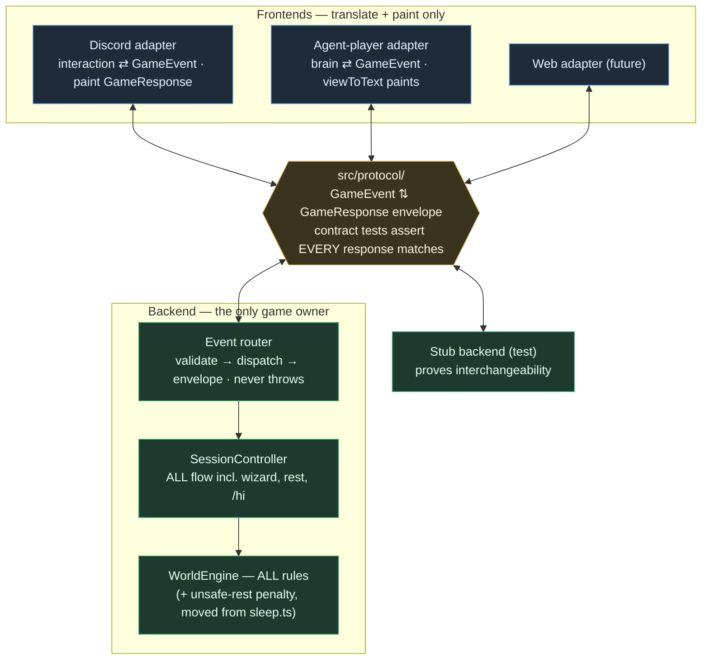

The deferred half of [[layer-boundaries-and-json-seam]]: the formal JSON protocol seam its gap table deferred ("protocol seam — does not exist") and the Discord-adapter rebuild M4 explicitly postponed ("a later, optional bolt-on; deferred, not dropped"). Motivation: the Release A measurement (§ Stage 4, findings 1–2 of `docs/archived/poc-plus/poc-plus-release-a-plan.md`) proved the agent-player is the only playtest instrument we have until human testing resumes, and today it is a privileged client — it calls `SessionController`'s typed methods in-process and goes engine-direct for the bookends, so its findings are not guaranteed player-true. This refactor makes the seam a real, single JSON channel that every frontend crosses for every mechanic, so agent smoke runs play exactly what players play, and frontends and backends become independently swappable. Direction settled with the owner 2026-08-02 (see Settled direction). Execution is one orchestrated-delegation **loop**, not a graph — see § Loop, not graph.

---

## The law

**Every game mechanic crosses the single JSON seam. No frontend holds a privileged channel to the engine or controller; no game rule, flow, or render-assembly lives in an adapter.** A frontend translates its transport's events into protocol input-events and paints the returned envelopes; the backend owns everything else. Frontends (Discord, agent-player, a future web UI) and backends (the real engine, a stub, a future service) are interchangeable because the protocol is the only surface either side sees.

## Settled direction (owner, 2026-08-02)

1. **Full scope.** The Discord adapter is rebuilt onto the protocol in this arc, not deferred again. The seam is only "single" when Discord crosses it too.
2. **Bookends come in.** Character creation, nightly rest+tick, and `/hi` stop being Discord-only flows the agent reaches engine-direct (M4's DA-4). The whole player lifecycle crosses the seam.
3. **The law applies going forward.** All future mechanics land behind the protocol; nothing new may ship as an adapter-side flow.
4. **Out of scope (deliberately separate):** the `AGENT_FORCE_FREE_ACTIONS`-style switch / day-job-rationing brain change from Release A finding 1. It is seam-independent and lands as its own task after this refactor; this arc must not grow it.

## Now — what exists (the banked base)

[p] `src/view/viewState.ts` — the semantic `ViewState` union (6 variants: decision, outcome, notice, menu, loading, commute), all-string fields, JSON-serialisable, imports nothing from `discord.js`. The response payload is already 90% built.
[p] `src/controller/SessionController.ts` (310 lines) — the transport-neutral flow owner for the action loop: `needsCharacterGate`, `stampLastPlayed`, `beginChoice`/`resolveChoice`/`stepChoice`, `openActionMenu`, `beginDayJob`/`commuteForWork`/`runWork`, `beginCustomAction`/`runCustomAction`, `feedbackConfirmation`/`recordFeedback`.
[p] `src/discord/dispatchInteraction.ts` (927 lines) — transport + paint only since M3; the M1 golden-transcript oracle (`tests/discord/dispatch-oracle.test.ts`) and the M2 snapshots characterise its behaviour byte-for-byte.
[p] `src/agent/harness.ts` — plays the mid-day loop through those same typed controller methods; `viewToText` is the agent medium step.
[c] The agent is a **typed-call client**, not a protocol client: no event/envelope vocabulary exists, so "every response matches the envelope" cannot be asserted, and a stub backend cannot be substituted.
[c] **Bookends bypass the seam.** Character creation (`commands/join.ts`, 511 lines + `WizardSession.ts`), rest+tick (`commands/sleep.ts`), and `/hi` (`commands/hi.ts`) have no controller seam and no `ViewState`; the agent harness calls the engine directly for them.
[!] **A second rule leak:** the unsafe-rest −1 HP penalty lives in `src/discord/commands/sleep.ts` (~:87-107), not the engine — the same smell as the M0 commute leak, and the reason the agent harness's `endDay` can never surface unsafe-rest feedback (M4.5 fidelity caveat 2). M7 moves it into the engine, mirroring M0.
[c] Read-only screens (`look`, `map`, `stats`, `backpack`, `journal`, `help`) are direct engine reads + render inside command files. Small, but they are mechanics, so the law covers them.

## Target



## Protocol design — settled calls and lead-owned questions

[I] **Home: `src/protocol/`.** A new top-level module that imports nothing from `discord.js`, `src/discord/`, `src/agent/`, or the engine implementation (engine *types* only where unavoidable). The non-imports are the structural guarantee, same trick as `viewState.ts`.
[I] **Envelope.** `GameResponse = { ok: true; view?: ViewState; facts?: Record<string, unknown> } | { ok: false; error: { code: GameErrorCode; message: string } }`. `facts` carries the semantic side-channel data adapters already consume (distilled type, character name, broadcast payload facts), so no adapter re-derives them. Exact shape is the lead's first settle; every field must be JSON-serialisable.
[I] **Events.** `GameEvent` is a discriminated union on `type`. First-cut inventory, mapped to today's surface: `menu.open`, `dayjob.start`, `action.custom`, `action.choose` (option index | bail), `feedback.submit`, `bug.submit` (the M5 action loop); `rest.begin`, `hi.open`, `character.create` + wizard-step events (M7); `screen.render` variants for look/map/stats/backpack/journal (M8). The union grows only in the slice that first needs each event — the established "no unused vocabulary ahead of a caller" rule.
[I] **Identity is opaque.** Events carry a `playerId: string`; nothing in the protocol assumes a Discord snowflake. (Today that string *is* the Discord user id; the protocol must not care.)
[I] **The router never throws.** Malformed events, unknown types, illegal moves, and backend errors all come back as `ok: false` envelopes with a stable `GameErrorCode` taxonomy (`no-character`, `no-rolls`, `stale-session`, `illegal-move`, `unsafe`, `invalid-event`, `internal`, …). A throw escaping the router is a contract violation the suite tests for.
[I] **Versioning.** A `PROTOCOL_VERSION` constant stamps the module; recorded in transcripts so a future breaking change is detectable.
[I] **Validation is hand-rolled**, matching the repo's gateway convention (throw-loud parse/validate functions, e.g. `resolveReport` in `ProdPlaytestCriticGateway`). No schema-library dependency.
[I] **In-process transport** (parent decision 3 stands): frontends import the router and pass objects. The protocol *shape* is the asset; a network socket stays a later bolt-on.

[I] **Staged flows and interstitial beats — SETTLED 2026-08-02 (option a).** The router takes an optional `onBeat(beat: GameResponse)` callback for interstitials while the final envelope is the return value: `dispatch(event: unknown, onBeat?): Promise<GameResponse>`. Beats are full `ok: true` envelopes carrying `loading`/`commute` views, emitted in flow order; flow stays server-side, in-process-friendly, and a future network transport maps beats to streamed messages. **Beat semantics: beats are advisory; the returned envelope is authoritative.** The router wraps every `onBeat` invocation in try/catch — a throwing adapter paint callback is `console.error`-logged and the flow continues, so the router-never-throws guarantee covers callback throws too (settles the coordinator's pre-flight risk 2). The same mechanism covers the custom-action and action-choice "Thinking…" beats. The contract suite asserts beat envelope-conformance, JSON round-trip, ordering, and never-throws (including a throwing `onBeat`) from M5 on.
[I] **Wizard state ownership.** The join wizard's multi-step session state (`WizardSession.ts`, currently instance-scoped adapter state) must become backend-owned for `character.create` to cross the seam — either controller-held session state keyed by `playerId`, or engine-persisted draft state. The M7.3 slice plan settles it; note the tension with parent decision 1 (session state is engine-owned, controller stateless) — that decision covered *option-resolution* state, and extending it to wizard drafts is a genuine design call, not a given. **Per the coordinator's pre-flight steer, M7.3's plan includes a `decisions/` record for whichever extension is chosen — the parent doc requires one to change a settled decision, and it must not be smuggled in as a slice note.**

## The contract-test barrier (the point of the exercise)

The single highest-value artefact in this arc is `tests/protocol/` — a suite that turns barrier verification from reading diffs into running a command. It lands in M5, **before** any migration, and every later slice extends it in the same commit as the event it adds.

- **Conformance:** every `GameResponse` the router emits, across every event type and every branch (success, each error code, each `ViewState` variant), validates against the envelope schema. "Every response matches the envelope" is asserted, not reviewed.
- **Negative space:** unknown event types, malformed payloads, out-of-range indices, and illegal moves for the current screen all return `ok: false` envelopes; the router never throws.
- **Round-trip:** every `ViewState` variant survives `JSON.parse(JSON.stringify(view))` unchanged (the seam is JSON even in-process).
- **Interchangeability:** the same suite runs against (a) the real backend and (b) a minimal stub backend behind the router. A frontend can be built and tested against the stub; the backend can be replaced under a frontend. This is the executable proof of the law.
- **No network, deterministic:** like every existing suite, it runs in `npm test` with stubs.

## Loop, not graph (execution shape — binding)

This arc runs as **one orchestrated-delegation loop per slice**: lead specs the slice → executor builds → lead verifies (re-run gates, read the riskiest file) → commit → fresh-context reviewer → triage → fixer → verify → commit → coordinator checkpoint → `/clear`. **No parallel streams, no worktrees.** The honest warning from principle 9 applies in full: comms reworks feel parallelisable but aren't, because `SessionController.ts`, `dispatchInteraction.ts`, `viewToDiscord.ts`, `viewState.ts`, and `src/agent/harness.ts` are touched by nearly every slice — two streams would share files, which makes them one stream. A loop of small per-domain slices is still fast, and far cheaper than untangling colliding worktrees.

## Milestones

Order is binding. Each milestone's detailed task checklist is written by the implementing lead just before it starts (the established pattern — over-specifying ten checklists upfront only gets rewritten as the protocol shape settles). Gates stack: every commit keeps **all** prior gates green. The M5–M10 checklists live in this doc (the M0–M4 pattern's `json-seam-build-plans.md` stays the M0–M4 record).

[x] M0–M4 — done (see parent doc): engine seam, oracle, view-state DTO, controller, agent-player adapter.
[x] **M5 — The contract.** *(done 2026-08-02 — slices M5.0/M5.1 below)* `src/protocol/` types (envelope, M5-event union, error taxonomy, version) → `tests/protocol/` contract suite → the in-process event router over `SessionController` for the action-loop events (`menu.open`, `dayjob.start`, `action.custom`, `action.choose`, `feedback.submit`, `bug.submit`), interstitial-beat mechanism settled and built. Purely additive: no production caller yet, zero behaviour change. Gate: typecheck + suite green at baseline; contract suite green against real backend and stub.
[x] **M6 — Agent-player becomes a protocol client.** *(done 2026-08-02 — single slice, execution state below)* `src/agent/harness.ts` speaks only `GameEvent`/`GameResponse` through the router for the mid-day loop (bookends stay engine-direct until M7); no controller imports left in the action path; `viewToText` reads envelope views. Gate: deterministic harness tests green (scripted brain, no network); one live `npm run agent:play` smoke run clean (exit 0, no new findings).
[x] **M7 — Bookends through the seam.** *(done 2026-08-05 — M7.0–M7.3, execution state below)* M7.0 extends the characterisation oracle to the join/hi/sleep command paths *first* (the M1-before-M3 pattern: no migration without a net). M7.1 rest+tick: the unsafe-rest −1 HP rule moves from `sleep.ts` into the engine (M0-style leak fix), `rest.begin` event + view-state, `sleep.ts` rewires, the agent drops its engine-direct `endDay`. M7.2 `/hi` through the seam. M7.3 character creation through the seam (wizard state ownership settled; the hardest slice — judge candidate). Gate: M7.0 oracle coverage green before each migration; contract suite extended per event; agent lifecycle fully protocol-driven.
[x] **M8 — Read-only screens through the seam.** *(done 2026-08-06 — M8.0 oracle + M8.1 crossing, execution state below)* `look`, `map`, `stats`, `backpack`, `journal`, `help` become `screen.*` events returning view-states; the agent gains full player parity on the reachable surface.
[x] **M8.5 — Smoke-run tooling (between M8 and M9).** *(done 2026-08-06 — stages 1-9, execution state below)* The settled smoke-run tooling plan (below): the run transcript gains a protocol-shaped log (DC-S1), replay + stub-backed modes (DC-S2), the lifecycle parity beats (DC-S3), the typed observer/player boundary (DC-S4), the choice-fidelity invariants (DC-S5), and the session spawn modes (DC-S7, owner requirement 2026-08-06): every agent session spawns as a FRESH player through the full `/join` wizard walk on a per-session fake id, or INHERITS an existing PC by its recorded userId. Gate: typecheck + full suite + a protocol-transcript smoke assertion (deterministic replay or stub-backed run) green.
[x] **M9 — Discord adapter rebuilt onto the protocol.** *(COMPLETE 2026-08-09 — five slices M9.0 to M9.4; build plan lead-settled 2026-08-08, below: recon, design calls DC-M9.1 to DC-M9.10)* `dispatchInteraction.ts` and the command files become translate + paint only: interaction → `GameEvent` → router → paint via `viewToDiscord`. Zero controller/engine imports remain in `src/discord/` (structural check, e.g. madge). Gate: **byte-identical** — the M1 oracle + M2 snapshots + M7.0 bookend coverage all green with zero snapshot churn; a snapshot change means the port drifted — fix the port, never re-bless. The M8.5 replay gate stacks: replay of the M8.5 corpus (stub + deterministic real-backend transcripts) byte-green. **The gate is discharged with one stated exception, named rather than assumed away: the corpus holds `stub-1d.protocol.json` and nothing else, so the replay arm was only ever proven on the stub half.** Deterministic real-backend entries have been deferred since M8.5 on the SF3 same-weekday-class caveat and are now formally M10's. "Replay green" in every M9 closeout note therefore means the stub arm, and the structural check is import-based, so it constrains imports and the DC-M9.4.5 pin constrains named calls — neither performs dataflow analysis.
[ ] **M10 — Closeout, plus the punch list M9.4 handed over.** *(build plan lead-settled 2026-08-09, below: recon, design calls DC-M10.1 to DC-M10.8, slices M10.0 to M10.2)* Interchangeability proof recorded (contract suite green against stub + real backend); the parent doc's gap-table "protocol seam" and "frontend adapters" rows settled; `CHANGELOG.md`, `TODO.md`, and this doc's execution state updated; the `AGENT_FORCE_FREE_ACTIONS` follow-up task written up in `TODO.md` as the next arc's first item. **M10 is no longer pure closeout:** four items ride with it and they are not one kind of work — the day-job leaf's un-acked `webhook.editMessage` catch is a live player-facing fault and takes its own slice with its own review gate (M10.0), while the SF3 real-backend corpus, the `src/**`-only typecheck and the `format.ts` layering are mechanical and travel together (M10.1). **The M9 replay-gate overclaim is discharged here or it is stated as a permanent limit**; the owner chose discharge (DC-M10.6, clock pinned at record and replay).

## M5 build plan (lead-settled 2026-08-02)

Goal: `src/protocol/` — the envelope, the M5 event union, the error taxonomy, the version stamp, hand-rolled validators, and the in-process router over `SessionController` for the six action-loop events — plus `tests/protocol/`, the contract-test barrier. **Purely additive: no production caller, zero behaviour change, no edits to existing source files.** Gate: typecheck clean; full suite green at the 89 files / 1686 tests baseline plus the new protocol tests; the contract suite green against the real backend (SessionController + MockWorldEngine) and a canned stub backend alike.

### Settled design calls (M5)

[I] **Envelope (DC-P1, frozen).**

```ts
export const PROTOCOL_VERSION = 1;

export type GameErrorCode =
  | 'no-character' | 'no-rolls' | 'stale-session' | 'session-expired'
  | 'illegal-move' | 'unsafe' | 'empty-action' | 'invalid-event' | 'internal';

export type GameResponse =
  | { v: number; ok: true; view?: ViewState; facts?: Record<string, unknown> }
  | { v: number; ok: false; error: { code: GameErrorCode; message: string }; facts?: Record<string, unknown> };
```

`v` stamps every envelope (= `PROTOCOL_VERSION`) so conformance is trivially assertable and a future breaking change is detectable per message. `facts` is allowed on error envelopes too (the `stale-session` narration needs it). **`facts` is a closed set:** the response validator whitelists known keys and rejects anything else, so the escape hatch cannot grow without a deliberate validator edit (the coordinator's "second protocol" risk). M5's keys: `distilledType`, `characterName`, `characterClass`, `actionId` (outcome broadcasts; consumers: the M9 Discord broadcast line, the M6 agent transcript), `nav: { rollsRemaining, hasPendingAction, hasRestedToday }` (the exact three fields `getNavButtons` reads; consumer: M9 nav-button assembly), `narration` (only on `stale-session` errors; consumer: the slash `/action` stale paint's `withNarration`).

[I] **Events (DC-P2).** `GameEvent` is a discriminated union on `type`, `playerId: string` everywhere (opaque identity — the protocol must not care that today it's a Discord snowflake):

```ts
| { type: 'menu.open'; playerId: string }
| { type: 'dayjob.start'; playerId: string; jobIndex: number }
| { type: 'action.custom'; playerId: string; text: string }
| { type: 'action.choose'; playerId: string; selector: { kind: 'option'; index: number } | { kind: 'bail' } }
| { type: 'feedback.submit'; playerId: string; surface: 'sleep' | 'release' | 'outcome-feedback'; text: string; actionId?: number }
| { type: 'bug.submit'; playerId: string; text: string; actionId?: number }
```

`bug.submit` maps to the controller's `'outcome-bug'` surface; the union grows only in the slice that first needs each event.

[I] **The router boundary takes `unknown` (DC-P3).** `dispatch(event: unknown, onBeat?): Promise<GameResponse>` — validation is the router's job, so the negative-space barrier (malformed payloads → `ok: false 'invalid-event'`, never a throw) is structural, not a test hope. Hand-rolled validators per the repo's throw-loud convention, but internal: `validateGameEvent(raw)` returns `{ ok: true; event } | { ok: false; message }`.

[I] **Result → envelope mapping (DC-P4).** The router owns player-facing copy; the adapter keeps only medium chrome (embed title/colour keyed by error code + call site, ephemeral flags). Byte-identity recon (2026-08-02) found the two no-character copies split cleanly by event — `menu.open`'s callers (nav:action, slash `/action`) both use the "…yet. Type `/join` to create one." copy, the three other events' call sites use "…Type `/join` first." — so per-event canonical copy preserves every current paint with zero drift:

| Controller result | Envelope |
| --- | --- |
| `no-character` (menu.open) | `ok:false 'no-character'`, `"You don't have a character yet. Type \`/join\` to create one."` |
| `no-character` (other events) | `ok:false 'no-character'`, `"You don't have a character. Type \`/join\` first."` |
| `no-rolls` | `ok:false 'no-rolls'`, the 🛌 copy (identical at both call sites today) |
| `resume-stale` | `ok:false 'stale-session'`, message = prompt, `facts.narration` when present |
| `resume-error` | `ok:false 'internal'`, message = the error message |
| `menu` / `resume-decision` / `resume` | `ok:true`, view |
| `invalid-job` | `ok:false 'illegal-move'`, `"Invalid job action."` |
| `unsafe` | `ok:false 'unsafe'`, the ⚠️ copy with `location` interpolated |
| `resolveChoice` → null | `ok:false 'session-expired'`, `"❌ Your action session expired. Try \`/action\` again."` |
| `empty-action` | `ok:false 'empty-action'`, message = prompt |
| `decision` / `outcome` (runWork/runCustomAction/stepChoice) | `ok:true`, view (+ outcome `facts` per DC-P1; the RA-6 identical `viewPrivate`/`viewPublic` pair travels as ONE view) |
| feedback/bug submit | `ok:true`, view = the surface's confirmation `NoticeViewState`; `recordFeedback` runs inside the router in try/catch (best-effort, preserving today's reply-first resilience) |
| any controller throw | `ok:false 'internal'`, message = `err.message` (the router never throws) |

[I] **Beats (DC-P5, per the settled onBeat decision).** One `idle()` string per dispatch, threaded into every beat of that dispatch (matches today's single `randomIdleMessage()` call): `dayjob.start` beats `loading { body: "⏳ **Starting…**\n_${idle}_" }` after guards pass, then `commute { destination, idle }` when commuted, then the final envelope; `action.custom` beats `loading { body: "**You:** ${clipped}\n\n⏳ **Thinking…**\n_${idle}_" }` (the 280-char clip moves into the router — it is part of the screen copy); `action.choose` beats `loading { body: "**You:** ${label}\n\n⏳ **Thinking…**\n_${idle}_" }` after resolution. The router's idle source is an injected `() => string` dep (the Discord adapter passes `randomIdleMessage` at M9; the agent + tests pass deterministic ones) — `src/protocol/` stays free of adapter imports.

[I] **Event flow order (DC-P6, faithful to today's leaves).** `menu.open`: `stampLastPlayed` → `openActionMenu` (the nav:action leaf's order). `dayjob.start`: `beginDayJob` (its own inline stamp) → beat → `commuteForWork` → beat-if-commuted → `runWork`. `action.custom`: `beginCustomAction` → (resume → view) → beat → `runCustomAction`. `action.choose`: `beginChoice` → `resolveChoice` → beat → `stepChoice`. No stamps beyond today's.

[I] **Stub backend + the RouterBackend interface (DC-P7).** The router depends on a `RouterBackend` interface — exactly the controller surface it calls (`stampLastPlayed`, `openActionMenu`, `beginDayJob`, `commuteForWork`, `runWork`, `beginCustomAction`, `runCustomAction`, `beginChoice`, `resolveChoice`, `stepChoice`, `feedbackConfirmation`, `recordFeedback`). `SessionController` satisfies it structurally; the contract suite's stub is a canned-script fixture. This is the interchangeability proof staying in M5 scope (the coordinator's steer), not drifting to M10.

[I] **File layout (DC-P8).** `src/protocol/envelope.ts` (version, types, `validateGameResponse` — whitelists the `facts` keys), `src/protocol/events.ts` (the union + `validateGameEvent`), `src/protocol/router.ts` (`GameRouter`, the mapping, the beat mechanics). Non-imports per the spec's Home rule: nothing from `discord.js`, `src/discord/`, `src/agent/`; engine/controller *types* only where unavoidable; `ViewState` from `src/view/viewState.ts`.

[I] **Known M9 watch items (flagged, not smuggled).** (1) The slash `/action` stale-resume fallback copy (`'Your previous action could not be recovered.'`, inline in `commands/action.ts`) differs from the controller's (`'Could not recover.'`). When M9 routes slash `/action` through `menu.open`, the controller's fallback wins — a copy-only drift on a dead-edge path. Settle at M9 with the oracle coverage in hand; if the path is characterised, record the unification as a decision, never re-bless silently. (2) The profanity guard (`checkProfanity`, `dispatchInteraction.ts` ~:315-321) runs adapter-side before `beginCustomAction`; the law ("no game rule lives in an adapter") forces a decision at M9 — move it behind the seam (router or controller) or record why it stays. Found by the M5.1 review.

### Slices

[x] **M5.0 — Types + validators.** *(done 2026-08-02, build `050020c` + review fix `a3920f0`)* `envelope.ts` + `events.ts` + unit tests (`tests/protocol/validate.test.ts`, 40 tests). Fresh-context review: one blocker accepted (the build commit's changelog edit had deleted the `## [0.3.3]` heading — restored) + three hardening fixes accepted (cross-arm pollution rejected — ok:true+error / ok:false+view; deep JSON-serialisability walk so nested functions can't pass; integer `nav.rollsRemaining`); whitespace-playerId dropped (identity is opaque by design). 90 files / 1726 tests green (+40 over the 1686 baseline), typecheck clean.
[x] **M5.1 — Router + contract suite (same commit — the coordinator's barrier).** *(done 2026-08-02, build `513921a` + review fix `22f291e`)* `router.ts` per DC-P4/P5/P6 + `tests/protocol/contract.test.ts` (95 tests): conformance of every event × every reachable branch against BOTH the real backend and a canned stub with shared expectations (hard-coded copy — the suite is the drift net), negative space, JSON round-trip (views + error-envelope facts), beat order pinned by an interleaved call log, never-rejects incl. hostile getters/unstringable throws. All 9 error codes and all 6 view variants reached. Fresh-context review: byte-identity of every copy constant + flow order verified programmatically against both adapter call sites (zero drift); accepted fixes closed two never-throws holes (gate inside the try; safeStringify at every catch), the falsy session-expired check, and suite gaps (beat position vs backend calls, beats-empty on error branches, stamp-throw path); dropped the idle-drawn-without-onBeat cosmetic. 91 files / 1821 tests green (+135 over the 1686 baseline), typecheck clean.

Scope fence (M5): additive only — no edits to existing source under `src/`; no new view-state variants (the union covers everything M5 emits); no production caller; no `sim/` changes; `PROTOCOL_VERSION` stays 1 throughout the arc unless a breaking change forces otherwise (flag it).

**Execution state:** M5.0 done (above). Open settles carried into M5.1: (1) the `empty-action` empty-prompt policy (review F8) — the validator rejects empty `error.message`, and the controller's `empty-action` carries a raw `firstDecision.prompt` that can be `''`, so the router must apply a fallback (settle: `prompt || 'Could not recover.'`, mirroring the controller's own resume-stale fallback; copy-only on a dead edge, flagged here per the scope fence); (2) the contract suite should assert decision/menu button-element shape on emitted views (review F7) since the envelope validator deliberately checks views shallowly.

---

## M6 build plan (lead-settled 2026-08-02)

Goal: `src/agent/harness.ts` speaks only `GameEvent`/`GameResponse` through `GameRouter` for the mid-day loop (bookends stay engine-direct until M7); no controller imports remain in the action path; `viewToText` reads envelope views. Gate: deterministic harness tests green (scripted brain, no network); one live `npm run agent:play` smoke run clean (exit 0, no new findings).

### Coordinator-steered viewToText diff (pre-build)

The coordinator's M5→M6 steer required diffing `viewToText`'s rendering inputs against the M5 `ViewState` variants field-by-field before wiring. Findings:

**Zero misses in the ViewState.** Every field `viewToText` reads per variant is present and typed:

- `decision`: title, openingFrame, storyThread.full, narration, combatStatus, prompt, optionLines (via buttons), footer — all in `DecisionViewState` ✓
- `outcome`: title, locationLine, breadcrumb, combatSceneBlock/sceneBlock (via isCombat), storyThread.full, outcomeBlock — all in `OutcomeViewState` ✓
- `notice`: text — in `NoticeViewState` ✓
- `menu`: title, description, buttons — all in `MenuViewState` ✓
- `loading`: body — in `LoadingViewState` ✓
- `commute`: destination, idle — in `CommuteViewState` ✓

**One gap: the agent's `AgentCharView` character snapshot.** `AgentHarness.ask()` currently calls `engine.getCharacter(userId)` → `agentCharView(char)` to build the `character` field of `ChooseMoveInput` for every `brain.chooseMove()` call — menu, decision, and post-outcome turns. This needs `name`, `class`, `health`, `maxHealth`, `stamina`, `maxStamina`, `rollsRemaining`, `wealth`, `location`. The envelope's `facts` already carry `characterName`, `characterClass`, and `nav.rollsRemaining` on outcomes, but (a) only on outcomes, not on menu/decision views, and (b) missing `health`, `maxHealth`, `stamina`, `maxStamina`, `wealth`, `location`.

**Settle (DC-M6.1): add `characterState` to the facts whitelist, populated on all view-bearing responses.** The missing fields are structured character state every frontend will need for player-facing HUD/chrome. Adding `characterState: { health, maxHealth, stamina, maxStamina, wealth, location }` to `facts` keeps the `characterName`, `characterClass`, and `nav` facts as-is (they serve other adapters) and extends `RouterBackend` with `getCharacter(userId)` so the router can populate the full snapshot on every view-bearing response. The consuming adapter (M6 agent harness) justifies the key in the same slice. No `facts` key is added without a consuming adapter proving it.

### Settled design calls (M6)

[I] **Character snapshot in facts (DC-M6.1).** Add `characterState` to `FACTS_KEYS` in `envelope.ts` with shape `{ health: number; maxHealth: number; stamina: number; maxStamina: number; wealth: number; location: string }`. Extend `RouterBackend` with `getCharacter(userId: string): CharacterData | null`. The router populates `facts.characterState` (plus already-existing `characterName`, `characterClass`, `nav`) on every view-bearing response: `menu.open` → menu/resume-decision, `dayjob.start` → outcome, `action.custom` → resume/outcome, `action.choose` → decision/outcome. The character is read ONCE per dispatch (immediately after the backend call that produces the view), and the same snapshot seeds `characterName`/`characterClass`/`nav` so there is no double-read. When the character is null (shouldn't happen on a view path — the caller already passed the guard), the `characterState` fact is omitted and the agent harness treats it as a fatal `no-character` finding.

[I] **Harness rewiring (DC-M6.2).** `AgentHarness` constructor takes `GameRouter` + `WorldEngine` (the engine is for bookends only: `seedCharacter`, `getMeta('day_number')`, `getCharacter` for invariant checks, `endDay`'s `restAtOak`/`tick`). The action path becomes:

- `menu.open` dispatch → read `ok:true` view; `ask()` builds `AgentCharView` from `response.facts.characterState` + `viewToText(response.view)`; brain move decides the next event
- `dayjob.start` dispatch with `onBeat` → the `onBeat` callback records commute beats into the transcript; the final envelope carries the outcome/decision/empty-action/error
- `action.custom` dispatch → resume returns a view directly; the thinking beat is passed through `onBeat`; outcome/decision handled same as dayjob
- `action.choose` dispatch → begin/resolve/step all inside the router; the thinking beat is passed through `onBeat`; outcome/decision handled same
- Error envelopes: the harness reads `ok:false` and maps `error.code` to the same `PlayResult` dispositions it already produces (no-character, no-rolls, stale-session, session-expired, illegal-move, unsafe, empty-action, internal → dead-end with the message as detail)
- The `seam()` wrapper is REMOVED — the router never throws, so no breadcrumb+try/catch is needed for controller calls. The outer `try/catch` stays for the transcript save (bookend throws + pure-code rendering errors), but the action path itself is throw-safe by construction.

[I] **Beats in the harness (DC-M6.3).** The router's `onBeat` callback is wired to:

- Commute beats (`commute` view) → recorded via `transcript.commute()` (same as today's explicit `commuteForWork` call)
- Loading/thinking beats → the agent does not render interstitial loading screens (they exist for the Discord player's multi-second wait); the harness absorbs them silently (the transcript records only player-visible beats — commutes are player-visible; "Thinking…" spinners are transport chrome)
- Beat errors: `onBeat` never throws (the router try/catches it), so a transcript push that fails is `console.error`-logged and the flow continues

[I] **Deterministic test port (DC-M6.4).** Port the existing M4 harness tests (`tests/agent/harness.test.ts`, 14 tests) to the protocol surface. The test helper `buildHarness()` creates a `GameRouter` over a canned stub `RouterBackend` (replacing the stub `SessionController` + `MockWorldEngine`). Port every test: one action e2e, day-job work flow, immediate-resolve, sleep, full-day loop, multi-day loop, QA capture (error envelopes, crashes, invariant sweeps, endDay fidelity, run summary). Add protocol-specific tests: beat order for dayjob.start (commute beat before outcome), error-code mapping (every `GameErrorCode` the harness can encounter), and the `characterState` fact is present on every view-bearing response.

[I] **play.ts wiring (DC-M6.5).** `play.ts` creates a `GameRouter` over the real `SessionController` and passes it to `createAgentHarness`. The harness file imports NO controller types — the import of `SessionController` and `SessionControllerImpl` from `harness.ts` is deleted. `createAgentHarness` takes `GameRouter` + `WorldEngine` instead of `AgentEngine`.

### Slice

[x] **M6 — Agent-player becomes a protocol client.** *(to be built)* Single commit (the harness is the only consumer, and the protocol changes only serve it).

#### Task checklist

1. **Extend protocol for `characterState` fact.**
   - Add `characterState` to `FACTS_KEYS` in `envelope.ts` with validator checking for `{ health: integer; maxHealth: integer; stamina: integer; maxStamina: integer; wealth: integer; location: string }` (all six fields present, integers non-negative except wealth which has no lower bound).
   - Add `getCharacter(userId: string): CharacterData | null` to `RouterBackend` interface in `router.ts`.
   - Add private helper `addCharacterFacts(userId: string, existingFacts?: Record<string, unknown>): Record<string, unknown>` to `GameRouter` — calls `backend.getCharacter(userId)`, returns merged facts with `characterState`, `characterName`, `characterClass` (when non-null), and `nav`; when char is null, returns `existingFacts` unchanged.
   - Call `addCharacterFacts` on every view-bearing branch: `dispatchMenuOpen` (menu + resume-decision), `dispatchActionCustom` (resume + after `renderStartResult`), `dispatchDayJobStart` (after `renderStartResult`), `dispatchActionChoose` (decision branch). `outcomeFacts` already sets `characterName`/`characterClass`/`nav`/`distilledType`/`actionId` on outcome branches — `addCharacterFacts` runs ADDITIONALLY on outcomes (it adds `characterState` without overwriting existing keys) and ON ITS OWN on non-outcome view branches (where there were no facts before).
   - `renderStartResult` already calls `outcomeFacts` on the outcome branch — pass the result through `addCharacterFacts` as a second step.
   - Verify: typecheck clean, existing contract tests green (no breakage — `characterState` is additive on outcome envelopes; non-outcome view envelopes gain facts they didn't have before, but the validator only checks that present facts are legal, not that certain facts MUST be present).

2. **Extend contract tests for `characterState`.**
   - Add `getCharacter` to the stub `RouterBackend` (returns the stub character).
   - Assert `characterState` is present on every view-bearing response: `menu.open` → menu, `menu.open` → resume-decision, `dayjob.start` → outcome, `action.custom` → resume, `action.custom` → outcome, `action.choose` → decision, `action.choose` → outcome.
   - Assert `characterState` shape: all six fields present + correct types.
   - Assert `characterState` is absent on error envelopes (the char guard is already the error response — no character exists to snapshot).
   - Assert `characterName` + `characterClass` (when non-null on the stub) are present on ALL view-bearing responses, not just outcomes.

3. **Rewrite `harness.ts` to use `GameRouter`.**
   - Replace `SessionController` + `SessionControllerImpl` imports with `GameRouter` + `GameRouterDeps`.
   - `AgentHarness` constructor: `engine: WorldEngine`, `router: GameRouter`, `brain`, `userId`. Store `engine` for bookends only.
   - `createAgentHarness` takes `{ engine, router, brain, userId }` instead of `AgentEngine`.
   - Remove `seam()` method entirely.
   - Rewrite `runAction()`: dispatch `{ type: 'menu.open', playerId: this.userId }` → switch on `ok`/`error.code` → build `PlayResult` from error codes, or read `view` + `facts.characterState` for the brain turn.
   - Rewrite `playMenu()`: extract `AgentCharView` from `facts.characterState` (with null guard → `no-character` fatal), call `ask()` with `viewToText(view)` + `agentCharView`, dispatch the brain's move as the appropriate event.
   - Rewrite `doDayJob()`: dispatch `dayjob.start` with `jobIndex`, wire `onBeat` to capture commute beats → `transcript.commute()`, handle the final envelope.
   - Rewrite `doCustom()`: dispatch `action.custom`, handle resume (direct view) vs outcome/decision.
   - Rewrite `runDecisionLoop()`: dispatch `action.choose`, no more `beginChoice`/`resolveChoice`/`stepChoice` calls — the router does all three internally.
   - Keep `endDay()` and `checkInvariants()` unchanged (engine-direct bookends).
   - `ask()`: takes `view: ViewState` + `charFacts: Record<string, unknown>` instead of calling `engine.getCharacter()`; builds `AgentCharView` from `charFacts.characterState` + `charFacts.characterName` + `charFacts.characterClass` + `charFacts.nav.rollsRemaining`.
   - Delete `SessionControllerImpl` import + constructor wiring.

4. **Port deterministic harness tests.**
   - Create stub `RouterBackend` (replace the existing stub controller). Returns canned `ActionMenuResult`/`DayJobStart`/`StartRenderResult`/`BeginCustomActionResult` per the existing test fixture, plus `getCharacter()` returning the stub character.
   - `buildHarness()` creates a `GameRouter` over the stub backend with a deterministic `idle: () => ''`.
   - Port all 14 existing tests: menu→custom→outcome, day-job work flow, immediate-resolve, sleep, full-day loop, multi-day loop, QA capture (no-character, no-rolls, resume-stale, resume-error, invalid-job, unsafe, crash, invariant breach, endDay throw, run summary).
   - Add protocol-specific tests: beat order asserted via a spy `onBeat` (commute beat fires + carries destination), error code → PlayResult mapping (each `GameErrorCode` maps to the expected disposition), `characterState` present on every brain turn's input.
   - The existing `tests/agent/harness.test.ts` file is REPLACED (the harness surface changes completely — no `SessionController` calls remain to test).

5. **Update `play.ts`.**
   - Create `GameRouter` over the real `SessionController` (constructed from `agentEngine`) with `idle: () => ''` (deterministic transcript).
   - Pass `{ engine: agentEngine.engine, router, brain, userId }` to `createAgentHarness`.
   - `harness.ts` must import zero controller types (verify with `grep -n 'SessionController' src/agent/harness.ts` returns nothing).

6. **Gate: typecheck + full suite green.**
   - `npm run typecheck` clean.
   - `npm test` green. All existing M4 harness tests ported and passing; contract suite extended for `characterState`; no regression in any existing suite.

7. **Gate: one live `npm run agent:play` smoke run.**
   - `AGENT_DAYS=1`, run `npm run agent:play`.
   - Assert exit 0, no new `error`-severity findings, coherent gameplay (the transcript shows a menu → action → outcome flow).

Scope fence (M6): bookends (`seedCharacter`, `endDay`, `restAtOak`, `tick`) stay engine-direct (M7 scope). No `sim/` changes. No Discord or controller source changes. No `viewState.ts` changes. `characterState` is the only facts-key addition — it is justified by the M6 agent harness in the same slice.

---

## M7 build plan (lead-settled 2026-08-05)

Goal: the three Discord-only bookends — rest+tick (`sleep.ts`), `/hi` (`hi.ts`), character creation (`join.ts` + `WizardSession.ts`) — cross the seam, so the agent lifecycle is fully protocol-driven and the M9 adapter rebuild has a characterised drift net for every bookend path. Gate: M7.0 oracle coverage green *before* each migration; contract suite extended per event in the same commit; zero engine-direct bookends left in the harness (rest, character creation — the nightly world `tick` stays engine-owned as the cron mechanism); typecheck + full suite green at the 91 files / 1823 tests baseline plus additions.

### Recon findings (2026-08-05, branch `feat/json-seam-protocol` @ `6022a36`)

[I] **What the M1 oracle already pins.** Slash `/sleep` goodnight (safe rest at the Oak + the appended `sleep:feedback` row), `nav:sleep` (loading beat → result), `nav:hi`, `join:name:modal` (step 1→2), and the character-gate reroute (via `/stats`). Command-level unit suites exist for all three (`sleep.test.ts` incl. the unsafe-rest penalty + admin tick, `hi.test.ts`, `join.test.ts`, `wizard-session.test.ts`) — but they drive handlers directly, not the dispatch path, so M9 has no byte-level net for the bookends.
[I] **The unsafe-rest rule (the M7.1 migration target) lives in `sleep.ts:70-107`.** Condition: `currentLoc !== null && !currentLoc.isSafe && !alreadyThere && !atWorkplace`, where `atWorkplace` uses the controller-side `getWorkplaceLocation` PRNG pair (the H1 workplace exemption). The penalty block: `restAtOak` → `modifyHealth(userId, −1)` → the ⚠️ penalty prose → `announceCollapse` when health moved. Guards above it: no-character, mid-action (`lastActionState !== null`), rolls-remaining (`rollsRemaining > 0`). The admin-tick branch (`SLEEP_ADMIN_TICK=true` + `ADMIN_USER_ID` match) calls `engine.tick(true)` + `buildMorningAnnouncement` — an admin cron affordance, not player lifecycle; it stays adapter-direct in M7.1 and is flagged as an M9 watch item.
[I] **`hi.ts` (112 lines) returns a composed string**, three variants: no-character copy, the unfinished-action resume screen (`resumeAction` → prompt + narration), and the greeting (location line + `formatCharacterHeader` + weekend hooks or seeded day-job actions). No buttons of its own — the slash arm / nav branch attach `getNavButtons(char, 'hi')`, which the M5 `nav` fact already serves. `NoticeViewState` carries all three variants.
[I] **`join.ts` (511) + `WizardSession.ts` (177).** Eight steps (1 name modal → 2 class → 3 upbringing → 4 race → 5 alignment → 6 dayJob → 7 itemSet → 8 confirm), screens built by `buildStepMessage` from module-level `_defs` (the YAML `CharDefs`, set by `makeJoinCommand`). Wizard state is an in-memory `Map<userId, WizardState>` with a 10-min TTL — no DB row until `confirm` → `engine.createCharacter`. The confirm path also fires the public "✨ A new hero joins the Oak" announcement (a `followUp` with the Oak image) and swaps the wizard for the ephemeral `/hi` screen via the dispatcher-injected `renderHiScreen`. Module-level `_userInFlight` double-click guard. All Discord-shaped: `EmbedBuilder`/`ButtonBuilder`/`ModalBuilder` throughout — the M7.3 seam cut needs a wizard view-state, not a string.
[I] **Mock surface is sufficient for M7.0.** `MockWorldEngine` records `restAtOak`/`modifyHealth` (clamps, returns updated char)/`tick` (canned via `setTickResult`)/`createCharacter` (returns the canned char or a default from data)/`resumeAction`/`getLocation` (`setLocation` carries `isSafe`). The oracle file's hoisted `announceCollapseSpy` already neutralises the collapse path the unsafe-rest transcript needs.
[I] **Determinism notes for the bookend transcripts.** The oracle pins `Date` to Wednesday 2026-07-15 (weekday); a weekend `/hi` transcript sets system time locally and restores. The wizard TTL reads `Date.now()` — deterministic under the same fake timers. The admin-tick transcript must set `process.env.ADMIN_USER_ID='admin-000'` + `SLEEP_ADMIN_TICK='true'` BEFORE `makeHarness()` (the sleep factory reads `ADMIN_USER_ID` at construction; `deps.ADMIN_USER_ID` is already `'admin-000'`) and restore after. `buildMorningAnnouncement` rotates prose by day — deterministic given a canned tick result. `join.ts`'s module-level `_userInFlight`/`_defs` are covered by the unique-userId-per-transcript rule and the per-test `makeHarness()`.

### Slice sequence (order binding; per-slice task checklists written just before each slice starts, M3-style)

[x] **M7.0 — Bookend oracle.** *(done 2026-08-05 — build `9e61011`, review clean, execution state below)* Extend the golden-transcript characterisation to the join/hi/sleep dispatch paths (detailed checklist below — the only slice fully specced today). Test-only, additive: no `src/` edits. Gate: new transcripts + snapshots green, existing oracle + suite untouched.
[x] **M7.1 — Rest + nightly tick.** *(done 2026-08-05 — build `e669262` + review fix `d47a835`, execution state below)* Move the unsafe-rest −1 HP rule (condition + penalty + prose inputs, value and conditions unchanged) into the engine, mirroring the M0 commute move; `rest.begin` event + router branch + controller `beginRest`; the guards (mid-action, rolls-remaining) move behind the seam with it; `sleep.ts` rewires to translate + paint (the admin-tick branch stays adapter-direct — flagged watch item); the harness `endDay` rest half dispatches `rest.begin` (the `tick(true)` cron call stays engine-direct), so the agent surfaces unsafe-rest feedback for the first time (closes the M4.5 fidelity caveat 2). The collapse announcement crosses as facts for the adapter to announce (consuming adapter in-slice: the rewired `sleep.ts`). Contract tests in the same commit.
[x] **M7.2 — `/hi` through the seam.** *(done 2026-08-05 — build `078aaba` + review fix `8b08059`, execution state below)* `hi.open` event; controller `openHi` composes the three screen variants as `NoticeViewState`; router branch + `addCharacterFacts`; `hi.ts` becomes translate + paint. Consuming adapter in-slice: the rewired `hi.ts`. Contract tests in the same commit.
[x] **M7.3 — Character creation through the seam (hardest; judge candidate).** *(done 2026-08-05 — build `9814274` + review fix `ed91227`, execution state below)*

### M7.0 — Bookend oracle (slice checklist, lead-settled 2026-08-05)

Slice goal: dispatch-level golden transcripts for every join/hi/sleep path the M7.1–M7.3 migrations will touch, so each migration diffs against a pinned baseline and M9's byte-identical gate has a net over the bookends. **Test-only, additive — no `src/` edits, no changes to existing test files.** New suite `tests/discord/bookend-oracle.test.ts` (own snapshot file), reusing `dispatch-harness.ts` (`makeHarness`, `oracleChar`, slash/button/modal factories, `snapshotAcks`) and copying the M1.2 determinism pattern: hoisted mocks for `IdleMessageSelector` (fixed idle), `broadcastOutcome`, `announceCollapse` (spies, asserted where the path fires them); fake `Date` pinned to Wednesday 2026-07-15 at file level; unique userId per transcript; fresh `makeHarness()` per transcript.

Settled calls (M7.0):

[I] **New file, not oracle growth.** `dispatch-oracle.test.ts` stays the M1 baseline untouched (its snapshots cement the action-loop leaves); the bookend coverage lands in `bookend-oracle.test.ts` so each baseline diffs independently. Same harness, same mocks, same snapshot style.
[I] **Characterise, don't judge.** Transcripts capture current behaviour verbatim — including anything that looks off (the join wizard's double space in `⚔️  Forge Your Hero`, the guards' exact copy). Defects found are logged as review notes, never fixed in this slice.
[I] **Explicit assertions ride every transcript** (branch-fired proof, per the M1.2 pattern): engine call logs (`restAtOak`, `modifyHealth`, `tick`, `createCharacter`, `resumeAction`), ack methods, and spy counts — the snapshot alone is not the assertion.

Transcript inventory (16):

**join (8):**

1. Slash `/join` start → `deferReply` ephemeral + `editReply` step-1 screen (name button, step footer, Oak thumbnail files); wizard session at step 1.
2. Slash `/join` with an existing character → the "already have a character" `editReply`; no session started.
3. `join:name` button → `showModal` with the name modal (`join:name:modal`, 2–30 char input).
4. Name modal submit with an invalid name (`Bad@Name`) → ephemeral ❌ `safeNotify`; session still at step 1.
5. Choice walk, steps 2→7: one transcript per step (class, upbringing, race, alignment, dayJob, itemSet) — set the session up via `h.joinWizards`, fire the `join:choice:<step>:<value>` button, snapshot the next screen; the itemSet choice lands the step-8 confirm screen. Values must come from the real `CHAR_DEFS` (the harness's YAML loads).
6. `join:confirm` at step 8 → `createCharacter` called with the full `CharCreateData`; the public announcement `followUp` (✨ embed + Oak files); `deleteReply` + the `/hi` `followUp` (the dispatcher's `renderHiScreen` path through the registry + `getNavButtons`).
7. `join:restart` → session reset to step 1; step-1 screen repainted.
8. Re-`/join` mid-wizard (session at step 3) → resumes the existing session (step-3 screen, not step 1).

**hi (3):**
9. Slash `/hi` weekday → the day-job greeting (location line, character header, seeded Town Guard actions), ephemeral + nav bar.
10. Slash `/hi` weekend → adventure hooks (local `vi.setSystemTime` to Saturday 2026-07-18, restored after).
11. Slash `/hi` with `lastActionState` set + `setResumeResult` → the ⏳ Unfinished Action screen (prompt + narration), no `startAction`.

**sleep (5):**
12. Unsafe-rest (THE M7.1 pin): char at a `setLocation({ isSafe: false })` spot, `rollsRemaining: 0`, no pending action → `restAtOak` + `modifyHealth(userId, −1)` called, the ⚠️ penalty section in the reply text, `announceCollapseSpy` fired once with prev/new vitals.
13. Workplace exemption (H1): char at its resolved workplace with `isSafe: false` → rest proceeds with NO `modifyHealth` call and no penalty section.
14. Guards: `rollsRemaining > 0` → the ⛔ "day is still young" reply, no `restAtOak`; `lastActionState` set → the ⛔ "Cannot rest now" reply, no `restAtOak`. (Two transcripts in one `it` block is fine; both are short guards.)
15. Admin tick: env set pre-harness per the recon note; slash `/sleep` from `admin-000` with a canned `setTickResult` → `tick(true)` called, the morning announcement reply with banner files, NO nav bar / `sleep:feedback` row.
16. No-character `/sleep` reroutes through the character gate to the join wizard (the gate's generic coverage is `/stats`; this pins it for the bookend M7.1 rewires).

Tasks:

1. Create `tests/discord/bookend-oracle.test.ts` with the determinism scaffolding (hoisted mocks, fake timers, imports from `dispatch-harness.ts`) and the 16 transcripts above, each with explicit assertions + `snapshotAcks` snapshot.
2. Verify: `npm run typecheck` clean; `npm test` green at 91 files / 1823 tests + the new suite; `git status` shows ZERO changes under `src/` and zero churn in existing snapshots; every transcript produced meaningful acks (non-empty spy logs, per the M1.2 `nonEmpty` pattern).
3. Changelog: `[Unreleased]` → `### Internal` one-liner (bookend oracle coverage, per the changelog skill).

Scope fence (M7.0): test-only — no `src/` edits, no edits to existing test files or snapshots; no behaviour judgements or fixes (log findings for review instead); no new harness helpers in `dispatch-harness.ts` beyond what a transcript strictly needs (any addition is additive and typechecked against the existing oracle).

### M7.1 — Rest + nightly tick (slice checklist, lead-settled 2026-08-05)

Slice goal: the unsafe-rest −1 HP rule (condition + penalty, **value and conditions unchanged**) moves from `sleep.ts` into the engine (M0-style leak fix), the player `/sleep` path crosses the seam as `rest.begin` (event → controller `beginRest` → router branch → `sleep.ts` translate + paint), the collapse announcement crosses as a `restUnsafe` fact, and the harness's nightly `endDay` rest half dispatches `rest.begin` so the agent surfaces unsafe-rest feedback for the first time (closes M4.5 fidelity caveat 2). The nightly world `tick(true)` stays engine-owned as the cron mechanism. Gate: typecheck clean; full suite green; **the M7.0 bookend oracle stays green with ZERO changes to it or its snapshot** (transcripts 12–15 are this migration's byte net); contract suite extended for `rest.begin` in the same commit; `dispatchInteraction.ts` untouched.

Settled calls (M7.1):

[I] **The rule moves INTO `restAtOak` (DC-M7.1.1).** `WorldEngine.restAtOak` becomes `restAtOak(discordUserId: string, opts?: { workplace?: string | null }): RestAtOakResult` with `RestAtOakResult = { character: CharacterData | null; wasUnsafe: boolean; unsafeFromName: string }`. The condition (`currentLoc !== null && !currentLoc.isSafe && !alreadyThere && !atWorkplace` — `atWorkplace` = the passed `opts.workplace` equals the char's location; the H1 workplace exemption, unchanged) and the −1 penalty move into the method, applied via its own `this.modifyHealth(discordUserId, -1)` so the `MockWorldEngine` call log records the same `{ discordUserId, amount: -1 }` the M7.0 transcript 12 asserts. `unsafeFromName` = the pre-rest location. The controller computes `opts.workplace` (it owns `dayJobs`): `getWorkplaceLocation(character.dayJob, dayJobs, { characterId, dayNumber })` — the exact `sleep.ts` computation, always-on (the controller's `dayJobs` is required). No balance/prompt edits anywhere.

[I] **Controller `beginRest` mirrors sleep.ts's guard order (DC-M7.1.2).** `SessionController.beginRest(userId): RestBeginResult` — no-character → mid-action (`lastActionState !== null`) → rolls-remaining (`rollsRemaining > 0`) → rest, exactly today's order. `RestBeginResult = { kind: 'no-character' } | { kind: 'mid-action' } | { kind: 'rolls-remaining' } | { kind: 'rested'; alreadyThere: boolean; prev: { health: number; stamina: number }; updated: CharacterData; wasUnsafe: boolean; unsafeFromName: string }` — `alreadyThere`/`prev`/`unsafeFromName` from the pre-rest char, `updated`/`wasUnsafe` from the engine result. `RouterBackend` gains `beginRest` (the `SessionControllerSatisfiesRouterBackend` type-level check keeps the contract honest).

[I] **`rest.begin` event + router branch, no beats (DC-M7.1.3).** `GameEvent` gains `{ type: 'rest.begin'; playerId: string }` + validator case. Router maps: `no-character` → `ok:false 'no-character'`, copy **"You don't have a character. Type `/join` first."** (DC-P4's non-menu variant — the old handler's "…yet. Type `/join` to create one." copy was unreachable: the dispatcher's character gate reroutes gated commands before the handler and M7.0 transcript 16 pins the reroute; recorded copy unification, `sleep.test.ts`'s loose assertions survive either copy); `mid-action` / `rolls-remaining` → `ok:false 'illegal-move'` with the exact ⛔ copies from `sleep.ts` (SEPARATOR + blank lines included — M7.0 transcript 14 pins them); `rested` → `ok:true`, view = `NoticeViewState { text: <composeRestCopy>, ephemeral: false }` (existing variant — no new view-state), facts = `addCharacterFacts` + (`restUnsafe` only when unsafe). `composeRestCopy` is a byte-for-byte lift of `sleep.ts`'s reply assembly (header / SEPARATOR / locationLine by `alreadyThere`, the ⚠️ penalty section, closing) — the `(x/max ❤️)` suffix is always present on the rested path (the char guard precedes the engine call, so `updated` is never null). No beats on `rest.begin` (single-reply flow). The M1 oracle's safe-at-Oak `/sleep` leaf + M7.0's unsafe/guard/admin transcripts are the byte net — the router's copies must match them exactly.

[I] **`restUnsafe` fact (DC-M7.1.4).** `FACTS_KEYS` gains `restUnsafe: { name: string; prev: { health: number; stamina: number }; updated: { health: number; stamina: number } }` (non-negative integers), present ONLY on unsafe rested envelopes. Consuming adapters in the same slice: the rewired `sleep.ts` (calls `announceCollapse(name, prev, updated)` — the exact args M7.0 transcript 12 asserts) and the harness `endDay` (records the feedback).

[I] **sleep.ts rewires to translate + paint (DC-M7.1.5).** `makeSleepCommand(engine, router)` — the `dayJobs` param drops (the controller owns dayJobs now). Handler: the admin-tick branch stays adapter-direct UNCHANGED (M9 watch item — flagged, not smuggled); the player path dispatches `rest.begin` and paints: `ok:false` → return `error.message` (the router's copy IS the string the dispatcher paints — byte-identical); `ok:true` → await `announceCollapse` from `facts.restUnsafe` when present, then return `noticeViewToDiscord(view).content`. The dispatcher's paint path (nav buttons, `sleep:feedback` row, ephemeral flags) is untouched.

[I] **Harness `endDay` rest half dispatches; `tick` stays engine-direct (DC-M7.1.6).** `endDay` becomes `async`; the rest half dispatches `rest.begin` (the controller's guards replace the harness's own rolls gate); the day-line label still reads `before.rollsRemaining` (QA label, not a rule); `facts.restUnsafe` → `transcript.finding('warning', …)` surfacing the −1 HP (closes M4.5 fidelity caveat 2); `rest.begin` error envelopes (no-character → deadEnd finding; illegal-move → idler) do NOT abort — the engine-direct `tick(true)` cron always runs; only a thrown bookend call stops the run (today's catch). `playDays` awaits `endDay`.

[I] **Wiring (DC-M7.1.7).** `index.ts`: move the `new SessionController(...)` up before the registry block and create `new GameRouter(controller, { idle: () => randomIdleMessage() })` (rest.begin draws no idle today — the real source keeps production parity for future beats); `makeSleepCommand(engine, router)`. `dispatch-harness.ts`: same over `deps.controller` with `{ idle: () => '' }` (deterministic) — the M7.0 transcripts keep passing UNCHANGED because `MockWorldEngine.restAtOak` replicates the new engine behaviour (records the first arg only, so `calls.restAtOak` stays `[userId]`, and applies the penalty through its own `modifyHealth`, so `calls.modifyHealth` stays `[{ discordUserId, amount: -1 }]`).

Tasks:

1. **Engine:** `WorldEngine` interface + `WorldEngineImpl.restAtOak` rework per DC-M7.1.1 (`RestAtOakResult`, `opts.workplace`, internal `modifyHealth`, condition + penalty byte-for-byte from `sleep.ts` — the ⚠️ prose stays adapter-side; the CONDITION and the −1 apply move).
2. **Mock:** `MockWorldEngine.restAtOak` replication per DC-M7.1.7 (records first arg only; internal `modifyHealth`; structured result) — M7.0 transcripts 12–15 must pass with ZERO edits to `bookend-oracle.test.ts` or its snapshot.
3. **Controller:** `beginRest` + `RestBeginResult` per DC-M7.1.2 (guard order; workplace via `getWorkplaceLocation`).
4. **Protocol:** `rest.begin` event + `validateGameEvent` case; `RouterBackend.beginRest`; `dispatchRestBegin` + `composeRestCopy` + the guard/penalty copy constants (byte-for-byte from `sleep.ts`, with a comment pinning M7.0 transcripts 12/14); `restUnsafe` in `FACTS_KEYS` + validator.
5. **sleep.ts:** rewire per DC-M7.1.5 (translate + paint; admin branch untouched; drop the now-dead engine reads + `dayJobs` param).
6. **Harness:** `endDay` rewire per DC-M7.1.6 (async; dispatch; tick engine-direct; unsafe feedback surfaced; `playDays` await).
7. **Wiring:** `index.ts` (controller/router creation order) + `dispatch-harness.ts` (router over `deps.controller`).
8. **Contract tests (same commit):** `StubBackend` gains `beginRest` (canned scripts); new `rest.begin` section — success safe (NoticeViewState, no `restUnsafe`, characterState/nav/characterName facts present), success unsafe (⚠️ section in `view.text`, `restUnsafe` shape), both guards → `illegal-move` with exact ⛔ copies, no-character copy, negative space (malformed → `invalid-event`), JSON round-trip (NoticeViewState + `restUnsafe`), zero beats.
9. **Harness tests:** the `endDay`-driven tests (sleep / full-day / multi-day / endDay fidelity) now exercise the rest-through-protocol path; add an unsafe-rest feedback test (facts → transcript finding).
10. **sleep.test.ts:** factory calls gain the router (a `GameRouter` over a real `SessionController` wrapping the `MockWorldEngine`, `{ idle: () => '' }`); byte assertions unchanged.
11. **Changelog:** `[Unreleased]` → `### Internal` one-liner.
12. **Verify:** `npm run typecheck` clean; `npm test` green; `git status` shows zero changes to `tests/discord/bookend-oracle.test.ts` + its snapshot and to `dispatchInteraction.ts`; M1/M2 snapshots zero churn.

Scope fence (M7.1): no game-rule/balance/prompt changes — the unsafe-rest penalty moves, value and conditions unchanged (the ⚠️ prose is copy, moving to the router); the admin-tick `/sleep` branch stays adapter-direct until M9 (flagged watch item); `dispatchInteraction.ts` not touched; no `sim/` changes; `PROTOCOL_VERSION` stays 1; `restUnsafe` is the only facts-key addition (consumers in-slice: `sleep.ts` + harness); no new view-state variant; no beats on `rest.begin`; M7.0 oracle + M1/M2 snapshots zero churn.

### M7.2 — `/hi` through the seam (slice checklist, lead-settled 2026-08-05)

Slice goal: the `/hi` greeting screen crosses the seam as `hi.open` (event → controller `openHi` → router branch → `hi.ts` translate + paint), with the three screen variants (no-character, unfinished-action resume, greeting) composed as `NoticeViewState` in the controller layer. No engine rule moves (hi has none — it is a read-only screen composition), no harness change (the agent never calls `/hi`), no new facts key (the M6 `characterState`/`characterName`/`characterClass`/`nav` convention covers every view-bearing response). Gate: typecheck clean; full suite green; **M7.0 bookend-oracle transcripts 9–11 and the M1 oracle's `nav:hi` leaf stay green with ZERO changes** (they are this migration's byte net); contract suite extended for `hi.open` in the same commit; `dispatchInteraction.ts` untouched.

Settled calls (M7.2):

[I] **Screen composition lives in the controller layer (DC-M7.2.1).** New `src/controller/hiScreen.ts` — `formatCharacterHeader`, `isWeekend`, and `composeHiScreen(engine, dayJobs, character): { kind: 'resume' | 'greeting'; view: NoticeViewState }` lifted byte-for-byte from `hi.ts` (same branch placement: greeting pieces built, then the `lastActionState` short-circuit to the resume screen; same reads; same try/catch fallback around the day-job actions block). It imports `classEmoji`/`dayJobEmoji`/`SEPARATOR` from `src/discord/format.js` — the exact `dayJob.ts` precedent (the controller layer already crosses into that pure-formatting module, which imports nothing from discord.js) — and `getDayJobActions`/`getWorkplaceLocation` from `./dayJob.js`. Rationale for controller, not router: the greeting is view composition, and the M3–M6 pattern composes views in the backend's view layer (`composeActionMenu` → `MenuViewState`, `buildDecisionView`, `buildOutcomeView`); the router's Home rule (DC-P8) forbids `src/discord/` imports, so router-owned composition would force an emoji-catalog relocation — churn beyond this slice's fence. The M7.1 asymmetry (the rest screen's copy in the router) is noted: rest's copy travelled with the penalty prose (router-owned copy per DC-P4); hi has no penalty copy, only a screen. Both hi views carry `ephemeral: true` (informational on this path — the dispatcher's `ephemeralCommands` list drives the actual paint until M9; transcript 9 pins flags 32768|64 from the dispatcher, not the view).

[I] **Controller `openHi` (DC-M7.2.2).** `SessionController.openHi(userId): HiOpenResult` with `HiOpenResult = { kind: 'no-character' } | { kind: 'resume'; view: NoticeViewState } | { kind: 'greeting'; view: NoticeViewState }` — char guard, then `composeHiScreen`. NO stamp: the dispatcher's generic post-handler `controller.stampLastPlayed` covers `/hi` (transcript 9 asserts `updateLastPlayed`, and the M1 oracle's `nav:hi` too), and the nav branch stamps before its handler — a stamp inside `openHi` would double-stamp. `RouterBackend` gains `openHi` (the `SessionControllerSatisfiesRouterBackend` type-level check keeps the contract honest).

[I] **`hi.open` event + router branch, no beats (DC-M7.2.3).** `GameEvent` gains `{ type: 'hi.open'; playerId: string }` + validator case (mirrors `rest.begin`). Router maps: `no-character` → `ok:false 'no-character'` with **NO_CHARACTER_COPY** — recorded copy unification: the old handler's "…yet. Type `/join` to create one." copy is dead behind the slash gate (hi is in `CHARACTER_GATED_COMMANDS`; M7.0 transcript 16 pins the gate reroute pattern for sleep), and on the genuinely-reachable charless `nav:hi` edge (public announcement buttons; the generic nav branch calls the registry handler ungated) the copy changes from "yet" to "first" — cosmetic, unpinned by any test (M1's `nav:hi` transcript and M7.0 transcripts 9–11 all have characters), the same unification M7.1 already applied to the parallel charless `nav:sleep` edge; recorded loudly here for the reviewer, who may flag it if the reachable-edge change is unwelcome. `resume`/`greeting` → `ok:true`, view, facts = `addCharacterFacts` (no new facts key). No beats (single-reply flow, like `rest.begin`).

[I] **hi.ts rewires to translate + paint (DC-M7.2.4).** `makeHiCommand(router)` — the `engine`/`dayJobs` params drop (the controller owns dayJobs now). Handler: dispatch `hi.open`; `ok:false` → return `error.message` (the router's copy IS the string the dispatcher paints — byte-identical); `ok:true` → `noticeViewToDiscord(view).content`. `formatCharacterHeader`/`isWeekend` move OUT of `hi.ts` into `hiScreen.ts` (their isolation tests move with them — `hi.test.ts` imports update, byte assertions unchanged). The dispatcher's paint chrome (nav bar via its own adapter-side `engine.getCharacter` read, ephemeral flags, the `renderHiScreen` join-confirm path) stays adapter-side until M9 — untouched.

[I] **Contract tests in the same commit (DC-M7.2.5).** `StubBackend` gains `openHi` (canned `HiOpenResult` scripts + the `run('openHi', …)` call log). A dedicated `conformance — hi.open` describe (fake timers → Wednesday 2026-07-15, mirroring the bookend oracle — the real backend reads `new Date()` for the weekend branch) driving BOTH backends: no-character → `NO_CHARACTER_COPY`; greeting → notice view with the location line, the character header, the day-job block, and the seeded action labels — labels asserted via `getDayJobActions('Town Guard', DAY_JOBS, { characterId: 1, dayNumber: 1 })` computed in the test, and the stub's greeting fixture built FROM those labels so the shared assert proves real/stub equivalence (the interchangeability point); `not.toContain('Weekend')`; resume → notice view with the prompt + narration; both arms assert `characterState`/`characterName`/`nav` facts + zero beats. Negative space: `{ type: 'hi.open' }`, `{ type: 'hi.open', playerId: '' }`, `{ type: 'hi.open', playerId: 42 }` join `GARBAGE_EVENTS`. Flow-order pin: `hi.open: openHi is the only backend call`.

Tasks:

1. **Controller:** `src/controller/hiScreen.ts` (lift per DC-M7.2.1) + `SessionController.openHi` + `HiOpenResult` per DC-M7.2.2.
2. **Protocol:** `hi.open` event + `validateGameEvent` case; `RouterBackend.openHi`; `dispatchHiOpen` per DC-M7.2.3 (NO_CHARACTER_COPY on no-character; `addCharacterFacts` on both view arms).
3. **hi.ts:** rewire per DC-M7.2.4 (translate + paint; drop `formatCharacterHeader`/`isWeekend`/engine/dayJobs).
4. **Wiring:** `src/index.ts` + `tests/discord/dispatch-harness.ts` — `makeHiCommand(router)`.
5. **hi.test.ts:** `formatCharacterHeader`/`isWeekend` imports move to `hiScreen.js`; the unfinished-action test drives a `GameRouter` over a real `SessionController` wrapping the stub engine (the sleep.test.ts M7.1 pattern: `new SessionController(engine, () => "", mockDayJobs)` + `{ idle: () => "" }`); add ONE greeting unit test through the router (weekday, the Blacksmith fixture → the workplace line "The Town Forge", the "Daily Work" block, the 📦 action-hint line). Byte assertions unchanged.
6. **Contract tests (same commit):** per DC-M7.2.5 (stub `openHi`, the fake-timer conformance block, GARBAGE_EVENTS additions, flow-order pin).
7. **Changelog:** `[Unreleased]` → `### Internal` one-liner.
8. **Verify:** `npm run typecheck` clean; `npm test` green; `git status` shows zero changes to `tests/discord/bookend-oracle.test.ts` + its snapshot, `dispatchInteraction.ts`, `src/engine/`, `src/agent/`, `src/protocol/envelope.ts`, `src/view/`; M1/M2 snapshots zero churn.

Scope fence (M7.2): no game-rule/balance/prompt changes (hi has no rule to move — read-only screen composition only); no engine changes; no harness changes (the agent never calls `/hi`; the M7 gate's "zero engine-direct bookends" refers to rest + character creation — rest moved at M7.1, creation is M7.3); `dispatchInteraction.ts` not touched (the dispatcher's hi paint path — nav bar, ephemeral flags, `renderHiScreen` — stays adapter-side until M9); no new view-state variant (NoticeViewState); no new facts key; no beats on `hi.open`; `PROTOCOL_VERSION` stays 1; M7.0 transcripts 9–11 + M1 `nav:hi` + M1/M2 snapshots zero churn.

### M7.3 — Character creation through the seam (slice checklist, lead-settled 2026-08-05)

Slice goal: the join wizard (`join.ts` 511 lines + `WizardSession.ts`) crosses the seam as `join.open` + `wizard.answer`/`wizard.choose`/`wizard.restart` + `character.create`, with the wizard draft controller-held per [[wizard-session-ownership]] (the `docs/decisions/` record written in this slice — a deliverable, not a slice note), a new `wizard` ViewState variant carrying the step screen semantically, and the agent's character creation crossing the protocol (the last engine-direct bookend leaves the harness). Gate: typecheck clean; full suite green; **the M7.0 bookend-oracle stays green with ZERO changes to the existing 16 transcripts or their snapshot** (transcripts 1–8 are this migration's byte net); contract suite extended for the five new events in the same commit; `dispatchInteraction.ts` untouched; the `docs/decisions/` record committed with the checklist.

### Design calls (M7.3)

[I] **Wizard state ownership — controller-held, decision 1 extended (DC-M7.3.1).** Settled in `docs/decisions/wizard-session-ownership.md` (written + committed in this slice): `SessionController` drives the existing `WizardSession` store (constructor-injected; index.ts creates ONE instance shared by the controller and the dispatcher's `joinWizards` dep — the bookend oracle's direct store reads keep working). The store stays at `src/discord/WizardSession.ts` (pure TS — the controller already crosses into such modules per the `dayJob.ts`/`format.js` precedent, DC-M7.2.1); its API, TTL and `wizard-session.test.ts` are UNCHANGED. The engine never touches the draft.

[I] **The event surface (DC-M7.3.2) — these names are now pinned for M8.5's parity beats.**

```ts
| { type: 'join.open'; playerId: string }
| { type: 'wizard.answer'; playerId: string; text: string }        // step-1 free-text name (the modal doesn't map onto request/response — M6→M7 steer)
| { type: 'wizard.choose'; playerId: string; step: number; value: string }  // steps 2-7 option buttons; value is the persisted key
| { type: 'wizard.restart'; playerId: string }
| { type: 'character.create'; playerId: string }                   // step-8 confirm
```

Validator shape checks only (DC-P3): `wizard.answer.text` non-empty; `wizard.choose.step` non-negative integer + `value` non-empty. Range/state checks (step is the current step, value is in the step's options) are the router's job → `illegal-move`. `join.open` mirrors the old slash handler's guard order: `characterExists` → start-or-resume (the old try/catch resume logic moves into the controller).

[I] **Wizard view-state (DC-M7.3.3).** New `WizardViewState` in `src/view/viewState.ts` + the union + the envelope validator's `validateView` case. The M2 pattern holds: pure strings pre-rendered (byte-identity), interactive/data parts semantic. Shape:

```ts
export interface WizardViewState {
  screen: 'wizard';
  /** 1-8; 8 = the confirm review screen. */
  step: number;
  /** The walk has 7 option steps (step 8 is the review). */
  totalSteps: number;
  /** Pre-rendered progress ledger (one line per step; ◀ marker; struck-through chosen values with the option's own emoji). */
  ledger: string;
  /** Pre-rendered body block: step prompt + option list (steps 2-7), the name prompt (step 1), the ready prose (step 8). */
  body: string;
  footer: string;
  /** Step 1 only — the modal the adapter welds (customIds are medium chrome). */
  nameField?: { label: string; placeholder: string; minLength: number; maxLength: number };
  /** Steps 2-7 only — value is the persisted key, label the display, emoji from the defs (FALLBACK_EMOJI "🔹" when absent). */
  options?: Array<{ value: string; label: string; emoji?: string }>;
  /** Semantic buttons the adapter welds (customIds + styles + chunking are medium chrome). */
  buttons: Array<
    | { kind: 'name'; label: string; emoji: string }
    | { kind: 'choice'; step: number; value: string; label: string; emoji?: string }
    | { kind: 'confirm'; label: string; emoji: string }
    | { kind: 'restart'; label: string; emoji: string }
  >;
}
```

The embed chrome (title `⚔️  Forge Your Hero` — double space, pinned verbatim; goldenrod; Oak thumbnail; Oak files) stays in the medium step, not the view. The view is NOT wrapped in character facts (the walk's user has no character — DC-M6.1's null-char rule).

[I] **Composition moves to the controller layer (DC-M7.3.4).** New `src/controller/joinWizard.ts` (the hiScreen.ts pattern): `CharDefs`/`NamedDef`/`ItemSetDef` (moved from join.ts), `OptionDef`, `buildStepOptions(step, defs, chosenClass?)` (signature unchanged — join-options.test.ts keeps its bodies), `titleCase`, `formatStatBonuses`, `sumItemModifiers`, `FALLBACK_EMOJI`, `STEPS` metadata, and `composeWizardView(state: WizardState, defs: CharDefs): WizardViewState` — a faithful lift of `buildStepMessage`'s content assembly (ledger lines incl. the `chosenEmoji` rule and the `~~heading~~ → **value**` struck-through line, the option-block body with stat-bonus blockquotes, the name prompt, the ready prose, the footers, the step 7 class-filtered kits), plus `isValidWizardChoice(step, value, defs, chosenClass?)` for the router's illegal-move arm. `join.ts` stops exporting `CharDefs`/`buildStepOptions` (dispatch-harness + join-options + join tests update imports). `wizardViewToDiscord(view)` lands in `src/discord/viewToDiscord.ts` (embed + button rows, ≤5/row, `files: imageFiles(OAK_IMAGE)`), and `buildNameModal(view)` stays in join.ts (welds `join:name:modal`/`join:name:input` + the view's `nameField`).

[I] **Controller wizard surface + RouterBackend (DC-M7.3.5).** `SessionController` constructor gains `wizards: WizardSession` and `wizardDefs: CharDefs` (required — every construction site updates). New methods + result types:

```ts
export type JoinOpenResult = { kind: 'has-character' } | { kind: 'view'; view: WizardViewState };
export type WizardAnswerResult = { kind: 'no-session' } | { kind: 'invalid-name'; message: string } | { kind: 'illegal-step' } | { kind: 'view'; view: WizardViewState };
export type WizardOptionResult = { kind: 'no-session' } | { kind: 'illegal-choice' } | { kind: 'view'; view: WizardViewState };
export type WizardRestartResult = { kind: 'view'; view: WizardViewState };  // restart always starts fresh (reset + start)
export type WizardConfirmResult = { kind: 'no-session' } | { kind: 'not-ready' } | { kind: 'created'; view: NoticeViewState; created: CharCreateData };
```

Guard order mirrors the old handlers: `openJoin` = `characterExists` → start-or-resume (the old try/catch) → composed view; `answerWizardName` = no-session/expired (reset on expiry) → step 1 check (`illegal-step`) → `setName` in try/catch (`invalid-name` with the store's message); `chooseWizardOption` = no-session/expired → `step` matches AND `isValidWizardChoice` (`illegal-choice`) → `choose` (pre-checks make its throw unreachable); `restartWizard` = reset + start; `confirmWizard` = no-session/expired → step 8 (`not-ready`) → `wizards.confirm` → `engine.createCharacter` → `composeHiScreen(this.engine, this.dayJobs, char)` → `{ kind: 'created', view: hi.view, created: data }`. The step→field map (2 class … 7 itemSet) lives in the controller. `RouterBackend` gains the five methods (the `SessionControllerSatisfiesRouterBackend` type-level check stays honest).

[I] **Router branches + copy (DC-M7.3.6).** `rest.begin`-style single-reply branches, no beats:

| Result | Envelope |
| --- | --- |
| `openJoin` has-character | `ok:false 'illegal-move'`, **HAS_CHARACTER_COPY** = `"You already have a character. Type \`/stats\` to see it."` (byte-pinned by transcript 2) |
| `openJoin` view | `ok:true`, view (no facts) |
| `answerWizardName` no-session | `ok:false 'session-expired'`, **WIZARD_NO_SESSION_COPY** = `"Your character creation session expired. Type \`/join\` to start over."` (new copy — TTL branch is unpinned; new transcript pins it) |
| `answerWizardName` invalid-name | `ok:false 'illegal-move'`, message = the store's message (`"Name must be 2-30 characters"` / `"Name must not contain @ or # (Discord pings)"` — transcript 4 pins the paint `❌ ${message}`) |
| `answerWizardName` illegal-step | `ok:false 'illegal-move'`, **WIZARD_ILLEGAL_CHOICE_COPY** = `"That option is no longer available. Type \`/join\` to start over."` |
| `chooseWizardOption` no-session | `ok:false 'session-expired'`, WIZARD_NO_SESSION_COPY |
| `chooseWizardOption` illegal-choice | `ok:false 'illegal-move'`, WIZARD_ILLEGAL_CHOICE_COPY |
| `chooseWizardOption` view | `ok:true`, view |
| `restartWizard` | `ok:true`, view (step 1) |
| `confirmWizard` no-session | `ok:false 'session-expired'`, WIZARD_NO_SESSION_COPY |
| `confirmWizard` not-ready | `ok:false 'illegal-move'`, **WIZARD_NOT_READY_COPY** = `"Character creation isn't ready to confirm. Type \`/join\` to start over."` |
| `confirmWizard` created | `ok:true`, view = the hi greeting NoticeViewState, facts = `{ createdCharacter, ...addCharacterFacts }` |

The wizard error copies carry NO `❌` — the handler paints them via `safeNotify` (`❌ ${message}`, transcript 4's byte path); HAS_CHARACTER_COPY is painted via `editReply` (transcript 2's path, no `❌`).

[I] **`createdCharacter` fact (DC-M7.3.7).** `FACTS_KEYS` gains `createdCharacter` = the `CharCreateData` (name/class/upbringing/race/alignment/dayJob non-empty strings + optional itemSetName; validator checks exactly that shape). Consumer in-slice: the rewired join confirm handler (the public ✨ announcement) — the announcement embed (title, `**${name}** the ${race} ${class}` + titleCase'd alignment line, colour, Oak image, content `<@userId>`, the `nav:hi` button row, `allowedMentions`) is welded adapter-side from this fact.

[I] **join.ts rewires to translate + paint (DC-M7.3.8).** `makeJoinCommand(router: GameRouter)` (defs drop — the controller owns them; sets the module-level `_router` for `handleInteraction`, documented as an M9 casualty) → slash handler: `deferReply({ flags: 64 })` FIRST (transcript 1), then dispatch `join.open`; `ok:false` → `editReply({ content: error.message })` (transcript 2's byte path); `ok:true` → `editReply(wizardViewToDiscord(view))` (transcripts 1/8). `handleInteraction` KEEPS its signature `(i, engine: WorldEngine, wizards: WizardSession, renderHiScreen?)` — the frozen dispatcher's join branch (dispatchInteraction.ts:238) passes `engine` + `joinWizards`, so both params become documented dead-until-M9 compat params and the handler dispatches through the module-level `_router`. Rewired bodies: `join:name` button → dispatch `join.open` (idempotent) → weld + `showModal` from `view.nameField` (transcript 3); name modal submit → dispatch `wizard.answer` → `ok:false` → `safeNotify(i, "❌ " + message)` (transcript 4); `join:choice:<step>:<value>` → dispatch `wizard.choose` → ok → `deferUpdate` + `editReply(wizardViewToDiscord(view))` (transcript 5); `join:restart` → dispatch `wizard.restart` → same paint (transcript 7); `join:confirm` → `deferUpdate` → dispatch `character.create` → release the `_userInFlight` lock early → announcement `followUp` from `facts.createdCharacter` (transcript 6's exact ack order: deferUpdate, followUp-announcement, deleteReply, followUp-hi) → `renderHiScreen(userId)` → `deleteReply` + `followUp` (bytes unchanged; the no-render fallback `editReply` pointer stays). The `_userInFlight` guard stays (transcript 18 pins it).

[I] **Harness: `seedCharacter` leaves; a standalone protocol walk (DC-M7.3.9).** New `src/agent/seedCharacter.ts` exporting `seedCharacterViaProtocol(router: GameRouter, userId: string, data: CharCreateData): Promise<void>` — dispatches `join.open` → `wizard.answer` (data.name) → `wizard.choose` × steps 2–6 (class/upbringing/race/alignment/dayJob) → step 7 when `itemSetName` → `character.create`; any `ok:false` throws with the envelope message. `AgentHarness.seedCharacter` is REMOVED (DC-S4's stated end state: the observer surface is exactly getCharacter/getMeta/tick). play.ts + the agent tests call the helper. **SEED alignment becomes lowercase** (`'lawful good'`) — the wizard persists step-5 values lowercase (the view offers them that way) and the controller VALIDATES the value against the defs, so the title-case fixture would now be rejected. Verify no test asserts the title-case alignment.

[I] **Wiring (DC-M7.3.10).** `src/index.ts`: `const joinWizards = new WizardSession()` moves UP before the controller construction; the controller gains `(engine, getCurrentScene, dayJobs, CHARACTER_GATED_COMMANDS, joinWizards, { classes: assets.classes as CharDefs["classes"], … })`; `makeJoinCommand(router)`. `tests/discord/dispatch-harness.ts`: same — `makeHarness` passes `joinWizards` + `CHAR_DEFS` into the controller; `buildRegistry` uses `makeJoinCommand(router)`. `tests/protocol/contract.test.ts` `realRouter`: `new SessionController(engine, () => SCENE, DAY_JOBS, undefined, new WizardSession(), REAL_DEFS)` (defs loaded from the char-creation YAMLs, mirroring the DAY_JOBS load). `tests/agent/harness.test.ts` `buildHarness` + `src/agent/play.ts`: controller gains the wizard deps + defs; both call `seedCharacterViaProtocol` (play.ts hoists its inline router and logs from SEED).

[I] **Contract tests (DC-M7.3.11, same commit).** `StubBackend` gains the five wizard methods with scripted results + call log (`startWizard`/`answerWizardName`/`chooseWizardOption`/`restartWizard`/`confirmWizard`; fixtures: step-1 view, step-N views, has-character, no-session, invalid-name, illegal-choice, not-ready, created with a canned hi NoticeViewState + `created` CharCreateData; a `wizardViews: Record<number, WizardViewState>` map so scripts can return step-specific views). Conformance sections per event × branches against BOTH backends (shared asserts on envelope shape + event-specific copy/shape; the stub fixtures satisfy the same structural asserts as the real compositions — step 1 has nameField + a name button, steps 2–7 non-empty options + choice buttons, step 8 confirm+restart): `join.open` has-character → HAS_CHARACTER_COPY; `join.open` view (step 1); `wizard.answer` ok (step 2 view) / invalid-name (store message) / no-session; `wizard.choose` ok / illegal-choice / no-session; `wizard.restart` (step 1 view); `character.create` created (notice view + `createdCharacter` fact shaped + characterState facts per the backend's getCharacter) / not-ready / no-session. Negative space: malformed variants join `GARBAGE_EVENTS` (`{ type: 'wizard.choose', playerId, step: 1.5 }`, missing `value`, empty `text`, `{ type: 'character.create' }` no playerId…). JSON round-trip: WizardViewState (every step variant) + createdCharacter. Flow-order pins: `join.open` → only `startWizard`; `character.create` → only `confirmWizard`. Zero beats on all five events.

[I] **New bookend-oracle transcripts (DC-M7.3.12) — the M7.0 review notes + the new copy pins.** Three NEW `it` blocks added to `tests/discord/bookend-oracle.test.ts` (existing 16 + snapshots UNTOUCHED; unique userIds; fresh `makeHarness()`): (17) **wizard TTL expiry** (review note 2 — WizardSession.ts:163): session at step 2 via direct store calls, advance the fake clock past 10 min (`vi.setSystemTime` to 12:11Z in try/finally, transcript-10 pattern), fire `join:choice:2:<value>` → ephemeral `reply` containing "Your character creation session expired", session cleared; (18) **`_userInFlight` double-click guard** (review note 1 — join.ts:134): a button interaction whose first awaited call (deferUpdate) hangs on a test-controlled gate; `dispatchInteraction(A)` (don't await), `await vi.waitFor(...)` the gate is held, `await dispatchInteraction(B)` (same userId) → B produced ZERO acks, release the gate, await A → A's acks normal; (19) **illegal-choice copy**: session at step 2, fire `join:choice:3:<value>` → ephemeral `reply` containing "That option is no longer available", session still at step 2. (D2 stale `/hi` resume edge: LEFT RECORDED — the M7.2 execution-state entry records it; pinning needs a resumeAction-throw mock mode + the hi paint path, both M9 territory. Recorded loudly in the slice record.)

[I] **Unit-suite rewiring (DC-M7.3.13).** `wizard-session.test.ts` UNTOUCHED (the store's API is unchanged). `join-options.test.ts`: imports of `buildStepOptions`/`CharDefs` move to `src/controller/joinWizard.js`, bodies unchanged. `join.test.ts`: factory + handler tests rewire to a `GameRouter` over a real `SessionController(engine, () => "", [], undefined, wizard, defs)` + `{ idle: () => "" }` (the sleep.test.ts/hi.test.ts M7.1/M7.2 pattern); the slash tests assert through the handler's `editReply`; the confirm tests keep the `handleInteraction(intr, engine, wizard, renderHiScreen)` call (engine/wizard now compat params) with the shared wizard instance + `makeJoinCommand(router)` having set the module-level router; the FORMAT_DEFS screen-formatting tests rewire to assert `wizardViewToDiscord(view).embeds[0].description` (byte assertions unchanged). `src/agent/viewToText.ts` gains a `'wizard'` case (render ledger + body; never reached at M7.3 — exhaustiveness + M8.5 parity). `view-state.test.ts` untouched unless the typecheck demands a wizard case.

Tasks:

1. **Decision record + checklist commit (docs only):** `docs/decisions/wizard-session-ownership.md` (already drafted, above) + this checklist; atomic `docs(m7): settle wizard state ownership + M7.3 slice checklist` commit.
2. **View-state:** `WizardViewState` + union + `validateView` case in `envelope.ts` (+ round-trip helper additions where the suite checks variants).
3. **Controller:** `src/controller/joinWizard.ts` (defs/types/`buildStepOptions`/`titleCase`/`composeWizardView`/`isValidWizardChoice`) + `SessionController` wizard deps + the five methods + result types (DC-M7.3.4/5).
4. **Protocol:** five events + validator cases (DC-M7.3.2); `RouterBackend` methods; five dispatch branches + the four copy constants + `composeRestCopy`-style care that HAS_CHARACTER_COPY is byte-identical (DC-M7.3.6); `createdCharacter` in `FACTS_KEYS` + validator (DC-M7.3.7).
5. **Medium step:** `wizardViewToDiscord` in `viewToDiscord.ts` (DC-M7.3.3) — embed title/colour/thumbnail/files + button rows, chunked ≤5.
6. **join.ts:** rewire per DC-M7.3.8 (factory, slash handler, `handleInteraction` with dead compat params, `buildNameModal`, customId constants stay, `_userInFlight` stays, `_router` module-level).
7. **Harness:** `src/agent/seedCharacter.ts` + `AgentHarness.seedCharacter` removal (DC-M7.3.9); `play.ts` + agent tests rewire.
8. **Wiring:** `index.ts` + `dispatch-harness.ts` (DC-M7.3.10).
9. **Contract tests:** stub methods + the five conformance sections + negative space + round-trip + flow-order pins (DC-M7.3.11).
10. **Bookend oracle:** transcripts 17–19 added (DC-M7.3.12).
11. **Unit suites:** join-options import moves, join.test.ts rewire, viewToText wizard case (DC-M7.3.13).
12. **Changelog:** `[Unreleased]` → `### Internal` one-liner.
13. **Verify:** `npm run typecheck` clean; `npm test` green; `git status` shows zero changes to `dispatchInteraction.ts`, `src/engine/`, `src/view/viewState.ts` is a NEW variant (allowed — the fence below), the M7.0 oracle's existing 16 transcripts + snapshot zero churn, M1/M2 snapshots zero churn.

Scope fence (M7.3): no game-rule/balance/prompt changes; `WizardSession`'s API + TTL unchanged (only its driver moves); no `sim/` changes; `dispatchInteraction.ts` NOT touched (the join branch stays call-compatible — dead compat params + module-level `_router` are the documented price, both M9 casualties); `PROTOCOL_VERSION` stays 1; `createdCharacter` is the only facts-key addition (consumer in-slice: the rewired join confirm handler); the wizard view-state is the only new view variant; no beats on the five events; M7.0 transcripts 1–8 + M1/M2 snapshots zero churn; the M7.3 transcripts 17–19 are ADDITIONS to the bookend oracle, never edits to existing ones.

Scope fence (M7 whole): no game-rule/balance/prompt changes — the unsafe-rest penalty *moves*, it does not change value or conditions; no `sim/` changes; no network transport; the admin-tick `/sleep` branch stays adapter-direct until M9 (watch item, recorded at M7.1); `PROTOCOL_VERSION` stays 1; no `facts` key without a consuming adapter in the same slice; `dispatchInteraction.ts` is not touched in M7 (the profanity guard and the slash `/action` stale-resume copy drift stay M9 items).

## M8 build plan (lead-settled 2026-08-06)

Goal: the six read-only screens (`look`, `map`, `stats`, `backpack`, `journal`, `help`) cross the seam as `screen.*` events returning `NoticeViewState`, so the agent gains full player parity on the reachable surface and the M9 rebuild has a characterised byte net over every screen. Gate: M8.0 oracle coverage green *before* any crossing (the M1-before-M3 law); contract suite extended per event in the same commit; typecheck + full suite green at the 92 files / 1904 tests baseline plus additions; `dispatchInteraction.ts` untouched.

### Recon findings (2026-08-06, branch `feat/json-seam-protocol` @ `096c9ff`)

[I] **What the M1 oracle already pins.** Slash `/stats` with-char (nav bar + stamp), the gated `/stats` reroute to the join wizard, and a throwing-handler `/stats` error path (`dispatch-oracle.test.ts` ~198/213/252); the generic `nav:<target>` branch mechanics via `nav:hi` (~614 — stamp pre-handler, nav bar, ephemeral). The bookend oracle pins the gate reroute for `/sleep` (transcript 16). **Nothing pins the other five screens' slash arms, any screen's nav arm, or any screen's charless edge** — the per-screen unit suites drive handlers directly, not the dispatch path (the same gap M7.0 closed for the bookends).
[I] **All five char-gated screens share the same no-character copy**: "You don't have a character yet. Type `/join` to create one." (`look.ts:25`, `map.ts:16`, `stats.ts:15`, `backpack.ts:18`, `journal.ts:12` — identical "yet" variant). `CHARACTER_GATED_COMMANDS` (`src/index.ts:163` + the harness copy) gates `look/map/stats/backpack/journal` but NOT `help`. `help.ts` (53 lines) is pure text with no engine read and no character guard at all — it works charless today.
[I] **The charless nav edges are genuinely reachable**: the generic `nav:*` branch (`dispatchInteraction.ts` ~880) calls the registry handler UNGATED with a bare `{ user }` — the M7.2 `nav:hi` precedent. Charless `nav:look/stats/backpack/map/journal` return the "yet" copy today; that is the genuinely-reachable charless edge the "yet"→"first" unification changes. `nav:help` does not exist (help has no nav button — `NAV_BUTTONS` in `format.ts`).
[I] **look's branches**: no-character, the null-location branch (`getLocation` null → "…lost to the warden's sight."), and the full scene (ascii code block → location line → safe/unsafe block → Paths from `getExits` (charted + frontier, direction-sorted) → entities from `getNearbyEntities` via `formatEntities`/`npcEmoji`). `resolveScene(tags)` is a `SceneLookupFn` injected at wiring (`index.ts:1307` — tagResolver+scenes; the harness stubs it fixed `{ sceneName: "test", ascii: "..." }`).
[I] **map delegates to the pure `map-render.ts`**: `renderMap(character.name, engine.getDiscoveredGraph(char.id), focus)`. The slash arm extracts `place` from options (the `index.ts` registry wrapper); a nav click has no options → full map.
[I] **stats/backpack already export pure formatters** (`formatStats`, `formatBackpack` + `BACKPACK_CAPACITY`); journal's composition is inline in the handler; help's copy is a literal array. M8.1 moves all composition into the controller layer (the hiScreen/joinWizard pattern).
[I] **Mock surface is sufficient**: `MockWorldEngine` has `setCharacter`/`setCharacterExists`, `setLocation(null)` (the `_locationSet` flag drives the null-location branch), `setExits`, `setNearbyEntities`, `setItems`, `setJournal`, `setDiscoveredGraph`, and records `getCharacter`/`getLocation`/`getExits`/`getNearbyEntities`/`getItems`/`getJournal`/`characterExists`/`updateLastPlayed` calls. No harness changes needed beyond one sanctioned comment update (below).
[I] **No beats, no Date reads, no idle on the screens paths**: the screens are single-reply flows; none of the six handlers or the dispatcher's screen paint reads `Date` or `randomIdleMessage`. The screens oracle therefore needs NO idle mock (the M7.0 file's `vi.mock` of `IdleMessageSelector` exists for the nav:sleep "Bedding down…" beat, which the screens never fire). Fake `Date` is pinned anyway for uniformity with the two sibling oracles (one `beforeAll`/`afterAll`, zero risk).

### Settled design calls (M8 — the recorded M7.3→M8 steer, pinned)

[I] **Flat event names, pinned for M8.5 (DC-M8.1).** `screen.look`, `screen.map` (`{ playerId; focus?: string }`), `screen.stats`, `screen.backpack`, `screen.journal`, `screen.help`. `help` is `screen.help`, not a seam exception — its Economy block carries game copy.
[I] **All screens ride `NoticeViewState` + `addCharacterFacts` (DC-M8.2).** No new view-state variant, no beats on any `screen.*` event, no controller stamps inside the `open*` methods (the `hi.open` precedent — the dispatcher's generic post-handler stamp covers the slash arms, the nav branch's pre-handler stamp the nav arms; double-stamping is the bug being avoided).
[I] **One controller method per screen (DC-M8.3).** `openLook(userId)`, `openMap(userId, focus?)`, `openStats(userId)`, `openBackpack(userId)`, `openJournal(userId)`, `openHelp(userId)` — all returning `ScreenOpenResult = { kind: 'no-character' } | { kind: 'view'; view: NoticeViewState }` EXCEPT `openHelp`, which has no char guard (help works charless today; gating it would be a behaviour change). `RouterBackend` gains all six.
[I] **The "yet"→"first" NO_CHARACTER_COPY unification per screen (DC-M8.4).** For the five char-gated screens the router's no-character arm uses the non-menu copy "You don't have a character. Type `/join` first." (DC-P4), unifying the old handler "yet" copy. Behind the slash gate the "yet" copy is dead (the gate reroutes to join before the handler — M1 stats + M7.0 sleep pin it; M8.0 pins it for look); on the genuinely-reachable charless `nav:*` edges (pinned by M8.0 per screen) the bytes change "yet"→"first" — cosmetic, the same unification M7.1/M7.2 applied to the charless nav:sleep/nav:hi edges. `screen.help` has NO no-character arm (DC-M8.3).
[I] **look's `resolveScene` becomes a controller constructor dep (DC-M8.5 — the wizardDefs precedent).** `SessionController` gains a 7th required param `resolveScene: SceneLookupFn` (the type moves with the composer; every construction site updates — index.ts, dispatch-harness, the contract suite's realRouter, agent tests). The existing `getCurrentScene` stays (a different read: the action-outcome scene string).
[I] **map composes in the controller layer importing the pure `map-render.ts` (DC-M8.6).** The controller layer already crosses into pure modules (`format.js` via `dayJob.ts`/`hiScreen.ts`); `map-render.ts` imports nothing from discord.js, so `openMap` imports `renderMap` directly.
[I] **The no-stamp property pinned with real spies (DC-M8.7 — the M7.2 review-fix lesson).** M8.1's unit coverage spies `updateLastPlayed` on the engine fakes and asserts not-called on every `open*` arm (the M7.2 fix's pattern), not just presence-in-oracle.
[I] **Parity fence (DC-M8.8).** M8 builds the `screen.*` events + the reachable surface (contract suite + oracle); DC-S3's parity beats (look-after-outcome, stats-at-day-start, scripted beats) are M8.5's — the M8 gate's "agent parity" is satisfied by the events existing and covered, not by wiring harness beats.

### Slice sequence (order binding)

[x] **M8.0 — Screens oracle.** *(done 2026-08-06 — build `ceda557`, review clean, execution state below)* Test-only, additive: the golden-transcript net over the six screens' slash + nav arms, the charless edges, look's null-location branch, and the gate reroute. Gate: new transcripts + snapshots green, existing oracles + suite untouched, zero `src/` edits.
[x] **M8.1 — One crossing slice for all screens.** *(checklist lead-settled 2026-08-06; full slice checklist below; done 2026-08-06 — build `30847b7` + review fix `83c5ef9`, review clean, execution state below)*

### M8.0 — Screens oracle (slice checklist, lead-settled 2026-08-06)

Slice goal: dispatch-level golden transcripts for every screen path the M8.1 migration will touch, so the crossing diffs against a pinned baseline and M9's byte-identical gate has a net over the screens. **Test-only, additive — no `src/` edits, no changes to existing test files.** New suite `tests/discord/screens-oracle.test.ts` (own snapshot file), reusing `dispatch-harness.ts` (`makeHarness`, `oracleChar`, `slashInteraction`, `buttonInteraction`, `snapshotAcks`, `nonEmpty` — the M7.0 pattern) and copying the M7.0 determinism shape: hoisted mocks where the path fires them, fake `Date` pinned to Wednesday 2026-07-15 at file level, unique userId per transcript, fresh `makeHarness()` per transcript. NO `IdleMessageSelector` mock (the screens fire no beats — recon note above).

Settled calls (M8.0):

[I] **New file, not oracle growth.** `dispatch-oracle.test.ts` (M1) and `bookend-oracle.test.ts` (M7.0) stay untouched; the screens coverage lands in `screens-oracle.test.ts` so each baseline diffs independently. Same harness, same mocks, same snapshot style.
[I] **Characterise, don't judge.** Transcripts capture current behaviour verbatim — including anything that looks off. Defects found are logged as review notes, never fixed in this slice.
[I] **Explicit assertions ride every transcript** (branch-fired proof, per the M1.2 pattern): engine call logs (`getCharacter`, `getLocation`, `getExits`, `getNearbyEntities`, `getItems`, `getJournal`, `getDiscoveredGraph`, `characterExists`, `updateLastPlayed`), ack methods, and the nav-bar/current-button shape — the snapshot alone is not the assertion.

Transcript inventory (18):

**look (5):**

1. Slash `/look` with-char, `setLocation` (safe Oak fixture), `setExits` (one charted neighbour + one frontier with teaser), `setNearbyEntities` (one player + one NPC with a >100-char description to exercise the truncation) → the full scene: the `...` ascii code block (the harness's fixed scene-renderer stub — M8.0 pins the code-block wrapper, not real art), location line, description, 🛡️ safe block, the Paths section (charted glyph + frontier teaser, direction-sorted), the entities block (🌟 Nearby Adventurers + Other Figures with the npcEmoji). Assert `getLocation`/`getExits`/`getNearbyEntities` call logs + ephemeral reply + nav bar (Look's own button absent; stats/backpack/map view buttons + hi/journal/action globals present).
2. Slash `/look` with-char at a null location (`setLocation(null)`) → the "…lost to the warden's sight." copy — look's real null-location branch (the steer's explicit pin). No `getExits`/`getNearbyEntities` calls.
3. `nav:look` (with-char) → the same scene content through the generic nav branch + ephemeral + nav bar (no Look button — current-command exclusion) + `updateLastPlayed` stamped pre-handler.
4. `nav:look` charless (`setCharacterExists(false)`, `setCharacter(null)`) → the "yet" no-character copy, NO nav bar (`!char`), `updateLastPlayed` NOT called (stamp no-ops without a char), zero `getLocation`/`getExits`/`getNearbyEntities` calls.
5. Slash `/look` charless → the character-gate reroute: `deferReply` + `editReply` (join wizard step 1), NO look content, zero look engine reads, `characterExists` called. Pins the gate for a third gated command (M1 owns `/stats`, M7.0 owns `/sleep`).

**map (3):**
6. Slash `/map` with-char, `setDiscoveredGraph` (canned nodes/edges/frontiers incl. the current-location marker), slash option `place` set (`stringOpts: { place: "…" }`) → the focus drill-down output. Assert the `options.getString("place")` path + the render.
7. `nav:map` (with-char, no options → full map) → the full-map render + nav bar (no Map button) + stamp.
8. `nav:map` charless → the "yet" copy, no nav bar, no stamp.

**stats (2)** — M1 owns the slash arms (with-char + gate reroute + error):
9. `nav:stats` (with-char, `setItems` with a nonzero modifier so the gear breakdown renders) → the stats sheet (header, upbringing/race/alignment/dayJob, Stats with the `(+N base, +N 🎒)` breakdown, vitals, location, wealth/rolls) + nav bar + stamp.
10. `nav:stats` charless → the "yet" copy.

**backpack (3):**
11. Slash `/backpack` with-char, `setItems` (a quantity-2 item to exercise the grid + a 0-modifier utility item to exercise the 📦 Utility block) → the grid + stat groups + utility.
12. `nav:backpack` (with-char) → same content + nav bar + stamp.
13. `nav:backpack` charless → the "yet" copy.

**journal (3):**
14. Slash `/journal` with-char, `setJournal` (recentActions: one success with a discovery rail + one failure with a >140-char narrative to exercise the truncation; npcsEncountered: one with class + location) → the chronicle + NPC list + the `/map` sign-off.
15. `nav:journal` (with-char) → same content + nav bar + stamp.
16. `nav:journal` charless → the "yet" copy.

**help (2):**
17. Slash `/help` with-char → the command list + Economy block; nav bar present (help's own button doesn't exist in NAV_BUTTONS; the globals hi/journal/action show; the view buttons don't list 'help' in showOnPages).
18. Slash `/help` charless → the SAME content, NO gate reroute (help is NOT in CHARACTER_GATED_COMMANDS — this pins the DC-M8.3 no-gate design for `screen.help`); assert `characterExists` NOT called (the gate short-circuits on membership).

Tasks:

1. Create `tests/discord/screens-oracle.test.ts` with the determinism scaffolding (fake `Date` pin; no idle mock — documented; imports from `dispatch-harness.ts`) and the 18 transcripts above, each with explicit assertions + `snapshotAcks` snapshot. Fixtures per the inventory (the exact canned location/exits/entities/items/journal/graph values are the executor's to choose — deterministic and self-describing).
2. The one sanctioned `dispatch-harness.ts` edit: update the stale buildRegistry comment ("the `look` scene-renderer is stubbed … because `/look` is driven by no transcript") to record that the stub is now a DELIBERATE determinism choice for the screens oracle, not a coverage gap. No other harness changes.
3. Verify: `npm run typecheck` clean; `npm test` green at 92 files / 1904 tests + the new suite; `git status` shows ZERO changes under `src/` and zero churn in existing snapshots; every transcript produced meaningful acks (non-empty spy logs, per the M1.2 `nonEmpty` pattern).
4. Changelog: `[Unreleased]` → `### Internal` one-liner (screens oracle coverage, per the changelog skill).

Scope fence (M8.0): test-only — no `src/` edits, no edits to existing test files or snapshots, no behaviour judgements or fixes (log findings for review instead); the only `dispatch-harness.ts` change is the sanctioned comment update; no new harness helpers.

### M8.1 — One crossing slice for all screens (slice checklist, lead-settled 2026-08-06)

Slice goal: the six read-only screens cross the seam as `screen.*` events returning `NoticeViewState` (DC-M8.2), so the M9 rebuild has the characterised byte net over every screen and the events exist for DC-S3's parity beats (M8.5). **The M8.1 gate (the recorded M8.0→M8.1 coordinator steer):** the "yet"→"first" NO_CHARACTER_COPY unification churns EXACTLY the five charless-nav snapshots (screens-oracle transcripts 4/8/10/13/16) and nothing else; the dispatch-harness's fixed scene-renderer stub survives as the controller's construction-site default (NOT the real tag→scene resolver), or look transcripts 1/3 churn beyond the planned five; the `getExits`/`getDiscoveredGraph` mock-log residual lands here.

Settled calls (M8.1 — the recorded DCs):

[I] **Events (DC-M8.1).** Six flat events: `screen.look` / `screen.map` (`{ playerId; focus?: string }`) / `screen.stats` / `screen.backpack` / `screen.journal` / `screen.help`. `screen.map`'s `focus` is optional and, when present, must be a string — EMPTY allowed (the registry's `getString("place") ?? undefined` can hand `''`, which today renders the full map); a non-string focus is malformed. All six validated in `validateGameEvent` (DC-P3 shape checks only — no range/state checks).
[I] **Controller methods (DC-M8.3).** `openLook(userId)`, `openMap(userId, focus?)`, `openStats(userId)`, `openBackpack(userId)`, `openJournal(userId)` return `ScreenOpenResult = { kind: 'no-character' } | { kind: 'view'; view: NoticeViewState }`; `openHelp(userId)` has NO char guard (help works charless today — DC-M8.3's no-gate pin) and returns `{ kind: 'view'; view: NoticeViewState }`. NO stamps inside any `open*` (the hi.open precedent — the dispatcher's slash-arm post-handler stamp + nav branch pre-handler stamp cover both arms; double-stamping is the bug being avoided; DC-M8.7 pins it).
[I] **Composition moves to the controller layer (DC-M8.3/5/6).** New `src/controller/{lookScreen,mapScreen,statsScreen,backpackScreen,journalScreen,helpScreen}.ts` modules, byte-for-byte lifts of the current handler bodies (the hiScreen precedent): `composeLookScreen(engine, resolveScene, character)` — the null-location branch FIRST, then `resolveScene`, engine-read order getCharacter → getLocation → getExits → getNearbyEntities preserved (the oracle's call-log asserts pin it); `composeMapScreen(engine, character, focus?)` — imports the pure `map-render.ts` (DC-M8.6); `composeStatsScreen(engine, character)` — `formatStats` + `formatStat`/`formatStatWithGear` move; `composeBackpackScreen(engine, character)` — `formatBackpack` + `BACKPACK_CAPACITY` + `GRID_COLS`/`EMPTY_SLOT` move; `composeJournalScreen(engine, character)`; `composeHelpScreen()` — the literal array. The `SceneLookupFn` type moves with the look composer (DC-M8.5).
[I] **`resolveScene` becomes the controller's 7th REQUIRED constructor param (DC-M8.5 — the wizardDefs precedent).** Every construction site updates: `src/index.ts` (the real tag→scene resolver, hoisted from the look registration); `src/agent/engineHarness.ts` — `AgentEngine` gains `resolveScene` (built from the already-loaded scenes + TagResolver, the index.ts closure shape) + `src/agent/play.ts` passes it; `tests/discord/dispatch-harness.ts` — the FIXED stub `() => ({ sceneName: "test", ascii: "..." })` (obligation O2 — the sanctioned comment updates to record the stub's new home; NOT the real resolver); `tests/protocol/contract.test.ts` realRouter + the line-1969 site; `tests/agent/harness.test.ts` ×4; `tests/discord/{sleep,hi,join}.test.ts`; `tests/controller/session-controller.test.ts` ×6 (all fixed stubs).
[I] **Router branches + copy (DC-M8.4).** The five gated branches: `no-character` → `this.error('no-character', NO_CHARACTER_COPY)` (the existing "You don't have a character. Type `/join` first." — the unification: the old handler "yet" copy is dead behind the slash gate, and the genuinely-reachable charless `nav:*` edges change "yet"→"first", pinned by the five screens-oracle transcripts); `view` → `this.finalize({ v, ok: true, view: result.view, facts: this.addCharacterFacts(playerId) })`. `screen.help` has NO no-character arm (DC-M8.3). No beats on any branch. `RouterBackend` gains the six methods.
[I] **The six command files rewire to translate + paint** (the hi.ts M7.2 pattern): `make*Command(router)` dispatch the event, return `response.error.message` on `ok:false` else `noticeViewToDiscord(view).content` with the "Something went wrong." fallback. `SceneLookupFn`/`EFFORT`/`npcEmoji`/`formatEntities` leave `look.ts`; `formatStats` leaves `stats.ts`; `formatBackpack`/`BACKPACK_CAPACITY` leave `backpack.ts`. The map slash-arm focus extraction stays adapter-side in `index.ts`/`dispatch-harness.ts` (the registry wrapper already does it — the until-M9 note).
[I] **Mock-log residual (obligation O3).** `MockWorldEngine.calls` gains `getExits: string[]` + `getDiscoveredGraph: number[]` (initialised `[]`); the two methods push. Verified: no test deep-equals the whole `calls` object (the contract suite's `expect(stub.calls)` is the separate StubBackend), so the additive arrays are safe. The screens-oracle zero-read assertions upgrade from byte-proven to log-proven (transcripts 1/3 gain `getExits` asserts, 2/4 `getExits` empty, 6/7 `getDiscoveredGraph` `[1]`, 8 empty) — test edits, not snapshot churn.
[I] **No-stamp spies (DC-M8.7).** New `tests/controller/screens.test.ts` asserts `engine.calls.updateLastPlayed` stays empty on EVERY `open*` arm (five gated × charless + with-char, plus `openHelp` both char states) — the mock's calls record is the real record, the M7.2 fix's pattern applied to the controller surface directly (not just presence-in-oracle).
[I] **Contract suite in the same commit.** `StubBackend` gains `lookResult`/`mapResult`/`statsResult`/`backpackResult`/`journalResult`/`helpResult` scriptables + the six methods; per-event conformance blocks (the five gated: no-character arm with NO_CHARACTER_COPY + view arm with notice conformance + facts; help: view-only incl. a charless case proving the no-guard design — the M7.2 review lesson: the stub's view fixtures must satisfy the same structural asserts as the real compositions); flow-order pins (`screen.look → openLook is the only backend call`, ×6); negative-space additions (`screen.map` focus wrong-typed, missing playerId / bare events for all six into GARBAGE_EVENTS); the barrier-coverage ViewState test already reaches `notice`.
[I] **Unit suites rewire.** `tests/discord/look.test.ts` (the `lookupSceneFn(scenes)` TagResolver resolver becomes the controller's `resolveScene` — behavior asserts unchanged), `stats-backpack.test.ts`, `journal.test.ts`, `help.test.ts` all drive `make*Command(router)` over a real controller + router (the sleep/hi M7 test pattern). `map-render.test.ts` untouched (pure module).
[I] **Parity fence (DC-M8.8).** M8.1 builds the events + reachable surface only; DC-S3's parity beats are M8.5's. The agent side changes only at the construction sites — no screen wiring in the harness.
[I] **`dispatchInteraction.ts` untouched.** The "yet" copies at `dispatchInteraction.ts:770`, `action.ts`, `feedback.ts`, `bug.ts` are OUT of scope (M9 + other arcs — recorded, not touched).

Tasks:

1. Protocol: `src/protocol/events.ts` — six union members + validator cases (incl. the `screen.map` focus string check with an `isString` helper); `src/protocol/router.ts` — `RouterBackend` + six dispatch branches + `dispatch()` switch cases.
2. Controller: `SessionController` gains the 7th param + the six `open*` methods; the six `src/controller/*Screen.ts` composer modules (byte-for-byte lifts).
3. Commands: the six `src/discord/commands/*.ts` rewire to `make*Command(router)` translate + paint.
4. Wiring: `src/index.ts` (controller gains the real resolver; the six registry registrations rewire; the map wrapper keeps its focus extraction), `src/agent/engineHarness.ts` + `src/agent/play.ts`, `tests/discord/dispatch-harness.ts` (7th arg = the fixed stub + `make*Command(router)` registrations + comment updates), `tests/agent/harness.test.ts` ×4, `tests/discord/{sleep,hi,join}.test.ts`, `tests/controller/session-controller.test.ts` ×6, `tests/protocol/contract.test.ts` (realRouter + line 1969).
5. Mock residual: `src/engine/MockWorldEngine.ts` gains the two call logs; the screens-oracle transcripts 1/2/3/4/6/7/8 assertion strengthenings.
6. Contract suite: stub fields + methods, conformance blocks for all six events (real + stub arms), flow-order pins, negative-space additions.
7. Unit suites: `tests/discord/{look,stats-backpack,journal,help}.test.ts` rewire to the router pattern; new `tests/controller/screens.test.ts` (arms + no-stamp spies per DC-M8.7).
8. Verify: `npm run typecheck` clean; `npm test` green at 93 files / 1922 tests + additions; **the M8.1 gate** — `git diff` on the screens-oracle snapshot file shows EXACTLY the five charless-nav snapshots churning (transcripts 4/8/10/13/16), nothing else; existing oracles zero churn; `dispatchInteraction.ts` zero-diff; the harness stub survives (look transcripts 1/3 unchanged).
9. Changelog: `[Unreleased]` → `### Internal` one-liner (screens through the seam, per the changelog skill).

Scope fence (M8.1): no game-rule/balance/prompt changes; no `sim/`; no new facts key (the six events reuse `addCharacterFacts` — the whitelist stays closed); `dispatchInteraction.ts` untouched; `PROTOCOL_VERSION` stays 1; the map slash-arm focus extraction stays adapter-side; DC-S3 parity beats stay M8.5's.

## Smoke-run tooling plan (lead-settled 2026-08-05)

This plan settles the six design questions of `docs/engine/json-seam-smoke-handover.md` (Q1–Q6) — how the seam upgrades the agent-player smoke runs so the model plays the full player lifecycle through the protocol and the run artifacts become protocol-shaped, replayable QA instruments. It is a spec plan: the tooling lands as one dedicated slice, **M8.5 — Smoke-run tooling**, between M8 and M9; nothing in this section is implemented yet. Each question settles as a DC-S* call below.

[I] **DC-S1 — Protocol transcript (Q1: Option A — augment, recorded always).**

- **Decision:** The run transcript gains a parallel `protocol` log. The semantic `Transcript` (turn/outcome/dead-end/day/commute/finding) stays exactly as-is — it remains the critic's input and the human-readable QA record. The protocol log records the raw `[{ event, response }]` stream per dispatch, making a run replayable, diffable across builds, and literally the event stream a Discord user's clicks will produce after M9. Option B (replace) was rejected: the semantic log carries QA-specific labels (offered moves, dead-end reasons) that are adapter-internal, not protocol, and forcing them through the protocol stream would pollute the seam vocabulary. Option C (off-by-default debug file) was rejected: off-by-default rots; the protocol log is the canonical artifact and is recorded **always**.
- **Shape:** `Transcript` gains `protocol: ProtocolEntry[]` and recording methods. One entry per dispatch: `{ seq, kind: 'dispatch', event, response, beats? }` — `event` is the raw `GameEvent`, `response` the final `GameResponse` envelope, `beats` the `GameResponse[]` interstitials recorded when `AGENT_PROTOCOL_BEATS=1` (a knob; default off — beats are advisory transport chrome, the final envelope is the contract; the knob exists for M9-drift-net runs that want beat-level pinning). Plus a marker: `{ seq, kind: 'tick', dayNumber }` (the engine-direct world-cron call, recorded so a real-backend replay can re-execute ticks at the right points and keep day-number-seeded RNG aligned). Plus a header entry `{ seq: 0, kind: 'header', v: PROTOCOL_VERSION, userId, brain, backend }` — `brain: 'scripted' | 'prod'`, `backend: 'real' | 'stub'` — so replay knows which backend class to use and how to interpret a mismatch. No timestamps (determinism). All entries are plain JSON-serialisable data.
- **Recording site:** a single `dispatch()` wrapper on the harness records then returns (one recording point per dispatch, no per-call-site bookkeeping); the `endDay` tick records the tick marker.
- **Files:** the semantic events stay in `AGENT_OUT` (array, shape unchanged — the smoke skill and any consumer of the repro file are untouched); the protocol log writes to `AGENT_PROTOCOL_OUT` (default `<AGENT_OUT>.protocol.json`), both written in `finally` like today.

[I] **DC-S2 — Replay + stub-backed modes (Q2).**

- **Replay runner:** `npm run agent:replay -- <protocol.json> [--stub|--real]` replays the recorded event stream against a backend, asserting every response validates (`validateGameResponse`) and matches the recorded final envelope (deep-equal; beats when recorded). Zero LLM tokens, no network. Backend selection defaults to the header's recorded `backend` class; flags override. A real-backend replay re-seeds the character (from the recorded creation dispatches — creation always crosses the seam from M7.3 on — else the caller pre-seeds) and re-executes `tick` markers via `engine.tick(true)` — the replay runner is QA tooling, and the cron stays engine-owned exactly as the harness's own `endDay` does. Exit 0 when every event validates and matches; non-zero with a diff report on any mismatch. Malformed/missing entries are validation failures, not silent skips.
- **Framing (the open sub-question):** the real engine's RNG (mulberry32 keyed by characterId/dayNumber) is deterministic per seed and the LLM is the only nondeterminism in a live run — so a replay of a *live* transcript replays a live brain's events, not a deterministic policy. Replay is therefore a **backend-regression + audit net, not a full-run reproducer** — except for the deterministic class (scripted-brain runs, stub runs), where it IS a byte-for-byte reproducer. A mismatch on a live transcript is a signal to diagnose (backend drift vs legitimate LLM-authored state divergence), not automatically a failure of the same kind as a deterministic mismatch. Recorded live transcripts remain the audit record: "the exact events a user's clicks would have produced".
- **Stub-backed full run:** `npm run agent:stub -- <days>` runs the harness loop (scripted brain) against the contract StubBackend with a canned full-lifecycle script (creation, day-job, custom action, choices, rest, hi, screens) — smokes the **agent side** independent of the engine, catching adapter drift (event vocabulary, facts consumption) without state setup. Deterministic, token-free, CI-runnable. The M8.5 gate includes the dogfood: a stub run's protocol transcript replays byte-equal.
- **StubBackend extraction:** the `StubBackend` class + canned fixtures move out of `tests/protocol/contract.test.ts` into a shared non-test module (one source of truth) imported by both the contract suite and the tooling. The contract suite stays green byte-for-byte after the move (M8.5 implementation detail; the move itself is mechanical).

[I] **DC-S3 — Full-lifecycle parity (Q3).**

- **Character creation:** Option A for the standard smoke fleet — a **scripted profile through the seam**: the deterministic run creates its character via the M7.3 wizard events with fixed answers (the free-text name answer event included), the same character every run (the current `seedCharacter` semantics, but through the protocol; the profile fixture gains the wizard's `itemSet` field the current SEED lacks). Option B as an opt-in realism mode: `AGENT_BRAIN_CHOOSES_CHAR=1` lets the brain choose through the wizard like a real user (name + step choices) — non-deterministic, token-heavier, exercises the wizard surface live. Default fleet: Option A (determinism wins; the day-1 transcript stays comparable across builds).
- **The greeting:** a **scripted day-start `hi.open` beat**, once per day, before the action loop — exercises the hi path live at zero brain cost (the brain has nothing to gain from chrome; parity argues for the scripted beat). The greeting dispatches through the seam (protocol-logged); the semantic log gains a `greeting` event (screen text) + a `greetings` count in `TranscriptSummary` (pure derived data) so the critic and human reviewers see the day-start chrome.
- **Read-only screens (M8):** after the `screen.*` events land, scripted low-frequency beats: `/look` after each outcome (the player looks around the new scene), `/stats` at day start beside the greeting. The brain never picks chrome; parity beats are scripted and deterministic. M8's per-screen slices build the events; M8.5 wires the beats (the "the agent can reach the screen through the protocol the way a player does" M8 gate becomes the scripted-beat pattern).
- **`tick(true)` stays engine-direct** (cron; a user never runs it). Restated gate once the observer boundary (DC-S4) lands: "**zero engine-direct PLAY actions in the harness**" (the old "zero engine-direct bookends" wording is superseded by the observer/player split — the remaining engine-direct bits are observer reads + the cron, not play).

[I] **DC-S4 — Observer/player boundary (Q4).**

- **Wording (settled):** the PLAY path is seam-only and structurally enforced; the QA-OBSERVER path (invariant checks, the day-line label, the final character dump) is engine-direct, explicitly declared, and never on the play path. A finding that needs an engine read is an observer result, not a player action. **The law governs play, not observation.**
- **Enforcement — typed, not grepped:** a dedicated `AgentObserver` interface with exactly `getCharacter(userId): CharacterData | null`, `getMeta('day_number')`, and `tick(true): { dayNumber }`. The harness constructor takes `(observer, router, brain, userId)`; `createAgentHarness` adapts the engine to it (the engine satisfies the interface structurally — verify at M8.5). The harness imports zero `WorldEngine` types. A structural test pins it (the M6 `grep 'SessionController'` pattern, made permanent): `harness.ts` contains no engine-direct play reads. The type is the gate; the grep is a tripwire against future drift. The M7.3 seam cut removes `seedCharacter` from the harness, so the observer surface is exactly the three methods above.
- **Why no `docs/decisions/` record:** this restates the law's scope, it does not change a settled decision — the harness's engine-direct QA reads have been documented practice since M4.4 (checkInvariants) and M7.1 (the day-line label is "a QA label, not a rule"). Codified, not changed. If the observer reads ever move behind the seam (a formal observer protocol), THAT is a change and gets a record. State this reasoning in the section so no one reads the settle as a smuggled amendment.

[I] **DC-S5 — Choice-fidelity invariants (Q5).**

- **Artifact invariant (replay-side):** the replay runner (DC-S2) always re-checks the recorded stream: every event validates (`validateGameEvent`), sequence sanity (first dispatch is the creation walk or `menu.open`; each event is legal given the preceding recorded envelope's view), and per `action.choose` the emitted selector is within the preceding decision view's buttons, per `dayjob.start` the `jobIndex` within the preceding menu's buttons. This turns the harness's existing pre-dispatch `isLegal` enforcement into a recorded, assertable artifact invariant that catches event-synthesis drift on every replayed run.
- **Contract-suite addition:** a "choice fidelity (agent stream)" describe: a recorded agent event-stream fixture (from a deterministic run) replays through BOTH backends asserting every envelope is in that event's allowed response set and the next event is legal for the returned view — the stream-level version of the existing per-event conformance sections.

[I] **DC-S6 — Slice shape + gate (Q6: Option A — dedicated slice).**

- **Decision:** one dedicated slice, **M8.5 — Smoke-run tooling**, slotted **between M8 and M9** — before the Discord rebuild, so M9's byte-identical gate inherits replay + protocol transcripts as its drift net (the handover's "M7.4" option; the M8.5 numbering keeps the milestone order self-documenting). Option B (fold into M10 closeout) was rejected: M10 is already the interchangeability-proof closeout; folding the tooling in makes it a mega-slice and leaves M9 without the net. The M8.5 position (after M8, not after M7.3) means the slice inherits every event surface M7.3 and M8 add — the parity beats need them.
- **M8.5 contents (implemented at M8.5, not now):** DC-S1 protocol log + `AGENT_PROTOCOL_OUT`; DC-S2 replay runner + stub-backed run + StubBackend extraction; DC-S3 parity beats (day-start `hi.open`, look-after-outcome, stats-at-day-start, scripted creation walk, `AGENT_BRAIN_CHOOSES_CHAR=1` opt-in); DC-S4 `AgentObserver` + structural pin; DC-S5 replay invariants + contract additions; the `greeting` semantic event + summary count. The full M8.5 task checklist is written just before M8.5 starts (per the arc's write-checklists-as-you-go pattern — it pins the M7.3 wizard-event and M8 `screen.*` event names this outline deliberately leaves generic).
- **Per-slice gate going forward (from M8.5 on):** typecheck + full suite + a **protocol-transcript smoke assertion** (deterministic replay or stub-backed run) green; the live `agent:play` run stays opt-in (tokens) per the `agent-smoke` skill. M9's gate gains: replay the M8.5 corpus (stub + deterministic real-backend transcripts) byte-green.

[I] **DC-S7 — Session spawn modes (owner requirement, recorded in the M8.5 checklist 2026-08-06).**

- **The fake discord id is confirmed fake:** characters are keyed by `user_id` (the discord id) in `player_characters`; the engine never validates discord-shaped ids (`createCharacter(discordUserId, …)` takes any non-empty string) and character NAMES are not unique in the DB, so a fresh session can only collide by userId, never by name. Today `play.ts` hard-codes `USER_ID = 'agent:play'` — harmless on the per-process `:memory:` engine, wrong for any shared/persistent backend.
- **Fresh spawn (default):** a per-session unique fake id (`AGENT_USER_ID` override; default `agent:<runner>-<session-tag>`), then the FULL `/join` walk through the seam — `join.open` → `wizard.answer` (free-text name) → `wizard.choose` steps 2–7 (class, upbringing, race, alignment — the wizard persists it lowercase, dayJob, itemSetName — step 7 is MANDATORY, a kit-less seed is impossible through the protocol) → `character.create`. The walk already exists as `seedCharacterViaProtocol` (M7.3, DC-M7.3.9) and every runner keeps it — never a direct `createCharacter` engine call. **The M8.5 fix:** the walk must flow through the harness's recorded-dispatch point — today it dispatches through the raw router in `play.ts`, so the creation walk is NOT protocol-recorded, which would break DC-S2's "replay re-seeds from the recorded creation dispatches" (a real defect this slice fixes; the walk becomes `AgentHarness.createCharacter(data)`).
- **Inherit spawn (`AGENT_INHERIT=1` + `AGENT_USER_ID=<recorded id>`):** no walk; the session starts at `menu.open` as that existing player. The inherit handle is the recorded fake userId from a prior session's protocol header (DC-S1 carries `userId`) — `agent:replay` inherits by construction (the recorded stream includes its creation dispatches); a fresh live/stub run inherits via the env pair. There is NO name→userId lookup in the engine (`getCharacter` is keyed by discord id only), so "inherit an existing PC" is by recorded id, not by character name — a name-based lookup would be a NEW observer/engine read, out of M8.5 scope (noted for a future slice).
- **Both arms are smoke-tested:** the stub runner's canned scripts cover fresh (creation prefix) and inherit (a no-creation script) so the no-walk path is exercised, and replay round-trips the header's userId.

**No `docs/decisions/` record (why):** the observer-boundary restatement (DC-S4) clarifies the law's scope and codifies documented practice — it changes no settled decision; the "Smoke-run tooling plan" section carries it as a settled call. A future move of the observer reads behind the seam would be a change and would require a record. DC-S7 likewise codifies a session-tooling capability (how sessions spawn), not a law or vocabulary change — it lives as a settled call in the checklist; a future change to the seam vocabulary or the play/observe law would still get a record.

### M8.5 — Smoke-run tooling (slice checklist, lead-settled 2026-08-06)

Slice goal: the settled smoke-run tooling (DC-S1–S6) plus the owner-required session spawn modes (DC-S7) — the harness plays the full player lifecycle through the protocol, run artifacts become replayable QA instruments, and every agent session either spawns as a FRESH player (the whole `/join` wizard walk, through the seam, on a per-session fake id) or INHERITS an existing PC by its recorded userId. **Gate:** typecheck clean; full suite green at 94 files / 1971 tests + additions; **the protocol-transcript smoke assertion green** (a deterministic stub session's protocol log replays byte-equal — as a test AND as a recorded corpus fixture for M9's replay gate); existing oracles/snapshots zero churn (the semantic `AGENT_OUT` shape is untouched); `dispatchInteraction.ts` zero-diff; `PROTOCOL_VERSION` stays 1. This supersedes the M8.5 outline above (written when M8.5 starts, per the write-checklists-as-you-go law).

Settled calls (M8.5 — the recorded DCs, event names pinned):

[I] **Protocol log (DC-S1).** `Transcript` gains `protocol: ProtocolEntry[]`; entries are plain JSON: `{ seq: 0, kind: 'header', v: PROTOCOL_VERSION, userId, brain: 'scripted' | 'prod', backend: 'real' | 'stub' }`; per dispatch `{ seq, kind: 'dispatch', event, response, beats? }` (`event` = raw `GameEvent`, `response` = final `GameResponse`, `beats` = the `GameResponse[]` interstitials only when `AGENT_PROTOCOL_BEATS=1` — a knob, default off; `createAgentHarness` gains `{ recordBeats?: boolean }` so the env is read in `play.ts`, not the library); per nightly tick `{ seq, kind: 'tick', dayNumber }`. No timestamps. **The single recording point is the harness's own `dispatch(event, onBeat?)` private method** — every existing dispatch site in `harness.ts` reroutes through it (`runAction`'s `menu.open`, `doDayJob`'s `dayjob.start`, `doCustom`'s `action.custom`, `runDecisionLoop`'s `action.choose`, `endDay`'s `rest.begin` + the tick marker after `tick(true)`). `play.ts` writes `AGENT_PROTOCOL_OUT` (default `<AGENT_OUT>.protocol.json`) in `finally` beside the semantic file (which stays byte-shaped — the `agent-smoke` skill and repro-file consumers are untouched).
[I] **Session bootstrap + recording gap fix (DC-S7).** The `seedCharacterViaProtocol` walk (join.open → wizard.answer → wizard.choose steps 2–7 → character.create, from `src/agent/seedCharacter.ts`) becomes `AgentHarness.createCharacter(data: CharCreateData)` — the FRESH spawn bootstrap, flowing through the harness's recorded dispatch so the creation walk lands in the protocol log (today it dispatches through the raw router in `play.ts` and is NOT recorded — a real defect against DC-S2's replay re-seeding). Inherit mode = no `createCharacter` call; the session starts at `menu.open` as `AGENT_USER_ID` (the recorded id, `AGENT_INHERIT=1`). `seedCharacter.ts` is absorbed into the harness; `play.ts` + `tests/agent/harness.test.ts` call sites rewire. `AGENT_USER_ID` defaults to a per-session unique `agent:<runner>-<session-tag>` (DC-S7's uniqueness rule — names are not unique in the DB, userId is the only collision key).
[I] **Observer boundary (DC-S4).** New `src/agent/observer.ts` exports `AgentObserver` = exactly `{ getCharacter(userId): CharacterData | null; getMeta(key: 'day_number'): string | null; tick(admin: true): { dayNumber } }` (the module imports `CharacterData` type-only from the engine; the HARNESS imports only the observer). Harness constructor becomes `(observer, router, brain, userId)`; `endDay`'s pre-rest read + `checkInvariants` + `currentDay` + the nightly `tick(true)` all read through the observer; `createAgentHarness` adapts the engine to it (the engine satisfies the interface structurally — verify with a compile-time assignment). The structural pin test (the M6 `grep 'SessionController'` pattern made permanent): read `src/agent/harness.ts` source, assert zero `../engine/` imports and no engine-direct play reads.
[I] **Parity beats (DC-S3).** `playDay` gains the scripted day-start greeting — `hi.open` dispatched through the seam BEFORE the action loop, its screen text recorded as a new semantic `greeting` event + a `greetings` count in `TranscriptSummary` (pure derived data) — plus the `screen.stats` beat beside it. The `playOneAction` outcome path gains the look-after-outcome `screen.look` beat. All three are scripted + deterministic (the brain never picks chrome; parity argues for scripted beats) and protocol-logged. Creation stays Option A (scripted answers) for the standard fleet; `AGENT_BRAIN_CHOOSES_CHAR=1` is the opt-in realism arm — the brain plays the wizard through the seam (menu-pick → `wizard.choose`, custom → `wizard.answer`), non-deterministic + token-heavy, live runs only.
[I] **Replay runner (DC-S2).** `src/agent/replay.ts` + `npm run agent:replay -- <protocol.json> [--stub|--real]`. Replays the recorded stream against a backend: every entry validates (`validateGameEvent` on events, `validateGameResponse` on responses), the final envelope deep-equals the recorded one (beats when recorded), tick markers re-execute via `engine.tick(true)`. Backend defaults to the header's `backend` class; flags override. A real-backend replay builds a fresh engine with a DETERMINISTIC scripted pipeline gateway (zero LLM tokens, no network — DC-S2) and re-seeds by replaying the recorded creation dispatches. Exit 0 when every entry validates and matches; non-zero with a diff report otherwise; malformed/missing entries are validation failures, not silent skips. **Verify-first obligation (carried from the outline):** confirm `characterId` assignment is reproducible on a fresh engine (mulberry32 is keyed by characterId/dayNumber) BEFORE claiming byte-for-byte real-backend replay; if it isn't, the slice records the decision to scope byte-identical replay to stub transcripts and keep real-backend replay as the audit net (the DC-S2 framing).
[I] **StubBackend extraction + stub run (DC-S2).** `StubBackend` + its canned fixtures move out of `tests/protocol/contract.test.ts` into a shared non-test module, `src/protocol/stubBackend.ts` (it implements `RouterBackend`; the router's Home rule only bans discord/agent imports). The contract suite imports the same module — byte-green after the mechanical move (no fixture edits). `src/agent/stub.ts` + `npm run agent:stub -- <days>` runs the harness (scripted brain) against it with a canned full-lifecycle script: the fresh creation walk (the stub's `joinResult`/`answerResult`/`chooseResult`/`confirmResult` + `wizardViews`), day-job, custom action, choices, rest, hi, the six screens. A second no-creation script is the inherit arm (proves the no-walk path against the stub).
[I] **Choice-fidelity invariants (DC-S5).** Replay-side stream checks in the runner: sequence sanity (first dispatch is the creation walk or `menu.open`), each event legal given the preceding recorded envelope's view, per `action.choose` the selector within the preceding decision view's buttons, per `dayjob.start` the `jobIndex` within the preceding menu's buttons. Contract-suite addition: a "choice fidelity (agent stream)" describe — a recorded deterministic event-stream fixture replays through BOTH backends asserting every envelope is in that event's allowed response set and the next event is legal for the returned view.

Tasks:

1. Protocol log (DC-S1): `src/agent/transcript.ts` — `ProtocolEntry` types + `header()`/`recordDispatch()`/`recordTick()` + the `greeting` semantic event + `TranscriptSummary.greetings`; `src/agent/harness.ts` — the private recorded `dispatch()` + reroute the five dispatch sites + the tick marker; `createAgentHarness` gains `{ recordBeats?: boolean }`.
2. Session bootstrap (DC-S7): `seedCharacter.ts`'s walk becomes `AgentHarness.createCharacter(data)`; `play.ts` rewires (fresh: unique id + `createCharacter(SEED)`; inherit: `AGENT_USER_ID` + no walk) and writes `AGENT_PROTOCOL_OUT` in `finally`; `tests/agent/harness.test.ts`'s three `seedCharacterViaProtocol` sites move to the harness method.
3. Observer boundary (DC-S4): `src/agent/observer.ts` + harness constructor swap + `createAgentHarness` adapter + the structural pin test (`tests/agent/observer.test.ts` or a new describe in harness.test.ts).
4. Parity beats (DC-S3): greeting + stats at day start, look after each outcome; `AGENT_BRAIN_CHOOSES_CHAR=1` opt-in (brain plays the wizard).
5. StubBackend extraction (DC-S2): move to `src/protocol/stubBackend.ts`; contract suite imports it byte-green.
6. Stub runner (DC-S2): `src/agent/stub.ts` + `npm run agent:stub` + the canned fresh/inherit scripts.
7. Replay runner (DC-S2 + DC-S5): `src/agent/replay.ts` + `npm run agent:replay` + the stream invariants + diff report + exit codes; the characterId-reproducibility verification first.
8. Contract suite (DC-S5): the "choice fidelity (agent stream)" describe with the recorded fixture through both backends.
9. Gate + docs: typecheck; full suite; the protocol-transcript smoke assertion as a test (`tests/agent/protocol-transcript.test.ts`: in-process stub session → protocol log → replay → byte-equal) AND a stub run's transcript recorded into the M8.5 corpus for M9's replay gate; changelog `[Unreleased]` → `### Internal` one-liner (smoke-run tooling); spec-doc execution state + TODO.md RESUME HERE updated.

Scope fence (M8.5): no game-rule/balance/prompt changes; no `sim/`; no new facts key (the parity beats reuse existing events + `addCharacterFacts` — the whitelist stays closed); `dispatchInteraction.ts` untouched; `PROTOCOL_VERSION` stays 1; no name→userId lookup (DC-S7's noted future observer read); the live `agent:play` run stays opt-in (tokens) per the `agent-smoke` skill; watch items carried: the D2 stale `/hi` resume edge + the charless `/help` `getCharacter` read stay M9's.

**Execution state (M8.5).** **2026-08-06 — stage 1 (DC-S1 protocol log) done: build `beae128` + review-fix `d14db64`, review sound-as-is (0 blockers / 0 should-fixes; 4 nits: 2 accepted + fixed, N2 unreachable defensive note dropped, N3 response-identity pinning dropped as pre-covered by stage 7's replay deep-equal); typecheck clean, 95 files / 1978 tests green (+1 file / +7 tests over the 94/1971 baseline).** Two recorded ripples beyond the task-1 fence, both necessary: the critic `renderEvent` gains the `greeting` case (TranscriptEvent union exhaustiveness) and `harness.test.ts`'s stubHarness backend gains the six M8.1 screen methods — a **latent M8.1 drift** (the M8.1 executor missed the stub's RouterBackend conformance; invisible because `tsconfig.json` typechecks `src/**` ONLY — `npm run typecheck` never covers tests, a latent-drift class recorded as a watch item for M9, explicitly not widened in M8.5). **Coordinator steer (stage 1→2 boundary):** on-goal, no drift, no blockers; two pins for stage 2 — (1) the semantic `AGENT_OUT` must stay byte-shaped, only `AGENT_PROTOCOL_OUT` appears in `finally`; (2) the inherit arm's default `AGENT_USER_ID` stays per-session unique (`agent:<runner>-<session-tag>`, userId is the only collision key). Stage 2 is the load-bearing one for stage 7: the creation walk must land in the recorded dispatch cleanly here (replay re-seeding is dead without it) — carry a protocol-log smoke assertion on the creation walk WITHIN stage 2, not just at the stage-9 gate. **2026-08-06 — stage 2 (DC-S7 session bootstrap) done: build `c022d1f`; typecheck clean, 95 files / 1980 tests green (+2 over the stage-1 baseline — the inherit-mode no-walk bootstrap test in `harness.test.ts` and the load-bearing creation-walk protocol-log smoke in `protocol-log.test.ts`).** `seedCharacter.ts` absorbed into `AgentHarness.createCharacter` (the FRESH bootstrap, walking through the harness's recorded `dispatch`), `play.ts` gains the fresh/inherit env surface (`AGENT_USER_ID`/`AGENT_INHERIT`/`AGENT_PROTOCOL_BEATS`/`AGENT_PROTOCOL_OUT`) + the protocol write in `finally`; fence held: semantic `AGENT_OUT` byte-identical, `dispatchInteraction.ts` + `PROTOCOL_VERSION` 1 + `CHANGELOG.md`/`TODO.md` untouched, zero dangling `seedCharacterViaProtocol` imports — stage 7's replay re-seeding is replayable from a recorded transcript. **Coordinator steer (stage 2→3 boundary):** on-goal, no drift, no blockers; two settles carried into stage 3 — (1) the structural pin scopes to `src/agent/harness.ts` ONLY (test files are observer-position QA and keep engine imports); (2) `src/agent/observer.ts` is the canonical type seam (re-exports `CharacterData`/`CharCreateData` type-only) so the harness's imports stay off the engine path; order the work observer.ts → constructor swap + adapter → pin test last. **2026-08-06 — stage 3 (DC-S4 observer boundary) done: build `46e73b8`; typecheck clean (the `play.ts` `WorldEngineImpl → AgentObserver` call site proves the structural satisfaction at typecheck — `play.ts` zero-diff), 96 files / 1984 tests green (+1 file / +4 tests: the three source-pin assertions + the minimal-observer behavioural test).** `src/agent/observer.ts` defines `AgentObserver` = exactly `getCharacter`/`getMeta('day_number')`/`tick(true)` (the QA-OBSERVER path; the law governs play, not observation) + the type re-exports (the DOM-global `CharacterData` shadowing gotcha documented — a bare re-export creates no local binding, so the interface would resolve to the DOM lib type); the harness constructor + `createAgentHarness` first param `engine → observer`, the four engine call sites reroute (endDay pre-rest read + nightly tick, checkInvariants, currentDay); the structural pin test (source-regex: zero `../engine/` imports, no `this.engine`, constructor first param is the observer) + the behavioural half (a bare three-method observer typed straight as `AgentObserver` — excess-property check — plays a full day over the stub backend); `stubBackend` extracted from `stubHarness` (mechanical). Fence held: zero `../engine/` imports left in `harness.ts`, no events/facts/behaviour change, `PROTOCOL_VERSION` 1. **Coordinator steer (stage 3→4 boundary):** on-goal, no drift, no blockers; two carries — the whole-stream seq pins (`[0..13]`, `ds[10]`) in `protocol-log.test.ts` break loudly when the beats land (make the update an explicit handoff item, not a silent ride-along), and the greeting summary-count test wants a real-flow variant once `hi.open` dispatches the greeting event. **2026-08-06 — stage 4 (DC-S3 parity beats + realism arm) done: build `4a8b3c9`; typecheck clean, 96 files / 1986 tests green (+2 over the stage-3 baseline: the real-flow DC-S3 beats test + the brain-driven-walk test).** `playDay` gains the scripted day-start beats (`hi.open` greeting → the semantic `greeting` event + `screen.stats`, once per day before the action loop) and `playOneAction` gains the look-after-outcome `screen.look` — all NO-STAMP pure reads, silent on `no-character` (the day ends no-character at the first `menu.open` anyway), warning findings otherwise, protocol-logged. `createCharacterWithBrain()` lands the `AGENT_BRAIN_CHOOSES_CHAR=1` realism arm (live-runs-only: the brain authors the character through the wizard — step-1 free-text name, positional menu-picks on steps 2-8 incl. the step-8 confirm, restart loops bounded by the 16-step guard, the all-zeros placeholder char per the wizard's no-facts envelope, no semantic turns — the walk is protocol-logged like the scripted one); `wizardLegalMoves` (step 1 = the name slot only, steps 2-8 = `view.buttons` aligned positionally). Carried pins updated as announced: whole-stream seq `[0..14]` + `screen.look` in the ds map + the creation-walk smoke's `after` list (dayjob stays `ds[10]`), and the M6 summary test's `greetings` 0→1 (real backend fires the greeting; the stubHarness tests stay 0 — no-character beats are silent). Fence held: no new events/facts (the beats reuse `hi.open`/`screen.stats`/`screen.look`), `PROTOCOL_VERSION` 1. **Review-fix `162b108` (SF1 + N5 + regression test):** the brain-walk's steps 2-7 branch now handles the OFFERED trailing restart button — `wizardLegalMoves` maps all buttons positionally but the walk threw on a non-choice pick, so a real brain clicking Start Over mid-walk crashed the run; it now dispatches `wizard.restart` and loops (16-step guard bounds it), with a regression test pinning the loop + the protocol's `wizard.restart` entry; the greeting beat's resume-arm note added. Carried to stage 7 (recorded, not fixed): **SF2** — the day-start greeting is wall-clock dependent (`isWeekend()` in `hiScreen`): a weekday-recorded real-backend transcript replayed on a weekend deep-equal-mismatches its `hi.open` envelope → stage 7 must scope real-backend byte-replay to same-weekday-class runs or pin the greeting deterministically (its day-job hooks also bind replay to the characterId-reproducibility obligation); **DC-S5 staleness** — the replay sequence-sanity rule ("first dispatch is the creation walk or `menu.open`") must carve out the scripted beats (`…creation walk → hi.open → screen.stats → menu.open`, `screen.look` after each outcome, silent no-character beat envelopes on a charless day); **D2 observability** — in inherit mode a stale pending action makes `hi.open` → `resumeAction` throw → `'internal'` → a per-day `day-start greeting failed: internal` warning finding (non-fatal; stage 7's legality checks must tolerate it); **stage-6 fixtures** — the stub's no-character `openHi`/`openLook`/`openStats` defaults keep beats silent, so the canned stub scripts must supply real greeting/look/stats fixtures for the stub corpus arm. **Coordinator steer (stage 4→5 boundary):** on-goal; two pins — keep the stub module's `MockWorldEngine` runtime import as the recorded Home-rule exception (no fixture "improvement" churn), and record the stage-4 review-fix in the execution state. **2026-08-06 — stage 5 (DC-S2 StubBackend extraction) done: build `5606684`; typecheck clean, 96 files / 1987 tests green (unchanged counts — a pure move; the contract suite's 176 tests byte-green with zero fixture value edits).** `StubBackend` + its 12 canned fixtures (`SEPARATOR`, `decisionView`, `outcomeView`, `noticeView`, `stubChar`, `SCREEN_VIEWS`, `wizardStep1View`, `wizardStepNView`, `wizardStep8View`, `HI_RESUME`, `STUB_OUTCOME`, `STUB_STEP_OUTCOME`) move verbatim to `src/protocol/stubBackend.ts` (one source of truth for the contract suite + the M8.5 tooling; the `MockWorldEngine` src→src runtime import is the recorded DC-P8 exception, zero discord/agent imports); the contract suite rewires to import the module (16 insertions / 306 deletions, no assertion/logic/fixture-value changes). Stage 6 (the stub runner) consumes this module next. **2026-08-06 — stage 6 (DC-S2 stub-backed run) done: build `c3f2362`; typecheck clean, 97 files / 1991 tests green (+1 file / +4 tests); both CLI arms verified live (`npm run agent:stub -- 1` and `-- 1 --inherit`: exit 0, both files produced, day 1 = 2 outcomes ended slept, 0 findings).** `src/agent/stub.ts` — `stubRun(days, { inherit?, outPath?, protocolOut? })` (the in-process driver stage 9's dogfood uses) + the CLI wrapper; the canned full-lifecycle script feeds the StubBackend REAL views for the DC-S3 beats (the N7 note — greeting/look/stats succeed, the greeting semantic event fires) and scripts the wizard walk (successive step views via the `wizardViews` record, the created arm), the day-job + custom flows (each resolving through TWO `action.choose` beats), the rested arm, and the safe menu; a `CannedStubBackend` subclass layers the two stateful alternations over the untouched RouterBackend double (the base stays pure); a stateful `StubObserver` adapts `getMeta`/`tick` for the day labels + tick markers (day numbers advance across multi-day runs); the header is honest (`scripted`/`stub`, userId `agent:stub`); `npm run agent:stub -- <days> [--inherit]` added. The 4 in-process tests pin the full dispatch stream (creation walk FIRST, `hi.open`+`screen.stats` before the first `menu.open`, `screen.look` after each outcome, `rest.begin`+tick), the inherit arm's absent walk, header honesty, and BYTE DETERMINISM across fresh runs (stage 9's byte-equal dogfood depends on it). **Coordinator steer (stage 5→6 boundary):** on-goal, no blockers; the real risk sits in stage 7 — the verify-first characterId-reproducibility check must run BEFORE building the runner (it may reshape the deliverable into audit-net-only scoping per the DC-S2 framing); the four carries (SF2 weekday/weekend, DC-S5 staleness, D2, stage-6 fixtures) are stage 7's; the M8.5-corpus location is a stage-9 decision (no declared dir yet). **2026-08-06 — stage 7 (DC-S2 replay runner + DC-S5 choice-fidelity) done: build `28d5340` + review-fix `59d6fb3`; typecheck clean, 98 files / 2013 tests green (+1 file / +22 tests over the stage-6 baseline); the CLI end-to-end ran live — stub run → 23 dispatches + 1 tick → 24 passed, 0 mismatches, exit 0.** The verify-first obligation discharged FIRST (the stage-6 steer's real risk): PROBE A (stub class) — the stub run's protocol log replayed against a FRESH CannedStubBackend deep-equals every envelope, YES; PROBE B (deterministic real class) — characterId assignment IS reproducible on a fresh engine (the fresh DB's first created character is again id 1; mulberry32 is keyed by characterId/dayNumber, so day-job actions/workplaces/rolls re-seed identically) and every envelope deep-equals in its JSON FORM (the one divergence class: live envelopes carry undefined-valued optional view fields that JSON.stringify drops; both sides compared in JSON form — the equivalence the contract suite's round-trip convention already blesses — a REAL recursive structural comparison, order-independent, pinned by a key-reordering test) — so real-backend byte-replay HOLDS for the deterministic class, the DC-S2 audit-net-only fallback is NOT triggered, and the corpus can include deterministic real-backend transcripts. `src/agent/replay.ts` — `replayLog`/`replayFile` in-process engines + CLI thin shell (`npm run agent:replay`): structural file validation (array/header/seq/DC-S1 shapes → fatal, never a silent skip; header.seq pinned to 0; tick-before-first-dispatch rejected as malformed), backend selection (header default, `--stub`/`--real` override honored + warned), stub arm (fresh canned backend), real arm (fresh deterministic engine re-seeded by REPLAYING the recorded creation walk; a walk-less real replay errors out per DC-S2 caller-pre-seeds; tick markers re-execute via `engine.tick(true)` with a dayNumber assert), per-entry `validateGameEvent` + `validateGameResponse` + JSON-form deep-equal of the final envelope AND the beats (when recorded) with a path-annotated diff, exit 0 only when every entry validated AND matched. DC-S5 sequence sanity with the stale-rule carve: the first dispatch is join.open/hi.open/menu.open (dispatch-counted, not tick-counted); `wizard.*` events only inside the creation-walk prefix; `action.choose` selector / `dayjob.start` jobIndex checked against the PRECEDING recorded envelope's view (via agentMoves' decisionLegalMoves/menuLegalMoves/isLegal); the scripted beats (hi.open/screen.stats/screen.look) are chrome — legal at their stream positions with NO preceding-view check; failures are validation failures. D2 tolerance: an 'internal' greeting envelope deep-equals like any other (comment-documented; genuinely inert — real inherit transcripts are refused before any dispatch). The deterministic session wiring (the pipeline script + SEED + real defs + `buildDeterministicRouter`) moved OUT of the tests into `src/agent/deterministicSession.ts` — ONE src-side source so what the tests drive and what byte-replay proves cannot drift (harness/protocol-log suites import it, net −101 lines, byte-equivalent); `stub.ts` exports `CannedStubBackend` + `configureCannedScript`. 19 tests: stub + inherit + beats round trips, key-reordering structural proof, mismatch with field-level diff, validation failures, DC-S5 tamper arms, the real-class round trip made permanent (the corpus class) + tampered-tick dayNumber + both override directions. **Review-fix `59d6fb3` (3 should-fixes + 3 nits, no blockers, all accepted):** SF1 — `validateGameEvent` runs BEFORE the DC-S5 sanity block so a selector-less `action.choose` is an event-invalid validation failure, never a TypeError crash (the selector is required by the action.choose schema; the shape-dependent view checks gate on the validator passing); SF2 — the first-dispatch invariant is no longer evadable by a leading tick marker (tick-led files are fatally rejected structurally; `replayLog`'s check counts dispatches only); SF3 — the same-weekday-class caveat now covers the nightly tick's wall-clock dependence TOO (Saturday bonus roll + Saturday NPC script `getUTCDay() === 6`, plus the 5-day absence nudge — a MULTI-DAY real-backend recording must replay same-weekday-class, envelope-visible via action hints off rollsRemaining); the deep-equal note de-overstated (structural + order-independent), header.seq pinned, `replayLog` defensively JSON-normalizes its input (the JSON-form contract made explicit), + a reverse override test; 3 regression tests, both SF1/SF2 verified to fail against pre-fix code. **Carry dispositions (the stage-6/7 carries, all resolved):** SF2 weekday/weekend → superseded by SF3 (same-weekday-class now covers the greeting AND the tick); DC-S5 staleness → resolved (the beats carved as chrome); D2 → tolerated by the legality checks; stage-6 fixtures → landed (the canned script feeds real views). **Coordinator steer (stage 7→8 boundary):** on-goal, no drift, no blockers; stage 8 (the DC-S5 contract suite — the "choice fidelity (agent stream)" describe with the recorded fixture through BOTH backends) must generate its fixture IN-PROCESS at test time (deterministic stub session → protocol log, the stage-9 smoke pattern — record and replay share the same wall-clock, sidestepping SF3, and the corpus-dir question stays unconstrained), must NOT reimplement the runner's legality checks (route through replay.ts's validated machinery) and must not widen the fence; the M8.5-corpus location stays a stage-9 decision (no declared dir yet); the in-process-fixture pin is settled NOW, everything else in stage 9 defers cleanly. **2026-08-06 — stage 9 (gate + docs) done: build `b956692` + review-fix `d4bd894`, review sound-with-should-fixes (1 should-fix + 3 nits — 3 accepted + fixed, 1 dropped as recorded); typecheck clean, 99 files / 2019 tests green (+1 file / +3 tests over the stage-8 baseline).** `tests/agent/protocol-transcript.test.ts` — the M8.5 gate's protocol-transcript smoke assertion made PERMANENT (in-process `stubRun(1)` session → its protocol log → `replayLog` → byte-equal, routed through replay.ts's machinery, never reimplemented; the review-fix hardens it: every non-header protocol entry must get a replay result, so a dead dispatch recorder cannot replay exit-green with zero entries) + the corpus's two-way staleness pin (the committed transcript must `replayFile` byte-green AND deep-equal a fresh in-process run — drift breaks loudly at test time, never rots to M9; `AGENT_PROTOCOL_BEATS` forced off in the suite for hermeticity against an ambient knob). **The M8.5-corpus location decision (the open stage-9 decision) settles as `tests/fixtures/protocol-corpus/`** — the coordinator ratified `tests/fixtures/` as sound (committed JSON is inert to the `src/**`-only typecheck); `stub-1d.protocol.json` (the 1-day stub run, 23 dispatches + tick, header honest `scripted`/`stub`) is generated via `AGENT_PROTOCOL_OUT=<corpus path> npm run agent:stub -- 1`, byte-deterministic (double-run + the lead's independent re-derivation both byte-identical; the CLI end-to-end replay of the committed corpus: 24 passed, 0 mismatches, exit 0), with the regen command + the SF3 same-weekday-class caveat in the corpus README — deterministic REAL-backend corpus entries stay deferred to M9 (a committed real transcript would drift on a Saturday re-tick: greeting `isWeekend()` + the Saturday bonus roll/NPC script/5-day nudge; M9's real-class entries need a same-weekday-class guard at replay or same-day record+replay). The corpus replays on the stub backend only (`--real` would mismatch the canned envelopes — the DC-S5 describe pins the one structural divergence). Changelog `[Unreleased]` → `### Internal` gains the M8.5 one-liner; TODO RESUME HERE reconciled. **M8.5 COMPLETE — the 9-task checklist is closed.** M9 (the Discord rebuild) inherits the M8 byte net (screens oracle + contract suite incl. the stage-8 describe) + the M8.5 replay/transcript/corpus tools as its drift net. **Coordinator steer (stage 9→M9 boundary):** on-goal, no drift, no blockers; M9's carry list recorded — the D2 stale `/hi` resume edge stays unpinned (M9 territory), the charless `/help` slash arm's `getCharacter` read via `addCharacterFacts` (M9's gate should know the call-log baseline moved), the map focus flow-order pin stays indirect (adequate), real-backend corpus entries deferred to M9 (SF3), and M9's own checklist is written fresh at its start (write-checklists-as-you-go). **2026-08-06 — stage 8 (DC-S5 contract suite) done: build `18c46cb` + review-fix `ccf1947`, review verdict sound-as-is (0 blockers / 0 should-fixes / 4 nits — 2 accepted + fixed, 2 dropped as recorded); typecheck clean, 98 files / 2016 tests green (+3 over the stage-7 baseline; contract suite 176→179).** The `describe('choice fidelity (agent stream) — DC-S5 (M8.5 stage 8)')` lands in the contract suite exactly per the stage-7 steer: the recorded deterministic event-stream fixture is generated IN-PROCESS at test time (a `stubRun(1)` session's protocol log in `beforeAll`, JSON-round-tripped — the stage-9 smoke pattern: record and replay share the same wall-clock, SF3's same-weekday-class caveat sidestepped, the corpus-dir question still unconstrained), legality routed through replay.ts's validated machinery (`replayLog` runs `validateGameEvent` + `validateGameResponse` + the DC-S5 sequence sanity on every entry — never reimplemented, no fence widening); the describe adds the contract suite's own command on top: (1) every recorded fixture envelope validates + is in its event's allowed response set (a per-event allowed-screen-family map; plus the review hardening that an ok:true envelope must carry a view — an ok-without-view envelope is in no event's allowed set, the router never emits one); (2) byte-equal stub-backend replay (`replayLog(fixture)` — every entry validated AND matched); (3) real-backend replay (`replayLog(fixture, { backend: 'real' })`) with zero validation failures + the ONE pinned structural divergence — the canned script idealizes rest (always rested ok:true) while the real engine correctly rejects resting with rolls unspent (the stub day's flows consume no rolls; the four diff lines pinned sorted) — plus structural fidelity everywhere else (diffs confined to `response.view.*`/`response.facts.*` content — the real engine's storyThread/openingFrame fields the stub's canned decision fixture predates are content-shape drift, tolerated by design — never screen/ok/error/validator lines). The fresh-context review verified non-vacuity with concrete tampers (corrupt a fixture view.screen; tamper the recorded rest.begin to ok:false — both the stub byte-equal arm and the pin fail; tamper an action.choose selector out of the preceding view — the DC-S5 validationError arm fails), the pin's byte-exactness, and the fence. Dropped: the dead `wizard.restart` ALLOWED_SCREENS key (mirrors the case-table family) and the stubRun tmp-file writes (pre-existing stage-6 behaviour, OS-tmp-managed). **Coordinator steer (stage 8→9 boundary):** on-goal, no drift, no blockers; stage 9 (gate + docs) lands: `tests/agent/protocol-transcript.test.ts` routes through `replayLog` (already-built machinery, never reimplemented — the stage-8 pin holds); the committed corpus entry must be pinned two ways — byte-green replay AND deep-equal to a fresh in-process run — with the SF3 Saturday re-tick caveat and the `AGENT_PROTOCOL_OUT` regen command in the corpus README; changelog `[Unreleased]` → `### Internal` one-liner, TODO RESUME HERE, and the final execution-state reconcile land in the stage-9 commit itself; the corpus carries the STUB transcript only for now (deterministic real-backend corpus entries stay deferred to M9 — SF3: a committed real transcript would drift on a Saturday re-tick, needing a same-weekday-class guard at replay).

## M9 build plan (lead-settled 2026-08-08)

Goal: `dispatchInteraction.ts` and the command files become translate + paint only, so every game mechanic reaches the player through `GameEvent` → `GameRouter` → `viewToDiscord` and no adapter holds a privileged channel to the engine or controller. Gate: **byte-identical**, stacked. The M1 oracle + M2 snapshots + M7.0 bookend oracle + M8.0 screens oracle stay green with zero snapshot churn beyond the churn this plan declares in advance (DC-M9.10); the M8.5 replay gate holds (corpus replay byte-green); the structural check (DC-M9.1) passes; typecheck + full suite green at the 99 files / 2019 tests baseline plus additions. A snapshot change nobody predicted means the port drifted: fix the port, never re-bless.

### Recon findings (2026-08-08, branch `feat/json-seam-protocol` @ `1fc4502`)

[I] **Baseline repaired before planning.** The pre-flight run was red: 1 failed / 2018 passed. `conformance — character.create` asserts the weekday "Daily Work" copy but pinned no clock, and its `created` arm returns the first-day `/hi` view, which branches on `isWeekend()`. It passed on the Thursday it landed and fails every Saturday and Sunday. Fixed test-only in `1fc4502` by wrapping the block in the same fake-timers pin the sibling `hi.open` block already had. This is the first live bite of the SF3 same-weekday-class caveat, which M8.5 recorded as a constraint on real-backend corpus recordings; the actual defect was an unpinned contract test. The three other suites matching weekday copy were audited and are false positives (a literal release-note title, replay.test.ts's SF3 doc comment, and harness.test.ts's "Daily Work" which is the weekday-independent day-job MENU header).
[I] **Most of the adapter already crosses.** The six `screen.*` commands plus `hi`, `join` and the `/sleep` player path are translate + paint over `router` today. Runtime (non-type) engine/controller imports left in `src/discord/` are exactly five: `mapError` (sleep.ts, admin-tick arm), `randomIdleMessage` (dispatchInteraction.ts + commands/action.ts), `composeActionMenu` (commands/action.ts), `titleCase` (commands/join.ts). Everything else in the layer is `import type`, which matters for how DC-M9.1 defines the check.
[I] **The dispatcher's live coupling is a closed list.** It calls the controller directly at twelve sites (`needsCharacterGate`, `stampLastPlayed`, `openActionMenu`, `beginDayJob`, `commuteForWork`, `runWork`, `beginCustomAction`, `runCustomAction`, `beginChoice`, `resolveChoice`, `stepChoice`, `feedbackConfirmation`/`recordFeedback`) and the engine at two (`getCharacter` for nav buttons in four branches, `getMeta(META_RECAP_THREAD_ID)` for the broadcast thread). Every one of those controller calls already has a router branch, so the customId rewrite is largely mechanical: the router's `dayjob.start`, `action.custom` and `action.choose` each reproduce the exact leaf order the dispatcher hand-rolls today, beats included.
[I] **The slash `/action` command is the largest un-crossed surface.** `commands/action.ts` (275 lines) calls `engine.startAction`/`engine.resumeAction` directly and re-implements the guards the router owns, with copy that has drifted: it uses the "You don't have a character **yet**. Type `/join` to create one." variant against the router's "You don't have a character. Type `/join` **first**.", and its stale-resume embed prepends narration (`withNarration`) where the `nav:action` stale embed does not. This is the copy drift the M7/M8 handover flagged as an M9 item.
[I] **The action net has a hole exactly where M9 needs it.** The M1 dispatch oracle covers the customId action paths well (dayjob buttons, choices, custom modal, cascade order, outcome/broadcast render, a broadcast throw) but its only slash-`/action` transcript is the adapter-throw funnel case. The slash arm's guards, day-job menu fallback, resume, stale, divine-intervention and auto-finish branches are covered only by unit suites driving `makeActionCommand` directly (`action-decision.test.ts`, `action-divine.test.ts`, `nav-action.test.ts`), not at dispatch level. Per the M1-before-M3 law that net lands before the migration (M9.0).
[I] **`viewPublic` is NOT a protocol gap.** RA-6 aliased the two arms: `renderStartResult` sets `viewPrivate` and `viewPublic` to the same object, and the choice path's outcome carries one `view` the dispatcher paints into both the private edit and the public broadcast. The adapter can broadcast the view it already painted, so nothing new needs to cross for the public message body.
[I] **`announceCollapse` IS a protocol gap.** It needs the pre-action and post-action vitals (`prevChar`, `char`), which `StartRenderResult`/`StepChoiceResult` carry but `outcomeFacts` drops. `facts.characterState` is post-state only. The `restUnsafe` fact (name + prev + updated vitals, added for the identical problem on the rest path in M7.1) is the precedent to copy.
[I] **Divine intervention lives only in the adapter.** `commands/action.ts` branches on `result.outcome.isDivineIntervention` and renders a distinct grey "⚠️ System" embed with no buttons, explicitly ahead of the generic auto-finish branch so a refunded roll is not repainted as a normal ✅ outcome. The controller's `renderStartResult` has no such branch, so everything already through the seam (the custom-modal path and the whole agent harness) renders a divine outcome as an ordinary outcome today. Crossing the slash path without adding this branch would silently delete a player-visible screen.
[I] **`facts.nav` nearly fits `getNavButtons` but not quite.** The fact is `{ rollsRemaining, hasPendingAction, hasRestedToday }`; `getNavButtons` takes `{ rollsRemaining, lastActionState, hasRestedToday }` and derives `hasPendingAction` itself. A tiny adapter or an overload closes it, no new fact needed.
[I] **`/feedback` and `/bug` slash commands are still engine-direct.** Both read `engine.getCharacter`, guard with the "yet" copy, and call `engine.submitFeedback`/`submitBug`. The protocol's `FeedbackSurface` is `'sleep' | 'release' | 'outcome-feedback' | 'outcome-bug'`, so neither slash arm has a surface to ride, and neither has a dispatch-level oracle transcript.
[I] **The profanity guard has exactly one call site.** `checkProfanity` runs in the `action:custom:modal` branch only, so free text typed into `/action <description>` reaches the engine unfiltered today. It is both a rule living in the adapter and an inconsistency; the two facts pull in opposite directions against a byte-identical gate (DC-M9.7).
[I] **The layering inversion runs both ways.** `src/controller/SessionController.ts` imports `WizardSession` from `src/discord/`, and `src/controller/mapScreen.ts` imports `renderMap` from `src/discord/map-render.ts`. Both modules are transport-neutral (no discord.js), so they are misfiled rather than misdesigned, but a "zero engine/controller imports in `src/discord/`" check would pass while the controller still depends on the adapter directory.
[I] **Not every `src/discord/` module is an interaction path.** `weekly-recap.ts`, `afternoon.ts`, `announcements.ts`, `pin.ts`, `release-notes.ts` and `collapse.ts` are scheduled or broadcast surfaces holding type-only engine imports. The gate's wording has to say what it covers or it either fails on inert type imports or quietly exempts real leaks.
[I] **No structural tooling is installed.** Neither madge nor dependency-cruiser is a dependency, and there is no lint script. The gate's "e.g. madge" is a suggestion, not a fact on the ground.
[I] **`npm run typecheck` covers `src/**` only.** Tests are not typechecked, which is how the M8.1 stub drift stayed latent until M8.5 stage 1 tripped over it. M9 adds RouterBackend surface again (DC-M9.3/DC-M9.5), so the same class of drift is live; the stub backend now sits in `src/protocol/stubBackend.ts` and IS typechecked, which contains most of it.

### Settled design calls (M9)

[I] **DC-M9.1 The structural check is a source-regex test over the interaction path, not a new dependency.** A test asserts that `dispatchInteraction.ts`, `commands/*.ts` and `viewToDiscord.ts` contain zero imports from `../engine/`, `../controller/`, `../../engine/`, `../../controller/`, counting **runtime imports only**: `import type` is inert at runtime, cannot carry behaviour, and banning it would force pointless DTO duplication. The scheduled/broadcast modules (`weekly-recap`, `afternoon`, `announcements`, `pin`, `release-notes`, `collapse`, `map-render`) are named as out of scope in the test itself with the reason, so the exemption is explicit rather than accidental. This copies the M8.5 DC-S4 observer pin, which already proved the pattern on `harness.ts`. No madge: a dev dependency for one assertion buys less than a test that names its own exemptions and runs in the suite.
[I] **DC-M9.2 `announceCollapse` crosses as a new `collapse` fact, following the `restUnsafe` precedent.** `{ name: string; prev: { health; stamina }; updated: { health; stamina } }`, emitted on outcome-bearing envelopes only, validated in `envelope.ts` exactly like `restUnsafe`. The consuming adapter is in-slice (the dispatcher's three `announceCollapse` calls), which is what the closed-facts rule requires. **Correction, recorded 2026-08-08:** that claim was wrong on the plan's own ordering, since those three call sites are rewired at M9.3, two slices later. The M9.0→M9.1 coordinator steer caught it, M9.1's recon addenda flagged it rather than building past it, and the owner has since restated the rule itself with a shape-proof carve-out (see § Scope fences, whole arc) rather than reordering the work. The in-slice proof for `collapse` is the lossless-mapping test against the real `announceCollapse` signature, which review fix `86e5cc9` had to make non-tautological before it discharged anything. The alternative, moving the announcement into the router, is rejected: `collapse.ts` posts to a Discord channel through a registered broadcaster, so it is transport, and M7.1 already settled this shape for rest.
[I] **DC-M9.3 Divine intervention becomes a seam-visible arm, not a lost screen.** `StartRenderResult` gains `{ kind: 'divine'; text: string }` ahead of the outcome branch (mirroring the adapter's ordering), the router maps it to an envelope the adapter paints as today's grey "⚠️ System" embed, and the contract suite covers it in the same commit. This closes a real seam hole rather than papering the slash path over it, and it upgrades every existing protocol consumer for free: the agent harness has been rendering refunded divine-intervention beats as ordinary outcomes since M6, which the M8.5 live smoke runs observed without recognising it as a fidelity loss.
[I] **DC-M9.4 The slash `/action` arm converges onto the existing events, and its drifted copy unifies.** `/action <text>` becomes `action.custom`, bare `/action` becomes `menu.open`, and the mid-action resume rides the arms those two events already have. The consequence is declared, not discovered: the slash arm's "yet" copy unifies onto "first" and its stale embed loses the narration prefix, exactly the unification M7.1/M7.2/M8.1 applied to their charless edges. Keeping two implementations of one flow so the bytes match is what M9 exists to end.
[I] **DC-M9.5 `/feedback` and `/bug` slash arms cross on two new surfaces.** `FeedbackSurface` gains `'slash-feedback'` and `'slash-bug'`, keeping the persist routing and the distinct confirmation copy the two commands already have, with their no-character copy unified onto "first" like every other crossing. Reusing `outcome-feedback`/`outcome-bug` is rejected: the surface value is persisted, so overloading it would corrupt the feedback attribution the prod-data reviews read.
[I] **DC-M9.6 Nav buttons read `facts.nav`, via a widened `getNavButtons` parameter.** The function accepts either shape (`hasPendingAction` when present, else derived from `lastActionState`), which removes all four `engine.getCharacter` calls from the dispatcher without touching a single rendered byte. **Correction, recorded 2026-08-09 when the slice built it: the widened parameter was necessary but nowhere near sufficient, because the premise underneath it was false.** The four weld sites do not call `getNavButtons` on anything the seam hands them: they call registry `CommandHandler`s typed `(interaction: unknown) => Promise<string>`, so a handler's `facts.nav` is discarded inside the handler and the dispatcher had nothing to widen the call with. The first attempt rebuilt it on a module-level per-user `Map` and the judge BLOCKED it (a leak with no TTL, serving a stale bar to a later command; `/ping` silently losing its bar; a deleted `notifyAdmin`). The built answer is an **optional second parameter** on `CommandHandler`: `(interaction: unknown, onNav?: (nav: NavFacts | undefined) => void) => Promise<string>`. A function with fewer parameters is assignable to a type with more, so every handler, every `asHandler` cast and every direct test call compiles unchanged and no assertion churns; the dispatcher passes a function-local closure at each site, so there is no global, no leak and no cross-user window. Three consequences the design call did not anticipate, all built and pinned: the `withTextOption` and `map` wrappers must **forward** the parameter or the handlers behind them silently supply nothing; three router arms had to start carrying `nav` because the read they replace was **outcome-independent** (the two slash feedback surfaces, the two `rest.begin` guard rejections, and every `internal` envelope — a fault screen kept its bar before the port); and `/ping`, the one registered command with no seam event to ride, gets its facts from a shared wiring wrapper (`src/discord/navSupply.ts`) imported by both `index.ts` and the harness, since a copy in each drifts and the transcripts would bind the wrong one.
[I] **DC-M9.7 The profanity guard moves behind the seam, and the slash gap closes with it.** `action.custom` runs `checkProfanity` in the router, so both text entry points are filtered by one rule in one place. This is a deliberate, recorded behaviour change on the slash path: text that reaches the engine today will be rejected after M9. It is the correct direction (the guard exists precisely to keep this text away from the engine, and the modal path proves the intended behaviour), and the asymmetry is a latent defect rather than a feature. **Owner sign-off given 2026-08-08 — M9.3 builds the move.** (Recorded in the execution state below; the M9 handover's "the decision that is not yours" carve-out is discharged.)
[I] **DC-M9.8 The admin tick stays engine-direct and is recorded as a deliberate exception.** `SLEEP_ADMIN_TICK` calls `engine.tick(true)`, the same cron mechanism M7.1 settled as engine-owned rather than player-facing. It is an operator affordance, not a game mechanic, so it does not cross; `sleep.ts` keeps its `mapError` import and DC-M9.1's check names the exemption.
[I] **DC-M9.9 `WizardSession` and `map-render` move out of `src/discord/`.** To `src/controller/WizardSession.ts` and `src/render/map-render.ts` respectively. Both are transport-neutral already, both are imported by the controller today, and leaving them makes the layer boundary decorative. Pure moves with import-path updates, no body edits, landing in the structural slice where the check that would otherwise be a lie is introduced.
[I] **DC-M9.10 The permitted snapshot churn is declared before the port starts.** Exactly three churn classes are expected, all copy unifications this plan settles: the slash `/action` no-character copy ("yet" to "first"), the slash `/action` stale-resume narration prefix (DC-M9.4), and the `/feedback` + `/bug` no-character copy (DC-M9.5). Anything else churning is drift and gets fixed in the port. The M8.1 gate ("exactly the five charless-nav snapshots") is the precedent, and it was verified mechanically.

### Slice sequence (order binding)

[x] **M9.0 — Action-paths oracle.** *(done 2026-08-08, build `c4f82cc` + review fix `a53f315`)* Test-only, additive, zero `src/` edits: dispatch-level golden transcripts for the slash `/action` arm (guards, day-job menu fallback, resume, stale, divine intervention, auto-finish + broadcast, first decision) and for the `/feedback` + `/bug` slash arms, in a new `action-oracle.test.ts` with its own snapshot file (the M8.0 "new file, not oracle growth" call). Gate: new transcripts green, the three existing oracles untouched.
[x] **M9.1 — The seam gaps.** *(done 2026-08-08, build `e9228cc` + review fix `86e5cc9`)* Protocol + controller + contract suite, no adapter rewrite: the `collapse` fact (DC-M9.2), the divine arm (DC-M9.3), the two feedback surfaces (DC-M9.5), the `getNavButtons` widening (DC-M9.6). Purely additive to the seam, so every oracle stays byte-green. Gate: contract suite extended per addition in the same commit; zero snapshot churn. **Recorded amendment to this line's own scope:** the slice DID touch `dispatchInteraction.ts`, at two paint sites of ~12 lines each, because the type system forces them the moment `StartRenderResult` gains the divine arm. "No adapter rewrite" held (every existing controller call in that file stayed); "no adapter edit" was never achievable, and the alternative was leaving `main` unable to compile a divine result on the live modal path. Flagged in the slice checklist before building, not discovered after.
[x] **M9.2 — The slash `/action` crossing.** *(done 2026-08-09, build `ae7ec6c` + review fix `0ad3fe6`; slice checklist lead-settled 2026-08-08, below: DC-M9.2.1 to DC-M9.2.7)* `commands/action.ts` collapses to translate + paint over `action.custom`/`menu.open` (DC-M9.4); the engine-direct `startAction`/`resumeAction` calls go, and `commands/feedback.ts` + `commands/bug.ts` cross onto the DC-M9.5 surfaces in the same slice (the slice-assignment gap, settled in DC-M9.2.1). Gate: M9.0's transcripts churn only in the classes DC-M9.2.4 declares (**five**, amending DC-M9.10's three); `action-decision.test.ts` and friends keep passing or are rehomed onto the seam with their assertions intact. **Recorded amendment to this line's own scope, the second slice running to make one:** M9.2 edited `dispatchInteraction.ts` twice, both times because a new controller arm needs its consumer in the same slice and the file's `begin.kind` if-chains give the compiler nothing to force. The build added the `menu-fallback` case in the `nav:action` leaf (nine lines); the review fix added the `resume-stale` case in the modal leaf. M9.1's precedent covers both, but note the sharper hazard here: an if-chain with no default is silently non-exhaustive, so the omission paints the wrong screen rather than failing to compile, which is exactly how blocker 2 reached a green suite.
[x] **M9.3 — The dispatcher rewrite.** *(done 2026-08-09; builds `e1b3aa2`, `ba062ec`, `3809d05`, `13059d6`, `f6becf2` + review fix `03cd61b`; judge BLOCK on the first `f6becf2` attempt, reworked; fresh-context review verdict BLOCK, one blocker + five should-fixes, all accepted and fixed)* Every controller call in `dispatchInteraction.ts` becomes `router.dispatch(event, onBeat)`; the four `engine.getCharacter` nav reads become `facts.nav` (DC-M9.6, corrected in place — the fact rides an optional `CommandHandler` parameter, not a widened `getNavButtons` call); the profanity guard moved (DC-M9.7 — **owner sign-off given 2026-08-08**). Modals, customId parsing, menu-message stashing, `navResponseMode` and the broadcast thread read stayed: they are transport. Gate MET: 100 files / 2137 tests green, typecheck clean, **381 snapshot insertions and 0 deletions** across three oracles measured against the pre-slice baseline (`0b2164f`), the screens oracle and the M8.5 corpus byte-untouched, replay green; `randomIdleMessage` gone from the file and every engine/controller import there now `import type` only. Six churn classes, all declared and all absorbed inside the slice (DC-M9.3.6, incl. classes 5 and 6 recorded after the fact). Three behaviour changes recorded rather than smuggled: the owner-signed profanity move, the custom-modal leaf's roll guard (a 0-roll player could take a free unpaid action through that button), and its charless arm replying once instead of deferring first.
[x] **M9.4 — Structural check + layering.** *(done 2026-08-09, builds `ad574f2` + `58542b6` + `f570d2d`, review fix `7246d8c`; checklist lead-settled `9b52abc`)* The DC-M9.1 test, the DC-M9.9 moves, the DC-M9.8 exemption recorded. Gate: the structural test passes and is proven non-vacuous (it fails when an engine import is reintroduced); full suite + typecheck green; changelog, execution state and TODO reconciled. **Recorded amendment to this line's own scope, the third slice running to make one, though this one widens a test rather than touching the adapter:** the fresh-context review found the check as first built scanned three named files rather than the `src/discord/` directory, so the DC-M9.1 exemption list was decorative — the named-out-of-scope modules had never been in scope to exempt. Corrected in `7246d8c`; the check now walks the directory and excludes the six broadcast modules by name, which is what DC-M9.1's own wording always described.

Scope fence (M9): no game-rule, balance or prompt changes (DC-M9.7 moves an existing guard, it does not change what the guard blocks); no `sim/` changes; `PROTOCOL_VERSION` stays 1; no `facts` key without a consuming adapter in the same slice (DC-M9.2 is the only new key and its consumer is in-slice); the nightly `tick` cron and the admin tick stay engine-owned (DC-M9.8); no network transport, no web adapter; `AGENT_FORCE_FREE_ACTIONS` remains the next arc's first task. Carried watch items: the D2 stale `/hi` resume edge (pin it or record it as tolerated during M9.3), the charless `/help` `getCharacter` read via `addCharacterFacts` (the call-log baseline moved in M8.1), deterministic real-backend corpus entries still deferred (SF3 same-weekday-class), and the tests-are-not-typechecked drift class.

### M9.0 — Action-paths oracle (slice checklist, lead-settled 2026-08-08)

Slice goal: dispatch-level golden transcripts over the two surfaces the M9 port will rewrite and no oracle covers today — the slash `/action` arm and the `/feedback` + `/bug` slash arms — so M9.2 and M9.3 diff against a pinned baseline instead of against nothing. **Test-only, additive — no `src/` edits, no changes to existing test files or snapshots.** New suite `tests/discord/action-oracle.test.ts` (own snapshot file — the M8.0 "new file, not oracle growth" call), reusing `dispatch-harness.ts` (`makeHarness`, `oracleChar`, `slashInteraction`, `snapshotAcks`) and copying the M7.0/M8.0 determinism shape: hoisted `IdleMessageSelector` mock (this path DOES fire idle copy — unlike M8.0), hoisted `broadcastOutcome`/`announceCollapse` spies (the M1 pattern), fake `Date` pinned at file level, unique userId per transcript, fresh `makeHarness()` per transcript.

Settled calls (M9.0):

[I] **Characterise, don't judge.** Transcripts capture current behaviour verbatim, including the drift this slice exists to find. Nothing is fixed here; findings are recorded for M9.2/M9.3 to settle.
[I] **Explicit assertions ride every transcript** (branch-fired proof, the M1.2 pattern): engine call logs (`getCharacter`, `characterExists`, `startAction`, `resumeAction`, `submitFeedback`, `submitBug`, `updateLastPlayed`), the `broadcastOutcome`/`announceCollapse` spy counts *and* arguments, ack methods and order, and the button/nav-bar shape. The snapshot alone is not the assertion.
[I] **The no-stamp property of the slash `/action` arm is pinned with a real spy** (the M7.2 review-fix lesson). Every `/action` branch either `reply`s or `deferReply`s inside the handler, so the dispatcher's post-handler `stampLastPlayed` never runs: `updateLastPlayed` must be asserted NOT called on all of them. This is the property DC-P6's `menu.open` flow order (`stampLastPlayed` → `openActionMenu`) will change when M9.2 routes bare `/action` through the router — a call-log change the byte gate cannot see, which is exactly why it is pinned before the port.
[I] **The two copy classes DC-M9.10 declares for this surface get named literal-string assertions**, not just snapshot blobs (the pre-flight coordinator steer): the stale-resume narration prefix and the `/feedback` + `/bug` "yet" copy. When M9.2/M9.3 land, the diff must visibly reduce to the declared classes.

Recon addenda (found while writing this checklist — flagged, not settled here):

[!] **DC-M9.10 churn class 1 is likely vacuous at dispatch level.** `action` is in `CHARACTER_GATED_COMMANDS`, so a charless slash `/action` is rerouted to the join wizard before the handler runs (`dispatchInteraction.ts` ~:118) — the handler's own "You don't have a character **yet**…" copy (`commands/action.ts`:60) is dead behind the gate, the same shape M7.1/M7.2/M8.1 recorded for their charless edges. Transcript 1 settles it: if the gate reroute is what the dispatcher paints, the declared unification churns zero snapshots and is copy-only on a dead edge. `/feedback` and `/bug` are NOT gated, so class 3 is genuinely live.
[!] **Three candidate churn classes DC-M9.10 does not declare**, all consequences of DC-M9.4 routing the slash arm onto `action.custom`/`menu.open`: (a) the slash arm's interstitial reads "⏳ **Starting…**" while the router's `action.custom` beat (DC-P5) and the modal path both read "⏳ **Thinking…**"; (b) the slash arm does NOT clip the echoed description, while the router clips at 280 chars; (c) bare `/action` gains a `stampLastPlayed` it does not perform today (above). Transcripts 3, 5, 6 pin all three so they land as *predicted* churn at M9.2 rather than as drift. **These are amendment candidates to DC-M9.10, to be settled in M9.2's checklist** — flagged here, not smuggled, and not rewriting the settled plan.
[?] **Slice assignment gap:** the M9 slice sequence assigns `commands/action.ts` to M9.2 and `dispatchInteraction.ts` to M9.3, but never says where `commands/feedback.ts` and `commands/bug.ts` rewire onto the DC-M9.5 surfaces. Settle it when M9.2's checklist is written; M9.0 is unaffected.

Transcript inventory (18):

**Slash `/action` (14):**

1. Charless slash `/action` (`setCharacterExists(false)`, `setCharacter(null)`) → the character-gate reroute (join wizard step 1): `characterExists` called, `startAction`/`getCharacter`-by-handler not reached, no `/action` content. Settles the vacuity of churn class 1.
2. With-char, `rollsRemaining: 0`, `lastActionState: null`, no description → the 🛌 **Out of actions for today.** copy, ephemeral `reply`, no defer, no nav bar, `updateLastPlayed` NOT called.
3. Bare `/action` with-char, rolls > 0 → the day-job menu: the `composeActionMenu` embed + buttons, `fetchReply` (the menu-message stash), ephemeral, `updateLastPlayed` NOT called (candidate churn class c).
4. Bare `/action` where the menu composition throws → the `${dayJobEmoji} **${dayJob}**\n\nUse \`/action <what you do>\`…` fallback copy. If this branch cannot be reached through the harness without contorting the mock, record it as unreached in the executor's report — do not fake it.
5. `/action <text>` with-char → `deferReply` + the `**You:** ${text}\n\n⏳ **Starting…**\n_${idle}_` interstitial (idle mocked), `startAction(characterId, text)` in the call log, then the first-decision render with its option buttons. Pins candidate churn class a.
6. `/action <text>` with text > 280 chars → the interstitial echoes the description UNCLIPPED. Pins candidate churn class b.
7. `/action <text>` → **divine intervention** (`setStartActionResult` with `outcome.isDivineIntervention`) → the grey "⚠️ System" embed, `components: []`, and `broadcastOutcome`/`announceCollapse` spies NOT called. The screen DC-M9.3 exists to stop M9.2 deleting; highest-value transcript in the slice.
8. `/action <text>` → **auto-finish** (`outcome` set, not divine) → the outcome embed + `getNavButtons` + service buttons; `broadcastOutcome` called once with its full payload (the `${classEmoji} **name** <@id> — ${distilledType}` content line, public outcome buttons, `allowedMentions`), `announceCollapse` called once with `(name, prevChar, resolvedChar)` — the byte net under DC-M9.2's `collapse` fact.
9. Auto-finish where `broadcastOutcome` throws → the isolated inner catch: the private outcome stays painted, NO `❌ Could not act.` repaint. Pins the isolation M9.2/M9.3 must preserve.
10. Mid-action (`lastActionState` set) → resume: `deferReply`, `resumeAction(characterId)`, the decision message at `decisionIdx = state.decisions.length`.
11. Mid-action → **stale resume**, `nextDecision.options: []` with `narration` present → the "⏳ Stale Action" embed carrying the `withNarration` prefix, `components: []`. The named-literal net for declared churn class 2.
12. Same, with an empty `prompt` and NO narration → the `'Your previous action could not be recovered.'` fallback (the M5 watch item: the router's fallback is `'Could not recover.'` — a second copy the M9.2 crossing must declare).
13. Mid-action where `resumeAction` throws → `❌ **Could not resume.**\n${msg}`.
14. `/action <text>` where `startAction` throws → `❌ **Could not act.**\n${msg}` — the handler's own catch, distinct from the M1 oracle's adapter-throw funnel transcript (which pins the *dispatcher's* catch: `notifyAdmin` + `safeErrorReply`). Assert `notifyAdmin` NOT called here.

**`/feedback` + `/bug` (4):**

15. Slash `/feedback` with-char → `🙏 Thanks. The warden listens.` painted ephemeral by the dispatcher with a nav bar; `submitFeedback(characterId, text)` in the call log; `updateLastPlayed` IS called (these commands return a string and let the dispatcher reply, so the post-handler stamp runs — the opposite of the `/action` arm, and worth the contrast).
16. Slash `/feedback` charless → the "…character **yet**. Type `/join` to create one." copy, NO gate reroute (`feedback` is not gated — assert `characterExists` not called), NO nav bar, `submitFeedback` not called. Declared churn class 3.
17. Slash `/bug` with-char → `🐛 Bug noted. The warden will investigate.` + nav bar + `submitBug(characterId, text)` + stamp.
18. Slash `/bug` charless → the same "yet" copy, no nav bar, `submitBug` not called.

Tasks:

1. Create `tests/discord/action-oracle.test.ts` with the determinism scaffolding (hoisted idle mock + `broadcastOutcome`/`announceCollapse` spies + fake `Date` pin; imports from `dispatch-harness.ts`) and the 18 transcripts above, each with its explicit assertions and a `snapshotAcks` snapshot. The canned `setStartActionResult`/`setResumeResult`/`setCharacter` fixture values are the executor's to choose — deterministic and self-describing.
2. Verify: `npm run typecheck` clean; `npm test` green at 99 files / 2019 tests + the new suite; `git status` shows ZERO changes under `src/` and zero churn in `dispatch-oracle.test.ts.snap`, `bookend-oracle.test.ts.snap`, `screens-oracle.test.ts.snap`; every transcript produced meaningful acks (non-empty spy logs).
3. Report, per transcript: which branch fired, and any behaviour that looks wrong (recorded, never fixed). Transcript 1's outcome (gate reroute vs handler copy) and transcript 4's reachability are explicit report items.
4. Changelog: `[Unreleased]` → `### Internal` one-liner (action-paths oracle coverage, per the changelog skill).

Scope fence (M9.0): test-only — no `src/` edits (including `MockWorldEngine`: if a branch needs a canned value the mock cannot express, report it rather than widening the mock), no edits to existing test files or snapshots, no new `dispatch-harness.ts` helpers, no behaviour judgements or fixes, no protocol/controller changes (M9.1 owns those).

### M9.1 — The seam gaps (slice checklist, lead-settled 2026-08-08)

Slice goal: close the four holes the M9.2/M9.3 crossings would otherwise have to work around — the `collapse` fact (DC-M9.2), the divine-intervention arm (DC-M9.3), the two slash feedback surfaces (DC-M9.5) and the `getNavButtons` widening (DC-M9.6) — so the ports that follow are wiring, not discovery. Protocol + controller + contract suite, with two surgical adapter paint sites the compiler forces (see the recon addenda). **No command file is rewired here** (`commands/action.ts`, `commands/feedback.ts`, `commands/bug.ts` stay engine-direct — M9.2 owns them), and `dispatchInteraction.ts` keeps every controller call it has today.

Settled calls (M9.1):

[I] **The `collapse` fact rides every outcome envelope that carries a post-action character — unconditionally, the way `restUnsafe` rides every unsafe rest.** `{ name: string; prev: { health; stamina }; updated: { health; stamina } }`, whitelisted in `FACTS_KEYS` with a structural validator block copied from `restUnsafe`'s (`envelope.ts`:198-223), emitted from `outcomeFacts` (`router.ts`:665) on both outcome arms (`renderStartResult`'s `outcome`, `action.choose`'s `outcome`) and omitted when the post-action `char` is null. The alternative — emit only when a vitals transition to 0 actually happened — is **rejected**: it would put `collapseNotice`'s transition predicate (`collapse.ts`:41-52) behind the seam *as a second copy*, leaving the rule in two places, which is the smell M7.1 moved a rule to avoid. `restUnsafe` is the exact precedent: it rides every unsafe rest whether or not vitals crossed 0, and `sleep.ts` calls `announceCollapse` unconditionally with it, letting `collapse.ts` decide. The cost is one declared corpus re-record (below); the benefit is one source of truth for the collapse rule.
[I] **`name` needs no fallback chain.** The fact is emitted only when `char` is present, so `char.name` is the whole story: the dispatcher's `step.char?.name ?? step.prevChar?.name ?? "A soul"` (`dispatchInteraction.ts`:722) and `action.ts`:203's `resolvedChar?.name ?? 'A soul'` are reachable only when the post char is null — and with a null `next`, `collapseNotice` returns null, so the announce is a no-op and omitting the fact is lossless. That is the property the mapping test proves rather than assumes.
[I] **The divine arm crosses as an ERROR envelope on a tenth error code, not as a new `ViewState` screen.** `StartRenderResult` gains `{ kind: 'divine'; text: string }` ahead of the outcome branch in `SessionController.renderStartResult` (:552, mirroring `action.ts`:158's ordering); `GameErrorCode` gains `'divine-intervention'`; `router.renderStartResult` maps the arm to `this.error('divine-intervention', result.text || 'Your roll has been refunded.')`. Three reasons: (1) the sibling arm `empty-action` already crosses exactly this way (`router.ts`:651 — a non-view start-result arm becomes an error envelope the adapter paints as a grey titled embed inline), which is the DC-I precedent; (2) no `ViewState` variant can express a grey *titled* embed (`notice` is content-only, `loading` is untitled) so a view means a new screen variant, a new painter, a new `viewToText` arm and two new `harness` screen arms — of which only the `viewToText` switch is compiler-forced, leaving `harness.ts`'s `default:` arms free to silently degrade to `'unexpected-screen'`; (3) `mapError`'s switch over the code union (`harness.ts`:232-258) IS exhaustive, so a tenth code is forced everywhere it matters. Semantically the roll was refunded and no action happened: `ok:false` with no view is the truth. `PROTOCOL_VERSION` stays 1 — the code set grows additively and every consumer in the repo is updated in-slice.
[I] **`'Your roll has been refunded.'` is dead-edge fallback copy, not new player copy.** The engine's divine `outcomeText` is never empty; the fallback exists only because the validator rejects an empty `error.message`, exactly like `empty-action`'s `|| 'Could not recover.'` (`router.ts`:653, recorded there as "copy-only on a dead edge").
[I] **The divine arm's in-slice consumers are the dispatcher's two direct `StartRenderResult` sites, and rewiring them is a declared behaviour change.** `dispatchInteraction.ts`:357-391 (`action:custom:modal`) and :584-619 (the day-job button) consume the controller result directly, so the new arm makes their fall-through `run.view` access a type error — the compiler forces both. Each gains the grey ⚠️ System paint (`title '⚠️ System'`, description = the text, `0x95a5a6`, `components: []`) modelled byte-for-byte on `action.ts`:158-170, and returns without broadcasting. **Consequence, declared not discovered:** a divine result on the modal and day-job paths stops rendering as a ✅ outcome embed with nav + service buttons and stops firing `broadcastOutcome`/`announceCollapse`. That is DC-M9.3's whole point ("crossing the slash path without adding this branch would silently delete a player-visible screen") applied to the two paths that already lost the screen; no test pins the old behaviour (the only divine coverage anywhere drives the slash arm), so it churns nothing and must be *recorded*.
[I] **The agent gains the divine screen the same commit.** `mapError` gains `case 'divine-intervention': this.transcript.deadEnd('divine-intervention', msg); return { kind: 'dead-end', reason: 'divine-intervention' }`. Consequence, declared: a divine roll becomes a stumble in `playDay`'s accounting (`harness.ts`:291-301, `STUCK_LIMIT` 5) instead of a completed action — correct, because the roll was refunded and nothing happened, and precisely the M8.5 fidelity loss DC-M9.3 names. The stub corpus cannot produce a divine result, so no recorded artefact moves.
[I] **The two slash feedback surfaces guard on the character in the router, adding no backend method.** `FeedbackSurface` gains `'slash-feedback' | 'slash-bug'`; `feedbackConfirmation` returns `'🐛 Bug noted. The warden will investigate.'` for `'slash-bug'` and the default `'🙏 Thanks. The warden listens.'` for `'slash-feedback'`; `recordFeedback` gains `case 'slash-bug': submitBug(char.id, text)` (no `actionId`) and lets `'slash-feedback'` fall to the existing `submitFeedback(char.id, text)` default — the exact routing `feedback.ts`/`bug.ts` perform today. `dispatchFeedback` (`router.ts`:388) gains a leading guard **for these two surfaces only**: `if (surface === 'slash-feedback' || surface === 'slash-bug')` and `this.backend.getCharacter(playerId)` is null → `this.error('no-character', NO_CHARACTER_COPY)` (declared churn class 3: "yet" → "first"). The four existing surfaces keep reply-first semantics byte-exactly. `getCharacter` is already on `RouterBackend` and is `StubBackend`'s one non-logging read, so no new method, no new stub knob, and the DC-P6 flow-order assertions stay clean.
[I] **`bug.submit` gains an optional `surface`; `feedback.submit`'s surface set gains one member.** `{ type: 'bug.submit'; surface?: 'outcome-bug' | 'slash-bug' }` with `dispatchFeedback(e.surface ?? 'outcome-bug', …)` — absent means today's behaviour, so the dispatcher's existing bug-modal caller changes nothing; `feedback.submit`'s surface union and `validateGameEvent`'s check (`events.ts`:111-122) gain `'slash-feedback'`. Routing `/bug` through `feedback.submit` is rejected: the events doc comment (`events.ts`:6-7) pins the split deliberately, and a persisted surface is not a place to be clever.
[I] **`getNavButtons` accepts either shape and derives nothing new.** `format.ts`:146 takes `{ rollsRemaining; lastActionState; hasRestedToday? } | { rollsRemaining; hasPendingAction; hasRestedToday }`, with `'hasPendingAction' in char ? char.hasPendingAction : char.lastActionState !== null`. Every existing call site keeps compiling and every rendered byte is unchanged; DC-M9.6's consumer (the dispatcher's four `engine.getCharacter` nav reads) lands in M9.3.
[I] **Declared churn — the amendment to DC-M9.10 this slice owns.** DC-M9.10 declares three copy classes for the *ports*; M9.1 declares one recorded-artefact class of its own: `tests/fixtures/protocol-corpus/stub-1d.protocol.json` gains `facts.collapse` on exactly its two outcome entries (seq 15 and seq 20, both `action.choose`), and nothing else in the file moves. Regenerated per the corpus README's documented command, then diffed mechanically to prove the diff is exactly that (the M8.1 "verified mechanically" precedent). **Everything else stays byte-green:** all four Discord oracle snapshots carry zero changed or removed entries (they record Discord acks only — no adapter serialises `facts`), and the two new divine transcripts are *additions* to `dispatch-oracle.test.ts.snap`, which is the only permitted new snapshot content in this slice.

Recon addenda (found while writing this checklist — flagged, not settled here):

[!] **DC-M9.2's "the consuming adapter is in-slice" wording does not hold, and the M9.0→M9.1 coordinator steer is right to flag it.** The three `announceCollapse` call sites it names sit in `dispatchInteraction.ts`, which the binding slice sequence rewires at **M9.3, two slices later** — so the arc's closed-facts rule ("no `facts` key without a consuming adapter in the same slice") is contradicted by the plan's own ordering, and `collapse` is this slice's only new key. The other three additions are not facts keys and escape the letter of the rule, but the divine arm shares the exposure and answers it differently: its consumers are compiler-forced in-slice. For `collapse` the in-slice proof of shape is the **lossless-mapping test** the steer requires — a constructed fact piped through the real, unmodified `announceCollapse(name, prev, next)` signature. Flagged here rather than built past silently; the wording is DC-M9.2's to fix if the owner wants the rule restated, not this slice's.
[!] **This slice touches `dispatchInteraction.ts`, which M9.1's one-line scope in the slice sequence ("Protocol + controller + contract suite, no adapter rewrite") does not anticipate.** Two paint sites of ~12 lines each, forced by the type system the moment the controller gains the divine arm — the alternative is a slice that leaves `main` in a state where a divine result on the live modal path either compiles to a mis-painted decision or does not compile at all. It is the closed-facts rule honoured, not broken: the arm's consumer lands with the arm. Not a rewrite; every existing controller call in that file stays.
[?] **`tests/discord/format.test.ts` is the natural home for the `getNavButtons` widening test and `tests/discord/collapse.test.ts` for the mapping test, both under `tests/discord/` — but the mapping test is really a protocol-side proof.** Settled for this slice as: the mapping test lives with its consumer (`collapse.test.ts`), because what it pins is what `announceCollapse` reads. If M9.4's DC-M9.9 moves `collapse.ts` out of `src/discord/`, the test moves with it.

Tasks:

1. `src/protocol/envelope.ts`: add `collapse` to `FACTS_KEYS`; add the structural validator block after `restUnsafe`'s (3 keys, non-empty `name`, `prev`/`updated` each exactly `{ health, stamina }` non-negative integers — reuse the local `vitalsOk` shape); add `'divine-intervention'` to `GameErrorCode` and `GAME_ERROR_CODES`.
2. `src/controller/SessionController.ts`: `StartRenderResult` gains `{ kind: 'divine'; text: string }`; `renderStartResult` returns it when `result.outcome?.isDivineIntervention`, **before** the `if (result.outcome)` branch; `FeedbackSurface` gains the two slash members; `feedbackConfirmation`/`recordFeedback` gain their arms per the settled calls. Comment the divine ordering as mirroring the adapter's, the way the neighbouring comments do.
3. `src/protocol/router.ts`: `outcomeFacts` takes `prevChar` and emits `collapse` when `result.char` is present; `renderStartResult` gains the `divine` case; `dispatchFeedback` gains the slash-surface character guard; `bug.submit` dispatch passes `e.surface ?? 'outcome-bug'`. `src/protocol/events.ts`: the two event-shape additions + validator arms.
4. `src/protocol/stubBackend.ts`: whatever the new union members force (a `divine` arm is scriptable through the existing `workResult`/`customWorkResult` knobs — no new knob unless the compiler demands one). Keep the Home rule.
5. `src/discord/format.ts`: the `getNavButtons` widening. `src/discord/dispatchInteraction.ts`: the two divine paint sites, modelled on `action.ts`:158-170 and placed exactly where the `empty-action` arm sits in each chain. `src/agent/harness.ts`: the `mapError` arm.
6. `tests/protocol/contract.test.ts`: divine cases for `dayjob.start` and `action.custom` on **both** backends (real via `MockWorldEngine.setStartActionResult` with `outcome.isDivineIntervention`, stub via the `workResult`/`customWorkResult` knob) asserting `expectError(o.response, 'divine-intervention', <the text>)` and `o.beats` — the loading beat fires before the start, so assert what actually happens rather than assuming; `collapse` pinned with `toEqual` on all three outcome arms (`dayjob.start`, `action.custom`, `action.choose`) plus a case proving it is absent when the post char is null; `feedback.submit`/`bug.submit` cases for the two slash surfaces (confirmation copy, persist routing, and the charless `no-character` arm with `NO_CHARACTER_COPY`); the flow-order pin for the slash surfaces; the tenth error code added to the barrier-coverage set at :2192 **reached through the real backend**.
7. `tests/protocol/validate.test.ts`: `'divine-intervention'` in the accepted-codes loop (:321); `collapse` accept + shape-rejection tests mirroring `restUnsafe`'s block (:448-510).
8. `tests/discord/collapse.test.ts`: the lossless-mapping test — a table of vitals transitions (health crossing, stamina crossing, both, neither, already-at-0) asserting that `collapseNotice(fact.name, fact.prev, fact.updated)` equals `collapseNotice(char.name, prevChar, char)` for the same characters, and that `announceCollapse` fed from the fact delivers the identical string to a registered broadcaster. This is the in-slice proof that DC-M9.2's shape is not short a field.
9. `tests/discord/format.test.ts`: both `getNavButtons` shapes produce identical rows, across the states the nav bar branches on (rolls 0 vs >0, pending action vs none, rested vs not, with and without `currentCommand`).
10. `tests/discord/dispatch-oracle.test.ts`: two new golden transcripts — a divine result through `action:custom:modal` and through the day-job button — pinning the ⚠️ System paint, `components: []`, and `broadcastOutcome`/`announceCollapse` NOT called. Additions only: no existing transcript, assertion or snapshot entry changes.
11. Regenerate the corpus: `AGENT_PROTOCOL_OUT=tests/fixtures/protocol-corpus/stub-1d.protocol.json npm run agent:stub -- 1` (no `AGENT_PROTOCOL_BEATS`), then **prove** the diff is exactly `facts.collapse` on seq 15 and seq 20 — report the proof (a `jq`/`git diff` transcript), do not assert it.
12. Verify: `npm run typecheck` clean; `npm test` green at 100 files / 2037 tests plus the additions; `git diff --stat` over `tests/discord/__snapshots__/` shows `dispatch-oracle.test.ts.snap` gaining entries only and the other three untouched; the M8.5 replay gate (`tests/agent/protocol-transcript.test.ts`) green.
13. Report: the four additions, the corpus diff proof, every place the compiler forced a change (the divine arm's blast radius is the interesting number), and anything the spec got wrong about the code — recorded, not silently fixed.
14. Changelog: `[Unreleased]` → `### Internal` one-liner (the four seam gaps closed), per the changelog skill.

Scope fence (M9.1): no command-file rewiring (`commands/action.ts`, `commands/feedback.ts`, `commands/bug.ts` keep every engine-direct call — M9.2), no controller call in `dispatchInteraction.ts` becomes a `router.dispatch` (M9.3), no profanity-guard move (M9.3, DC-M9.7), no structural check and no module moves (M9.4, DC-M9.1/DC-M9.9), no new `ViewState` variant, no `PROTOCOL_VERSION` bump, no game-rule/balance/prompt change (the divine *screen* moves behind the seam; what the engine does about a refunded roll does not change), no `MockWorldEngine` widening unless a contract case genuinely cannot be scripted (report instead), no re-blessing: an unpredicted snapshot or corpus diff is a defect in the change, not in the gate.

### M9.2 — The slash `/action` crossing (slice checklist, lead-settled 2026-08-08)

Slice goal: `commands/action.ts` collapses to translate + paint over `action.custom` / `menu.open` (DC-M9.4), and the `/feedback` + `/bug` slash arms cross onto the DC-M9.5 surfaces M9.1 built. Every engine-direct call leaves the three command files: `startAction`, `resumeAction`, `getCharacter`, `getMeta`, `submitFeedback`, `submitBug`, plus the `composeActionMenu` controller import. **Gate:** typecheck clean; full suite green at the 100 files / 2087 tests baseline plus additions; the `action-oracle` snapshot churns in **exactly** the classes DC-M9.2.4 declares below and nothing else; the other three oracle snapshots byte-unchanged; the M8.5 corpus replay green; `dispatchInteraction.ts` zero-diff. **And the gate the bytes cannot give us:** immediately after the port, grep the three ported files for `engine.startAction`, `engine.resumeAction`, `engine.submitFeedback`, `engine.submitBug` and `composeActionMenu`, all of which must be gone. A matching snapshot is equally consistent with the engine-direct calls still sitting there (the M9 pre-flight steer's point 3), and DC-M9.1's structural check does not land until M9.4.

Settled calls (M9.2):

[I] **DC-M9.2.1 `commands/feedback.ts` and `commands/bug.ts` cross in THIS slice.** This settles the slice-assignment gap the M9.0 close recorded. Both files are ~15 lines, both return a plain string, and both keep the dispatcher's generic paint path (its `ephemeralCommands` list already carries `feedback` and `bug`, its post-handler `stampLastPlayed` already fires for them), so neither has any coupling to the `/action` port or to the M9.3 dispatcher rewrite: no shared module, no shared event, no shared painter, no shared copy constant. Each becomes the `hi.ts` / `look.ts` shape exactly: factory takes `router`, dispatch `feedback.submit` with `surface: 'slash-feedback'` or `bug.submit` with `surface: 'slash-bug'`, `ok:false` returns `error.message`, otherwise `noticeViewToDiscord(view).content`. The confirmation copy and the persist routing already live controller-side byte-identically (`feedbackConfirmation`, `recordFeedback`), so nothing new is written behind the seam. Deferring them to M9.3 was the alternative and is rejected: the surfaces exist as of M9.1, the restated closed-facts rule asks a seam addition to name the slice that wires it, and bundling two trivial ports into the dispatcher rewrite mixes them into a far larger risk surface for no benefit. `actionId` is omitted on both arms (the registry never supplies one).

[I] **DC-M9.2.2 The threading fix is one call-site edit at `SessionController.ts`:590, not a ViewState change.** This discharges the M9.0 verification obligation, and the framing matters. `actionType`, `combatEnemyName` and `combatEnemyCondition` are consumed *inside* `buildDecisionView` to select and fill the opening frame, and the only thing that survives onto `DecisionViewState` is the already-rendered `openingFrame?: string`. So all three are lost **before** the ViewState exists, and no downstream layer (router, envelope, painter) can restore them: `renderStartResult` calls `buildDecisionView(result.firstDecision, 0, result.state, prevChar, result.actionType)` with five positional args, and `result.combatEnemyName` / `result.combatEnemyCondition` are read nowhere in `SessionController.ts`. The fix is to pass args 6 and 7 at that one call. Adding fields to `DecisionViewState` would be a different and wrong design (it would move frame rendering across the seam boundary for no gain). **Consequence, declared: this is a fidelity restoration, not merely a port prerequisite.** Every seam consumer has been rendering combat opening frames with the literal `'Unknown foe'` and the placeholder `] ?/?` bar since the paths crossed: the `action:custom:modal` leaf since M3, and the agent harness since M6. It is the same class of loss as DC-M9.3's divine arm, found the same way. It churns no snapshot, because every oracle fixture omits `actionType` deliberately to keep the ANSI opening-frame renderer out of dispatch-level determinism scope arc-wide, which is precisely why the byte gate is structurally blind here and why the proof below is not optional.

[I] **DC-M9.2.3 The menu-composition fallback copy moves behind the seam rather than being deleted.** Found in recon, and the plan never declared it. `composeActionMenu` is called **untried** at `SessionController.ts`:275, so a throw propagates out of `openActionMenu` into the router's outer catch and returns `ok:false 'internal'`. A naive port would therefore delete the fallback screen at `commands/action.ts`:133 (`` `${dayJobEmoji(character.dayJob)} **${character.dayJob}**\n\nUse \`/action <what you do>\` to start an action.` ``), which **M9.0 transcript 4 pins**, and it would surface a raw internal-error string in its place. Settle: `openActionMenu` wraps the compose call and returns a new `menu-fallback` arm; the router maps it to `ok:true` with a `NoticeViewState` carrying the byte-identical copy; the handler paints it ephemerally. This is the law applied (player-facing copy does not live in an adapter) and M7.1's precedent (the copy travels with the flow it belongs to). Composing `dayJobEmoji` controller-side is the established `hiScreen.ts` / `dayJob.ts` precedent, so no emoji catalogue moves. Recorded sub-consequence, no practical change: today's `catch` also wraps the `reply` and `fetchReply`, so a Discord ack failure lands in it and attempts a second `reply` that throws "already replied" into the dispatcher's catch; after the port the seam arm covers composition failure only and an ack failure reaches the dispatcher's catch directly, which is the same destination with one less doomed reply attempt.

[I] **DC-M9.2.4 The declared churn, amending DC-M9.10.** DC-M9.10 declared three copy classes for the ports and settled class 1 as vacuous at dispatch level. This slice amends it with **five** classes, each pinned by a named literal in `action-oracle.test.ts` before the port so the diff must visibly reduce to them. The first three are the candidates M9.0 pinned and left for this checklist to settle; the last two are new from recon.
  1. The interstitial verb changes: `⏳ **Starting…**` becomes the router's `action.custom` beat copy `⏳ **Thinking…**` (transcript 5). The `**You:**` echo line stays.
  2. The echoed description gains the router's 280-char clip, `slice(0, 279).trimEnd()` plus an ellipsis, where the slash arm interpolates raw (transcript 6). The **unclipped** text still reaches the engine, as it does on the modal path.
  3. `stampLastPlayed` starts firing, and **more broadly than M9.0 recorded**: the router stamps first on *every* `menu.open` arm, including the guard rejections, so bare `/action` stamps and `/action` with zero rolls now stamps too, where today's arm stamps on neither. This lands as **call-log churn the byte gate cannot see**, which is why M9.0's review fix extended the no-stamp assertion to all fourteen `/action` transcripts: those assertions invert here, deliberately, and must be updated as a visible part of this slice rather than quietly relaxed.
  4. NEW: the slash path gains an `empty-action` arm. An empty `firstDecision.options` today falls through to `buildDecisionView`'s `Continue` fallback; on the seam it becomes `ok:false 'empty-action'` with the controller's `'Could not recover.'` fallback.
  5. NEW: the stale-resume inline fallback `'Your previous action could not be recovered.'` unifies onto the controller's `'Could not recover.'`. This is the M5 watch item recorded above, now settled as a copy unification on a dead edge, pinned by transcript 12.

[I] **DC-M9.2.5 Preserved deliberately, and NOT to be tidied.** Each of these is a place where the slash path differs from the modal path and where a well-meaning port would "fix" it and churn a snapshot.
  - Both error paints keep omitting `embeds: []`, so the interstitial embed survives above `❌ **Could not act.**` and `❌ **Could not resume.**` exactly as today (transcripts 13, 14). The modal path clears embeds; do not copy that here.
  - The public broadcast content line keeps its `classEmoji` prefix and its `'Unknown'` name fallback, rebuilt from `facts.characterClass` and `facts.characterName` (transcript 8). It diverges from the modal path's line, which has neither. Recorded, not unified in this slice.
  - The `resolvedChar === null` nav fallback maps to `facts.nav` being absent, which yields service buttons only. DC-M9.6's widened `getNavButtons` reads the fact shape. This is the fallback M9.0 recorded as unpinned, so reason about it deliberately rather than by accident.
  - `stashMenuMessage` / `consumeMenuMessage` and the `fetchReply` that feeds them stay in `commands/action.ts` and stay exported: they are transport with no representation in `MenuViewState`, the dispatcher imports both, and DC-M9.3 keeps menu-message stashing explicitly out of scope.
  - Churn class 1 stays vacuous twice over: charless slash `/action` reroutes at the gate, and `menu.open`'s `NO_CHARACTER_MENU_COPY` is byte-identical to the handler's "yet" copy anyway, so even the unreachable edge would not churn.
  - The slash arm stays unguarded for profanity in this slice. DC-M9.7 moves the guard at M9.3 with the owner's sign-off; M9.2 must not smuggle it in early.

[I] **DC-M9.2.6 The dead inner rolls guard is not ported, and its absence is verified rather than assumed.** `commands/action.ts`:109-115 cannot fire: reaching it requires passing the top guard at :67 (`rollsRemaining <= 0 && !lastActionState`) and the resume branch at :76 (`lastActionState === null`), and those two together force `rollsRemaining > 0`, with no engine read between :57 and :109 to change it. The lead independently confirmed the seam reproduces the live guard exactly: `openActionMenu` uses the identical `character.rollsRemaining <= 0 && !character.lastActionState` condition at `SessionController.ts`:255, in the identical order (char guard, rolls guard, resume, menu). So a mid-action player with zero rolls still resumes rather than being told they are out of actions. Do not preserve the dead guard, and do not restructure the top guard in a way that could resurrect it.

[I] **DC-M9.2.7 `buildDecisionMessage` and `buildOutcomeEmbed` are genuinely dead after the port, so their tests rehome onto the seam.** Both are medium wrappers that build a view from engine data and then paint it; once views arrive pre-built on envelopes the handler calls `decisionViewToDiscord` and `outcomeViewToDiscord` directly. `tests/discord/action-decision.test.ts` imports both, and `tests/discord/view-state.test.ts` imports through the same module. Rehome those onto the pure builder plus painter pair (`buildDecisionView` + `decisionViewToDiscord`, `buildOutcomeView` + `outcomeViewToDiscord`) with **every byte assertion unchanged**, which is the M9.2 gate's "keep passing or are rehomed with their assertions intact". Keeping dead production wrappers alive purely to host tests is the alternative and is rejected.

Recon addenda (found while writing this checklist, flagged rather than settled here):

[!] **The slash arm's no-character copy is the MENU wording, not the one its sibling uses.** `commands/action.ts`:60 is byte-identical to `NO_CHARACTER_MENU_COPY`, while the `action.custom` path the ported `/action <text>` arm will use returns `NO_CHARACTER_COPY` ("first", not "yet"). Both are unreachable behind the character gate, so nothing churns, but the port must not assume one copy serves both arms.
[!] **`engine.startAction` stamps internally.** `WorldEngineImpl.startAction` calls `updateLastPlayed`, so today's `/action <text>` path does stamp, via the engine rather than the controller. Only the guard, menu and resume branches stamp nothing. Churn class 3 is therefore about the *menu and guard* arms specifically, not the start path, and the assertion updates must say which.
[!] **The resume branch fires for `/action <text>` too**, not just bare `/action`: the mid-action guard at :76 precedes the description check and ignores the text entirely. `beginCustomAction` reproduces this (its `resume` arm fires when `lastActionState !== null`), so the behaviour matches, but a port that routes on "has description" *before* checking mid-action state would silently change it.

Tasks:

1. **Controller:** pass args 6 and 7 at `SessionController.ts`:590 (DC-M9.2.2). Add the `menu-fallback` arm to `openActionMenu` and `ActionMenuResult` (DC-M9.2.3), wrapping only the `composeActionMenu` call, with the copy composed byte-for-byte from `commands/action.ts`:133.
2. **Protocol:** map the `menu-fallback` arm in `dispatchMenuOpen` to `ok:true` plus `NoticeViewState` (DC-M9.2.3). No new event, no new facts key, no new view variant, no `PROTOCOL_VERSION` change.
3. **`commands/action.ts`:** rewire to translate + paint over `menu.open` and `action.custom` per DC-M9.4, with `onBeat` painting the interstitial. Keep the eleven return sentinels, the ephemeral orchestration, the four embed chromes with no painter (stale grey `⏳ Stale Action` with its `withNarration` prefix fed from `facts.narration`, the grey `⚠️ System` divine embed now painted from the `'divine-intervention'` error code, and both `❌` catch strings), the nav plus service button welding from `facts.nav` / `facts.actionId`, `broadcastOutcome`, `announceCollapse` fed from `facts.collapse` (M9.1's fact, its first consumer, which is what the restated closed-facts rule named this slice for), and the `fetchReply` / `stashMenuMessage` pair. Delete the dead inner guard, `buildDecisionMessage`, `buildOutcomeEmbed`, and every engine-direct call plus the `composeActionMenu` import. Factory becomes `makeActionCommand(router)`.
4. **`commands/feedback.ts` + `commands/bug.ts`:** rewire per DC-M9.2.1.
5. **Wiring:** `src/index.ts` (three factories, and the `getCurrentScene` / `dayJobs` arguments `/action` no longer needs) and `tests/discord/dispatch-harness.ts`.
6. **The threading proof (do this before the port, and prove it fails):** a named case in `tests/protocol/contract.test.ts` on the real-backend arm driving `action.custom` with a canned combat start (`actionType: 'combat'` plus `combatEnemyName` and `combatEnemyCondition`), asserting the decision envelope's `view.openingFrame` contains the enemy name and its banded condition and does **not** contain `'Unknown foe'` or `?/?`. Report the failure output with args 6 and 7 removed. A test that cannot be shown to fail has not discharged the M9.0 obligation.
7. **Test rehoming:** `action-decision.test.ts` and `view-state.test.ts` per DC-M9.2.7; `action-divine.test.ts` and `nav-action.test.ts` onto the router-backed factory (the `sleep.test.ts` / `hi.test.ts` pattern); `feedback-bug.test.ts` factory calls gain the router.
8. **Oracle updates:** `action-oracle.test.ts`'s no-stamp assertions invert for the menu and guard arms per DC-M9.2.4 class 3, and the five declared churn classes are updated as named literals. Every other assertion and every other snapshot entry stays byte-identical.
9. **Verify:** typecheck; full suite; `git diff` over `tests/discord/__snapshots__/` shows churn confined to `action-oracle.test.ts.snap` in the declared classes only, proven by reading the diff rather than by trusting the stat; the M8.5 replay gate green; then the post-port grep from the gate above.
10. **Changelog:** `[Unreleased]` → `### Internal` one-liner.
11. **Report:** the churn diff class by class, the threading proof's failure output, every place the compiler forced a change, and anything this checklist got wrong about the code, recorded rather than silently worked around.

Scope fence (M9.2): `dispatchInteraction.ts` is NOT touched (every controller call in it stays until M9.3, including the `nav:action` leaf, the modal leaf and the day-job button); no profanity-guard move (DC-M9.7 is M9.3's, owner-signed but not this slice's); no structural check and no module moves (M9.4); no game-rule, balance or prompt change (DC-M9.2.2 restores a rendering input that was being dropped, it does not change what the engine decides, and DC-M9.2.3 moves a copy without editing it); no `sim/` changes; `PROTOCOL_VERSION` stays 1; no new facts key, no new event, no new view variant; the corpus is not regenerated (no `facts` shape changes); no re-blessing, since an unpredicted snapshot diff is a defect in the port and not in the gate.

### M9.3 — The dispatcher rewrite (slice checklist, lead-settled 2026-08-09)

Every controller call in `dispatchInteraction.ts` becomes `router.dispatch(event, onBeat)`, the four `engine.getCharacter` nav reads become `facts.nav` (DC-M9.6), and the profanity guard moves behind the seam (DC-M9.7, owner-signed). Modals, customId parsing, menu-message stashing, `navResponseMode`, the broadcast thread read and the collapse announce stay: they are transport. `delegate-judge` is mandatory on this slice and only this slice.

**The state the port starts from.** After M9.2 the runtime (non-type) engine/controller imports left in the whole `src/discord/` layer are exactly three, down from the five recon found: `randomIdleMessage` in `dispatchInteraction.ts`, `mapError` in `commands/sleep.ts` (the DC-M9.8 admin-tick exemption) and `titleCase` in `commands/join.ts`. `composeActionMenu` and `commands/action.ts`'s own `randomIdleMessage` left with M9.2. So M9.3 owns exactly one of the three: `randomIdleMessage` must leave `dispatchInteraction.ts` with the four leaves that use it (`:367`, `:599`, `:728`, `:902`), because the router already supplies the idle line through its own `idle` dep. `titleCase` is M9.4's, alongside the DC-M9.9 moves.

**DC-M9.3.1 The build sequences guard-move first, mechanical conversions second (the M9.2→M9.3 coordinator steer).** DC-M9.7 is a router-side change to the `action.custom` branch, independent of the twelve leaf rewrites, already owner-signed, and far easier to verify or revert on its own than entangled in a 927-line mechanical diff. It also lands its behaviour change immediately and visibly: `action.custom` already carries the slash `/action <text>` arm as of M9.2, so the moment `checkProfanity` runs in the router, the unfiltered slash path closes, one commit, one churned transcript. The adapter keeps its own `checkProfanity` call at `:303` until the modal leaf's turn in the mechanical pass, where it is dropped as redundant; in between, the adapter guard simply fires first and the router's is dead on that path, which changes no byte.

**DC-M9.3.2 Two profanity characterisation transcripts, and they are expected to behave differently.** DC-M9.7 has no byte net at all today: neither `dispatch-oracle.test.ts` nor its snapshot contains a single transcript of the rejection copy, so "the word list and the verdict do not change" is currently an assertion with nothing to diff against. M9.3.0 adds both halves. The **modal** transcript (`action:custom:modal` with profane text) pins today's plain pre-defer ephemeral rejection and **must stay byte-identical through the whole slice**. The **slash** transcript (`/action <profane text>`) pins today's pass-through, where the text reaches the engine unfiltered, and **must churn exactly once**, at the DC-M9.7 commit, into the rejection. That is the owner-signed behaviour change made byte-visible rather than argued, and it is the only intended churn on that transcript.

**DC-M9.3.3 The zero-beat net lands before the mechanical port, not after.** M9.2's blocker 1 was not a fact about `action.custom`; it was the general question every converted leaf must answer, namely whether a beat fired and therefore whether the interaction is acked. Eleven of the twelve controller call sites have never had a transcript where the call throws or rejects before any beat fires. M9.3.0 nets the arms where that question bites, all test-only and additive against the pre-port dispatcher: the three `beginDayJob` guard arms (`no-character`, `invalid-job`, `unsafe`, each a plain ephemeral reply today at `:576-596`), `beginChoice`'s `no-character` arm, the `resolveChoice` null session-expired arm, and a throws-before-any-beat transcript on both `beginDayJob` and `beginChoice`. Any of these that the port converts into an `editReply` on an un-acked interaction is blocker 1 again, and this net is what makes that visible.

**DC-M9.3.4 The `action:` choice leaf has an ordering inversion the byte gate will not catch on its own.** Today the leaf runs `beginChoice`'s character guard first, then `deferUpdate` unconditionally, and only then parses the customId (`:692-711`), so a malformed `action:`-prefixed id is acked and silently dropped. Transcript `dispatch-oracle` 534 pins that, but with a character present. The port must build the selector before it can call `router.dispatch`, which moves parsing ahead of the guard, and on the charless-plus-malformed cross the two orders disagree: today a plain no-character reply, after a naive port zero acks. Nothing pins that cross. M9.3.0 adds it, and the port keeps the observable order by parsing without early-returning, or by dispatching first and dropping the unparseable id after the guard has had its say.

**DC-M9.3.5 The choice leaf's ack split is transport and must survive verbatim.** That leaf paints its loading beat through `interaction.editReply` but every final view through `interaction.webhook.editMessage(interaction.message.id, ...)`, and the session-expired copy through the webhook too. The router cannot express that distinction and should not: `onBeat` maps to `editReply`, the resolved envelope maps to the webhook edit. Getting it backwards edits the wrong message and is invisible to any assertion that only checks payloads rather than methods, which is precisely what the M9.2 harness hardening now makes catchable.

**DC-M9.3.4 amended 2026-08-09, after the port proved both of its options wrong.** The call offered two ways to keep the observable order — parse without early-returning, or dispatch first and drop the unparseable id after the guard — and M9.3.2b took neither, because both require a protocol event to exist before the id is known good. The first attempt invented one (a sentinel selector claiming option `Number.MAX_SAFE_INTEGER`), which the M9.3.2b review blocked: it would have entered the M8.5 replay corpus as an event DC-S5's sequence sanity rejects, and it overwrote the player's intact action message with a false `session-expired` notice. The built answer parses first and, on a malformed id, acks with `deferUpdate` and returns **without dispatching anything** — no fabricated event, message untouched, byte-identical to today for a player who has a character. The declared consequence is the charless-plus-malformed cross flipping from a plain no-character reply to deferUpdate-then-silence, an order that is unreachable in practice (a charless player has no action message to click). That flip **churned the M9.3.0 transcript inside the slice** and is recorded as churn class 6 below.

**DC-M9.3.6 Declared churn classes, before the port starts (the DC-M9.10 discipline, and the M8.1 precedent of verifying them mechanically).** Three were expected; one turned out vacuous on inspection, which makes the remaining gate sharper rather than looser. (1) **Withdrawn as vacuous, verified 2026-08-09 rather than assumed:** the day-job leaf's `⏳ **Starting…**` copy does *not* unify onto `Thinking…`, because the router's `dayjob.start` beat already emits `⏳ **Starting…**` verbatim. All three beat bodies were compared side by side and are byte-identical between adapter and router (`dayjob.start` `Starting…`, `action.custom` and `action.choose` `**You:** …\n\n⏳ **Thinking…**`), including the custom leaf's 280-character clip. M9.2's `Thinking…` churn was specific to the *slash* arm, whose adapter said `Starting…` where the router says `Thinking…`; the customId leaves never had that drift. (2) The slash profanity transcript from DC-M9.3.2, once, landed at M9.3.1. (3) The idle line now comes from the router's `idle` dep rather than the adapter's own `randomIdleMessage` call, byte-neutral where the dep is the real selector, called out only because M9.2 found the test harness wiring that dep to `() => ""`. **So the standing expectation for the remaining passes is ZERO snapshot churn**, and anything that moves is drift to be fixed in the port. **Two classes were absorbed mid-flight against that expectation and are recorded here rather than left unsaid, both inside the slice so the external gate still reads as pure addition.** (5) `tests/protocol/contract.test.ts`'s M8.5 real-vs-stub interchangeability proof pins a diff array, and the `rest.begin` rejection gaining its `nav` fact turned one "missing in live" line into a field-by-field comparison. The judge ruled it legitimate rather than re-blessing it: the array is a **derived** diff, the structural claim under it (the canned script idealises rest, the real engine rejects with rolls unspent) is unchanged, and the corpus fixture is byte-untouched, so the M8.5 replay gate is honestly green. (6) The DC-M9.3.4 amendment above flipped the charless-plus-malformed `action:` cross, churning the M9.3.0 transcript that pinned it — 12 insertions against 6 deletions at `13059d6`, net additive versus the pre-slice baseline because M9.3.0 added that transcript inside this same slice.

**DC-M9.3.6a The beat copy matching does not mean the beat paint matches.** Each leaf renders its loading beat differently even though the bodies agree: the day-job leaf paints through `loadingViewToDiscord`, while the custom-modal and choice leaves hand-build an `EmbedBuilder` with their own colour. A port that unifies beat painting onto one helper because "the copy is identical anyway" churns two transcripts for a reason nobody declared. The beat body crosses; the paint stays per leaf. Anything else churning is drift and gets fixed in the port, never re-blessed.

**DC-M9.3.7 The three newest arms must survive the rewrite.** `menu-fallback` and `resume-stale` (M9.2) and the two divine paint sites (M9.1) were all added to `dispatchInteraction.ts` specifically because a new controller arm needed an in-slice consumer, and M9.3 deletes the if-chains hosting them. Losing one reproduces blocker 2's exact shape on code that is weeks old. The divine paint is netted (`dispatch-oracle` pins it on both the custom-modal and day-job leaves, added in M9.1, so the checkpoint's concern that it was unpinned is discharged); `menu-fallback` is netted by `dispatch-oracle` 736; `resume-stale` on the modal leaf is **not** netted at dispatch level and M9.3.0 adds it.

**DC-M9.3.8 `profanity.ts` moves with the guard, and the rejection rides `illegal-move`.** DC-M9.7 says the guard runs inside the router's `action.custom` branch but never says where the module lives, and today it is `src/discord/profanity.ts`. Leaving it there would make `src/protocol/` import from `src/discord/`, which is precisely the inversion DC-M9.9 exists to end, and it would do so in the one direction the seam cannot tolerate. The module is already transport-neutral (zero imports, just `process.env` and `RegExp`), and after the move the router is its only caller, so it becomes `src/protocol/profanity.ts` as a pure move with import-path updates, landing with the guard on the same "the consumer lands with the arm" principle the last two slices used. The rejection maps to `illegal-move` with a `PROFANITY_COPY` constant carrying the adapter's exact string **including its leading ❌**: `illegal-move` is already the router's code for guard rejections with fixed copy (`INVALID_JOB_COPY`, `MID_ACTION_COPY`, `WIZARD_ILLEGAL_CHOICE_COPY`), and `SESSION_EXPIRED_COPY` is the standing precedent for a router copy constant that carries its own ❌. No eleventh error code: unlike DC-M9.3's divine arm, this paints as an ordinary guard rejection, so nothing downstream needs to tell it apart.

**DC-M9.3.9 The guard runs before the character guard, not after.** Today the modal leaf checks profanity at `dispatchInteraction.ts:302`, ahead of `deferReply`, ahead of the stale-menu deletion and ahead of `beginCustomAction`, so a charless player submitting profane text gets the profanity rejection rather than the no-character copy. If the router checks profanity after its own `no-character` guard, that pair silently swaps, and nothing pins the cross. This is the same class as DC-M9.3.4's inversion and it gets the same treatment: `checkProfanity` runs first in the `action.custom` branch, before `beginCustomAction`, and M9.3.0's net adds the charless-plus-profane transcript so the order is pinned rather than argued. The slash arm has no conflicting order to preserve, because a charless slash `/action` never reaches the handler at all: the character gate reroutes it to the join wizard, as M9.0 recorded when it found DC-M9.10's churn class 1 vacuous.

**One environmental fact both the net and the move must respect.** `checkProfanity` is inert unless `PROFANITY_FILTER` is set, and it memoises its compiled patterns in a module-level cache on first call, so any transcript that means to exercise the guard must arm the env var and call the module's own `resetCache()` first, then restore both. A pass-through pinned with the filter disarmed proves nothing, because every arm passes through when the guard is inert, and it would not churn at the DC-M9.7 commit either. The modal and slash characterisation transcripts are only meaningful as an armed pair.

**Two decisions M9.3 settles rather than defers.** Both have now been named three times each and the arc's scope fence already assigns the first to this slice. (1) **The D2 stale `/hi` resume edge**: pin it with a transcript or record it as tolerated with the reason, but do not carry it to M9.4. (2) **The DC-M9.6 nav fallback where `resolvedChar === null`**: M9.0 recorded it unpinned, M9.2 deferred the wiring here, so M9.3 either pins it or records it tolerated, in the checklist's own closing entry.

**DC-M9.3.10 Crossing the four feedback leaves must not lose the admin notification.** Each of the dispatcher's four feedback and bug modal-submit leaves wraps `recordFeedback` in a try that calls `notifyAdmin` on a throw. The router's `dispatchFeedback` is reply-first best-effort by design and swallows the same throw into a `console.error`, so a naive crossing silently deletes admin notification for a failed persist, on exactly the tables the prod-data reviews mine. Nothing pins it, because no transcript anywhere makes `recordFeedback` throw. The arc's consistent answer to "crossing would delete a signal" is to add the arm rather than accept the loss (M9.1's divine intervention, M9.2's `menu-fallback`), and the same answer applies here even though this signal is operator-visible rather than player-visible: the confirmation envelope carries a `persistFailed` fact when the persist threw, and the four leaves call `notifyAdmin` on seeing it. The consumer lands in the same slice as the fact, so the closed-facts rule is satisfied outright rather than by the shape-proof carve-out. **One recorded consequence of crossing it as a boolean:** the original error object cannot survive the seam, so the adapter passes a synthetic error to `notifyAdmin` and the admin DM loses its stack detail. Nothing is actually lost, because the router `console.error`s the real error server-side at the same moment, so the detail moves from the DM to the log rather than disappearing; the notification itself, which is the signal that would otherwise have been deleted, is preserved intact along with each leaf's own distinguishing message string. **Recorded while settling this, not fixed here:** M9.2 already changed this class on the two slash surfaces, where `submitFeedback`/`submitBug` had no try at all and a throw propagated to the dispatcher's outer catch, whereas the router now swallows it and still paints the confirmation. That is a real behaviour change M9.2 did not declare. It is defensible (reply-first resilience is the router's stated design) and it is not worth reopening a closed slice for, but it is recorded here rather than left unsaid.

**DC-M9.3.11 The reply-then-record order inverts, and it is call-log churn only.** The adapter replies with the confirmation and then persists; the router persists inside its try and then returns the confirmation envelope for the adapter to paint. Player-visible behaviour is identical either way, including when the persist throws, so no snapshot moves. It is declared here as churn class 4 for the same reason M9.2 declared its stamp-order inversion: the byte gate cannot see it, so a reader of the call-log assertions must be told it was intended.

**DC-M9.3.12 `needsCharacterGate` and `stampLastPlayed` stay, as the slice's two named exceptions.** The slice sequence says every controller call in the file becomes `router.dispatch`, but neither of these is a game action and neither has an event to become. More decisively, the router deliberately does **not** stamp on the six screen events, and says so in its own comment, precisely because the dispatcher's slash-arm and nav-branch stamps already cover both arms and double-stamping is the bug it is avoiding. Removing the dispatcher's two stamps would therefore leave the screen events unstamped unless every event grew its own stamp, which is a far larger change than this slice's byte gate can safely absorb and would invert the stamping design the router was built against. So both calls stay, stamping semantics do not change, and no churn class is needed for them. DC-M9.1's structural check is import-based rather than call-based, so this costs nothing structurally, but M9.4 must name these two the way DC-M9.8 names `sleep.ts`'s `mapError`, or the check's exemption list is incomplete. This amends the gate below: the file keeps three deliberate call sites, not one.

**Two latent defects the net pinned, to be carried and not quietly repaired.** M9.3.0 characterises today's behaviour, so where today's behaviour is wrong the transcript records the wrongness, and the port must reproduce it or the gate turns red for a reason nobody declared. (1) **The day-job leaf's catch paints through `webhook.editMessage` on an interaction nothing ever acked**: when `beginDayJob` throws before any beat, the ack sequence is a bare `webhook.editMessage` with no preceding `reply`, `deferReply` or `deferUpdate`. The message edit succeeds server-side but the interaction itself is never acknowledged, so a real player very likely sees "This interaction failed" over the top of a correctly-painted error. This is blocker 1's family, discovered by the net doing exactly its job, but it is a **pre-existing** defect rather than one the port introduces, so M9.3 preserves it and it becomes a named punch-list item rather than an undeclared in-flight fix. Note the harness cannot catch this class the way it catches the others, because `webhook.editMessage` is mocked unconditionally and carries none of the ack invariants `wireReplyAcks` enforces. (2) **The modal leaf's stale embed drops narration** even when the resume supplies it, where the slash arm's stale embed prefixes it; the asymmetry was already recorded against `nav:action` in M9.2 and is now pinned on the third surface too.

**Gate.** All four oracles byte-green with only the three declared churn classes, verified by reading the diff rather than by the suite passing; the M8.5 corpus replay green; the contract suite green; typecheck clean; no `controller.` or `engine.` call left in `dispatchInteraction.ts` except the three DC-M9.3.12 and transport exceptions (`controller.needsCharacterGate`, `controller.stampLastPlayed`, and the broadcast thread's `engine.getMeta(META_RECAP_THREAD_ID)`); `randomIdleMessage` gone from the file. Grep the ported file rather than trusting byte-identity, because byte-identity alone cannot prove the port happened and DC-M9.1's structural check does not land until M9.4.

### M9.4 — Structural check + layering (slice checklist, lead-settled 2026-08-09)

Slice goal: make the layer boundary M9 has spent four slices establishing into something the suite enforces rather than something the commit messages assert. The DC-M9.1 structural check lands, the DC-M9.9 modules move, the last non-exempt runtime cross-layer import leaves `src/discord/`, and the nav-weld gap `/ping` proved gets a registry-level assertion. **This is the arc's last build slice and it is a zero-behaviour-change slice: the declared churn is ZERO.** Nothing here alters what a player sees, so any snapshot that moves is drift, and the M8.5 corpus must stay byte-untouched without needing a regeneration.

**The state this slice starts from, verified rather than inherited.** The runtime (non-type) engine/controller imports left in the whole `src/discord/` layer are exactly two: `mapError` in `commands/sleep.ts` (the DC-M9.8 admin-tick exemption, which stays) and `titleCase` in `commands/join.ts` (M9.3 assigned it here). `randomIdleMessage` left with M9.3. Baseline: 100 files / 2137 tests green, typecheck clean, clean tree at `ee69714`.

**DC-M9.4.1 Three passes, sequenced, moves first.** The check's exemption list is written against file paths, so writing it before the modules move means writing it twice and reviewing a diff that mixes relocation noise with assertion logic. So: **M9.4.1** the layering moves plus the dead `DispatchDeps` fields (mechanical, compiler-forced, ~30 files touched, zero new tests), **M9.4.2** the DC-M9.1 structural check plus the call-site pin, **M9.4.3** the nav registry assertion. Passes 2 and 3 are independent of each other and both depend only on pass 1; they stay sequential anyway because the slice is small and three test-authoring diffs reviewed separately are cheaper to judge than one combined.

**DC-M9.4.2 The DC-M9.9 moves are pure relocations, and `tests/**` is the larger half of the work.** `src/discord/WizardSession.ts` (177 lines) → `src/controller/WizardSession.ts`; `src/discord/map-render.ts` (370 lines) → `src/render/map-render.ts`. Both target directories already exist. **No body edits** — if a move tempts an edit, the edit is a separate concern and does not land here. The import sites are **23 for `WizardSession`** and they are not mostly in `src/`: 5 src sites (`index.ts`, `agent/play.ts`, `agent/deterministicSession.ts`, and type-only in `controller/SessionController.ts` + `controller/joinWizard.ts`) against 18 test sites. `map-render` has only 2 (`controller/mapScreen.ts`, `tests/discord/map-render.test.ts`). The M9.1→M9.2 coordinator's point applies in miniature: `npm run typecheck` covers `src/**` only, so a missed *test* import path is invisible to typecheck and only the suite catches it. Run both.

**DC-M9.4.3 `titleCase` moves to `src/util/titleCase.ts`, and this is the lead's assumption rather than an owner ruling.** The owner was asked and did not answer, so it is recorded here as an assumption rather than smuggled as a settled call: `titleCase` is a pure string helper with no controller coupling, so moving it means the DC-M9.1 exemption list stays exactly the DC-M9.8 admin tick and `commands/join.ts` needs no hole cut for it. The alternative (exempt `join.ts` alongside `sleep.ts`) leaves a permanent gap in the layer check for a function that has no business being behind the boundary. `joinWizard.ts` uses `titleCase` itself at `:151` and so becomes an importer rather than the owner; check for other consumers before moving, and re-export nothing — a compatibility re-export from `joinWizard.ts` would leave the banned import path still resolving and quietly defeat the check this slice exists to add.

**DC-M9.4.4 The structural check bans runtime imports only, and names every exemption in the test itself.** A source-regex test over `src/discord/dispatchInteraction.ts`, `src/discord/commands/*.ts` and `src/discord/viewToDiscord.ts`, asserting zero imports from `../engine/`, `../controller/`, `../../engine/`, `../../controller/`. `import type` is inert at runtime and stays legal, per DC-M9.1. **Two parsing hazards the regex must handle rather than accidentally pass:** multi-line import statements (the check reads statements, not lines) and the inline type modifier — `import { type Foo } from '../engine/x.js'` is equally inert, so treat an import whose every named binding carries `type` as type-only, and say so in the test's own comment. The scheduled/broadcast modules (`weekly-recap`, `afternoon`, `announcements`, `pin`, `release-notes`, `collapse`, `map-render`) are out of scope because they are not on the interaction path; after DC-M9.4.2, `map-render` is not in `src/discord/` at all, so drop it from that list rather than naming a file that has moved. The one live exemption is `commands/sleep.ts`'s `mapError` (DC-M9.8: the admin tick is an operator affordance, not a game mechanic). **Non-vacuity is proven by tampering, not by assertion:** reintroduce a runtime engine import into `dispatchInteraction.ts`, watch the check go red, revert. Record the tamper and its result in the commit body — a green check that has never been shown to fail is exactly the shape `/ping` already burned this arc once.

**DC-M9.4.5 The six call sites get pinned, because the check is import-based and cannot see them.** DC-M9.3.12 left `dispatchInteraction.ts` with deliberate controller/engine *calls* that no import-based check constrains, and the M9.3 Gate miscounted them: it said "three deliberate call sites" but was counting methods. The real list is **six sites across three methods** — `controller.needsCharacterGate` ×1 (`:124`), `controller.stampLastPlayed` ×2 (`:141`, `:997`), `engine.getMeta(META_RECAP_THREAD_ID)` ×3 (`:454`, `:769`, `:946`). The check asserts that exact set, so a seventh call site appearing trips the test and has to argue for itself. Assert on the count and the method names, not on line numbers, or the pin turns into a maintenance tax that gets deleted the first time the file shifts.

**DC-M9.4.6 The nav assertion is registry-level, and its negative case is permanent rather than a one-off tamper.** The gap is real and `/ping` proved it: a command registered without calling `onNav` silently drops its nav bar, and because `CommandHandler`'s second parameter is optional precisely so nothing churned at M9.3, the compiler cannot catch it. `CommandRegistry.commandNames()` already exists, so the assertion enumerates every registered name, invokes each handler through the harness with a character present, and asserts nav facts were supplied — with an explicit allow-list of names that legitimately supply none, each carrying its reason inline. **The owner chose registry-level over per-command transcripts** because the failure class is a command registered *later*, which transcripts cannot cover. **Two constraints on how it is built, both from the pre-flight steer:** it asserts a boolean (were facts supplied), it does **not** snapshot nav shape or ack sequence — this slice declares zero churn and a new pinned payload would break that promise; and the non-vacuity case lives *in the test file* rather than in a commit message, by building a second registry containing a deliberately non-forwarding handler and asserting the helper reports it. That makes the check self-proving on every run, which is the stronger form of what DC-M9.4.4 does by hand.

**DC-M9.4.7 `DispatchDeps.getCurrentScene` and `.dayJobs` are dead and go with the moves.** Both are referenced only by the interface declaration at `dispatchInteraction.ts:61-62`; the dispatcher's body reads neither since M9.3. Removing them touches `src/index.ts:1294-1295` and `tests/discord/dispatch-harness.ts:212-213`. **The risk to check rather than assume:** a `DispatchDeps` literal built with a type assertion rather than through the harness helper would neither fail to compile nor start failing, so grep for other construction sites before deleting, and confirm the harness's own `dayJobs: DAY_JOBS as never` at `:57` is a different object (it is the `SessionController` argument, not the deps literal) before touching it.

**Declared churn: none.** No oracle snapshot, no protocol corpus entry, no contract-suite expectation may move. Unlike M9.1 through M9.3, this slice has no copy unification and no behaviour change to absorb, so there is no legitimate churn class to hide drift in. A moved byte is a defect in the slice, never a re-bless.

**Watch items recorded, not built here.** (1) The D2 generic-nav read-order change M9.3 recorded stays unpinnable with today's `MockWorldEngine`, which returns one mutable character object and so cannot express a per-read snapshot difference; pin it if the mock ever grows per-read snapshots, otherwise it stays recorded. (2) **Owner call taken 2026-08-09:** the three carried punch-list items — the day-job leaf's catch painting through `webhook.editMessage` on an un-acked interaction, deterministic real-backend corpus entries, and `npm run typecheck` covering `src/**` only — all move to **M10**, not here, which is what keeps M9.4 honestly zero-behaviour-change. M10 therefore stops being pure closeout and inherits a three-item punch list.

**Gate.** Full suite green at the 100 files / 2137 tests baseline plus the slice's own additions; typecheck clean; **all four oracle snapshots and the M8.5 protocol corpus byte-identical** (verified by reading the diff, not by the suite passing); the M8.5 corpus replay green; the DC-M9.1 check present, passing, and **proven non-vacuous by a recorded tamper**; the nav assertion present with its negative case passing in-file; zero runtime engine/controller imports left in `src/discord/` except `commands/sleep.ts`'s `mapError`; `src/discord/WizardSession.ts` and `src/discord/map-render.ts` gone from that directory.

## M10 build plan (lead-settled 2026-08-09)

Goal: close the arc. The interchangeability proof gets recorded rather than assumed, the parent doc's two gap-table rows settle, and the four items M9.4 handed over get discharged — including the one that is a live player-facing fault rather than paperwork. **M10 is not a single kind of work and is not sequenced as one**, per the M9.4→M10 coordinator steer adopted below: the ack fault goes first, alone, with its own review gate; the three mechanical carries follow together; the closeout lands last, once there is something true to write about the replay gate.

### Recon findings (2026-08-09, branch `feat/json-seam-protocol` @ `198d634`)

[I] **Baseline verified, not inherited.** Clean tree at `198d634`, 102 files / 2142 tests green, typecheck clean. The M9.4 closeout's counts reconcile exactly.
[I] **The day-job ack fault has an in-file precedent for its own fix, and the contrast is two tests apart.** `dispatchInteraction.ts`'s action-choices leaf already carries the phase split M9.2's blocker 1 established: `if (!beatPaint)` at `:862` divides the pre-beat half (which replies plainly, `:882-887`) from the post-beat half (which edits via `webhook.editMessage`, `:896`). The day-job leaf at `:667-786` never got it: its `internal` arm at `:738` throws into a single shared catch at `:775-784` that paints via `interaction.webhook.editMessage(...).catch(() => {})` regardless of whether anything ever acked. So the fix is not a new invention, it is the sibling leaf's shape applied one leaf over — the same generalisation the M9.2→M9.3 carry predicted and M9.3 applied everywhere except here.
[I] **The fault is currently pinned as correct behaviour, which is why the suite is green.** `tests/discord/dispatch-oracle.test.ts:1169` is titled "…the error paints via `webhook.editMessage` with NO prior reply/deferReply/deferUpdate (DC-M9.3.3)" and asserts `_acks.map(m => m.method)` equals exactly `["webhook.editMessage"]`. Its own preceding comment (`:1165-1168`) states the fault in plain words. M9.3 characterised it faithfully and moved on, which was the right call for a byte-identical slice and is precisely what M10 now has to undo deliberately. The adjacent transcript at `:1185` pins the choice leaf doing it correctly, so the two shapes sit side by side in one file.
[I] **There are TWO un-acked pre-beat sources on that leaf, not one.** The coordinator's handover named the throw; recon finds a second. (1) `internal` — `backend.beginDayJob` throws before any beat can fire (per DC-P6 the call precedes the loading beat), the realistic source being a failing character read under DB contention, the same class M8.1 recorded when a throwing engine read on `/stats` became `ok:false 'internal'`. (2) `invalid-event` — `parseInt(customId.slice(...), 10)` on a malformed suffix yields `NaN`, `events.ts:97`'s `isNonNegativeInteger` rejects it, and the leaf's `!response.ok` chain has arms for `no-character`/`illegal-move`/`unsafe`/`divine-intervention`/`empty-action` and **no arm for `invalid-event`**, so it falls through to the same `throw` at `:738`. The choice leaf handles its equivalent explicitly (parse first, `deferUpdate`, return without dispatching — M9.3.2b's review blocker). Not player-reachable today, since every day-job customId is bot-authored, but it reaches the same broken catch and pages `notifyAdmin` when it does.
[I] **`divine-intervention` and `empty-action` are post-beat and their edits are correct.** Both originate in `runWork`, which runs after the loading beat, so the interaction is deferred by the time those arms paint. Nothing asserts that ordering today; the harness change below will assert it for free.
[I] **The harness cannot express the fault at all.** `tests/discord/dispatch-harness.ts:337-341` mocks `webhook.editMessage` as a bare recorder — it pushes an ack and returns. `wireReplyAcks` (`:260-275`) enforces discord.js's real invariants on `reply`/`deferReply`/`editReply`, which is what caught M9.2's lie in `bookend-oracle` transcript 18, but `webhook.editMessage` was never wired into it. `deferUpdate` (`:346`) and `update` (`:350`) also flip `replied`/`deferred` without rejecting an already-acked interaction. So today the fault cannot be proven, cannot be regression-tested, and could recur silently on any leaf.
[I] **`format.ts` is a wider rehome than the M9.4 note frames it.** The note describes a render→discord dependency created by moving `map-render.ts`. The import graph says the controller layer had the same dependency all along: `format.ts` has **13 `src/` importers and 2 `tests/` importers**, and seven of the src ones are `src/controller/*` (`SessionController`, `dayJob`, `hiScreen`, `lookScreen`, `statsScreen`, `journalScreen`, `backpackScreen`, `helpScreen`), plus `src/view/actionViewState.ts`, `src/render/map-render.ts`, `src/index.ts` and `src/discord/commands/action.ts`. `format.ts` itself imports nothing and is pure string and emoji lookup. So this is not a fix for a fresh M9.4 regression; it is the last misfiled module in the layering, and `map-render` merely made it visible.
[I] **The test-side typecheck gap is 58 errors across 15 files, measured rather than estimated.** Probed with a throwaway tsconfig extending the real one over `src/**` + `tests/**`. The distribution matters for scoping: 13 × TS2741 and 10 × TS2345 are genuine fixture drift (repository `CreateInput` fixtures missing `max_stamina`, `ActionStartResult` missing `actionType`, `band: string` where `CombatBand` is required, `LocationInfo` short a field), 10 × TS6133 are unused locals, 10 × TS2339 are property accesses on narrowed types, and one needs `lib` at `es2023` for `Array.prototype.findLastIndex`. This is the drift class M9's own recon flagged at line 755 and never got to close; the errors are real and none of them are test-harness noise to be silenced.
[I] **No clock pinning exists anywhere in `src/agent/`.** `replay.ts:16-19` documents the SF3 hazard in its header comment and stops there; the only clock pin in the repo is `1fc4502`'s vitest fake-timers wrap on a contract block. So the real-backend corpus item is build work, not a recording session — which is why it had to be an owner call rather than a lead assumption.

### Settled design calls (M10)

[I] **DC-M10.1 The day-job catch gets the action-choices leaf's phase split, verbatim in shape.** `beatPaint` is already the phase signal in that leaf; the catch consults it. Pre-beat (no `beatPaint`) → `notifyAdmin` plus a plain ephemeral `interaction.reply(...).catch(() => {})`, matching `:882-887` exactly. Post-beat → today's `webhook.editMessage` fallback unchanged. Copying the sibling's shape rather than inventing a third one is deliberate: two leaves with one ack discipline is reviewable, three shapes is how the fault got here.
[I] **DC-M10.2 The harness gains the invariant FIRST, and the fault's proof is that the existing pin goes red.** `webhook.editMessage` joins `wireReplyAcks`'s enforcement: it throws `InteractionNotReplied` when neither `replied` nor `deferred` is set. This is the M9.3 lesson applied at the start rather than after — a check that has not been shown to fail proves nothing. The expected intermediate state is a RED suite with `dispatch-oracle.test.ts:1169` failing, and that failure **is** the fault's first proof; it gets recorded in the commit body, since a red tree is never committed. `deferUpdate` and `update` gain the already-acked rejection in the same pass.
[I] **DC-M10.3 The harness change is a layer-wide probe, and whatever else it reddens is in scope.** Turning the invariant on across all three fake interaction shapes tests every leaf that paints through a webhook, not just this one. Anything else it catches is either fixed in this slice or recorded here with a reason — it is not silenced by loosening the mock. This is the payoff that makes the harness fix worth more than a targeted assertion.
[I] **DC-M10.4 `invalid-event` gets its own arm rather than falling through to the fault path.** It is a malformed customId, not an engine fault, so it does not deserve a `notifyAdmin` page or an error painted at the player. It takes the choice leaf's answer: `deferUpdate` and return without painting, leaving the message untouched — the same "protocol honesty over preserving an unreachable order" call M9.3.2b's review settled.
[I] **DC-M10.5 `notifyAdmin` stays on the pre-beat `internal` arm.** M9.2's blocker 1 and M9.3's blocker both turned on an ordinary game event (a 30-minute D2 timeout) being paged as a fault, and the fix there was to stop paging. This is the opposite case and must not be reflexively matched: a `beginDayJob` throw is a genuine defect with no ordinary-play source, so it keeps its page. The change here is the ack, not the alerting.
[I] **DC-M10.6 SF3 is discharged by pinning the clock at record and replay, not by dodging it (owner call, 2026-08-09).** The protocol-log header gains a recorded wall-clock stamp; replay injects it as the clock source so a transcript recorded on a Thursday replays green on a Saturday. This removes the same-weekday-class caveat rather than encoding it as a corpus constraint, which is what lets M9's replay gate be discharged honestly instead of permanently footnoted. The two alternatives were offered and declined: one entry per weekday class (keeps the caveat structural) and declaring a permanent limit (leaves the gate overclaimed in the record).
[I] **DC-M10.7 `format.ts` rehomes out of `src/discord/`, and the move stays a pure relocation.** No body edits, no compatibility re-export — a re-export would leave the banned path resolving and quietly defeat the DC-M9.1 check, exactly as DC-M9.4.3 ruled for `titleCase`. Target settles in the M10.1 checklist against `titleCase`'s `src/util/` precedent. 15 import sites, and per the M9.4 lesson `npm run typecheck` cannot see the two test ones, so both gates run.
[I] **DC-M10.8 The test-side typecheck gap closes by fixing the 58 errors, not by relaxing strictness for tests.** `noUnusedLocals` in a test file catches dead fixtures, which is the drift this item exists to expose; the ten TS6133s are findings, not noise. The one legitimate compiler-config change is `lib: es2023`, which is a capability gap rather than a strictness dial.

### Slice sequence (order binding)

[ ] **M10.0 — The day-job ack fault.** Harness invariant first (DC-M10.2/DC-M10.3), then the phase split (DC-M10.1) and the `invalid-event` arm (DC-M10.4). **The only slice in M10 with a player-visible behaviour change, and the only one carrying a fresh-context review gate** — the coordinator's steer is explicit that bundling it under a paperwork slice risks it getting a paperwork-level review. Declared churn: the `cid-dj-throws` transcript in `dispatch-oracle.test.ts.snap`, deliberately, plus any transcript the harness probe reddens. The other three oracle snapshots, the contract suite and the M8.5 corpus stay byte-identical — nothing here touches the router.
[ ] **M10.1 — The three mechanical carries.** The SF3 clock pin plus the first real-backend corpus entry (DC-M10.6), the `format.ts` rehome (DC-M10.7), the test-side typecheck (DC-M10.8). Independent of each other; sequenced within the slice as three commits so each is reviewable alone. Declared churn: the protocol-log header gains a field, so the committed stub corpus regenerates — the one legitimate corpus move in the arc since M8.5, and it must be a header-only diff.
[ ] **M10.2 — Closeout.** The interchangeability proof recorded against what M10.1 actually achieved; the parent doc's "protocol seam" and "frontend adapters" gap-table rows settled; `CHANGELOG.md`, `TODO.md` and this doc's execution state reconciled; the `AGENT_FORCE_FREE_ACTIONS` follow-up written into `TODO.md` as the next arc's first item. Zero `src/` edits.

Scope fence (M10): the arc's fences all still bind — no game-rule, balance or prompt changes, no `sim/` changes, `PROTOCOL_VERSION` stays 1, no `facts` key without its consuming adapter, branch stays `feat/json-seam-protocol` and the owner merges. Two fences specific to this milestone: **M10.0 changes ack behaviour only** (no copy change, no new screen, no alerting change beyond DC-M10.4's arm), and **M10.1's corpus regeneration must be a header-only diff** — a body change there means the clock pin altered replay semantics and the slice stops to explain why.

## Verification baseline

`npm run typecheck` clean; `npm test` green at **99 files / 2019 tests** (M9 pre-flight reconciled 2026-08-08 — the M8.5 stage-9 close plus the `1fc4502` weekend pin; the 94/1971 line this replaced was the M8.1 baseline, and the 89/1686 line recorded 2026-08-02 predates M5–M7.3; per-slice entries above carry each step). Live runs need `set -a; . ./.env; set +a` first (no dotenv); real-LLM smoke runs are opt-in via `npm run agent:play` per the `agent-smoke` skill and cost real tokens — keep `AGENT_DAYS` small.

## Scope fences (whole arc)

- No game-rule, balance, or prompt changes. The unsafe-rest penalty *moves*; it does not change value or conditions. Any behaviour change the migration forces is flagged as a decision, not smuggled.
- **No `facts` key without a consuming adapter in the same slice, with one carve-out (owner-ratified 2026-08-08).** A key may land ahead of its consuming adapter when the slice carries an **in-slice proof of shape** against the real consumer's signature, and names the slice that wires it. The proof must be a test that fails when the key is short a field: a hand mirror of the router's own construction proves nothing, because both sides of the assertion are then the same expression. Rationale: the rule exists so a key cannot be invented speculatively and rot unused, and a shape proof plus a named wiring slice discharges that purpose without forcing the arc to reorder work the byte gate wants in a different order. M9.1's `collapse` is the case that surfaced it (its three `announceCollapse` consumers are M9.3's), and it is the precedent for any future slice claiming the same latitude.
- No `sim/` changes; it enters at the engine and stays there (parent decision 6).
- The error funnel/guard plumbing stays wrapping the adapter — that is [[discord-interaction-layer]]'s remit, still sequenced after.
- No network transport, no web adapter, no multi-agent co-located runs (the protocol enables them; building them is a later arc).
- The free-action-forcing harness change is the *next* task, not this one (settled direction 4).
- Branch: one feature branch off `dev` (after the owner's pending 0.3.3 merge lands — reconcile-first); atomic commit per slice; changelog per slice; the owner merges to `dev`. No agent commits, pushes, or checkouts of `dev`/`main`.

## Execution state

**2026-08-02 — reconcile + pre-flight.** Branch `feat/json-seam-protocol` off `dev` (`56e127d`; owner's 0.3.3 merge to `main` + tag `v0.3.3` confirmed landed). Baseline verified: typecheck clean, 89 files / 1686 tests green (count reconciled — see Verification baseline). Docs commit `8c9fc6f` (this spec + the parent continuation note + the player-action-patterns entry + RESUME HERE reconcile).

**Coordinator pre-flight steer (kimi-k3, 2026-08-02):** direction sound; three drift/risks to design around — (1) M7.3's wizard-state-ownership settle pushes against parent decision 1 and needs a `decisions/` record planned into M7.3, not smuggled as a slice note; (2) the contract suite must cover interstitial beats from M5 on (envelope conformance, JSON round-trip, ordering) or the barrier has a hole exactly where live UX depends — and a throwing `onBeat` adapter callback must not escape the router (settle in M5, not M9); (3) keep the stub backend in M5 scope (don't let it drift to M10), require every `facts` key to be justified by a consuming adapter in the slice that adds it, and pin the error-code taxonomy precisely in M5 because M6's scripted brain will pressure-test it immediately. Highest-value M5 outcome: the beat mechanism + envelope/error-taxonomy freeze, asserted by the suite in the same commit as the router.

**2026-08-02 — M5 done.** Slices M5.0 (`050020c` + review fix `a3920f0`) and M5.1 (`513921a` + review fix `22f291e`) committed; review outcomes recorded per slice above. Final: typecheck clean, 91 files / 1821 tests green (+135 over the 1686 baseline). The barrier is executable: `npm test` runs the whole contract suite against both backends.

**Coordinator M5→M6 steer (kimi-k3, 2026-08-02):** on goal, no drift, no blockers. Highest-value M6 move: BEFORE rewiring the harness, diff `viewToText`'s actual rendering inputs against the M5 view-state variants field by field — every miss must be settled as a deliberate, recorded view-state/protocol change (the closed `facts` whitelist will hard-fail any smuggle; that is the fence working), never patched via `facts` or a harness-side engine read, so "agent plays exactly what players play" stays true rather than approximately true. Secondary: land the scripted-brain deterministic tests BEFORE the live `agent:play` run, so the smoke gate validates integration only, not correctness.

**2026-08-02 — M6 done.** Single slice, design calls DC-M6.1 through DC-M6.5 settled in this doc. The viewToText diff found zero ViewState misses and one gap (`AgentCharView` character snapshot) — settled as `characterState` fact populated on all view-bearing responses. Protocol extended: `FACTS_KEYS` gains `characterState`, `RouterBackend` gains `getCharacter`, `SessionController.getCharacter` is a thin pass-through, the router populates `characterState`/`characterName`/`characterClass`/`nav` on every view-bearing envelope (menu, resume, decision, outcome). Contract tests extended (95 tests green). Harness rewired: `GameRouter` replaces `SessionController` in the action path, `viewToText` reads envelope views, `charFromFacts()` builds `AgentCharView` from facts, `mapError()` routes every `GameErrorCode` to a `PlayResult` disposition, `onBeat` callback records commute beats. Zero controller imports in `harness.ts`. Deterministic tests ported (20 tests green). `play.ts` wires `GameRouter` over real `SessionController`. Gate: typecheck clean; 91 files / 1823 tests green (+2 over M5 baseline). Live smoke run: deterministic gate is the correctness proof; the live `npm run agent:play` needs a longer timeout than the CI tool allows and should be run manually at AGENT_DAYS=1. Bookends (`seedCharacter`, `endDay`, `restAtOak`, `tick`, `checkInvariants`) remain engine-direct (M7 scope). M7 (bookends through the seam) is next; M7.0 oracle coverage before any migration per the M1-before-M3 pattern. No `sim/`, no Discord, no controller behaviour change.

**Coordinator M6→M7 steer (kimi-k3, 2026-08-05):** on goal, no drift, no blockers. The oracle → rest → hi → join-wizard order is right (M7.3 inherits the event/facts/view-state patterns M7.1/M7.2 settle). Hold two lines: the `tick(true)` cron call stays engine-direct ("agent lifecycle", not "agent owns cron"), and M7.0's "characterise, don't judge" fence (the known oddities will tempt fixes that poison the baseline). Named M7.3 design risk to settle in its checklist, not mid-build: the wizard's step-1 name entry is a Discord modal, which does not map onto request/response — the wizard wants a free-text answer event (`wizard.answer`-style) alongside the state-ownership `decisions/` record. Carry M6's "manual live `agent:play`, small AGENT_DAYS" caveat into the M7 closeout (the harness `endDay` rewires in M7.1). Highest-value next move: commit the M7 plan, launch the M7.0 executor — every green transcript buys drift-net coverage for three migrations at once.

**2026-08-05 — M7 plan landed.** Recon + slice sequence + the M7.0 slice checklist written above (lead-settled). M7.0 started.

**2026-08-05 — M7.0 build committed, REVIEW PENDING.** Build `9e61011`: `tests/discord/bookend-oracle.test.ts` + snapshot (16 transcripts: 8 join, 3 hi, 5 sleep — incl. the unsafe-rest M7.1 pin, the H1 workplace exemption, both guards, admin tick, gate reroute), one additive `dispatch-harness.ts` line (`deleteReply` spy on `buttonInteraction` — the confirm path's fake gap, sanctioned by the fence), changelog line. Verified by lead: typecheck clean, 92 files / 1839 tests green (+16 over the 1823 baseline), zero churn in existing snapshots, no `src/` edits. Executor notes characterised-not-fixed: the `⚔️  Forge Your Hero` double space (pinned verbatim + asserted), `MockWorldEngine.createCharacter` not persisting into `getCharacter` (post-confirm /hi renders the canned char — M7.3 turns this into a real seam assertion), admin-tick needs `setCharacterExists(true)` (the gate precedes the admin branch). **Next loop step: fresh-context reviewer over `9e61011` → triage → fixer (if accepted findings) → verify → commit → record slice outcome + tick → coordinator checkpoint → M7.1.**

**2026-08-05 — M7.0 review done: clean, zero accepted findings; slice complete.** Fresh-context delegate-reviewer over `9e61011` (adversarial, against the M7.0 slice checklist): verdict **sound as-is** — no blockers, no genuine defects. The reviewer independently re-ran the gates (typecheck clean; 92 files / 1839 tests green ×3 repeat runs + isolated bookend-oracle run; zero snapshot churn; clean tree at finish) and diffed every asserted copy string / call signature against real source (announceCollapse's subset-object args `{health,stamina}` and clamp 10→9; `CharCreateData` shape incl. `itemSetName`; admin-tick banner + `buildMorningAnnouncement` copy; the seeded day-job triple reproduced by executing `mulberry32(1001)`; navIds derived by hand from `NAV_BUTTONS` showIf/showOnPages; both guard copies; name-validation message; weekend hooks). Fence held: the one `deleteReply` harness line proven genuinely required (without it the confirm path short-circuits into `safeNotify` before the `/hi` followUp) and inert for the M1 oracle. All 16 transcripts map 1:1 to the inventory; determinism robust (17 unique userIds, fresh `makeHarness()` per transcript incl. h+h2 in sleep 14, env set before factory construction + `finally` restore, per-file hoisted mocks). Triage: all five findings dropped as fixes (two are unpinned-but-outside-inventory branches, one theoretical TZ nit, two by-design/cosmetic) — no fixer round, no review-fix commit. **M7.3 review notes carried (recorded, not fixed):** (1) the join `_userInFlight` double-click guard (join.ts:134) has no byte-level net — M7.3 rewires the handler, add a transcript; (2) the wizard TTL-expiry branch (WizardSession.ts:163) is unpinned — cover in M7.3 (TTL semantics change with the state-ownership settle anyway); (3) transcript 6's post-confirm `/hi` snapshot renders the canned char (by design) — the M7.3 seam cut turns this into a real assertion. M7.1 next.

**2026-08-05 — Coordinator checkpoint M7.0→M7.1 could NOT run; M7.1 started on the recorded steer.** The delegate-coordinator (kimi-k3) is unreachable — provider-side account suspension (insufficient balance), not transient; no steer was produced this checkpoint. The recorded M6→M7 steer (2026-08-05, above) governs M7.1: `tick(true)` stays engine-direct, characterise-don't-judge, the wizard modal → free-text answer event settles at M7.3 alongside the `docs/decisions/` record, and the manual `agent:play` caveat carries into the M7 closeout. The M7.1 slice checklist was written by the lead against it (lead-settled, above). Resume coordinator consults when billing is restored.

**2026-08-05 — M7.1 done (build `e669262` + review fix `d47a835`).** Build: the unsafe-rest −1 HP rule moved into `WorldEngine.restAtOak` (DC-M7.1.1 — condition + penalty unchanged, applied via internal `modifyHealth`); `rest.begin` event + `SessionController.beginRest` (guard order mirrored) + router branch (no beats; guards → `illegal-move` with exact ⛔ copies; `no-character` → the non-menu "…Type `/join` first." copy — recorded unification of the old handler's dead "yet" copy, unreachable behind the dispatcher gate); `composeRestCopy` byte-for-byte lift; `restUnsafe` fact (DC-M7.1.4 — consumers in-slice: `sleep.ts` announceCollapse + harness finding); `sleep.ts` rewired to translate + paint (admin-tick branch adapter-direct, flagged M9 watch); harness `endDay` async, rest half dispatches `rest.begin`, `tick(true)` stays engine-direct, unsafe feedback surfaces as a warning finding (closes M4.5 fidelity caveat 2); `index.ts`/`dispatch-harness.ts` wiring (DC-M7.1.7). Fresh-context review: verdict sound as-is — byte-identity verified MECHANICALLY (old sleep.ts copies diffed byte-for-byte against the router constants; admin branch extracted + diffed; protected files zero-diff; transcripts 12–15 green unchanged), rule fidelity (condition equivalent, `is_safe !== 1` ⇔ `!isSafe`, workplace via seeded `getWorkplaceLocation` closing transcript 13), harness `tick` engine-direct confirmed, contract suite 5 conformance cases × both backends + 3 malformed `rest.begin` + round-trip + zero-beats. Triage: 2 of 5 accepted — (1) harness silently swallowed `ok:false 'internal'` rest envelopes (a thrown `beginRest`/`restAtOak` was invisible, run continued — pre-M7.1 a throwing rest half captured a finding + stopped): fixed as an error finding + `return false`, restoring the old crash contract; (2) `restUnsafe` validator reject-branches untested: added the positive case + five negative blocks in `validate.test.ts`. Dropped: the dead `ephemeral: false` field (informational, DC-M7.1.3's existing-variant call), the day-line label (spec-endorsed QA label), the `sleep.test.ts` fixture completions (verified genuine pre-existing latent type gaps outside the tsconfig gate). Final: typecheck clean, 92 files / 1858 tests green (+19 over the 1823 baseline; +6 from the review fix), M7.0 oracle + M1/M2 snapshots zero churn, `dispatchInteraction.ts` untouched. M7.2 (`/hi` through the seam) next.

**2026-08-05 — Coordinator checkpoint M7.1→M7.2 could NOT run (same provider suspension).** The delegate-coordinator (kimi-k3) remains unreachable — account org-31d818df… suspended, insufficient balance, not transient. No steer produced; the M6→M7 steer + the M7.1 outcome record above carry M7.2. The M7.2 slice checklist is the next session's first task (same shape as M7.1: `hi.open` event + controller `openHi` + router branch + `hi.ts` translate + paint + contract tests in the same commit; M7.0 transcripts 9–11 are the byte net; the dispatcher's `renderHiScreen` join-confirm path stays adapter-side until M9). Resume coordinator consults when billing is restored.

**2026-08-05 — M7.2 done (build `078aaba` + review fix `8b08059`).** Build: `hi.open` event + validator case; `SessionController.openHi` (char guard, NO stamp — the dispatcher's generic post-handler stamp + the nav branch's pre-handler stamp cover `/hi`; a stamp inside `openHi` would double-stamp); `GameRouter` branch (no beats; `no-character` → `NO_CHARACTER_COPY` — recorded copy unification: the old handler's "…yet. Type `/join` to create one." copy is dead behind the slash gate, and on the genuinely-reachable charless `nav:hi` edge (public announcement buttons; the generic nav branch calls the registry handler ungated) the copy changes "yet"→"first" — cosmetic, unpinned by any test, the same unification M7.1 applied to the parallel charless `nav:sleep` edge); the greeting composition moved into the controller layer as `src/controller/hiScreen.ts` (`formatCharacterHeader`/`isWeekend`/`composeHiScreen`, byte-for-byte lift — DC-M7.2.1: composition lives with the other view composers because the router's Home rule (DC-P8) forbids `src/discord/` imports, and the controller layer already crosses into `format.js` via the `dayJob.ts` precedent); `hi.ts` rewired to translate + paint (`makeHiCommand(router)`); wiring in `index.ts` + `dispatch-harness.ts`. Fresh-context review over `078aaba`: verdict sound as-is — byte-identity of the lift verified MECHANICALLY (all 39 composition string literals present; formatters byte-identical; compose arrays, `?? "1"` fallback, `< 0.34` threshold, emoji map, engine-read order identical), gates re-run (typecheck clean; 92 files / 1866 tests green; bookend + M1 oracles 45 green zero churn), fence zero-diff, both dispatcher call sites (`renderHiScreen` join-confirm + generic `nav:hi`) consume only the handler's string. Triage: 3 minor findings, 2 accepted — (1) the stub's hi.open resume arm hid a real/stub divergence (`expect.any(Boolean)` on `hasPendingAction` — the stub char was clean while the stub returned a resume view): fixed via an overridable stub `character` field, the resume case carrying a pending char, and the shared assert now pins `hasPendingAction: true`; (2) the no-stamp property was pinned only in spirit (the M7.0 oracle's `toContain(1)` is presence-only): the unit suite now spies `updateLastPlayed` on the engine fakes and asserts not-called on both arms. Dropped-as-recorded (F2): the D2 stale-action `/hi` resume throw now surfaces as `ok:false 'internal'` — the bare timeout copy painted as content and `notifyAdmin` no longer fires for that edge — consistent with the seam's internal-error convention (the `action.custom` D2 edge has behaved identically since M6); unpinned, watch item for M7.3/M9. Final: typecheck clean, 92 files / 1866 tests green (+8 over the 1858 baseline; review fix adds no tests), M7.0 oracle + M1/M2 snapshots zero churn, `dispatchInteraction.ts` untouched. M7.3 (character creation — hardest) next.

**2026-08-05 — M7.3 done (build `9814274` + review fix `ed91227`); M7 complete.** Build: wizard state ownership settled as a genuine scoped extension of parent decision 1 in `docs/decisions/wizard-session-ownership.md` (controller-held session state keyed by `playerId`; game state stays engine-owned — the record is the amendment, a deliverable of this slice); the join wizard crosses the seam as `join.open` + `wizard.answer` (the free-text name — the M6→M7 steer's modal-doesn't-map point) + `wizard.choose` (steps 2–7, value = the persisted key, validated against the defs incl. the lowercase step-5 alignment and the class-filtered step-7 kits) + `wizard.restart` + `character.create` (the confirm: new hero's `/hi` greeting as the view + `createdCharacter` fact for the announcement — consumer in-slice: the rewired handler); new `wizard` ViewState variant (ledger/body/footer pre-rendered for byte-identity, nameField/options/buttons semantic); composition lifted into `src/controller/joinWizard.ts` (hiScreen pattern); `join.ts` rewires to translate + paint — `handleInteraction` KEEPS its `(i, engine, wizards, renderHiScreen?)` signature (the frozen dispatcher's join branch passes `engine` + `joinWizards`), both params documented dead-until-M9 compat params, dispatch through a module-level `_router` set by `makeJoinCommand(router)` (both M9 casualties); the agent's last engine-direct bookend leaves the harness — `seedCharacter` removed, `src/agent/seedCharacter.ts` drives the walk through the protocol (`itemSetName` is now REQUIRED: the wizard's step 7 is mandatory — the walk throws a clear error up front rather than stalling at the confirm; the SEED fixtures gained `itemSetName` + lowercase `lawful good` alignment per DC-S3's anticipated profile change). Copy unifications recorded: HAS_CHARACTER_COPY byte-pinned by transcript 2; WIZARD_NO_SESSION_COPY (new — the old `Wizard session expired for user X` copy leaked the userId and was unpinned; now pinned by new transcript 17); WIZARD_ILLEGAL_CHOICE_COPY + WIZARD_NOT_READY_COPY (new, pinned by transcript 19 + the contract suite). The M7.0 review notes closed: the `_userInFlight` double-click guard pinned (new transcript 18), the wizard TTL-expiry branch pinned (new transcript 17), the mock's createCharacter non-persist documented (the contract suite + the live run assert the real path). Fresh-context review over `9814274`: verdict sound as-is — byte-identity verified MECHANICALLY (`composeWizardView` diffed line-by-line against the pre-commit `buildStepMessage` incl. the `chosenEmoji` rule and the step-8 single-row confirm+restart weld; the unchanged transcripts 1–8 snapshots re-assert the double-space title, footers, ledger bytes through the NEW seam path), gates re-run (typecheck clean; 92 files / 1902 tests green; bookend oracle 19 green), fence zero-diff (dispatcher, engine, WizardSession, wizard-session.test, sim/), ownership record honest, seed walk proven live. Triage: 2 of 2 findings accepted — (1) the `wizard.answer` `illegal-step` arm had zero contract coverage: pinned in both backends' conformance blocks (real: seed to step 3; stub: scripted); (2) the `join:name` button silently no-acked when `join.open` returned `ok:false` (Discord "This interaction failed" after 3s): the else arm now `safeNotify`s the router's message. Dropped as recorded: the `_router!` concern (analysed — the deref sits inside the handler's try/finally, so a null router degrades to the dispatcher's generic catch + lock release; null is unreachable in production wiring), the wrong-step ack-shape change (no old byte net; new shape pinned by transcript 19), the stub `wizardStepNView` fixture's step-3-only body content (M8.5 StubBackend extraction), the TTL copy unification (an improvement — the old message leaked the raw userId). The delegate-fixer subagent run FAILED (runtime), so the lead implemented the two accepted findings directly (ed91227). **D2 stale `/hi` resume edge: LEFT RECORDED, not pinned in M7.3** — the M7.2 execution-state entry records it; pinning needs a resumeAction-throw mock mode + the hi paint path, both M9 territory. Final: typecheck clean, 92 files / 1904 tests green (+38 over the 1823 baseline; +2 from the review fix), bookend oracle 19 transcripts (16 original + 3 new) zero churn, M1/M2 snapshots zero churn, `dispatchInteraction.ts` untouched. **M7 closeout live run (AGENT_DAYS=1, 2026-08-05): exit 0, 0 error / 0 warning findings, 3 outcomes + 1 night** — the seed-through-the-seam + rest-through-the-seam + engine-direct tick all exercised live on the real engine; the M6-carried closeout caveat is closed. M8 (read-only screens through the seam) next — per the coordinator steer below, it must open with a screens oracle before any crossing.

**2026-08-05 — Coordinator checkpoint M7.3→M8 (deepseek-v4-flash; kimi-k3 remains suspended).** Steer recorded: direction on goal, M7 complete. Obligations: the M7 closeout live run (landed above) and this execution-state entry (written). M8 sequencing call: **the read-only screens have no byte net** — the M1 oracle covers only `/stats` (with-char, gated reroute, no-rolls) and the bookend oracle asserts nav button ids, never screen content; the per-screen unit suites drive handlers directly (the same gap M7.0 closed for the bookends). Per the arc's own M1-before-M3 law, **M8 must open with a screens oracle (M8.0: additive, characterise-don't-judge, ~12–16 transcripts over the six screens' slash + nav arms, incl. look's real null-location branch and the gate reroute) before any crossing** — otherwise M9's byte-identical gate cannot see port drift in the screens. `help.ts` settled as `screen.help` (its Economy block carries game copy; a recorded seam exception would re-litigate at M9). Parity fence: M8 builds the `screen.*` events + the reachable surface; DC-S3's parity beats are M8.5's. M8 checklist should pin: flat event names for M8.5 (`screen.look`, `screen.map` with `{ focus?: string }`, `screen.stats`, `screen.backpack`, `screen.journal`, `screen.help`); all screens ride `NoticeViewState` + `addCharacterFacts` (no new view variant, no beats, no controller stamps — the hi.open precedent); one controller method per screen (openLook/openMap/…); the "yet"→"first" NO_CHARACTER_COPY unification per screen (verify which charless nav edges are genuinely reachable); look's `resolveScene` becomes a controller constructor dep (the wizardDefs precedent), map composes in the controller layer importing the pure `map-render.ts`; the no-stamp property pinned with real spies (the M7.2 review-fix lesson). Resume coordinator consults when billing is restored (or keep the deepseek-v4-flash stand-in per the owner's call).

**2026-08-05 — Smoke-run tooling brainstorm settled (docs only).** The six design questions (Q1–Q6) of `docs/engine/json-seam-smoke-handover.md` settled as DC-S1–S6 in the **Smoke-run tooling plan** section above: protocol transcript (Q1, Option A — augment, recorded always), replay + stub-backed modes (Q2), lifecycle parity (Q3 — scripted creation through the seam by default + `AGENT_BRAIN_CHOOSES_CHAR=1` opt-in, scripted day-start greeting + screen beats), typed observer/player boundary (Q4 — no `decisions/` record: a clarification of the law's scope, not a change), choice-fidelity invariants (Q5), and a dedicated **M8.5** slice between M8 and M9 (Q6 — so the M9 rebuild inherits replay + the protocol transcript as its drift net). The smoke-handover doc flipped to `superseded`. Coordinator (kimi-k3) unavailable (same suspension) — the recorded M6→M7 steer governed. No code landed; M7.3 (character creation) remains the next slice, M8.5's checklist is written when it starts. The DC-S4 no-record call is lead-ratified: the restatement engages documented practice (M4.4 checkInvariants, M7.1 day-label) and the law's 'privileged channel' reads play-path-only by its stated motivation — a future move of the observer reads behind the seam remains a record-worthy change.

**2026-08-06 — M8 plan landed; M8.0 screens oracle done (build `ceda557`, review clean).** The M8 build plan (lead-settled) written into this doc above per the write-checklists-as-you-go law: M8.0 screens oracle (fully specced) then M8.1 one crossing slice for all screens. Build `ceda557`: `tests/discord/screens-oracle.test.ts` + snapshot — 18 golden transcripts over the six screens' slash + nav arms (look 5 incl. the real null-location branch and the character-gate reroute; map 3 incl. the slash `place`-focus drill-down; stats 2 nav-only — M1 owns the slash arms; backpack 3; journal 3; help 2 incl. the charless slash arm proving NO gate reroute and `characterExists` never called, the DC-M8.3 `screen.help` no-gate pin). Determinism per the M7.0 pattern (fake Date pin, unique userId per transcript, fresh `makeHarness()` per transcript, no idle mock — the screens fire no beats, documented); branch-fired assertions on every transcript (engine call logs, ack methods, nav-bar shapes hand-derived from NAV_BUTTONS, byte copies). One sanctioned `dispatch-harness.ts` comment edit (the look scene-renderer stub is now a DELIBERATE determinism choice for the screens oracle, not a coverage gap); changelog line. Verified by lead: typecheck clean, 93 files / 1922 tests green (+18 over the 1904 baseline), zero churn in existing oracles/snapshots, zero `src/` edits, `dispatchInteraction.ts` untouched. Fresh-context review: verdict sound as-is — fence zero-diff (exactly the 4 expected paths), 18/18 transcripts map 1:1 to the inventory, byte/call-log fidelity verified against source (the "yet" copy identical in all five command files, the stamp no-op on charless edges per `stampLastPlayed`, the gate membership short-circuit for help, nav shapes hand-derived, screen bytes incl. the journal `slice(0,137)` truncation and the `.trim()`-stripped NPC line), determinism repeat (full suite + isolated ×2, zero churn). Triage: 3 nits, 0 accepted as fixes — (1) **recorded residual**: `MockWorldEngine` logs no `getExits`/`getDiscoveredGraph` calls (they return canned data without a `calls` push), so those zero-read assertions are byte-proven rather than log-proven; the fix is a `src/` edit, M8.1's natural home (same file as the DC-M8.7 no-stamp spies); (2) the map focus consumption is proven indirectly by rendered bytes (adequate — hand-walked `resolveMapFocus`); (3) a cosmetic `nonEmpty` clause (dropped). Four characterise-don't-judge notes recorded, all verified genuine pre-existing quirks/mock limits not test bugs: the journal NPC line's `.trim()`-stripped indent, the mock's single-canned-location staleness giving charted neighbours the Oak's glyph, the map cross-region child rail rendering the Broken Keep as its own root, and the missing mock logs above.

**Coordinator checkpoint M8.0→M8.1 (deepseek-v4-flash stand-in, 2026-08-06).** Steer recorded: direction on goal, M8.0 complete. Three obligations for M8.1's checklist, to be written in the fresh session before the crossing (write-checklists-as-you-go): (1) the "yet"→"first" NO_CHARACTER_COPY unification churns EXACTLY the five charless-nav snapshots (screens-oracle transcripts 4/8/10/13/16) and nothing else — the M8.1 gate reads "only these 5 snapshots churn"; (2) DC-M8.5's `resolveScene` controller constructor dep must keep the harness's fixed scene-renderer stub as its construction-site default (the harness passes `() => ({ sceneName: "test", ascii: "..." })`, NOT the real tag→scene resolver), or look transcripts 1/3 churn beyond the planned 5 — the sanctioned comment makes the stub a deliberate determinism choice, and the checklist must require it to survive; (3) the residual `getExits`/`getDiscoveredGraph` mock-log gap lands in M8.1 (same slice as the DC-M8.7 no-stamp spies, same file). Also folded in here: the `Verification baseline` count updated to 93/1922 (the 89/1686 line predated M5–M7.3). M8.1 (the crossing) is next; its checklist is the fresh session's first task.

**2026-08-06 — M8.1 done (build `30847b7` + review-fix `83c5ef9`, review clean); M8 complete.** Build: the six read-only screens cross the seam as `screen.*` events (DC-M8.1) — flat names pinned for M8.5; controller `open*` methods + the composition lifted byte-for-byte into `src/controller/{lookScreen,mapScreen,statsScreen,backpackScreen,journalScreen,helpScreen}.ts` (DC-M8.3/5/6 — `resolveScene` becomes the controller's 7th required constructor dep, every construction site updated incl. `play.ts` via a new `AgentEngine.resolveScene` in `engineHarness.ts`); router branches (no beats, no stamps — the dispatcher's slash-arm post-handler + nav pre-handler stamps cover both arms; the five gated arms → `NO_CHARACTER_COPY`, the recorded "yet"→"first" unification; `screen.help` has NO no-character arm); the six handlers rewire to translate + paint; the M8.0 residual lands (`MockWorldEngine` gains `getExits`/`getDiscoveredGraph` call logs, the screens-oracle zero-read assertions upgraded to log-proven); contract suite extended for all six events in the same commit (conformance real+stub, flow-order pins, negative space; the stub `character` field becomes nullable for the charless help cases). Also: `addCharacterFacts` now returns `undefined` when it produced nothing — the charless `screen.help` envelope carries no facts key (the wizard no-facts convention; the `case 'rested':` gained a defensive `?? {}`). Fresh-context review over `30847b7`: verdict **sound as-is** — the 5-snapshot gate verified MECHANICALLY (git diff shows EXACTLY transcripts 4/8/10/13/16 churning, "yet"→"first" only, the 13 with-char transcripts byte-identical, no other snapshot file touched), the harness stub survives (look transcripts 1/3 unchanged per the gate), byte-identity of all six lifts diffed (look quote-normalized zero-diff; the other five side-by-side identical literals + engine-read order), gates re-run (typecheck clean; 94 files / 1971 tests green, +49 over the 1922 baseline; screens-oracle isolated 18/18 zero churn), fences zero-diff (dispatcher, sim/, FACTS_KEYS unchanged, PROTOCOL_VERSION 1, the map slash-arm focus extraction stays adapter-side). Triage: 0 blockers, 0 should-fixes, 3 nits — (1) **recorded note**: the charless `/help` slash arm now performs one `getCharacter` read via `addCharacterFacts` (help was a zero-read path pre-M8.1; DC-M8.2's uniform-facts mandate, invisible to the byte net — M9's gate should know the call-log baseline moved); (2) fixed as a one-line style commit (`83c5ef9`, a jammed import line in help.test.ts); (3) carried: the map focus flow-order pin stays indirect (the M8.0 triage note 2, adequate). **Recorded drift (the M7.2 D2 pattern, now pinned):** the M1 oracle's "throwing-handler `/stats`" edge — a throwing engine read on `/stats` is now absorbed by the router into `ok:false 'internal'` and painted as bare content with NO `notifyAdmin` (the seam's never-throws boundary); the dispatch-oracle test was rewritten to pin the new convention and a new `/action` adapter-throw test keeps the dispatcher's catch (notifyAdmin + safeErrorReply) covered. **M8 complete** — all six read-only screens cross the seam with the contract suite + oracle net in place. M8.5 (smoke-run tooling) is next, its checklist written when it starts; the M9 rebuild's byte-identical gate inherits the screens net.

**2026-08-08 — M9 reconcile + pre-flight.** Branch `feat/json-seam-protocol` at `d3aa721` (docs-only ahead of the `8a9bf7a` the M9 handover names), clean tree. Gates re-run by the lead on a **Saturday**: typecheck clean, 99 files / 2019 tests green — the weekend-red class `1fc4502` fixed is confirmed closed on the day that would trip it. Recon claims spot-verified against the repo: exactly five runtime engine/controller imports remain in `src/discord/` (`randomIdleMessage` ×2, `titleCase`, `mapError`, `composeActionMenu`); `checkProfanity` has one call site (`dispatchInteraction.ts`:303); the dispatcher's four `engine.getCharacter` nav reads (:155, :178, :234, :886) and three `getMeta(META_RECAP_THREAD_ID)` broadcast reads (:372, :600, :715) are as recorded; the layering inversion is real (`mapScreen.ts` imports `renderMap` at runtime; `SessionController` imports `WizardSession` type-only — DC-M9.9 still holds as layer hygiene, not as a runtime leak); no madge/dependency-cruiser and no lint script installed (DC-M9.1's source-regex call stands); `tsconfig.json` includes `src/**/*.ts` only. One doc drift found and fixed: § Verification baseline still read the M8.1-era 94/1971.

**Coordinator pre-flight steer (M9, sonnet stand-in, 2026-08-08):** on goal, no drift, no blockers; the settled slice sequence and M9.0-first are correct. Three pins for the M9.0 checklist, all folded in above: (1) pin the DC-M9.10 churn classes as **named literal-string assertions**, not opaque snapshot blobs, so the M9.2/M9.3 diff visibly reduces to the declared classes rather than to "snapshot changed, looks fine"; (2) **divine intervention and auto-finish + broadcast are the highest-value transcripts** — they are the two behaviours living only in the adapter today, and without a dispatch-level pin there is no net for the exact case DC-M9.3 calls out as "would silently delete a player-visible screen"; (3) **byte-identity alone cannot prove the port happened** — a matching snapshot is equally consistent with the engine-direct calls still being there, and DC-M9.1's structural check does not land until M9.4, so the lead runs a cheap grep-check (no `engine.startAction`/`resumeAction`/`checkProfanity` left in the ported file) right after M9.2 and M9.3 rather than discovering a byte-matching non-port at the end of the arc. DC-M9.7's owner sign-off stays correctly scoped as an M9.3 blocker, not a pre-flight one.

**2026-08-08 — M9.0 checklist landed (lead-settled, above); slice started.** Written per write-checklists-as-you-go, with three recon addenda flagged rather than settled: DC-M9.10's churn class 1 (the slash `/action` "yet"→"first" copy) is likely **vacuous at dispatch level** because `action` is character-gated and the charless slash reroutes to the join wizard before the handler runs — transcript 1 settles it; and **three candidate churn classes DC-M9.10 does not declare** fall out of DC-M9.4 routing the slash arm onto `action.custom`/`menu.open` — the "⏳ Starting…" vs "⏳ Thinking…" interstitial copy, the missing 280-char clip on the slash echo, and the `stampLastPlayed` that bare `/action` does not perform today but `menu.open`'s DC-P6 flow order does. All three are pinned by M9.0 transcripts so they land at M9.2 as predicted churn rather than as drift; they are **amendment candidates to DC-M9.10, to be settled in M9.2's checklist**. One slice-assignment gap recorded: the sequence never says where `commands/feedback.ts` and `commands/bug.ts` rewire onto the DC-M9.5 surfaces (M9.2's checklist settles it; M9.0 unaffected).

**2026-08-08 — M9.0 done (build `c4f82cc` + review fix `a53f315`); the M9 net is in place.** `tests/discord/action-oracle.test.ts` + its own snapshot file: the 18 transcripts of the checklist above, all firing the branch they name. Determinism per the M7.0/M8.0 pattern (hoisted `IdleMessageSelector` mock — this path DOES paint idle copy, unlike M8.0 — hoisted `broadcastOutcome`/`announceCollapse` spies, fake `Date` pinned to Wednesday 2026-07-15, unique userId + fresh `makeHarness()` per transcript). Verified by lead: typecheck clean, 100 files / 2037 tests green (+1 file / +18 tests over the 99/2019 baseline), the three existing oracle snapshots byte-unchanged, zero `src/` edits, isolated + repeat runs green.

**The three slice deliverables, settled:** (1) **DC-M9.10 churn class 1 is VACUOUS at dispatch level** — `action` is in `CHARACTER_GATED_COMMANDS`, so a charless slash `/action` reroutes to the join wizard before the handler runs; transcript 1 asserts the join step-1 paint plus the *absence* of the handler's "yet" string and zero `getCharacter`/`startAction`/`resumeAction` reads. The declared unification churns no snapshot and is copy-only on a dead edge, the same shape M7.1/M7.2/M8.1 recorded. (2) **The three undeclared churn classes are now pinned by literal assertions**, so they land at M9.2 as predicted churn rather than as drift: the slash interstitial reads `**You:** ${description}\n\n⏳ **Starting…**\n_${idle}_` against the router's "⏳ **Thinking…**" (transcript 5); a 306-char description is echoed UNCLIPPED where the router clips at 280 (transcript 6); bare `/action` performs no `stampLastPlayed` where DC-P6's `menu.open` flow order will (transcript 3, and now every `/action` transcript). **These stay amendment candidates to DC-M9.10 for M9.2's checklist to settle.** (3) The day-job-menu fallback (transcript 4) IS reachable without widening the mock — `composeActionMenu`'s first read is `engine.getMeta('day_number')` (`dayJob.ts`:196), forced to throw with the same `vi.spyOn` technique the M1 oracle already established.

Fresh-context review over `c4f82cc`: verdict **sound as-is** — non-vacuity traced branch by branch against real source (the gate mechanism via `needsCharacterGate` + the harness's `CHARACTER_GATED_COMMANDS` matching `index.ts`'s real set; the divine branch genuinely preceding and returning before auto-finish; broadcast + collapse genuinely sharing one `try` whose `catch` only logs, so transcript 9's isolation claim is structural), every literal/custom_id/flag diffed against source (nav ids, the V2 `32768|64` flag math, the `action:choice:${idx}:${opt}` format, both stale-fallback copies, the throw messages), inventory 1:1 with 18 snapshot entries, fence zero-diff, determinism re-proven under `--sequence.shuffle` at both test and file level. Triage: 1 should-fix + 1 nit accepted, 3 recorded — accepted: the no-stamp pin sat on only 5 of 14 `/action` transcripts where the settled call says all of them (and it is exactly the property `snapshotAcks` cannot see, since it records interaction acks and never engine calls), plus transcript 13's missing `safeErrorReply` sibling assertion; both fixed in `a53f315`, all nine passing first run.

**Recorded, not fixed (carried to M9.2/M9.3):** (a) `commands/action.ts`:108-115's inner `rollsRemaining <= 0` guard is **dead code** — the top guard at :67 already returns for that condition on every path — so M9.2 must not spend effort preserving it byte-for-byte, nor accidentally make it reachable; (b) the auto-finish path's `resolvedChar === null` branch (`action.ts`:175-184 — `'Unknown'` name, service-buttons-only) is unpinned, dropped because reaching it means characterising a concurrent-deletion state the engine cannot produce, but DC-M9.6's nav rewrite touches exactly that fallback, so M9.3 should reason about it deliberately; (c) **the `actionType`/`combatEnemyName`/`combatEnemyCondition` thread into `buildDecisionMessage` is unpinned on the slash path** (the fixtures omit `actionType`, following the M1 oracle, so the ANSI opening-frame renderer stays out of dispatch-level determinism scope arc-wide) — closing it here would have grown the settled inventory and pulled the frame renderer into snapshots for the first time, so instead it becomes an **M9.2 verification obligation: the crossing must prove those three optional params still thread through `action.custom`, by unit-level assertion if not by oracle.** (d) The slice-assignment gap for `commands/feedback.ts` / `commands/bug.ts` (DC-M9.5) is still open for M9.2's checklist.

**Coordinator checkpoint M9.0→M9.1 (sonnet stand-in, 2026-08-08).** On track, no blockers; M9.1 is scoped correctly as protocol + controller + contract only. **One real drift caught in the settled plan:** DC-M9.2 justifies the `collapse` fact by claiming its consuming adapter is in-slice ("the dispatcher's three `announceCollapse` calls, which is what the closed-facts rule requires"), but the binding slice sequence puts the dispatcher rewrite at **M9.3, two slices later** — so the arc's standing rule (no `facts` key without a consuming adapter in the same slice) is contradicted by the plan's own ordering, and `collapse` is M9.1's only new key. The other three additions are not new facts keys, so they escape the letter of the rule, but they share the exposure: nothing calls any of the four until M9.2/M9.3. **Steer for M9.1's checklist:** the `collapse` fact carries the highest risk of being built to the wrong shape, because `{ name, prev: { health, stamina }, updated: { health, stamina } }` was derived from the `restUnsafe` precedent by analogy rather than from the three `announceCollapse` call sites it must feed — so the checklist requires a **lossless-mapping test in-slice**: pipe a constructed `collapse` fact through the real, unmodified `announceCollapse(name, prevChar, char)` signature and assert it supplies exactly what that function reads today. Cheap (one test, no dispatcher edit) and it turns M9.3 into "wire it up" instead of "discover the fact is short a field". The DC-M9.2 in-slice wording is to be flagged in M9.1's recon addenda, not quietly built past. DC-M9.7's owner sign-off stays parked as an M9.3 blocker. Highest-value next move: write the M9.1 checklist with that mapping proof as an explicit line item, then launch M9.1.

**2026-08-08 — DC-M9.7 signed off by the owner.** The profanity guard moves behind the seam at M9.3: `checkProfanity` runs inside the router's `action.custom` branch, so both text entry points are filtered by one rule in one place and free text typed into `/action <description>` — which reaches the engine unfiltered today — is rejected after M9. The M9 handover's "the decision that is not yours" carve-out is discharged; M9.3 builds the move rather than leaving the guard in the adapter and flagging it. The scope fence still binds: the guard **moves**, its word list and its verdict do not change, and the resulting behaviour change is recorded in M9.3's execution-state entry the way M7.1's rule move was.

**2026-08-08 — M9.1 checklist landed (lead-settled, above); slice started.** Reconciled first: branch `feat/json-seam-protocol` at `2188073`, clean tree, typecheck clean, **100 files / 2037 tests green** — the M9.0 close verified independently, not taken from the report. Four settled calls carry real weight beyond the DC text. (1) The `collapse` fact rides outcome envelopes **unconditionally** (post char present), because the alternative — emitting only on a real 0-crossing — would put `collapseNotice`'s transition predicate behind the seam as a *second copy* of a rule that still has to live in `collapse.ts` for the rest and nightly-tick paths; `restUnsafe` is the precedent and it is unconditional on unsafe rests. The price is one declared recorded-artefact churn (below). (2) The divine arm crosses as an **error envelope on a tenth code** (`'divine-intervention'`), not as a new `ViewState` screen: `empty-action` already crosses exactly that way (`router.ts`:651), no view variant can express a grey *titled* embed, and `mapError`'s switch over the code union is exhaustive where `harness.ts`'s screen switches have `default:` arms that would silently degrade a new screen to `'unexpected-screen'`. `PROTOCOL_VERSION` stays 1. (3) The two slash feedback surfaces guard on the character **in the router** via the `getCharacter` already on `RouterBackend` — no new backend method, no new stub knob, and `bug.submit` gains an *optional* surface so today's caller changes nothing. (4) Declared churn, as an amendment to DC-M9.10: `tests/fixtures/protocol-corpus/stub-1d.protocol.json` gains `facts.collapse` on exactly seq 15 and seq 20, proven by a mechanical diff, and `dispatch-oracle.test.ts.snap` gains two divine transcripts as additions only — every other oracle snapshot stays byte-identical.

**Two recon addenda flagged, not built past.** DC-M9.2's "the consuming adapter is in-slice" claim is confirmed wrong on the plan's own ordering (the three `announceCollapse` sites are M9.3's), exactly as the M9.0→M9.1 steer said; the in-slice substitute is the steer's lossless-mapping test against the real `announceCollapse(name, prev, next)` signature, and the DC wording is the owner's to restate, not this slice's to quietly satisfy. Second: M9.1 **does** touch `dispatchInteraction.ts`, which its one-line scope in the slice sequence does not anticipate — two ~12-line divine paint sites the type system forces the moment the controller gains the arm. That is the closed-facts rule honoured (the arm's consumer lands with the arm), and it carries a declared behaviour change: a divine result on the modal and day-job paths stops rendering as a ✅ outcome with buttons and stops broadcasting. No test pins the old behaviour — the only divine coverage in the repo drives the slash arm — so it churns nothing and is recorded here instead.

**2026-08-08 — M9.1 build committed (`e9228cc`), review done, REVIEW FIXES PENDING; the session stopped here on the owner's instruction (usage).** Build: the four seam gaps per the checklist above. `collapse` fact (whitelisted + a structural validator modelled on `restUnsafe`'s, the shared vitals check hoisted with no behaviour change) emitted from `outcomeFacts` on every outcome envelope carrying a post-action char; the divine arm (`StartRenderResult` `{ kind: 'divine'; text }` → the tenth error code `'divine-intervention'`) with its two compiler-forced dispatcher paint sites and the harness's `mapError` arm; the two slash feedback surfaces with the router-side character guard and `bug.submit`'s optional surface; the `getNavButtons` widening. Verified by lead, independently of the report: typecheck clean, **100 files / 2089 tests green** (+52 over 2037), the M8.5 replay gate green, the slash-path suites green and unchanged, all four oracle snapshots byte-unchanged except `dispatch-oracle.test.ts.snap`'s 90 insertions / 0 deletions (the two declared divine transcripts), and the corpus diff proven by stripping `facts.collapse` from the new file and deep-comparing against `HEAD^` — identical, with the key present on exactly seq 15 and seq 20. Both declared churn classes landed exactly as declared and nothing else moved.

**Fresh-context review over `e9228cc`: verdict sound as-is, no blockers.** The reviewer re-ran the gates, reconstructed the corpus claim its own way *and* regenerated the corpus live (byte-identical), read the snapshot diff rather than trusting the stat, traced the divine ordering to the engine's producer (`PipelineActionStateMachine`:1504-1541 — `isDivineIntervention` can only originate from `startAction`, never `stepAction`, so `action.choose` correctly has no divine case), byte-compared both new paint sites against `commands/action.ts`:158-170, verified the `MockWorldEngine` unscriptability claim behind the stub-only negative-space case, and confirmed the scope fence held. **Triage — three accepted, two dropped:** (1) ACCEPTED, and it is the important one: the lossless-mapping test in `collapse.test.ts` is **tautological** — `buildCollapseFact` is a hand mirror of the router's private construction, so both sides of the assertion are `f(x)` and the test cannot catch the fact being short a field, which is precisely the obligation the M9.0→M9.1 steer created it to discharge. The fix is to source the fact from a real `GameRouter` outcome envelope and feed *that* into the real `announceCollapse`. (2) ACCEPTED: the `mapError` `'divine-intervention'` arm — the commit's headline fidelity claim — has no test; `harness.test.ts`'s existing `stubHarness` pattern covers the sibling codes and the divine arm is already proven scriptable through `workResult`. (3) ACCEPTED: `bug.submit`'s new optional-surface validator branch has no negative-space test and `validate.test.ts`'s accepts-every-surface loop still omits `'slash-feedback'`. DROPPED: the `'hasPendingAction' in char` structural discrimination (no `CharacterData` carries the field today — recorded as an M9.3 watch item instead, since an object carrying both would silently prefer `hasPendingAction` with no compiler signal), and the hand-mirror duplication nit (subsumed by fix 1). **New watch item, pre-existing and unrelated to this commit:** `tests/db/migrate.test.ts` fails intermittently under `--sequence.shuffle` (`no such table: meta`), reproduced on one seed of three, green standalone and under the default suite order.

**2026-08-08 — M9.1 review fixes landed (`86e5cc9`); M9.1 COMPLETE.** All three accepted findings implemented, test-only, in a commit kept separate from the build per the arc's convention. The important one: `collapse.test.ts`'s lossless-mapping block no longer builds its fact from a hand mirror of the router's private `outcomeFacts`. It sources `facts.collapse` from a real `GameRouter` outcome envelope (real `SessionController` over `MockWorldEngine`, the contract-suite wiring) and feeds that into the real, unmodified `announceCollapse`, comparing against the two fixtures the test itself defined. The pre/post snapshots come from two genuinely distinct engine reads, matching what `renderStartResult` does: `getCharacter` returns a mutable current character and the `startAction` spy flips it, so reads before the action yield `prev` and reads after yield `updated` no matter how many reads occur (a `mockReturnValueOnce` chain would be brittle, because `addCharacterFacts` reads again after the outcome read). **The obligation is now discharged, and provably so:** the lead tampered the router two independent ways and confirmed the test breaks each time, then reverted. Swapping `prev`/`updated` fails 3 of 5 transitions through the announce comparison (the two no-transition classes are correctly no-ops under a swap). Dropping `prev` outright fails all 5 at `expect(response.ok).toBe(true)`, because the envelope validator rejects a short `collapse` fact before it ever reaches the assertion, which pins the chain twice over. The old block survived both tampers. Also: `mapError`'s `'divine-intervention'` arm gained the test its headline fidelity claim lacked (dead-end disposition plus transcript reason and detail, through the harness suite's own `stubHarness` `start` knob), and `bug.submit`'s optional-surface validator branch gained its negative space with both directions of the deliberate split pinned (`feedback.submit` rejects `'slash-bug'`; `bug.submit` rejects `'slash-feedback'` and accepts absent / `'outcome-bug'` / `'slash-bug'`). Verified by the lead independently of the report: typecheck clean, **100 files / 2087 tests green**, `git diff src/` empty, all four oracle snapshots and the protocol corpus byte-untouched. The count moves **−2** against the 2089 baseline, deliberately: the collapse block trades ten mirror-fed assertions for five real-envelope ones (the `announceCollapse` proof subsumes the direct `collapseNotice` comparison and is the stronger of the two), plus 1 harness and 2 validator. One spec error the fixer flagged rather than working around: the divine arm is scriptable through the harness suite's own local `stubBackend()` `start` knob, not through `src/protocol/stubBackend.ts`'s `workResult`/`customWorkResult` (that class serves the contract suite). No changelog edit: the build commit's `[Unreleased]` line covers the slice.

**2026-08-08 — the closed-facts rule restated (owner-ratified).** The arc's standing rule now carries a shape-proof carve-out (§ Scope fences, whole arc): a `facts` key may land ahead of its consuming adapter when the slice carries an in-slice proof of shape against the real consumer's signature and names the slice that wires it, with the explicit requirement that the proof fail when the key is short a field. DC-M9.2's incorrect "consuming adapter is in-slice" claim is corrected in place rather than deleted, so the record shows the contradiction, who caught it (the M9.0→M9.1 steer), and how it was resolved. The alternative the owner declined was moving `collapse` to M9.3, which would have meant reverting verified green work and re-recording the corpus twice.

**Coordinator checkpoint M9.1→M9.2 (sonnet stand-in, 2026-08-08).** On goal, no drift, no blockers; M9.1 genuinely closed and M9.2 correctly next per the binding sequence. The coordinator verified the owner's carve-out is recorded in § Scope fences and that DC-M9.2's correction points to it, so the ordering contradiction is resolved in the doc rather than only in a session. It also caught a stale SHA: the review-fix commit is `86e5cc9`, not the `88ba8e6` the lead first recorded (a commit-message typo amend re-hashed it, content-identical), now corrected throughout. **Highest-value thing M9.2's checklist must get right, and it is not the port itself:** the `actionType`/`combatEnemyName`/`combatEnemyCondition` threading proof, because it is the one gap the byte-identical gate is *structurally blind to*. The M9.0 oracle deliberately omitted `actionType` from its fixtures to keep the ANSI opening-frame renderer out of snapshot scope arc-wide, so a thread dropped on the newly-ported slash path would ship as a silent player-visible regression with **zero snapshot churn to catch it**. The specific seam to design the proof around is that `SessionController.renderStartResult` passes `actionType` only, not the two combat params. Two further risks to design into the checklist rather than resolve mid-build: (1) the three undeclared churn classes must be pre-declared *in the checklist itself* as a named-literal amendment to DC-M9.10, mirroring how M9.0 pinned them, because discovering-then-rationalising them during the build is precisely what would undermine the declared-in-advance invariant the whole gate rests on; (2) the `commands/feedback.ts` / `commands/bug.ts` assignment onto the now-existing DC-M9.5 surfaces needs an explicit M9.2-versus-M9.3 call, since left implicit it risks either double-building or stranding a surface nothing wires. Minor and cheap: state `commands/action.ts`:108-115's dead inner guard as a "verify unreachable after the port" line, since a mechanical refactor of the top guard at :67 is exactly what could resurrect it.

**2026-08-08 — M9.2 checklist landed (lead-settled, above); slice started.** All four owed settlements discharged, and recon surfaced three things the plan did not have. (1) `commands/feedback.ts` + `commands/bug.ts` are assigned to **M9.2**, because they have zero coupling to the `/action` port or the dispatcher rewrite and the surfaces M9.1 built would otherwise sit unwired across two slices. (2) The threading fix is **one call-site edit** at `SessionController.ts`:590, not a ViewState change: all three values are consumed inside `buildDecisionView` and only the rendered `openingFrame` string survives onto the DTO, so they are lost before the ViewState exists and nothing downstream can restore them. That makes it a **fidelity restoration**, since the modal path (since M3) and the agent (since M6) have been rendering combat frames with `'Unknown foe'` and a `] ?/?` placeholder bar, the same class of silent loss as DC-M9.3's divine arm. It churns nothing, because every oracle fixture omits `actionType` by design, which is exactly why the proof must be shown to fail rather than merely to pass. (3) **A screen a naive port would have deleted:** `composeActionMenu` is called untried at `SessionController.ts`:275, so a compose throw becomes `ok:false 'internal'` and the day-job-menu fallback copy that M9.0 transcript 4 pins would vanish, replaced by a raw error string. DC-M9.2.3 moves the copy behind the seam as a `menu-fallback` arm instead. DC-M9.10's three churn classes are amended to **five**: the two new ones are the slash path gaining an `empty-action` arm and the stale-resume inline fallback unifying onto `'Could not recover.'`. Churn class 3 also turned out broader than recorded, since the router stamps on every `menu.open` arm including guard rejections, so it lands as call-log churn the byte gate cannot see and M9.0's no-stamp assertions invert deliberately. The lead verified independently that `openActionMenu`:255 reproduces the live rolls guard exactly, condition and order, so the dead inner guard at `commands/action.ts`:109-115 is confirmed unreachable and a mid-action player with zero rolls still resumes.

**2026-08-09 — M9.2 (the slash `/action` crossing) DONE: build `ae7ec6c` + review fix `0ad3fe6`; review verdict BLOCK, two blockers, no should-fixes and no nits, both blockers accepted and fixed.** The build landed the port at 100 files / 2098 tests green with typecheck clean, and the fresh-context reviewer and the judge, spawned independently, returned the same verdict and the same pair of defects: everything the slice claimed held (the DC-M9.2.2 threading fix, the DC-M9.2.3 menu-fallback wiring, the DC-M9.2.6 rolls-guard move, the fence, the five declared churn classes), but two real defects sat outside all five classes and were structurally invisible to the byte gate.

**Blocker 1, the un-acked `editReply`.** `beginCustomAction` calls `resumeAction` untried, and `resumeAction` throws the player-facing text on the ordinary D2 30-minute timeout, which is a normal game event rather than a fault. That throw surfaces as `ok:false 'internal'` from the router's outer catch with no beat ever fired, so the lazily-deferring interstitial never deferred, and the ported handler fell straight through to the final `editReply` on an interaction nothing had acked: discord.js throws, the player sees a raw library error and `notifyAdmin` pages for a timeout. The error half now branches on `beatPaint` as the phase signal. No beat means the pre-beat half, where guard rejections keep their single plain ephemeral reply and everything else defers before editing; a beat means the post-beat half, where the interstitial has already deferred. **Blocker 2, the lost stale screen.** `beginCustomAction`'s resume arm had no empty-options guard, so `/action <text>` on a stale pending action rendered an ordinary Decision embed with a synthetic Continue button in place of the grey stale notice. It now shares `openActionMenu`'s guard as a `resume-stale` arm, which the router maps onto `stale-session` with narration riding `facts` exactly as `dispatchMenuOpen` already does, and whose second consumer in the modal leaf is load-bearing (see the slice-sequence amendment above).

**Why a green suite proved nothing here, and what changed as a result.** Both blockers live only on the `/action <text>` arm, and no M9.0 transcript crossed a supplied description with mid-action state: transcript 20's resume always carried populated options, so neither the throwing resume nor the empty-options resume was ever exercised through that surface. Underneath that, `dispatch-harness.ts` recorded acks blindly, so an `editReply` on an un-acked interaction and a missing guard branch both looked like ordinary transcripts. The fix hardens the harness itself: `wireReplyAcks` enforces discord.js's real invariants across all three fake interaction shapes (`reply`/`deferReply` throw `InteractionAlreadyReplied` when already acked, `editReply` throws `InteractionNotReplied` when not, `deferUpdate`/`update` flip the same flags), which promptly caught `bookend-oracle` transcript 18's test-local `deferUpdate` override lying about its own ack state, the one place a hand-rolled stub stands in for the harness's. Three transcripts were added on the bare surface: the resume throw, an empty-options resume with narration, and a populated resume proving the new guard does not over-fire. **Lead-verified independently, not taken on report:** 100 files / 2101 tests green, typecheck clean, and the snapshot diff is 99 lines of pure addition with zero deletions, so no previously pinned byte moved; the other three oracles and the protocol corpus are byte-identical.

**Coordinator checkpoint M9.2→M9.3 (2026-08-09).** On goal, no drift, no blockers; M9.0 to M9.2 delivered the shape the plan committed to, both `dispatchInteraction.ts` edits ahead of M9.3 were flagged before building rather than discovered after, and DC-M9.10's churn classes growing three to five is the plan amending itself in the open. Four pins beyond the two the lead had already recorded, all folded into the M9.3 checklist above: the profanity guard has **zero byte net** today, so DC-M9.7's "word list and verdict unchanged" is an assertion with nothing to diff against; that same rejection sits exactly on blocker 1's fault line, being pre-defer, pre-beat and plain-reply; the DC-M9.6 nav fallback at `resolvedChar === null` has now been named three times without landing; and the newest arms (`menu-fallback`, `resume-stale`, the two divine paint sites) are the thinnest-tested code in the file and M9.3 deletes the if-chains hosting them. Sequencing settled: **one slice, but guard-move first and the mechanical conversions second**, so the judge reviews smaller individually-gated diffs. One checkpoint concern is discharged rather than carried: the divine paint IS netted, `dispatch-oracle` pinning it on both the custom-modal and day-job leaves since M9.1. Watch-item dispositions: the D2 stale `/hi` edge and the nav fallback are settled in M9.3 and not deferred again, the charless `/help` read rides to M9.4, and deterministic real-backend corpus entries plus the tests-are-not-typechecked drift class both want an explicit owner call on whether they are M9.4 or leave M9 entirely (the checkpoint recommends the latter as an M10 punch-list item).

**2026-08-09 — M9.3 (the dispatcher rewrite) COMPLETE.** Committed and green on `feat/json-seam-protocol`: `0b2164f` (checklist + the M9.2→M9.3 checkpoint), `e1b3aa2` (M9.3.0, the characterisation net, twelve transcripts, test-only), `94319e4` (DC-M9.3.10 to DC-M9.3.12), `ba062ec` (M9.3.1, the DC-M9.7 profanity guard move, the owner-signed behaviour change), `45e1082` (the DC-M9.3.6 correction), `3809d05` (M9.3.2a, the four feedback leaves), `13059d6` (M9.3.2b, the three beat-bearing leaves), `f6becf2` (M9.3.2c, the nav reads — the reworked pass), `03cd61b` (the fresh-context review fixes). 100 files / **2137** tests green, typecheck clean.

**The slice's headline result, measured against the pre-slice baseline `0b2164f`: 381 snapshot insertions, 0 deletions, 0 modified lines across the three touched oracles, with the screens oracle and the protocol corpus byte-untouched.** Every declared churn was absorbed inside the slice — the profanity transcript was added at M9.3.0 and flipped at M9.3.1, the malformed-`action:` transcript likewise — so from outside the slice the whole rewrite of the live interaction path reads as pure addition and not one previously-pinned byte moved. Confirmed end-state: `randomIdleMessage` gone from the dispatcher, every engine and controller import there now `import type` only, and only the DC-M9.3.12 and transport call sites left (`controller.needsCharacterGate` ×1, `controller.stampLastPlayed` ×2, `engine.getMeta(META_RECAP_THREAD_ID)` ×3 — **six call sites across three methods**, which is what M9.4's exemption list must name; the Gate's "three deliberate call sites" counted methods).

**M9.3.2c, the pass the judge blocked, was reworked rather than replayed.** DC-M9.6's premise was false (see its in-place correction above): the four weld sites are `CommandHandler`s that discard `facts.nav`. The blocked attempt rebuilt it on a module-level per-user `Map`, which dropped `/ping`'s bar, leaked on `nav:sleep` with no TTL so a stale bar reached a later command, documented an invariant that was already false, and deleted `notifyAdmin` on `nav:action`. The built answer is the optional `onNav` parameter on `CommandHandler` — assignment-compatible, so zero assertion churn — with a function-local closure at each consume site. What the judge kept from the stash all landed: the injected `idle` dep, the `nav:action` → `menu.open` crossing, the `navTarget !== "action"` double-stamp fix, the D2 stale `/hi` pin and the charless `nav:hi` pin (which together discharge the two "settle rather than defer" items this checklist owed), and the two router facts additions, narrowed as asked to the hand-built `nav` rather than the broad `addCharacterFacts` and now carrying contract assertions.

**Then the slice's first fresh-context reviewer found a blocker the judge had not.** `internal` has two sources — `openActionMenu`'s `resume-error` arm, which IS the ordinary 30-minute action timeout, and a genuine backend throw — and the pre-port leaf paged the admin for the second only. Restoring `notifyAdmin` on the collapsed code paged for both, so a player walking away from a decision screen would wake an operator: M9.2's blocker 1, one leaf over. The thrown kind now carries `facts.internalFault` (the `persistFailed` pattern, DC-M9.3.10's precedent) and the leaf pages on that alone, proven against the pre-slice baseline as identical acks with notifyAdmin 0 → 0. The same review found the choice leaf had lost its outer try at M9.3.2b, so an ack or paint failure escaped a dispatcher whose caller has a `finally` and no `catch` (restored); and that `/ping`'s nav supply existed twice, with the transcripts binding the harness copy, so deleting the production copy kept the suite green — the judge's own finding, moved rather than closed (now one shared module, `src/discord/navSupply.ts`).

**Seven blind spots were found in this slice, every one of them where a green suite proved nothing**, which is the pattern M9.2's two blockers established and which this slice should be remembered for. (1) M9.3.0's net existed precisely because eleven of the twelve call sites had never had a transcript where the call fails before any beat fires. (2) The M9.3.2b port bridged the parse-before-guard inversion with a fabricated sentinel selector (`{ kind: 'option', index: Number.MAX_SAFE_INTEGER }`), which would have crossed the seam as a real `action.choose` claiming the player picked option 9007199254740991, recorded into the M8.5 replay corpus where DC-S5's sequence sanity would then reject it, and which also overwrote the player's intact action message with a false `session-expired` notice. (3) That sentinel reported zero churn truthfully, because the transcript covering the path asserted `_acks.some(a => a.method === 'deferUpdate')` rather than the sequence; the assertion is now exact plus a snapshot. (4) The judge found the fourth in M9.3.2c's first attempt: `/ping` silently losing its nav bar, a leaking stash serving a *wrong* nav bar to a later command, an already-false documented invariant, and a deleted `notifyAdmin` on `nav:action`. (5) **The technique that found the last three is worth more than any of them: replay a transcript against a worktree at the pre-slice baseline and diff the snapshot.** The D2 `/hi` transcript did that and showed today's dispatcher welds a nav bar over a fault screen, because its read ran regardless of outcome — so the port was silently stripping the buttons off every screen the seam absorbs a fault into, and the transcript inherited from the blocked stash had pinned that regression as if it were the baseline. Every claim of the form "this transcript proves no regression" is worthless unless the transcript has been run on both sides; two of this slice's transcripts had not been. (6) The first fresh-context reviewer's blocker, above — `notifyAdmin` on the ordinary D2 timeout, invisible because no `nav:action` transcript covered any resume or guard arm at all. (7) The same review: the `/ping` wrapper duplicated between production and the harness, where the transcripts bound the copy that could not regress, and every stamp assertion in all four oracles written as `.toContain(1)`, which cannot see a double stamp — DC-M9.3.12's "stamping semantics do not change" had nothing to diff against until this slice added two counting transcripts.

**Two design calls were corrected mid-slice rather than built past.** DC-M9.3.6's churn class 1 was withdrawn as vacuous once the beat bodies were actually compared side by side (the router's `dayjob.start` already emits the adapter's exact `Starting…`; M9.2's `Thinking…` churn was specific to the slash arm), which tightened the remaining gate to zero rather than loosening it, and DC-M9.3.6a records the trap behind it: the bodies matching does not mean the paints match. And **DC-M9.6's stated premise is false** — nav buttons cannot read `facts.nav` "via a widened `getNavButtons` parameter" because the four sites are `CommandHandler`s returning `Promise<string>` that discard the fact; the judge-endorsed rebuild is an optional second parameter on `CommandHandler`, which is assignment-compatible and therefore costs zero assertion churn. That correction is now written into the DC-M9.6 entry above, along with DC-M9.3.4's, which the port also had to amend.

**Three behaviour changes are recorded rather than smuggled, beyond the owner-signed profanity move.** (1) The custom-modal leaf gains the daily-roll guard M9.2 explicitly left it: pre-port that leaf's `begin.kind` chain had no rolls arm at all, so a player with zero rolls clicking Custom… on a stale day-job menu got a full free action — LLM call, loot and all — because `WorldEngineImpl.startAction` has no guard of its own. (2) The same leaf's charless arm now replies once instead of deferring and then editing. (3) The generic nav leaf reads the character **after** the handler rather than before, which matters only on the D2 path, where `resolveStaleTimeout` mutates (clearing `last_action_state`, conditionally refunding) before throwing: a player whose action timed out with no refund left now sees Rest where they used to see Action. The post-port bar is the truthful one, and the case is unpinnable with today's `MockWorldEngine` (it returns one mutable character object, so a per-read snapshot difference cannot be expressed) — recorded here and carried as an M9.4 watch item rather than left silent.

**Carried into M9.4.** The exemption list must name six call sites across three methods, not three. `DispatchDeps.getCurrentScene` and `.dayJobs` are now referenced only by the interface declaration and should go with the layering moves. And the judge's punch-list item is now live and proven by `/ping`: any command registered later without calling `onNav` silently drops its nav bar, so M9.4 wants either a registry-level assertion or one cheap transcript per registered command name. The day-job leaf's catch painting through `webhook.editMessage` on an un-acked interaction stays pinned as-is and un-catchable by the harness (`webhook.editMessage` is mocked without the ack invariants `wireReplyAcks` enforces).

**2026-08-09 — M9.4 done, and with it M9. Checklist `9b52abc`, builds `ad574f2` (moves) + `58542b6` (structural check) + `f570d2d` (nav assertion), review fix `7246d8c`.** 102 files / 2142 tests green, typecheck clean. **The slice delivered what it declared: zero snapshot churn and zero corpus churn across all five commits**, verified by diffing `'*.snap'` and `tests/fixtures/` over the whole range rather than by the suite passing. `WizardSession` now lives in `src/controller/`, `map-render` in `src/render/`, `titleCase` in `src/util/`, and `commands/sleep.ts`'s `mapError` is the only runtime engine or controller import left anywhere in `src/discord/` — the DC-M9.8 exemption exactly, and nothing else.

**The review finding that mattered, and it was a finding about the gate rather than about the code.** The structural check as first built scanned three named files (`dispatchInteraction.ts`, `viewToDiscord.ts`, `commands/*.ts`), so a plain runtime `import { getCharacter } from '../engine/…'` added to `format.ts` or `navSupply.ts` stayed green — reproduced by tamper in fresh context. DC-M9.1's own wording says the broadcast modules are "named as out of scope in the test itself", which only means something if the check scans the directory and excludes them; scanning an allow-list instead made the exemption list decorative, because the exempted files had never been in scope. The check now walks `src/discord/` recursively and excludes the six broadcast modules by name: nineteen files in scope where there were fifteen. **This is the arc's recurring lesson in its purest form** — the check was green, the check was reviewed, and the check was guarding three files out of a layer. A gate that has only ever been seen to pass is not evidence.

**Four properties of the check a future reader needs, none of which are visible from watching it pass.** (1) It is **source regex, not dataflow**: the DC-M9.4.5 pin catches `const ctrl = controller; ctrl.stampLastPlayed(…)` and renaming destructures, but `controller` passed into a helper and re-bound there is beyond it, and the test says so in its own comment rather than implying otherwise. (2) An import inside a **column-0 block comment trips it** — a false positive, deliberately not fixed, because it fails toward red rather than toward a silent pass and closing it would mean a fifth regex on a check whose whole value is that it cannot be talked out of a hit. (3) The banned-path test **strips relative depth** rather than enumerating it, so a command file added under a subdirectory (`commands/foo/bar.ts`, needing `../../../engine/`) is still caught — a latent hole nobody had hit. (4) Five shapes are caught that the first build missed: re-exports, dynamic `import()` with quotes or backticks, side-effect-only imports, mixed `{ type X, y }` clauses, and the depth case. Nine tamper shapes were verified red and three verified green, each reverted with `src/` confirmed clean.

**One layering consequence the moves created rather than removed.** `src/render/map-render.ts` now imports `SEPARATOR` and three direction helpers from `src/discord/format.js`, so a render module depends on the discord layer where the dependency used to be intra-layer. DC-M9.9 called `map-render` transport-neutral, which is true of its logic but was never true of its import graph. `format.ts` itself imports nothing and is pure string and emoji lookup, so the honest fix is rehoming it — too many importers to absorb in a slice that declared zero churn, and carried to M10 rather than left unsaid.

**Coordinator checkpoint M9.4→M10 (2026-08-09).** On goal, no drift, no blockers; M9 genuinely closeable and the remaining work is paperwork rather than building. Its one substantive catch is recorded in the M9 milestone line above: **the M9 gate reads "replay of the M8.5 corpus (stub + deterministic real-backend transcripts) byte-green", and the corpus contains only `stub-1d.protocol.json`**, so every M9 closeout note's "replay green" means the stub arm alone. The real-backend entries have been deferred on the SF3 same-weekday-class caveat since M8.5 and are M10's. Its steer for M10, adopted: the four inherited items are not one kind of work. Three are mechanical or tooling (the deterministic real-backend corpus, `npm run typecheck` covering `src/**` only, the `map-render`/`format.ts` layering) and sit fine beside the interchangeability-proof writeup, but **the day-job leaf's catch painting through `webhook.editMessage` on an un-acked interaction is a live player-facing correctness bug, not an inherited gap**, and bundling it under a slice whose stated purpose is paperwork risks it getting a paperwork-level review. It wants its own sequenced pass with its own review gate, and it likely needs the harness fixed first — `webhook.editMessage` is mocked without the ack invariants `wireReplyAcks` enforces, so today the fault cannot be proven or regression-tested at all.

**The M9.2-era pickup notes follow, kept for the record.** M9.0, M9.1 and M9.2 were closed and M9.3 was next; `delegate-judge` was mandatory on it. Three things carried into that slice. First, M9.2's blocker 1 generalises: M9.3 converts many more leaves to `router.dispatch(event, onBeat)`, and every one of them inherits the question "did a beat fire, and therefore is this interaction acked?", so the phase signal belongs in the slice's design rather than being rediscovered per leaf. Second, the same file's `begin.kind` if-chains are silently non-exhaustive, which is how blocker 2 reached a green suite; M9.3 should prefer shapes the compiler can force. Third, DC-M9.7 (the profanity guard moving behind the seam) is owner-signed and M9.3 builds it, and the modal leaf still calls `beginCustomAction` directly until that slice lands. The M9.1-era pickup notes follow, kept for the record: M9.1 is closed, M9.2's checklist is written and the slice is in flight. The four settlements it owed, now discharged in the checklist above, were: the three undeclared churn classes as an amendment to DC-M9.10 (the "⏳ Starting…" vs "Thinking…" interstitial, the unclipped >280-char echo, and the `stampLastPlayed` bare `/action` does not perform but `menu.open` will — churn class 1 as declared is VACUOUS and churns no snapshot), the `actionType`/`combatEnemyName`/`combatEnemyCondition` threading proof (unit-level assertion is acceptable but must be deliberate — note that `SessionController.renderStartResult` passes `actionType` only, so the crossing must reckon with the two combat params), the slice assignment for `commands/feedback.ts` / `commands/bug.ts` onto the DC-M9.5 surfaces now that those surfaces exist, and `commands/action.ts`:108-115's dead inner rolls guard (do not preserve it byte-for-byte). Immediately after the M9.2 port, grep the ported file: no `engine.startAction` or `engine.resumeAction` may remain — byte-identity alone cannot prove the port happened, and DC-M9.1's structural check does not land until M9.4.
