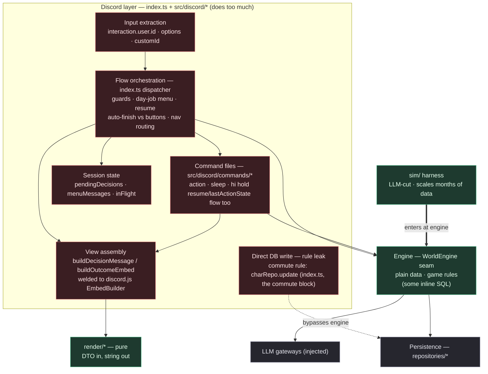
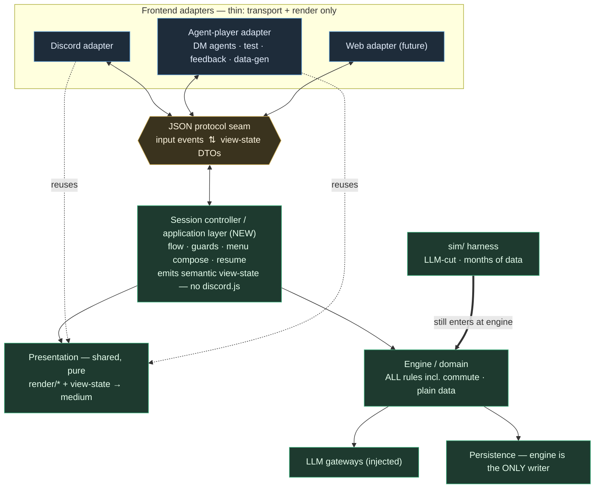

How the layers wire together today versus a frontend-neutral target where every frontend (Discord, a DM-agent player, a future web UI) talks to the game through one JSON seam. The engine and renderers are already clean; the missing piece is an application/controller layer, currently smeared across the Discord handlers. Extracting it is the prerequisite for the "all features on, driven by agents" short-term sim, and doubles as the future frontend-swap seam. All open questions were settled 2026-07-18 (see Decisions).

---

## The layers (glossary)

Six responsibilities. The problem is not that they exist; it is that three of them currently live in one place (the Discord layer) instead of being separated.

[I] **Transport / frontend adapter** — talks the wire protocol of one client. Today: `discord.js`. Captures input events, paints output.
[I] **Application / flow orchestration** — the game *as played*: guards, which screen to show, menu composition, resume, auto-finish-vs-buttons, nav routing, per-session working state. Frontend-agnostic by nature.
[I] **Presentation / rendering** — turns semantic outcome data into a medium (ANSI frames, embeds, plain text).
[I] **Engine / domain** — all game rules and state transitions. Plain data in, plain data out.
[I] **Persistence** — durable state behind repositories.
[I] **LLM pipeline** — decision/critic/classify gateways, injected into the engine.

---

## Now — current state

[p] **The engine boundary was drawn deliberately and holds.** `WorldEngine` is a plain-serialisable seam (its header says so), the engine imports nothing from `discord.js` or `render/`, and `sim/` proves it runs standalone.
[p] **`render/*` is genuinely pure** — its own input DTOs, string output, zero imports from engine/db/discord.
[c] **The application boundary above the engine was never drawn.** Flow, session state, and view-assembly all accreted inside the Discord handlers because a single `discord.js` `Interaction` bundles input + response + identity, so guard→engine→build-embed→reply in one handler is the path of least resistance. The `index.ts` dispatcher is now a ~2460-line `if/else` on `customId` with 20-plus branches, and it is not the only home: the `src/discord/commands/*` files (`action`, `sleep`, `hi`) carry their own resume/`lastActionState` flow, so the extraction is bigger than one file.
[!] **One real rule leak:** the "commute from the Oak to workplace" path writes character stamina + location straight to the DB via `charRepo.update` (`index.ts`, under the `── Commute from the Oak to the workplace ──` block — the sole direct repo write in the whole Discord layer), bypassing the engine. It is the canary: a game rule living in the UI. Contained (one site) but it is exactly the drift that grows.

---

## Target — best-practice future

The shape in one sentence: **Discord and the agent-player become peer adapters over one JSON seam; a new session controller owns all flow; the engine owns all rules; rendering is a shared pure service any adapter can reuse.**

[I] **Adapters shrink to two jobs:** translate their transport's events into protocol input-events, and paint the returned view-state in their medium. No game logic.
[I] **The controller is the new layer** and is transport-neutral: it never imports `discord.js`. It emits a *semantic* view-state DTO (screen kind, prompt, narration, options, art slots, footer), not embeds.
[I] **Rendering is shared:** the pure `render/*` frames plus a view-state→medium step, callable by any adapter, so an agent can see close to what a Discord player sees.
[I] **Two test depths, kept distinct:** `sim/` still enters at the *engine* (fast, deterministic, LLM cut — for months of data); the *agent-player* enters at the *protocol/controller* (all features on, real LLM — for bug-hunting and feedback). This is the "in between" target: a shorter sim of the whole game, not the engine core alone.

---

## Gap — how far from target

| Layer | Now | Target | Distance |
| --- | --- | --- | --- |
| Engine / domain | Clean seam; a couple of rules leaked up (commute); some inline SQL | All rules in engine; sole DB writer | **Small** |
| Persistence | Behind repos mostly; engine inline SQL + 1 Discord direct write | Every write via repos, engine-only | **Small–med** |
| Presentation | `render/*` already pure ✓; view-assembly welded to `discord.js` | Semantic view-state DTO + shared pure renderers | **Medium** |
| Application / controller | Does not exist; flow spread across `index.ts` dispatcher + command files | Dedicated transport-neutral controller (flow + session state) | **Large — the bulk** |
| Protocol seam | **Built and load-bearing** (`src/protocol/`: versioned envelope, event union, closed `facts` whitelist, error taxonomy, contract suite against two backends) | JSON input-events + view-state DTOs | **Closed** — see [[json-seam-protocol]] M5–M10. Transport stays in-process per decision 3, so the wire-format claim is by design rather than demonstrated |
| Frontend adapters | **Two thin adapters over one seam**: the Discord layer is translate + paint (zero runtime engine/controller imports, structurally enforced) and the agent-player is a protocol client | Thin adapters; + agent-player, + web later | **Closed for the two that exist**; a web adapter is a later arc, unblocked rather than built |
| Test harnesses | `sim/` at engine level only | `sim/` (engine) + agent-player (controller, all features) | **Agent-player is net-new** |

Already banked (the reason this is a refactor, not a rewrite): the engine seam, the pure renderers, the repository layer, the `sim/engine-factory` wiring, and the JSON-serialisable action state that already round-trips through the DB.

---

## Decisions — settled 2026-07-18

Every open question from the spark phase is resolved below. Changing any of these now requires a `decisions/` record.

1. **Session state is engine-owned.** The engine absorbs option-resolution (button index → option label) into its already-persisted action state — `lastActionState.pendingDecision` carries the options and `WorldEngineImpl` already parses them — so the controller stays stateless. The Discord-side `pendingDecisions` map (`src/discord/commands/action.ts`) is deleted, not relocated.
2. **Rendering: semantic view-state + shared pure renderers.** The controller emits a semantic view-state DTO (screen kind, prompt, narration, options, art slots, footer); the pure `render/*` frames plus a view-state→medium step turn it into the medium; adapters only paint. No per-adapter styling logic, so an agent sees close to what a Discord player sees.
3. **Protocol transport: in-process first.** The agent harness imports the controller and passes JSON objects. The protocol shape is the asset; a network JSON-RPC socket is a later bolt-on once agents must run out-of-process.
4. **Sequencing: commute fix first; oracle before extraction.** The commute rule moves into the engine as a standalone first slice — one site, engine-testable in isolation, needs no Discord-flow oracle. The behavioural oracle (a characterisation baseline of current Discord behaviour to diff against) is a hard prerequisite for the dispatcher extraction only. Oracle mechanism is the implementing lead's call; golden transcripts through the live handlers look cheaper than standing the agent-player up against the unextracted flow, since the agent-player needs its own adapter work first.
5. **Relationship to [[discord-interaction-layer]]: controller extraction first, plumbing on top.** That doc standardises Discord *plumbing* (ack/defer, loading envelope, component/embed builders, error funnel, in-flight guard); it cleans the adapter but does not extract the controller. After extraction its "five concerns" become the thin adapter's internal job, much smaller.
6. **sim vs agent-player: keep both, don't merge.** `sim/` = engine-level, deterministic, LLM-cut, months-of-data scale. Agent-player = controller-level, real LLM, all features on. Different depths, different jobs.

Carried idea, not a commitment: [I] **declarative controller** — a route table rather than hand-written branches, folding in the interaction-layer's route-table idea so both frontends and the ack model share one declaration. The lead may adopt it during M3 if it pays for itself.

Why now, not later:
[p] The "all features on, agent-driven" target is **unreachable** without the controller — those features live in the handlers, so `sim/` cannot reach them. Extraction is a prerequisite, not polish.
[p] Same seam serves the eventual frontend swap. Build once.
[p] Stops further rule/flow accretion in the handlers (the commute leak is the warning shot).
[c] The bulk is untangling the ~2460-line `index.ts` dispatcher — the busiest file in the repo.
[c] Regression risk in the live Discord flow during extraction. Mitigated by M1 (oracle first) and migrating screen-by-screen against it.

---

---

## Arc status — closed 2026-08-09

The arc this doc specced ran M0–M10 and is done: the protocol seam exists and both frontends (Discord, agent-player) ride it, settling the two corresponding gap-table rows above. The milestone record, build plans, handovers and the interchangeability proof (with an explicit statement of what it does *not* cover) are archived under `docs/archived/json-seam/` — see [[json-seam-protocol]] and [[json-seam-build-plans]]. Two limits worth not re-discovering: the transport is **in-process throughout** (decision 3 — nothing has crossed a wire), and the structural checks constrain imports and named calls, **not dataflow**.

Related: [[discord-interaction-layer]] (adapter plumbing), [[mvp-architecture]] (system target), [[mvp-llm-prompt-architecture]] (sim harness lineage).
