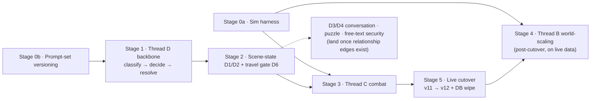

_Decided handover spec + parent/overview for the `0.3.0` v12 prompt-set, split into four sibling parts (tracked in the Parts index below). Keeps the cross-cutting frame: prerequisites, the staged build sequence, scope fences, the skill map, the thread-ownership map, risks, the carry-forward checklist, and the acceptance gate._

---

# Decision Prompt v12 — First-Class Combat, World Scaling & Multi-Stage Pipeline

**Thesis (shared with v9):** deepen immersion by balancing probabilistic and deterministic mechanics — dice rule the uncertain, the engine owns what players would feel cheated by if it drifted, the LLM dresses it. v9 took the LLM-only steps (markdown input + coherence critic); v12 lands the engine-heavy half: combat (C), world-scaling (B), and the multi-stage pipeline (D). This is the `v12` prompt *set* — it forks the single-file v11 into a versioned set of templates, and its Stage-1 classifier inherits v11's seven-value `ActionType` set (the canonical routing key, [[action-engine-framework]]).

## Must clear before any v12 build (gating prerequisites)

Not one buildable unit — two prerequisites plus three stageable threads that stay blocked until these land. Ordered by what unblocks the most:

- [x] **Build the sim harness** — gates tuning **Thread B** (scaling curve) and **Thread C** (severity bands); tuning blind bricks the game into trivial-or-impossible. Built in `src/sim/` (T1–T4, [[stage-0a-sim-harness-plan]]) — the *real first deliverable* of `0.3.0`.
- [x] **Settle prompt-set versioning** — asset layout + `PROMPT_VERSION` shape for a multi-template set (`decision-prompts/v12/{classify,decide/*,resolve/**/*}.md`). Gates all of Thread D; decide before building (see [[prompt-v12-pipeline]]). Settled in [[v12-prompt-set-versioning]]; scaffolded in `src/llm/prompt-builder.ts` (loader + stubs). Phase-split decide templates (NEW_ACTION vs CONTINUE) and per-verdict resolve templates (success/failure).
- [x] **`ActionType` enum** — standardised on v11's seven values (`combat · travel · social · skill · search · rest · other`); this is the single canonical routing key ([[action-engine-framework]] — retires the code's overlapping `category`/`distilledType`), which Thread D's Stage-1 classifier emits.
- [x] **Pin the typed scene-state structure** before Thread C — `combatState` is its first writer (see [[prompt-v12-scene-state]]). Graph-*shaped*, persisted in SQLite this round; real graph backend defers to MVP. Pinned + shipped in [[stage-2-scene-state-spine-plan]] (the `relations` table + typed edge ops).
- [ ] **Carry every v8–v11 rule forward** into whichever template now owns it (refunds, known-locations reuse, no-dead-turns, the security rule, markdown framing). A prompt-set rewrite is the easiest place to silently drop a hard-won rule. Owned by [[stage-5-live-cutover-plan]] Task 5 (the carry-forward audit).

> [>] Critical path: `v11 → {sim harness, prompt-set versioning} → D → C → B`. Stage the threads (D backbone first) so telemetry makes any regression attributable.

## Parts (this spark is split)

Each thread carries its full detail in a sibling part; this parent keeps the shared frame and tracks them here.

| Part                          | Thread             | What it covers                                                                                                                                                            |
| ----------------------------- | ------------------ | ------------------------------------------------------------------------------------------------------------------------------------------------------------------------ |
| [[prompt-v12-combat]]         | **C**              | Combat as a frequent, long, high-reward wilds mode: prompt rules + the engine combat spine (lifted decision cap, `combatState`, contested roll + severity bands, no-one-shot floor). |
| [[prompt-v12-world-scaling]]  | **B**              | The world sizes to the player (effective strength × week-indexed World Tier) → tougher foes, bigger rewards; **no** player-side dice buff; the anti-treadmill tension.    |
| [[prompt-v12-pipeline]]       | **D** (pipeline)   | Decompose the mega-call into classify → decide → resolve; per-type interaction shapes (D3), the free-text security stack (D4), and the cost/data case for the split (D5).  |
| [[prompt-v12-scene-state]]    | **D** (scene-state)| Engine-owned, graph-shaped spine across beats (D1); typed graph-delta mutations, no LLM SQL (D2); deterministic travel/location coherence (D6).                           |

## Threads shipped in v9 (forwarded)

- [>] **Markdown input** → shipped in [[prompt-v9-markdown-and-critic]]. v12's per-type templates inherit the framing.
- [>] **Coherence critic** → the `decide → critique → correct` decorator is Thread D's first pipeline stage ([[prompt-v12-pipeline]]); it gains ground truth to check against once C/D bring scene-state.

## How the three threads compose (v12 ownership)

Thread D reframes C and B: they stop being edits to *one* prompt file and become properties of a **versioned prompt set** — new version, bump `PROMPT_VERSION` (`prompt-builder.ts:6`), but `v12` is now a set of templates, not a single file.

- [>] **The `v12` prompt set** owns the per-type-per-verdict templates (classify / decide/{combat,…,other} / resolve/{combat,…,other}/{success,failure}), each inheriting v9's markdown framing — including combat's unsafe-location rules (C, [[prompt-v12-combat]]) and the `## World State` tier block (B, [[prompt-v12-world-scaling]]). Decide templates are phase-split (NEW_ACTION vs CONTINUE); resolve templates are verdict-split (success vs failure).
- [>] **`machine.ts` + `dc.ts`** own the combat spine (C, [[prompt-v12-combat]]): lifted decision cap, contested roll + severity bands, no-one-shot floor, and the `combatState` object that D1/D2 model as graph-shaped state ([[prompt-v12-scene-state]]).
- [>] **`buildUserMessage` (`prompt-builder.ts`)** owns emitting only the per-type slice of context each stage needs (D, [[prompt-v12-pipeline]]).
- [>] **A new orchestrator** owns the chain (D, [[prompt-v12-pipeline]]): classify → select template → decide → (dice) → resolve, plus the structured handoff. The v9 `CritiquedLlmGateway` is its seed.
- [>] **`machine.ts` / the context builder** own computing the encounter's difficulty band + scaled reward from (player strength, world tier) (B, [[prompt-v12-world-scaling]]). The roll math in `dc.ts` stays **unchanged** — no player buff.
- [>] **A sim harness** ([[mvp-llm-prompt-architecture]]) is a *prerequisite* for tuning B and C and measuring D's latency/coherence trade-off — not a nice-to-have.

## Build sequence (the handover plan)

This doc is `decided` — it is the spec an implementing session builds against. Start at **`planning-and-task-breakdown`** to turn each stage below into tasks; the per-part docs carry the detail each stage needs. The stages follow the critical path `v11 → {sim harness, prompt-set versioning} → D → C → B` and are ordered so telemetry can attribute any regression. Each stage names its dependency, the code it touches, and its exit criteria (a subset of the global Acceptance sketch below).

- [x] **Stage 0a — Sim harness** (the *real first deliverable*; no thread-C/B tuning is trustworthy without it). Depends on nothing. Touches: new test/sim tooling reusing captured `llm_calls` as mocks ([[mvp-llm-prompt-architecture]]). **Exit:** can replay a scripted character through simulated weeks against mocked/captured LLM output and emit win-rate / death-rate / reward curves offline. *Scope fence below — this is not a live-model soak or a full game sim.* **Built** in `src/sim/` per [[stage-0a-sim-harness-plan]] (T1–T4; synthetic-mock mode — captured replay + the death-rate metric deferred). Pending review.
- [x] **Stage 0b — Prompt-set versioning** (gates *all* of Thread D). Depends on nothing. Touches: asset layout `decision-prompts/v12/{classify,decide/{BASE,phases/*,*.md},resolve/{BASE,*/{success,failure}.md}}`, the `PROMPT_VERSION` shape (`prompt-builder.ts:6`), `MAX_DECISIONS_PER_ACTION` constant, and stamping every `llm_calls` row with the exact set version. **Exit:** an outcome traces to the exact template set that produced it. Settle *before* writing any template (see [[prompt-v12-pipeline]] §D, and the `prompt-versioning` skill). Settled in [[v12-prompt-set-versioning]]; scaffolded in `src/llm/prompt-builder.ts` (loader + phase-split stubs).
- [x] **Stage 1 — Thread D backbone** ([[prompt-v12-pipeline]]). Depends on 0b. Touches: a new orchestrator (seed: the v9 `CritiquedLlmGateway`), `buildUserMessage` slicing per-type context, the classify → decide → (dice) → resolve chain with a **structured, typed handoff carrying `final_mutations`** (the D5b fix). **Exit:** an action runs the chain, decide emits options only, a fresh resolve stage produces mutations from the handoff, and the latency tail is measured. *Prototype off the live loop first — this is the most invasive change; keep pure travel/rest single-call.* **Shipped** per [[stage-1-thread-d-backbone-plan]] — `PipelineActionStateMachine` runs the full chain in the sim with the D5b handoff.
- [x] **Stage 2 — Scene-state spine + travel gate** ([[prompt-v12-scene-state]] D1/D2/D6). Depends on Stage 1 (the pipeline carries it) and the pinned SQLite structure. Touches: the typed edge storage, the edge-shaped mutation ops (`set_relation`/`update_relation`), the `scene_location` decision-contract field, and the deterministic travel-coherence gate in the ⚙️ engine ([[action-engine-framework]]). **Exit:** enemy HP / NPC disposition / puzzle clues persist across beats; the forge→forest teleport bug is fixed deterministically; the LLM never emits SQL. **Shipped** per [[stage-2-scene-state-spine-plan]] (relations spine + travel gate, sim-proven).
- [x] **Stage 3 — Thread C combat** ([[prompt-v12-combat]]). Depends on Stage 2 (`combatState` *is* the first scene-state writer) and Stage 0a (to tune bands). Touches: `machine.ts` (lifted decision cap, round loop, no-one-shot floor), `dc.ts` (contested roll + severity bands), the combat template, and per-round beat logging. **Exit:** the combat Acceptance bullet — multi-round `required` fights bounded by the round cap, tier scaling touches enemy HP + band damage only. **Shipped** per [[stage-3-combat-spine-plan]] (execution state 2026-07-05, 1149/1149 green).
- [ ] **Stage 5 — Live cutover** ([[stage-5-live-cutover-plan]]). Depends on Stages 1–3. Runs *before* Stage 4 — the numbering is historical, the order is deliberate: cut over scale-neutral, then tune Thread B on live data. Touches: the prod `PipelineLlmGateway`, the real classify fallback, critic re-placement, the carry-forward audit, then the hard flip v11 → v12 + DB wipe + `0.3.0`. **Exit:** every live action runs the v12 chain, stamped per stage; the legacy machine and `PROMPT_VERSION` are deleted. *In progress — Task 0 (prod scene-state host wiring), T1b (full-chain sim coverage for all ActionTypes), and T1 (combat calibration baseline) landed; T2 (prod `PipelineLlmGateway`) is the next task and the critical path.*
- [ ] **Stage 4 — Thread B world-scaling** ([[prompt-v12-world-scaling]]). Depends on Stage 3 (`combatState` receives the two tier-scaled numbers), Stage 0a (to tune the lag + reward coefficients — *do not guess them*), and now Stage 5 (tuned post-cutover on live data; the launch is scale-neutral with the `scale` seam at 1). Touches: the difficulty-band + scaled-reward computation from (player strength, World Tier), the `## World State` block, and the rumour cadence. **Exit:** the world-scaling Acceptance bullet — a stronger character meets measurably tougher, better-paying foes in the same place without a flat treadmill. *No build-plan doc yet — spec one (stage-4) when Stage 5 clears.*
- [>] **Cross-cutting, threaded through the stages:** carry every v8–v11 rule forward into its new template owner (the checklist below); the **conversation/puzzle templates + free-text security stack** (D3/D4) land once relationship edges exist (Stage 2), so schedule them alongside/after Stage 3; the **prose-critic trigger** stays parked pending Stage 3 combat telemetry ([[prompt-v12-pipeline]] §D7). Everything deferred past the Stage 5 cutover (Stage 4, D3/D4, the trigger decision, F#21, carried cleanups) is tracked in [[prompt-v13-roadmap]].

## Scope fences (rabbit-hole containment)

These are the four places the build can balloon. Hold the line:

- [!] **Sim harness = offline replay, not a game sim.** Minimum viable: captured/mocked LLM output + scripted button presses + a character walked through N weeks, emitting the curves that tune B and C. It is *not* a live-model soak test, a headless Discord client, or a general simulation framework. Build exactly enough to stop tuning blind.
- [!] **Scene-state = one typed edge table, not a graph DB.** Pin a single SQLite shape this round (e.g. `relations(from_id, to_id, type, props_json)`); the engine reads/writes it *only* through the typed mutation ops. No query language, no Cypher, no backend swap — the real graph backend defers to MVP ([[mvp-data-model]]).
- [!] **Free-text trust = revoke only, no restoration this round.** A strike downgrades the player to buttons-only for the session/day and stops there. The trust-*restoration* path is deferred to MVP; POC ships the revocation + graceful degrade, nothing more.
- [!] **Pipeline split = incremental, not big-bang.** Decompose combat and ambiguous intent; keep pure travel/rest single-call. The v9 critic is the on-ramp — prototype the chain beside the live loop before cutting over.

## Skills for the build

Per [[using-agent-skills]] — this doc *is* the spec, so an implementing session skips `spec-driven-development` and enters at planning. Suggested mapping (project skills in **bold**):

| Stage / concern | Primary skills |
| --------------- | -------------- |
| Turn this spec into tasks | `planning-and-task-breakdown` |
| 0a Sim harness | `test-driven-development`, `incremental-implementation` |
| 0b Prompt-set versioning | **`prompt-versioning`**, `api-and-interface-design` |
| 1 Pipeline backbone | `api-and-interface-design` (the handoff contract), `doubt-driven-development` (invasive core loop), `incremental-implementation` |
| 2 Scene-state | `api-and-interface-design` (mutation-op vocab), **`game-development`** → **`multiplayer`** (server-authoritative state), `test-driven-development` |
| 3 Combat | **`game-development`** → **`game-design`** (balance), `test-driven-development`, `performance-optimization` (latency tail) |
| 4 World-scaling | **`game-design`** (curve + reward), `performance-optimization` |
| D4 free-text security | `security-and-hardening` |
| Any prompt/template edit | **`prompt-versioning`** |
| Before each merge | `code-review-and-quality`, then **`releasing`** for the commit/branch/changelog |

## Carry-forward checklist (v8–v11 rules that must survive the rewrite)

The single easiest way to regress: silently drop a hard-won rule when splitting one file into a set. Each must land in whichever v12 template now owns it, and be verified by the final Acceptance bullet:

- [ ] Refunds — no-op / timeout rolls (1 free each per day) ([[roll-economy-timeouts-and-world-growth]]).
- [ ] `KNOWN LOCATIONS` reuse — lazy-create off-map locations, don't duplicate known ones.
- [ ] No dead turns — genuine no-ops resolve *empty*, never fabricate a change ([[mutation-vocabulary-refinement]] §5a).
- [ ] The SECURITY RULE — player text is in-world speech, never an engine instruction (D4).
- [ ] Markdown framing — v9's markdown input/interpretability, inherited by every per-type template.
- [ ] Per-option stat & ability-check rolls ([[per-option-stat-and-ability-checks]]).

## Open questions (cross-cutting)

- [?] Ship C, B, D as one `v12`, or stage them (D backbone first, then C on its scene-state, then B on top)? Staging makes regressions attributable. **→ decided: staged, per the Build sequence above.**
- [!] v12 must **carry every prior data-driven fix forward** (refunds, `KNOWN LOCATIONS`, no dead turns, security rule, markdown framing) — the rewrite is the easiest place to drop one.

## Risks

- [c] **Three structural changes at once.** Staged prompt versions let telemetry attribute any regression. Thread D is the most invasive and wants its own prototype before touching the live loop — the v9 critic is the on-ramp.
- [c] **Compounding latency.** C multiplies calls per fight (rounds), D per beat (stages). Not the binding constraint (D5), but watch the tail — the round cap, a heuristic/cached classifier, and decompose-only-where-it-pays keep it in check.
- [c] **Tuning the curve blind** (B) bricks the game into trivial or impossible. The sim harness gates it.

## Acceptance sketch (when this graduates)

- [ ] In unsafe locations combat dominates; in safe ones it's rare. Fights run multi-round (`required`), end within the round cap (4 after the initiating decision, ≤6 total), and a win yields loot/advance scaled to difficulty. No round one-shots a full-HP player; a would-be killing blow triggers the once-per-day survive-at-1 save; tier scaling changes enemy HP + band damage only, never the variance/floor.
- [ ] Over simulated weeks a stronger character meets measurably tougher foes than a weaker one in the *same* place, and those fights pay proportionally more — the world tracks the player but rewards growth (not a flat treadmill). The cross-session World Tier is observable on top of the within-encounter scaling.
- [ ] An action runs the chain: a typed classification routes to the right template, decide emits options only, and a fresh resolve stage produces mutations from a structured handoff — every row stamped with the exact `v12` prompt-set version.
- [ ] Scene-state survives across beats as graph-shaped, persistent state: enemy HP / NPC disposition / puzzle clues persist; the engine applies only whitelisted, clamped graph-deltas — the LLM never emits SQL. A boar near death stays near death; an NPC's price doesn't reset; a fled enemy is remembered.
- [ ] A conversation is judged on what the player types against the NPC's relationship edges, disposition gating the impossible; a puzzle's clues come from rolls but its solve is a rollless semantic match.
- [ ] Free-text is gated: oversized/injection-flagged input is caught pre-LLM and downgrades the offending player to buttons-only going forward.
- [ ] All v8/v9 rules verified present across whichever template now owns each.
