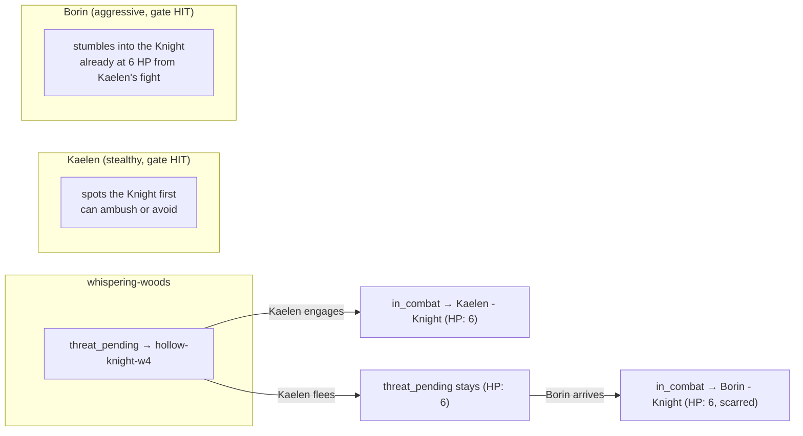

# Threat Encounter System

A stochastic encounter gate that populates unsafe locations with the Threat's minions
across three tiers (grunts, champions, herald), scaling density by week and incentivising
co-op through shared threat-pool persistence and asymmetric detection.

Builds on the v12 pipeline (classify → decide → resolve) and the existing scene-state
spine (`relations` table, D1/D2). The engine gates *when* and *what*; the LLM dresses
*how* and *who* — the same seam as the rest of the v12 architecture.

---

## 1. Three Tiers

Three enemy tiers, unlocked by real-calendar week. Unlock means the tier enters the
encounter pool — not guaranteed every fight, but rollable by the gate.

| Tier | Label | Unlock week | Lane | Solo | Pair | Fellowship (3+) | Flavour |
|---|---|---|---|---|---|---|---|
| T1 | **Grunts** | Week 1 | Unsafe only | Fair fight, normal loot | Quick kill, bonus loot | Trivial, fast clear | Twisted fauna — a wolf with red-glowing eyes, a boar with thorny growths, a raven that watches too long. Something *off*. The Threat is still distant; these are creatures that brushed against wrongness and survived changed. |
| T2 | **Champions** | Week 3 | Unsafe, requires group (desperate solo) | Desperate — survive or retreat | Hard but winnable | Fair fight, best loot | Named agents with deliberate purpose. A corrupted treant striding the woods. A hooded figure collecting corpses. A broken-down cart that's an ambush with a leader. The Threat has lieutenants. |
| T3 | **Herald** | Week 5 | Deep-unsafe only (Stonebridge-level, far frontier) | "Run." | "Run together." | Survivable — can drive it off, never permanently kill | The Big Bad's direct agent. Appears first in a scripted Saturday event, then re-appears at high density. Named, recurring, recognisable. Cannot be slain in a random encounter — only driven off. The Threat has a face. |

**Tier 3 capstone:** the Herald can't be beaten permanently outside of the final
climax. A successful group encounter drives it off for a few weeks (writes a
`threat_defeated` edge with a repopulation timer). It returns.

---

## 2. Density Curve

The gate threshold drops each week, making encounters more frequent. This is the
*visible darkening* — the world is genuinely more dangerous in week 8 than week 2.

| Week | Gate DC | ~Encounter chance | Pool weight (T1 / T2 / T3) | Group size |
|---|---|---|---|---|
| 1 | 16 | 25% | 100 / 0 / 0 | Solitary grunt |
| 2 | 15 | 30% | 100 / 0 / 0 | Solitary grunt |
| 3 | 14 | 35% | 70 / 30 / 0 | 1-2 grunts or solo champion |
| 4 | 13 | 40% | 60 / 40 / 0 | 1-2 grunts or solo champion |
| 5 | 12 | 45% | 50 / 35 / 15 | Grunt pair or champion + grunts |
| 6 | 11 | 50% | 40 / 35 / 25 | Warband: 2-3 grunts + champion |
| 8 | 9 | 60% | 30 / 40 / 30 | Warband, champion-led |
| 12 | 7 | 70% | 20 / 40 / 40 | Large warband, herald may lead |

> [!] Numbers are starting estimates. **Must be tuned on the sim harness** before
> hitting prod. The curve above is a hypothesis; the sim runs combat outcomes against
> it and tells us if week 8 feels like a darkening world or a grind.

**Natural wildlife is preserved.** If the gate misses, the player gets normal wildlife
(wolves, boars, bandits) per existing combat rules. The Threat doesn't saturate the
world until mid-game — it bleeds in gradually.

---

## 3. The Encounter Gate

Engine-owned stochastic check that fires per action when a player enters or acts in
an unsafe location. Positioned in the pipeline between CLASSIFY and DECIDE.

### Flow

```
1. Player acts in unsafe location
2. Check: week ≥ 1? (grunts unlocked)
3. Read approach modifier from classify DMA (new 'approach' field on RoutingFlags)
4. Gate roll: d20 + approach_modifier vs week threshold
5. Gate miss → clean passage or natural wildlife encounter (no Threat)
6. Gate hit → roll tier from weighted pool → persist encounter edge → inject into DECIDE context
```

### Approach modifiers (inferred by classify DMA)

| Approach | Keywords | Gate modifier | Narrative framing |
|---|---|---|---|
| `stealthy` | sneak, creep, lurk, shadow, quietly, scout | +3 | "You spot them first." Surprise/ambush framing. |
| `cautious` | careful, slow, watch, listen, proceed | +2 | "You hear them before they see you." Mutual detection, even start. |
| `neutral` | (no approach keywords) | 0 | Default. "You walk into each other." |
| `aggressive` | charge, rush, attack, storm, brute | -2 | "They hear you coming." Enemy gets the drop. |

The approach modifier is a mechanical reward for descriptive play. A player who says
"I creep through the treeline" gets a 15% better chance of spotting the enemy first
(or avoiding it entirely via the stealth-payoff path in §5).

### Gate config

```typescript
// src/engine/threat/threat-config.ts
const THREAT_CONFIG = {
  tierUnlocks: { tier1: 1, tier2: 3, tier3: 5 },
  gateThreshold: (week: number): number => Math.max(7, 17 - week),
  densityPool: (week: number): PoolWeights => densityCurve[Math.min(week, 12)],
  approachModifier: { stealthy: 3, cautious: 2, neutral: 0, aggressive: -2 },
};
```

---

## 4. Shared Threat Pool — Scene-State Persistence

Threat encounters are **per-location, not per-player**. The encounter state lives in
the existing `relations` table as engine-owned edges. Two players in the same unsafe
hex see the same wounded champion.

### New `rel_type` values

| rel_type | From | To | Props | Created by | Cleaned up by |
|---|---|---|---|---|---|
| `threat_pending` | `location` (ref: location name) | encounter ID (e.g. `"threat-hollow-knight-w4"`) | `{ tier, density, maxHp, encounterName }` | Gate hit (first player triggers it) | First engagement (upgraded to `in_combat`) |
| `in_combat` | `pc` | encounter ID | `{ enemyHp, maxHp, round, tier }` | Player engages the threat | Combat resolved (win → `threat_defeated`; flee → stays) |
| `threat_defeated` | `location` | encounter ID | `{ clearedDay, tier, repopulatesDay? }` | Combat resolved, victory | Repopulation timer expires (daily tick) OR herald special |

### Shared-world semantics



### Daily persistence

The `relations` table survives day boundaries by construction — it's SQLite. A
champion fought to 5 HP on Monday is at 5 HP when a different player walks into the
same hex on Tuesday. Only the daily tick explicitly repopulates cleared encounters:

- `threat_defeated` edges with expired `repopulatesDay` are removed by the daily
  upkeep cron (same seam as the afternoon reset / weekly cadence).
- `threat_pending` edges from an unattended gate HIT persist until someone engages
  or the daily tick consolidates them (a scouting party that arrived and left).

### Nearby-Player awareness

The `## Threat presence` block injected into DECIDE context also carries:

```
Nearby in this area:
  - Kaelen (Ranger) — also in the Whispering Woods
  - Thorne (Warrior) — at the Old Watchtower, one hex away
```

This is how the prompt naturally frames co-op: "You spot a champion's patrol — too
many for one. Kaelen is nearby in the woods. Do you call out, or press on alone?"

---

## 5. Stealth Payoff

A stealthy approach that beats the gate gives the player a real choice at the DECIDE
stage — not forced combat, but a fork:

```
Case A — Gate miss (stealthy, d20 8 + 3 = 11 < threshold 13):
  Clean passage. No Threat encounter. No roll spent.
  → Normal action resolution (travel/rest, no combat)

Case B — Gate hit, stealthy approach (d20 12 + 3 = 15 ≥ threshold 13):
  "You spot the grunt patrol before they see you."
  Option: "Slip past without a fight?" → free resolve, no roll spent
  Option: "Spring an ambush with the drop on them?" → combat, initiative advantage, roll spent

Case C — Gate hit, aggressive approach (d20 12 + 0 = 12 ≥ threshold 13):
  "You crash through the brush straight into a grunt. It was waiting."
  → Combat, roll spent, neutral initiative
```

In case B, the DECIDE template receives an additional `encounter_avoidable: true`
flag in the `## Threat presence` block. The LLM authors two paths — slip past or
engage — and the engine skips the roll if the player chooses the free resolve.

---

## 6. Teamwork Incentives

| Situation | Solo | Pair | Fellowship (3+) |
|---|---|---|---|
| Grunt encounter | Fair fight, normal loot | Quick kill, bonus loot (×1.3) | Trivial, fast clear (×1.5) |
| Champion encounter | Desperate (survive/retreat) | Hard but winnable | Fair fight, best loot |
| Herald encounter | "Run." | "Run together." | Survivable, can drive it off |
| Gate roll (approach bonus) | Own approach only | Highest approach shared | Best approach in group |
| Loot multiplier | ×1 | ×1.3 | ×1.5 |

The loot multiplier is engine-applied at resolve-finalize time — the LLM doesn't
compute it, it just receives the result and narrates accordingly.

**Champion solo signal:** when the gate fires a champion-tier encounter and the player
is alone, the `## Threat presence` block includes:

```
This presence feels strong — too strong for one.
Nearby: Kaelen (Ranger) in the Whispering Woods.
You could call out, or press on alone.
```

The LLM dresses this signal naturally. If the player presses on alone and survives,
they get bragging rights + better loot (solo-champion bonus). If they call for help,
the fellowship gets a shared encounter with the persistence semantics above.

---

## 7. Saturday Events — Scripted Milestones

Saturday events are the scripted drumbeat of the Threat. Engine-owned (fixed schedule,
not stochastic) and serve as tier-reveal moments.

| Week | Event | What happens | Narrative |
|---|---|---|---|
| 1 | (none — world feels normal) | — | Establishes baseline safety |
| 2 | **First Sign** | A grunt wanders to the edge of a safe zone — found dead by a villager, or attacking a farmstead at dusk. Players hear via rumour, not direct encounter. | "Something is wrong" |
| 3 | **Champion's Debut** | A named champion targets a specific location — poisons Stonebridge's well, burns a mill, leaves a sigil. Players can investigate or intercept. First named enemy. | The Threat has *agents* |
| 4 | **Density Spike** | Coordinated grunt attack on a frontier outpost. Gate threshold drops visibly — players notice unsafe locations are genuinely more dangerous. | The world is darkening |
| 5 | **Herald Revealed** | The Herald appears — scripted, unavoidable in narrative. Not necessarily a fight. Seen on a ridge at sunset, or its name carved into the Oak. Does something undeniable — cracks the ground, curses a location, raises dead grunts. | The Threat has a face and a name |
| 6+ | **Escalation** | Champions lead warbands. The Herald returns. Locations flip safety status (safe road becomes unsafe). The world is recognisably at war. | Late-game — Threat no longer hidden |

Saturday events can:
- Flip a location's `is_safe` flag (champion's corruption)
- Inject a rumour into world-state for the decide prompt
- Spawn a scripted encounter (Herald's first appearance is a cutscene, not a fight)
- Write a `threat_defeated` edge with a long repopulation timer (driving Herald off)

---

## 8. Classify DMA Extension

One new field on `RoutingFlags`:

```typescript
// src/llm/pipeline/types.ts
interface RoutingFlags {
  unsafe_location: boolean;
  needs_roll: boolean;
  target_present: boolean;
  approach: 'stealthy' | 'aggressive' | 'neutral' | 'cautious';  // new
}
```

Heuristic classify (`classifier.ts`) maps keywords:
- `stealthy` — sneak, creep, shadow, lurk, quietly, scout
- `cautious` — careful, slow, watch, listen, proceed
- `aggressive` — charge, rush, storm, brute, force
- `neutral` — (no approach keywords)

LLM classify fallback fills the gap on ambiguous input. The approach modifier is a
slot on the existing DMA output — no new DMA, no new prompt stage.

---

## 9. Pipeline Integration

The gate fires in `PipelineActionStateMachine.start()` and `.step()`, between the
classify result and the decide call.

```typescript
// Pseudocode — gate logic in PipelineActionStateMachine
private async runThreatGate(
  location: string,
  week: number,
  approach: RoutingFlags['approach'],
): Promise<ThreatEncounter | null> {
  if (!this.resolver.isLocationSafe(location)) return null;  // safe → no gate
  if (week < 1) return null;

  const mod = THREAT_CONFIG.approachModifier[approach];
  const roll = this.rollD20() + mod;
  const threshold = THREAT_CONFIG.gateThreshold(week);

  if (roll < threshold) return null;  // miss

  const tier = rollWeightedTier(week, this.rollD20());
  const density = rollGroupSize(tier, week, this.rollD20());

  // Persist: write threat_pending edge in relations table
  const encounterId = `threat-${nanoid(8)}-w${week}`;
  this.relations.set({
    fromType: 'location', fromRef: location,
    toType: 'npc', toRef: encounterId,
    relType: 'threat_pending',
    props: { tier, density, maxHp: maxHpForTier(tier), encounterName: pickName(tier, week) },
  });

  return { encounterId, tier, density, approachAdvantage: mod > 0 };
}
```

The resolved `ThreatEncounter` is injected into `LlmContext` as `threatPresence` — a
new optional field that the v12 pipeline's decide template renders as:

```
## Threat presence
A Tier 1 grunt — a wolf with eyes that burn red. Something has touched this one.
Encounter: you spot them first (surprise).
Nearby: Kaelen (Ranger) in the Whispering Woods.
```

---

## 10. Prompt Template Changes

### classify.md — No change

Classify already routes ActionType + flags. The new `approach` field is part of the
existing DMA contract.

### decide/BASE.md — New rule section

Added after section 5 (NPC Handles):

```
### 6. Threat Encounters
When `## Threat presence` is present, the enemy is a minion of the greater evil.
These are not random wildlife — they are deliberate, touched by something wrong.
The creature should feel *off* even in its description: wrong-coloured eyes, too-calm
behaviour, unnatural resilience. They escalate — a Tier 1 grunt is unsettling, Tier 2
champion is menacing, Tier 3 herald is terrifying. Write encounters that make the
world feel darker.
```

### decide/combat.md — No structural change

The combat template receives the `## Threat presence` block automatically through the
LlmContext injection. The existing combat rules (physical options, item anchoring,
danger pacing) handle the encounter.

When `encounter_avoidable: true` is present (stealthy approach, gate hit), the template
should offer a free-resolve path (slip past) alongside the combat options.

### resolve/combat/{success,failure}.md — No change

Resolve receives the encounter through the structured handoff. The outcome text dresses
the result against the tier's flavour.

---

## 11. Engine New Files

| File | Purpose |
|---|---|
| `src/engine/threat/threat-config.ts` | Threshold curve, tier unlocks, density pool, approach modifiers |
| `src/engine/threat/encounter-gate.ts` | `runThreatGate` — the stochastic gate, tier/density rolls, persistence writes |
| `src/engine/threat/encounter-pool.ts` | Name generators, group-size rolls, max-HP-per-tier lookups |
| `src/engine/threat/saturday-events.ts` | Scripted event schedule, location-safety flips, rumour injection |

The gate integrates into `PipelineActionStateMachine` — not a new DMA, just a pipeline
stage method that fires between classify and decide.

---

## 12. Acceptance

- [ ] A player in an unsafe location has a stochastic chance to encounter a Threat enemy, scaling with week. Enemy tier matches the unlock schedule.
- [ ] Stealthy / cautious approaches improve the gate roll; aggressive penalises it.
- [ ] A stealthy gate hit offers a free-resolve path (slip past, no roll spent).
- [ ] Two players in the same unsafe hex see the same shared encounter — a wounded champion stays wounded for the second player.
- [ ] Encounter state persists across days in the `relations` table.
- [ ] A champion encounter signals "too strong for one" when the player is solo, with nearby players named.
- [ ] Loot multiplier applies for group fights.
- [ ] Saturday events fire on schedule, flipping location safety and introducing the Herald.
- [ ] The Herald can be driven off but not permanently killed outside the climax.
- [ ] Density curve is tuned on the sim harness.
- [ ] All v8-v11 combat rules preserved (no-one-shot floor, per-option stat, roll-first).

---

## 13. Deferred: Campaign Journal

> A long-running narrative log (per-player or per-fellowship) that tracks story beats,
> NPC interactions, location discoveries, and resolved quests. The engine selects
> relevant entries (by location, NPC, or keyword) and injects them into LlmContext as
> a `## Journal` block — giving the LLM a memory of "what happened last week in this
> village" without re-inventing it from recentActions alone. Persisted in a
> `journal_entries` table, summarised/trimmed by week so it doesn't bloat context.
> Wire into the prompt templates alongside `## Threat presence` once the core threat
> system is stable.

Not in scope for this build cycle. Noted for post-stabilisation.
