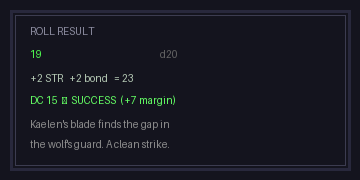
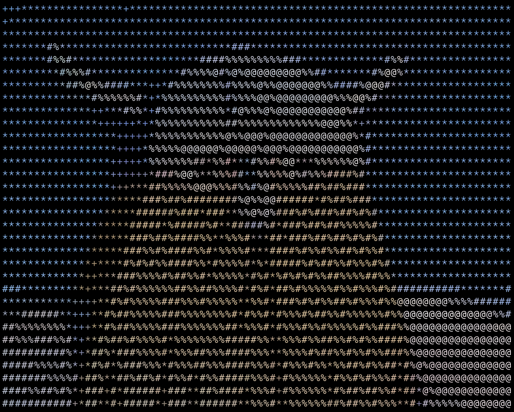

Findings and mock-ups from an ANSI-colour experiment (2026-07-08): Discord `ansi` code blocks give the existing ASCII presentation colour, HP-bar semantics, and pixel-art-style depth on desktop at zero dependency cost, degrading to plain monochrome art on mobile. Captures the empirically tested constraints (wrap widths, char budgets, palette), a colour-role convention, a frame/slot layout system, and a splash-screen treatment.

---

# ANSI Art — Coloured Frames & Splash

> Everything below was tested live through the bot (DM to admin) on desktop client + Nothing Phone 2a, 2026-07-08.

## 1. What Discord actually supports

- ` ```ansi ` code blocks render SGR escape codes on **desktop and browser only**: `0` reset, `1` bold, `4` underline, fg `30-37`, bg `40-47`. Fixed Solarized-ish palette, no RGB.
- **Mobile strips the codes** and shows plain monochrome art — layout intact, colour gone. Graceful degradation, but colour must never carry gameplay-critical information on its own.
- Escape codes count toward the 2 000-char message limit. Measured budgets: 30-wide interaction frames 820–1 250 chars incl fences; the 40-wide splash with bg fills + piped border lands at ~1 945 (near the ceiling).
- Wrap thresholds (via a ruler message, `30…56` cols): **40 cols max on the phone** (Nothing 2a, default font), desktop comfortably beyond 56. Existing 30-char loader cap stays right for anything mobile players must read; 40 is the ceiling for showpieces.
- Dark fg colours (esp. gray `30`) read badly on Discord's dark chat background. Prefer light fg (white/tan) and get "dark" from **bg fills** instead.
- Half-blocks (`█ ▀ ▄ ▐ ▌`), shade blocks (`░ ▒ ▓`) and box-drawing (`═ ║`, heavy `━ ┃`) render single-width on desktop.

[?] Do half-blocks/box-drawing stay single-width on all mobile fonts? Splash rendered on the Nothing but a broader device pass hasn't happened.
[?] A May 2026 comment on the community ANSI guide says Discord moved the palette from Solarized-custom toward standard ANSI colours — re-verify hex values before building UI that colour-matches them.

## 2. Colour-role convention

Small fixed vocabulary so colour becomes a convention, not per-frame decoration:

| Code | Colour | Role |
|---|---|---|
| 30 gray | chrome | frame borders, labels, empty bar segments (desktop only — too dark for body text) |
| 31 red | threat | enemy names, damage floaters, low HP, eyes |
| 32 green | life | healthy HP fill, healing floaters |
| 33 yellow | warmth/reward | fire, loot, NPC props, title lettering (tan-gold) |
| 34/36 blue/cyan | player | player name / sprite, NPC speech |
| 35 magenta | reserved | magic / status effects (unused so far) |
| 37 white | emphasis | sprites, item names |
| bg 40 | panel | dark-teal backdrop fill — makes a message read as a solid panel |
| bg 41/42 | surface | frame bars, ground strips |

## 3. Frame system (mocked, all validated ≤ 30 wide)

One fixed chrome with four swappable slots — matches the existing fragment-library approach:

- **Header slot** — name + level, HP bar rendered from state (`#`/`-`, or `█`/`░`).
- **Sprite slot** — ~6×20 region; monster/portrait/potion/chest are interchangeable fragments; variants (idle `o` eyes vs hit `x` eyes) instead of new art.
- **Floater slot** — one line for `-12`/`+10` from the tick result.
- **Message box** — 2×26 chars, a hard budget the LLM flavour text can be given.

Mocked and sent live: encounter opener, skill-use reply, NPC dialogue, item-use reply, loot reply (Pokémon-style layout, menu delegated to Discord buttons/replies). Also a 38-wide side-by-side battle layout and a 46-wide panorama — desktop-only shapes.

Example (encounter, monochrome; colour applied by role at render time):

```
+----------------------------+
|  GLOOMFANG           Lv 4  |
|  HP [########--------]     |
|                            |
|        /\        /\        |
|       /  \______/  \       |
|      |    o    o    |      |
|      |      /\      |      |
|       \    '--'    /       |
|        '-.______.-'        |
|                            |
|    ,^.                     |
|   ( _ )                    |
|   /|_|\      WARDEN  Lv 3  |
|  / |_| \     HP 24/30      |
|    |_|       [######----]  |
|   _/ \_                    |
+----------------------------+
|  A wild GLOOMFANG lunges   |
|  from the bracken!         |
+----------------------------+
```

Wire format — the bot embeds real ESC bytes inside the block; one HP-bar line spelt out:

```
|  HP [########--------]     |
```

## 4. Splash treatment

40-wide title splash in the style of pixel-art banners (ref: Polyducks' *Mushroom Hunt*): bg 40 teal panel fill for depth, 3-row half-block font for `WARDEN'S`, 4-row font for `OAK` in tan-gold, gold double-line piped border with red corner knobs and an acorn crest `╡@╞`, scene strip (pines, cottage, oak, mushroom) over a bg 42 ground band, credits line. The block fonts are dicts keyed by letter — reusable for chapter titles / version stamps.

```
o══════════════════╡@╞═════════════════o
║   *        .         *       .       ║
║         ----==[ THE ]==----          ║
║   █   █ ▄▀▄ █▀▄ █▀▄ █▀▀ █▄ █ ▀ ▄▀▀   ║
║   █ █ █ █▀█ █▄▀ █ █ █▀▀ █ ▀█   ▀▀▄   ║
║   ▀▄▀▄▀ █ █ █ █ █▄▀ █▄▄ █  █   ▄▄▀   ║
║         ▄████▄  ▄████▄  ██ ▄█▀       ║
║         ██  ██  ██  ██  ███▀         ║
║         ██  ██  ██████  ███▄         ║
║         ▀████▀  ██  ██  ██ ▀█▄       ║
║    ▄█▄     ▄█▄        ▄▄▓█████▓▄▄    ║
║  ▄█████▄ ▄█████▄    ▓█████████████▓  ║
║     █       █  ▄▄▄       ▀█▄█▀       ║
║     █       █ ▐█:█▌      ▄█▄█▄ ▄█▄   ║
║. , . , . , . , . , . , . , . , .▐▌ . ║
║  AN ASYNC TURN-BASED DISCORD RPG     ║
o══════════════════════════════════════o
```

[p] Zero dependencies, zero attachments — pure strings through the existing send path.
[p] Same art degrades cleanly to monochrome on mobile.
[c] 8+8 fixed colours cap the fidelity — the reference pixel art's ~16 tuned earth tones are unreachable; bg fills + `░▒▓` dither is the ceiling.
[c] Colour roughly doubles a frame's char cost; the splash is already at ~97% of one message.

## 5. Reference — bento item-grid border poster (2026-07-09)

ALL ASSET LINKS HAVE MOVED TO /mnt/nas/stuff/pics/daily-pixel/filtered-inspo/


Zelda-style inventory poster; noted as the model for **UI/menu frames** (inventory, character sheet, shop), complementing the landscape reference that informs scene shading.

- **Triple border**: thick outer gold rule, black gutter, thin gold rule, black gutter, then panel edges. ANSI mapping: an outer `█`-run frame plus an inner light box-drawing line, gutters from the black bg.
- **Bento panel grid**: irregular rectangles on black, each outlined and holding exactly one icon. Slots of differing sizes inside one fixed chrome — same philosophy as the frame/slot system, applied to menus.
- **Rivet dots** at panel corners/junctions as chrome decoration.
- **Flat two-tone only, zero dither** — icons are chunky, symmetric, and read at tiny sizes. Lesson: scenes get dither, UI gets flat fills; don't mix.
- **Palette is near-1:1 ANSI**: gold→33, orange→31, lavender→35, white accents→37 (sparse: eyes, glints), black bg→40. Two warm + two cool tones per icon = the same ramp-sharing trick as the landscape reference.
- The `≡ $ ≡` cash plaque works verbatim as text glyphs.

[I] A bento inventory frame: box-drawing panels, one half-block icon per slot, rivets at junctions — strong candidate for the inventory/shop command replies.
[p] First reference whose full palette fits the 8-colour ANSI set without loss.
[c] Irregular panel grids spend many box-drawing junction chars; the mobile single-width question above applies double here.
[?] 35 magenta is "reserved: magic" in the colour-role table, but here lavender is the natural metal/chrome tone for icons — allow a per-screen role override for menu frames?

## 6. Reference — dialogue/choice modal (2026-07-09)


Pixel-UI dialogue box ("You have found: 2 RED mushrooms…"); noted as the model for **dialogue and prompt frames** (loot found, NPC speech, confirmations). Third register after scene shading and menu grids.

- **Ornamental rim**: a repeating dash-dot lace (`.-·-._.-·-.`) inside the structural border, one dim colour run — pure cheap ASCII, big perceived polish.
- **Crest interrupt**: the rim breaks for a centred emblem `< ≡☺≡ >`, exactly the existing `╡@╞` splash convention — treat crest-interrupts-the-border as a house style.
- **Nested borders**: bright outer double-line, dimmer inner rim, sparkle ornaments (`✦`/`❖`) tucked in the inner corners.
- **Inline colour semantics in prose**: the word RED in red, quantity in white, flavour name `(Fly Agaric)` in warm yellow, the keyword Inventory in cyan — colour roles applied to single words inside the message box, not just chrome.
- **Selection state by shape, not colour**: chosen option is a filled pill + label, unchosen a small dot + label. Redundant with colour, so it survives the mobile monochrome strip — textbook for our "colour never carries gameplay info" rule.
- **Bullet hierarchy** in body text: `•` event line, indented `+` detail line, then the question, then choices — a reusable 4-beat layout for any loot/confirm reply.
- Flat fills only, no dither — reinforces the scenes-dither / UI-flat split from §5.

[I] Adopt the 4-beat loot-found layout for gather/loot tick replies: event line, detail line, question, Discord buttons.
[p] The rim + crest + corner sparkles are all single-colour ASCII runs — polish at almost zero char-budget cost.
[c] Actual Yes/No selection lives in Discord buttons per §3, so in-frame choice rows are preview/decoration only — don't duplicate interactive state in art.
[I] Filled-vs-hollow marker (`●`/`·`) as the standard shape-redundant highlight wherever colour marks the active element.

## 7. Reference — outline tree-town scene (2026-07-09)


Textmode-style tree-town with outline creatures; noted as the model for **world/exploration scenes** — the character-medium-native way to draw large scenes, complementing (and for scenes, arguably overriding) the dither-heavy fill approach of the landscape reference.

- **Outline-first construction**: thin contours (`( ) \ | / _ ~`) with empty bg interiors; only focal elements get solid fill. Fights the medium far less than filling everything.
- **Fill as hierarchy**: filled = near/important (teal canopy, red towers), outline-only = distant/ethereal (the ghost-creatures right). Direct game mapping: **outline = rumoured/undiscovered, filled = explored** — a render-time discovery state with zero extra art.
- **Cheapest style to colour**: outline shapes are long single-colour runs over untouched bg, so coloured cost stays close to monochrome cost. Tall + narrow suits mobile better than wide panoramas.
- **Crosshatch fill** (`▒`/`▚`) as brick/texture on the towers; grass tufts `\|/`, asterisk flowers, scattered tiny mushrooms = the scatter-decoration vocabulary verbatim.
- **Tiny inhabitants**: 2–3 char ghost faces in windows/platforms — fragment variants, big life-per-char payoff.
- [c] Smooth organic curves chunk up in ASCII; composition and fill hierarchy survive, elegance degrades a notch.

## 8. Reference — Pokémon-style battle screen (2026-07-09)


Slim note — the diagonal encounter layout is already house style (§3); three details worth stealing:

- **HP-bar crumble**: the depleted end of a low bar dissolves into dither instead of a hard cut — `HP [█▓▒░------------]` — pairing with the dissolve-death gradient as one "losing integrity" language.
- **Size hierarchy for turn emphasis**: the acting creature huge and foregrounded, the target small and distant.
- **Nameplate chrome**: underline rule beneath the name, small boxed `HP:` label — cheap single-run polish.
- [c] Letter-spaced message caps read beautifully but double char cost (`SUPER EFFECTIVE!` spaced = 31 chars > 28 interior) — desktop showpieces only.
- [c] Sprite scanline texture is sub-cell detail; don't imitate with `▒`, it reads as noise.

## 9. Reference — Polyducks boss encounter HUD (2026-07-09)


Full-screen boss encounter (LAMP PHANTOM); the model for **boss/showpiece encounter frames** — what a desktop-width (40-col) set-piece should aspire to.

- **HUD sandwich**: persistent status strip on top (name, level, segmented bar, hearts, counter), command strip on the bottom, scene viewport between. Maps to header slot + a decorative footer strip (real buttons stay Discord-native).
- **Three resource notations coexist**: segmented cell bar (`▮▮▮▮▯▯`), hearts row (charges), and a boxed numeric `30/200`. Segments read better than continuous fills at small sizes — consider for skill charges/stamina.
- **In-scene name tag**: boss name in a speech-bubble label with underline, floating in the viewport pointing at its owner — labels entities where they stand instead of only in headers.
- **Texture islands**: brick-course and diagonal-hatch patches fill dead space *irregularly*, never wall-to-wall — keeps a big frame airy while killing the emptiness. ANSI: `═`/`▭` brick courses, `╱` hatch runs, each a single dim colour run.
- **Red discipline**: red appears only as threat/attention (eyes, boss name, low HP number) — exactly the 31 role; scarcity is what makes it land.
- **Selected hotbar slot marked by white outline** — shape-redundant selection again, third source for the rule.
- Micro-doodads (spider on a thread, candles, lamp, tiny jester) — inhabitant vocabulary at scene scale.

## 10. Reference — "The Hand" trade offer (2026-07-09)


Textmode trade-offer scene; extends the dialogue register (§6) into **offer/trade interactions** and independently validates the outline-scene register (§7).

- **One drop of colour**: a giant white-outline hand where the only saturated object is the tiny red mushroom being offered — the interaction payload. Colour scarcity = attention; the rarer the palette use, the harder the focal point hits.
- **Callout connector**: the UI panel is physically wired to the scene by a drawn elbow line — art and interface bridged in one gesture. Perfect for "NPC offers X" / inspect moments.
- **Sectioned panel**: title row (right-aligned), offer row, button row — three stacked cells in plain box lines.
- **Button state via shade fill**: one button carries a `▒▓` fill, the other is plain — state by texture, shape-redundant, mobile-safe.
- **Plane shading by sparse dots**: isometric depth on the hand's side faces from scattered dots/dashes only — outline register's answer to shading.
- [p] Near-zero colour cost: one red word, one red sprite, teal chrome, everything else default.

## 11. Reference — landscape village scene (backfill, analysed 2026-07-09)


The foundational reference — source of the shading vocabulary used in splash v2 and codified in the `ansi-frames` skill. ~12 tuned earth tones at 1px native res (image regenerated from the analysis copy; original screenshot was 2px/cell).

Six shading techniques observed:

- **Flat two-tone cel shading** — every material is base + exactly one shadow colour, no gradients. ANSI: plain fg/bg fills.
- **50% checkerboard dither** (`▒`) — band transitions: sky-to-haze, path texture strips.
- **Scatter (stipple) falloff** (`░` thinning to `.`) — checker bands fade out into lone pixels; gradient by density.
- **Diagonal hatching** — roofs and corner transitions; the one technique with no clean ANSI equivalent.
- **Sculpted shadow shapes** — hand-drawn scalloped shadow arcs under foliage, not dither. ANSI: half-block scallops.
- **Decorative pixel clusters** — 4-px diamond sparkles/flowers as texture decals.

Four colour-selection techniques:

- **Unified limited palette** (~12 earth tones) — above the 8+8 ANSI ceiling but not wildly so.
- **Hue-shifted shadows** — shadows bend toward navy instead of darkening the same hue.
- **Ramp sharing** — one navy is the shadow for foliage, mountains and bushes; sky tan reappears as path highlight. The trick that makes 8 colours viable.
- **Warm/cool depth** — warm tans pull the path/village forward, cool desaturated greens/blues push the forest back; near-black framing vignette.

[I] For *exploration* scenes the outline register (§7) is the better medium fit; this reference remains the vocabulary source for dither, shadows and palette discipline wherever fills are used (splashes, ground strips, dissolves, bar crumble).

## 12. Reference — roll result card (own mock, June 2026)



Own mock from the render-pipeline era, previously unindexed; the model for the **data card** register — pure typographic frames with no sprite art at all.

- **Five-beat hierarchy**: dim caps label (`ROLL RESULT`), big focal number (`19`) with right-aligned dim context (`d20`), calculation line (`+2 STR +2 bond = 23`), colour-coded outcome (`DC 15 ✓ SUCCESS (+7 margin)`), dim flavour text.
- **Colour carries the verdict, position carries the data**: outcome line green 32 / red 31, everything else near-monochrome — mobile-safe because the ✓/✗ and wording are shape-redundant.
- The cheapest frame in the whole library: ~8 short lines, two colour switches.

[I] Adopt as the template for every skill-check tick reply; the calculation line doubles as the transparency/audit surface for LLM-driven checks.

## 13. Anti-reference — luminance-mapped ASCII portrait (June 2026)



The Eisen portrait through `ascii-image-converter` density mapping (` .:-=+*#@`). Kept as the documented **anti-pattern** the reference library argues against:

- Wall-to-wall density texture: every cell filled, so nothing reads — no silhouette, no negative space, the background of `*` noise as loud as the subject.
- Luminance mapping preserves *values* but destroys *shapes*; every §5–§11 reference works by the opposite priority (shape first, then one shading accent).
- At 30 cols this collapses entirely; hand-authored outline + selective fill (§7) is the portrait path instead.

[!] The POC pipeline (see [[mvp-ascii-render-pipeline]]) produces exactly this style — fine as a placeholder generator, but scene/portrait *assets* that matter should be authored per the registers above, not converted.

## 14. Reference — honey mushrooms field scene (2026-07-09)


Polyducks field-notes scene ("BEWARE OF HONEY MUSHROOMS / may contain bees"); extends the outline register (§7) with three new tools plus a tone lesson.

- **Pattern fill as material identity**: the mushroom cap is filled with a hexagon honeycomb lattice — the pattern *is* the semantics (honeycomb says honey), unlike §9's texture islands which are just surface. ANSI: repeating glyph lattices (`/ \ _` hexes, scale courses, weave) inside an outline to say what a thing is made of.
- **Glyph-built critters**: bees assembled from 3–6 chars — wings `(( ))`, body `|`/`∞` — the same critter recurring at different sizes/angles. A micro-fauna vocabulary on top of the tiny-inhabitants idea: swarms, vermin, fireflies for a handful of chars each.
- **Diegetic text objects**: the warning sign carries real text *inside the scene* (red frame = warning semantics), distinct from UI panels (§6/§10). Signposts, gravestones, shop boards, carved trees as in-world text carriers — flavour text that needs no frame chrome at all.
- **Repeated-bracket fringe**: `)))))|||||(((` as the cap's gill edge — repeated glyph runs for organic fringes (gills, grass skirts, roots, ripples).
- Honey drips shrink as they fall — the density/size falloff rule showing up in yet another form.
- Tone note: the joke on the sign ("may contain bees") — deadpan warnings fit the Warden's Oak register; diegetic text is where humour lands best.

## 15. Reference — rest-stop scene (2026-07-09)


Polyducks rest-beat scene ("TAKE A REST HERE…"); the model for **idle/quiet-tick moments** plus two reusable notations. Technique-wise it mostly confirms earlier registers (pattern-fill wood rings on the log's hex cross-section, hatched bark island, steam curls, glyph critters); its new material:

- **The rest beat as content**: art whose entire job is a pause. Directly applicable to quiet ticks, camp/rest actions, and "nothing happened" replies — the moments an async game has in abundance and usually wastes.
- **Status glyphs**: `z z Z` floating above the sleeping creature — comic-vocabulary state notation (sleep `z`, poison bubbles `°o`, alert `!`, confusion `?`) above a sprite. Shape-carried, so it survives mobile, and the natural client for the reserved 35 magenta status role.
- **Costume variants make crowds**: the same mushroom base as a dressed character, skirted pair, and sleeper — one fragment plus pose/costume deltas yields an NPC crowd, extending the variant convention from equipment to characters.
- **Narrator caption with pointer tail**: a boxed meta-voice caption anchored to a scene spot by a small tail — a third text channel distinct from dialogue modals (§6) and diegetic signs (§14). Its letter-spaced caps act as the *narrator's typographic voice* — refines §8's cost warning: wide tracking is a voice marker, spent only on short narrator lines when width allows.

## 16. Reference — item showcase cards (2026-07-09)


Two single-item hero shots; the model for the **item showcase** register — the "legendary drop" treatment where one item earns a whole frame. Together they demonstrate two opposite colour strategies, both ANSI-relevant.

**Card 1 (teal blade) — one-hue ramp discipline.** Measured palette: **six colours total** incl. black — a 4-step teal ramp (#bdffca → #25e2cd → #0a98ac → #005280) plus near-black. Everything below is done with those five inks:

- **Bevel planes**: top facet brightest, side face mid, underside deep — each plane exactly one ramp step; that alone creates the 3D read.
- **Creature-silhouette inlay**: a dark bird/whale motif embedded flat in the blade face — lore/detail via one dark shape, no extra colour.
- **Stepped notch runs** along the edge (chips/runes) and a **pinwheel guard** of overlapping quills, each quill split into two ramp steps for rotational depth.
- **One highlight edge**: a single pale run along the light side does all the lighting.
- ANSI mapping: one hue ≈ colour + bold/dim + `░▒▓` mixes ≈ 4 steps. Card renders in the item's signature colour — element/rarity readable before a single word.

**Card 2 (ornate sword) — temperature split + detail concentration.** ~12 colours, but grouped: cool blade (2 mint/teal tones + one cyan edge line + triangle serrations) vs warm ornate guard (orange/red/gold: eye motif, curled quillons, studs).

- **Detail budget concentrates at the guard**; the blade stays nearly flat — long single runs. In char terms: all the colour switches cluster in a ~6-col zone, the rest of the frame is almost free. This *is* the escape-code budget strategy.
- **Functional vs decorative by temperature**: cool = the working part, warm = the crafted part.
- **Blueprint backdrop**: dashed construction guides + corner `+` registration marks — presents the item as a spec sheet/museum plate; a cheap dim-colour dressing that makes a plain frame feel curated.

Shared devices: hero diagonal composition on empty ground (ANSI: `▀▄` staircases and `/ \` edges), corner-only chrome (card 1's stepped brackets — cheapest ornament tier vs §6's full rim), and card 1's `▢ ▪ ▪ ▪` **pip meter** — the smallest resource notation (rarity/upgrade/charges), shape-redundant as ever.

[I] Reserve the showcase treatment for rare+ drops so the format itself signals rarity — common loot stays in the §6 dialogue layout.
[I] Pick the strategy per item: one-hue ramp for elemental/simple items, temperature-split for ornate/named gear.

## 17. Reference — consumable family set (2026-07-09)

   

Four bottles, one system; the model for **item families** — how consumables stay legible as a catalogue rather than as one-off heroes. Sprite-slot scale, so this is the direct template for the potion/chest fragments in §3.

- **Same dressing, same scale**: identical dashed-border card, corner marks, and construction rules across all four — the *set* consistency is what makes each *difference* readable.
- **Silhouette-first identity**: round flask, round-shouldered bottle, strapped jug, long-necked conic — each recognisable by outline alone, which is the mobile monochrome test passed before colour even arrives.
- **One identity motif each**: `~` liquid squiggle, `°o` bubbles (plus a beetle as the stopper), `xxx` on the jug, skull on the poison. A single 2–4 char glyph cluster inside the outline carries the item's meaning — ASCII-trivial (`~`, `°o`, `xxx`, skull via `▄:▄`).
- **Hue = effect class**: red/heal, pink/charm-fizz, blue/stock, green/poison — one-hue ramps per bottle (§16 card-1 strategy at sprite scale), always backed by the motif so colour never carries it alone.
- **Even the stopper is identity**: plain cork band, living beetle, wooden plug, tall collar — the cap line of each sprite is a free variation slot.

[I] Build the potion fragment as a parameterised family: one bottle outline per silhouette class, motif glyph + colour role injected per item type. Four silhouettes × motifs × hues covers the whole consumable economy.

## 18. Reference — key in two render states (2026-07-09)

 

The same key twice: solid orange, then red as a **stippled ghost outline with a sparkle halo**. The lesson is that item *state* is a render treatment of one asset, not new art.

- **Solid = physical/owned**; **broken-dot outline + sparkles = spectral/sought/enchanted/consumed** — the §7 fill-vs-outline discovery trick applied to a single item.
- Mechanically trivial in our pipeline: the ghost render is derivable from the monochrome fragment (keep contour cells, thin them to `·`/`:` stipple, drop the fill, scatter 3–4 `✦ +` around it) — a render-time transform an `AnsiRenderer` can apply from a state flag.
- **Hue shift doubles the signal**: orange→red alongside solid→ghost; state never rides on colour alone (the shape treatment carries it), consistent with every state mark in this library.
- Game mappings: quest item not yet found (ghost in the objective card), key consumed on use (ghost in the "used" reply), cursed/enchanted variants (solid + sparkle halo only).

[I] Add render-state transforms (solid / ghost / sparkled) to the fragment pipeline rather than authoring state variants — one key sprite, N states for free.

## 19. Reference — monster portrait card (2026-07-09)


Undead head in the same dashed card system; the model for **monster portraits** — bestiary entries, encounter thumbnails, the creature counterpart of the §17 item families.

- **Head-crop, not full body**: the face fills the card; at sprite-slot scale a head reads where a full body turns to mush. Full bodies belong to the encounter viewport, portraits to cards.
- **One gross signature detail**: the exposed pink brain — the potions' identity-motif rule applied to creatures. Every bestiary entry gets exactly one memorable feature (brain, single eye, split jaw).
- **Decay as edge noise**: the silhouette is deliberately chipped and pocked, with dither patches inside — damage/corruption carried by contour irregularity, readable in monochrome. A cleaner-vs-chipped contour could even scale with the creature's HP.
- **Discord palette pairing**: sickly green body + pink brain + red eyes — horror via complementary clash, with red still reserved for threat (eyes only), consistent with §9's red discipline.

[I] Bestiary/inspect replies: §17's card dressing + head-crop portrait + name/level line — a third card type alongside items and data cards.

## 20. Implications & direction

[I] Build a small `AnsiRenderer`: keep `.ascii` fragments **colour-free**, apply colour by role at render time (chrome/bar/sprite/floater slots), so mobile fallback and the 30-char width validation both operate on the monochrome source.
[I] **Delivery convention (settled 2026-07-10): art post + reply body.** Every frame is its own Discord message; the narration/options/speech are a reply beneath it — universal across the art/Discord messaging engine. Formalised in [[ansi-art-classification-framework]] §2b, with the pre-decision **opening frame** (one per classified action type) in §2c/§3.0 and canonical monochrome wireframes under `assets/ansi/wireframes/`.
[!] If coloured strings are ever stored as assets, `SceneLoader` width validation must strip SGR codes before counting (`SceneLoader.ts` counts raw length today).
[I] Splash-as-PNG hybrid: for the one screen where fidelity matters, attach a rendered image (full colour on every client incl. mobile) and keep ANSI for in-game frames — pairs with the Aseprite pixel-art pipeline in [[mvp-ascii-render-pipeline]].
[I] Generator scripts (frame markup → validated `.ans`, block-letter fonts, width ruler) were session scratch — rebuild as repo tooling if this graduates.
[?] Where does colour land first: combat frames (highest information payoff: HP bars, damage) or the `/hi` splash (highest wow payoff)?
